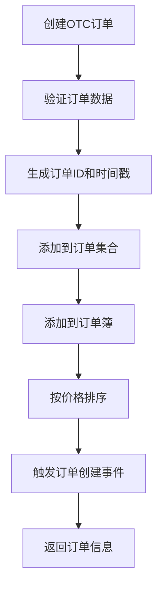
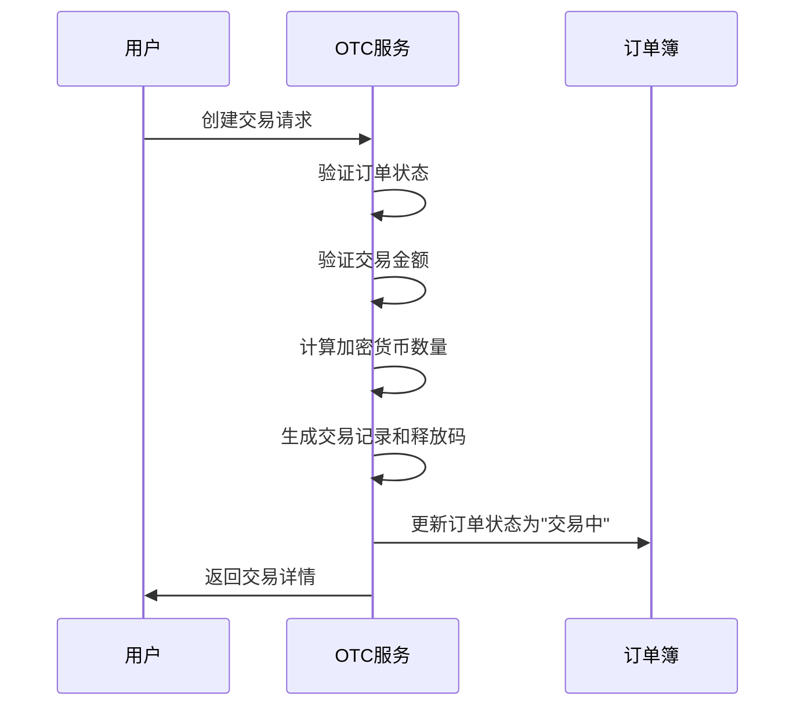
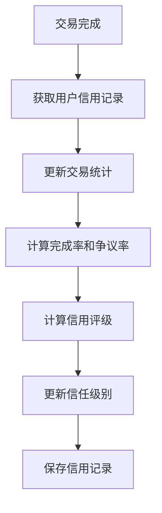
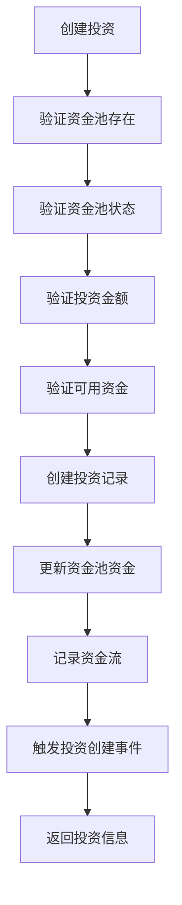
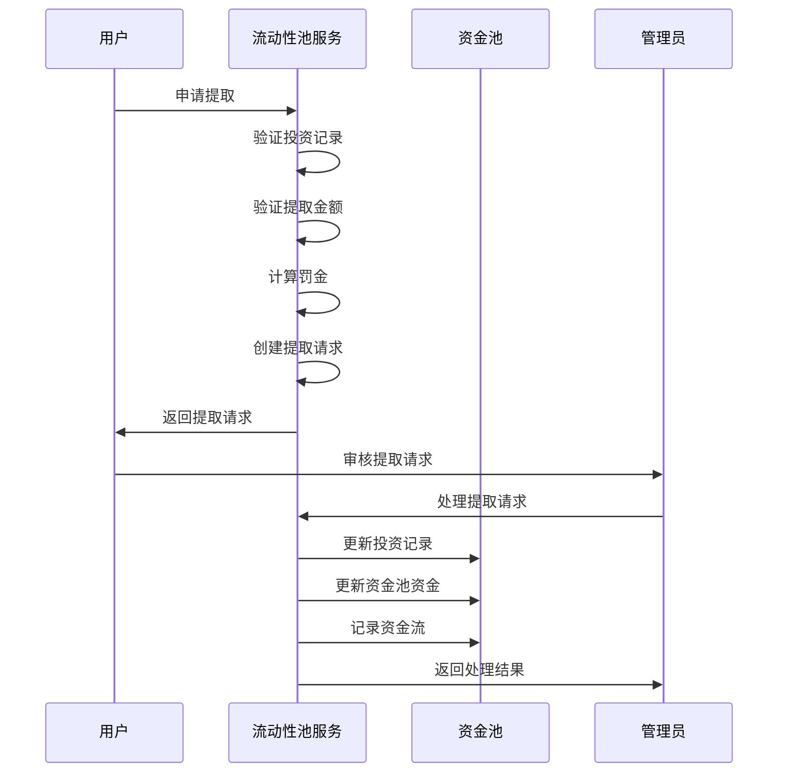
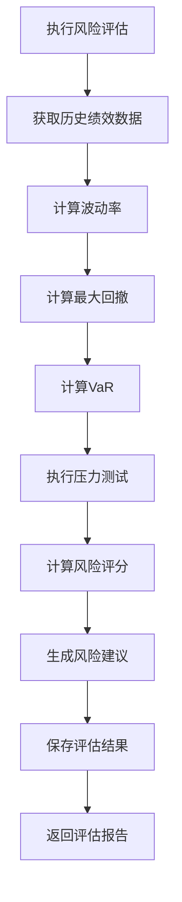
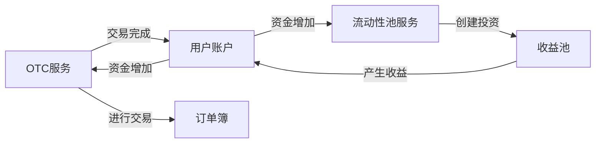
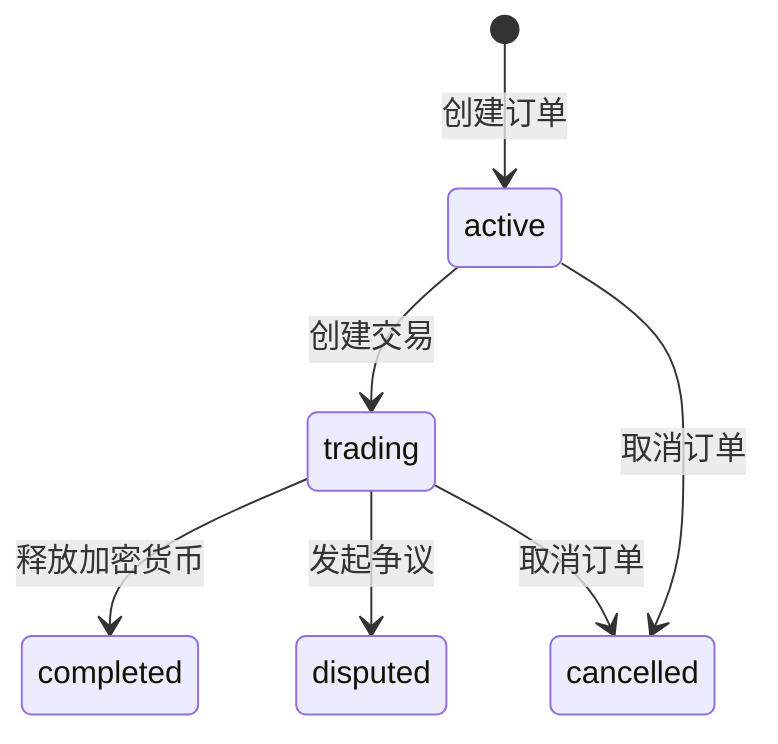
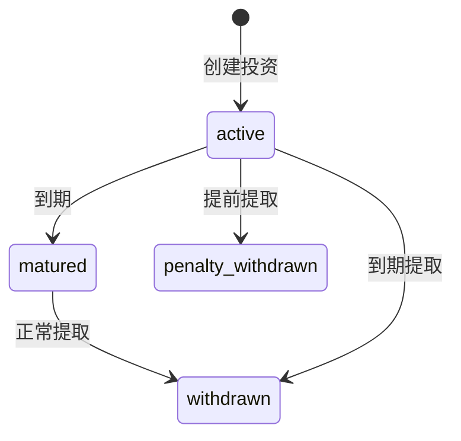

# 交易与流动性服务

<cite>
**Referenced Files in This Document**   
- [otcService.ts](file://backend/src/services/otcService.ts)
- [liquidityPoolService.ts](file://backend/src/services/liquidityPoolService.ts)
- [otc.ts](file://backend/src/routes/otc.ts)
- [liquidityPool.ts](file://backend/src/routes/liquidityPool.ts)
</cite>

## 目录
1. [引言](#引言)
2. [OTC服务设计与实现](#otc服务设计与实现)
3. [流动性池服务设计与实现](#流动性池服务设计与实现)
4. [服务间关联与数据流](#服务间关联与数据流)
5. [状态转换与异常处理](#状态转换与异常处理)
6. [结论](#结论)

## 引言

本文档深入分析了交易与流动性服务的设计与实现，重点阐述了OTC服务如何管理场外交易订单簿、P2P交易流程和用户信用体系，以及流动性池服务如何管理多个收益池。文档详细说明了`createOrder`、`createTransaction`和`releaseCrypto`等核心方法的业务逻辑，解释了投资创建、收益计算、提取请求处理和风险评估等关键功能。同时，文档描述了两个服务间的关联，包括OTC交易如何影响流动性池的资金状况，并提供了服务间数据流、状态转换和异常处理的详细说明。

## OTC服务设计与实现

OTC服务是平台场外交易的核心组件，负责管理订单簿、处理P2P交易流程和维护用户信用体系。该服务通过`OTCService`类实现，采用事件驱动架构，确保交易流程的可追溯性和实时性。

### 订单簿管理

OTC服务通过`orderBook`对象管理订单簿，该对象是一个以交易对（如CNY_USDT）为键的映射，存储所有活跃的买卖订单。当用户创建新订单时，`createOrder`方法会将订单添加到相应的交易对列表中，并根据订单类型（买/卖）和价格进行排序，确保买单价高的订单和卖单价低的订单优先匹配。

**Diagram sources**
- [otcService.ts](file://backend/src/services/otcService.ts#L150-L170)

**Section sources**
- [otcService.ts](file://backend/src/services/otcService.ts#L150-L170)

### P2P交易流程

P2P交易流程是OTC服务的核心业务逻辑，从创建交易到最终释放加密货币，整个过程严格遵循安全协议。`createTransaction`方法负责创建新的P2P交易，它会验证订单状态和交易金额，然后生成包含唯一释放码的交易记录。

**Diagram sources**
- [otcService.ts](file://backend/src/services/otcService.ts#L172-L205)

**Section sources**
- [otcService.ts](file://backend/src/services/otcService.ts#L172-L205)

### 用户信用体系

OTC服务通过`userCredits`映射维护用户信用评级，该评级基于用户的交易历史动态计算。`updateUserCreditScore`方法在每次交易完成后更新用户信用，综合考虑完成率、争议率和平均放币时间等因素，生成1-5星的信用评级和相应的信任级别。

**Diagram sources**
- [otcService.ts](file://backend/src/services/otcService.ts#L320-L360)

**Section sources**
- [otcService.ts](file://backend/src/services/otcService.ts#L320-L360)

## 流动性池服务设计与实现

流动性池服务是平台收益管理的核心，负责管理多个收益池，包括投资创建、收益计算、提取请求处理和风险评估。该服务通过`LiquidityPoolService`类实现，采用事件驱动架构，确保资金流动的可追溯性和透明度。

### 收益池管理

流动性池服务通过`pools`映射管理多个收益池，每个池子都有明确的策略类型、风险等级和收益率。`createInvestment`方法负责处理用户投资，它会验证资金池状态和投资金额，然后创建投资记录并更新资金池的可用资金量。

**Diagram sources**
- [liquidityPoolService.ts](file://backend/src/services/liquidityPoolService.ts#L207-L240)

**Section sources**
- [liquidityPoolService.ts](file://backend/src/services/liquidityPoolService.ts#L207-L240)

### 收益计算与提取

流动性池服务通过`calculateReturns`方法计算投资收益，采用复利计算模型并扣除管理费。`requestWithdrawal`方法处理提取请求，支持正常提取和提前提取，后者会根据剩余锁定期收取罚金。`processWithdrawal`方法由管理员调用，用于批准或拒绝提取请求。

**Diagram sources**
- [liquidityPoolService.ts](file://backend/src/services/liquidityPoolService.ts#L242-L315)

**Section sources**
- [liquidityPoolService.ts](file://backend/src/services/liquidityPoolService.ts#L242-L315)

### 风险评估

流动性池服务通过`performRiskAssessment`方法进行风险评估，计算波动率、最大回撤、VaR等关键风险指标，并生成1-10的风险评分和相应的投资建议。该评估结果为投资者提供了重要的决策参考。

**Diagram sources**
- [liquidityPoolService.ts](file://backend/src/services/liquidityPoolService.ts#L500-L550)

**Section sources**
- [liquidityPoolService.ts](file://backend/src/services/liquidityPoolService.ts#L500-L550)

## 服务间关联与数据流

OTC服务和流动性池服务虽然独立运行，但通过平台的整体业务逻辑紧密关联。OTC交易的成功执行会影响用户的资金状况，进而影响其在流动性池中的投资能力。

### 数据流分析

两个服务之间的数据流主要通过用户账户和资金状况进行间接关联。当用户在OTC服务中完成交易并获得法币或加密货币后，这些资金可以用于在流动性池服务中创建新的投资。反之，用户从流动性池中提取的资金也可以用于OTC交易。

**Diagram sources**
- [otcService.ts](file://backend/src/services/otcService.ts)
- [liquidityPoolService.ts](file://backend/src/services/liquidityPoolService.ts)

**Section sources**
- [otcService.ts](file://backend/src/services/otcService.ts)
- [liquidityPoolService.ts](file://backend/src/services/liquidityPoolService.ts)

### 资金状况影响

OTC交易对流动性池的资金状况有间接影响。当大量用户通过OTC服务将加密货币兑换为法币并提取时，可能会减少平台的整体流动性，影响流动性池的可用资金量。反之，当用户将法币兑换为加密货币并投资于收益池时，会增加平台的流动性。

## 状态转换与异常处理

两个服务都实现了完善的状态转换机制和异常处理策略，确保系统的稳定性和用户体验。

### OTC服务状态转换

OTC服务中的订单和交易都有明确的状态转换路径。订单状态从"活跃"到"交易中"，最终变为"已完成"或"已取消"。交易状态从"待支付"到"已支付"，最终变为"已释放"或"争议中"。

**Diagram sources**
- [otcService.ts](file://backend/src/services/otcService.ts#L100-L110)

**Section sources**
- [otcService.ts](file://backend/src/services/otcService.ts#L100-L110)

### 流动性池服务状态转换

流动性池服务中的投资记录也有明确的状态转换。投资状态从"活跃"开始，到期后变为"已到期"，提取后变为"已提取"或"罚金提取"。

**Diagram sources**
- [liquidityPoolService.ts](file://backend/src/services/liquidityPoolService.ts#L130-L140)

**Section sources**
- [liquidityPoolService.ts](file://backend/src/services/liquidityPoolService.ts#L130-L140)

### 异常处理

两个服务都实现了全面的异常处理机制。在关键操作前进行参数验证，捕获并处理各种业务异常，如订单不可用、金额超出范围、权限不足等。异常信息会被记录到日志中，并返回给客户端清晰的错误提示。

## 结论

OTC服务和流动性池服务共同构成了平台的核心交易与资产管理功能。OTC服务通过高效的订单簿管理和安全的P2P交易流程，为用户提供了便捷的场外交易体验。流动性池服务通过专业的收益池管理和风险评估，为用户提供了多样化的投资选择。两个服务虽然独立运行，但通过用户资金流紧密关联，共同构建了一个完整的金融生态系统。系统的事件驱动架构、完善的状态管理和异常处理机制，确保了平台的稳定性、安全性和可扩展性。