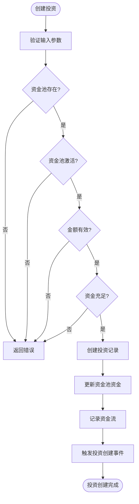
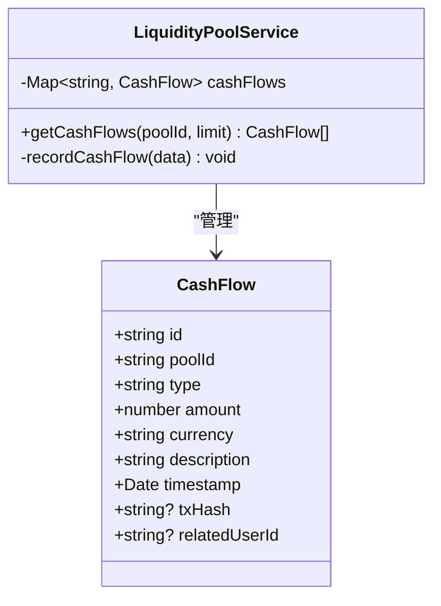
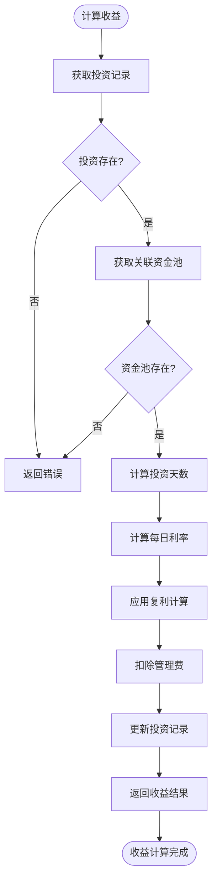
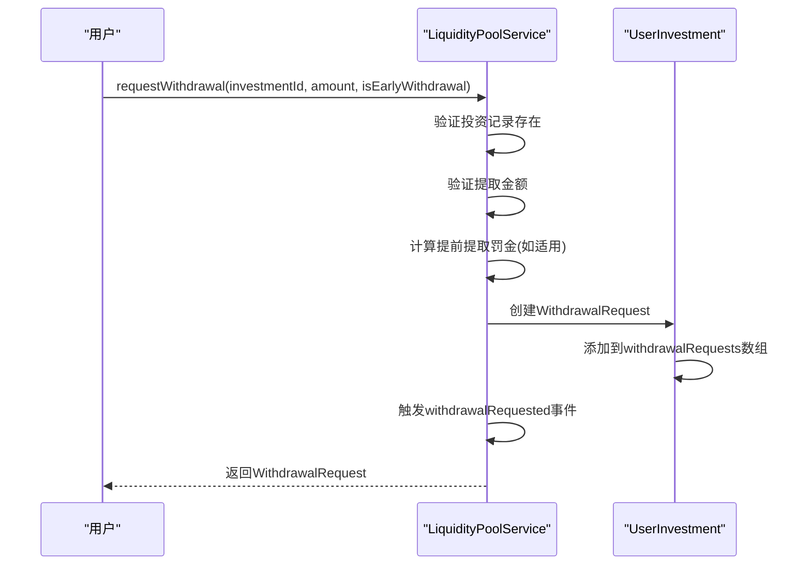
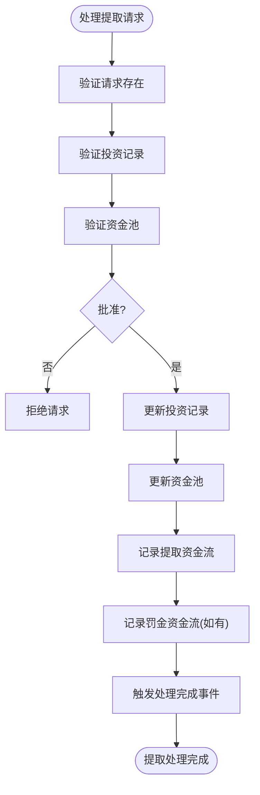
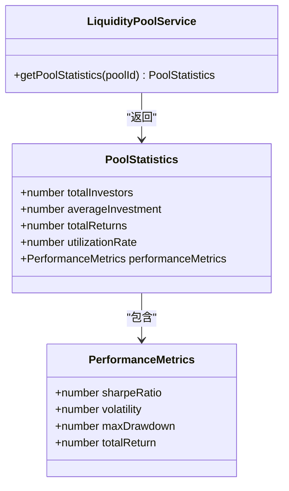
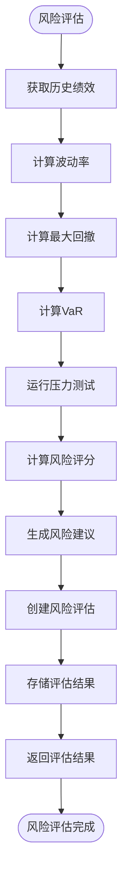
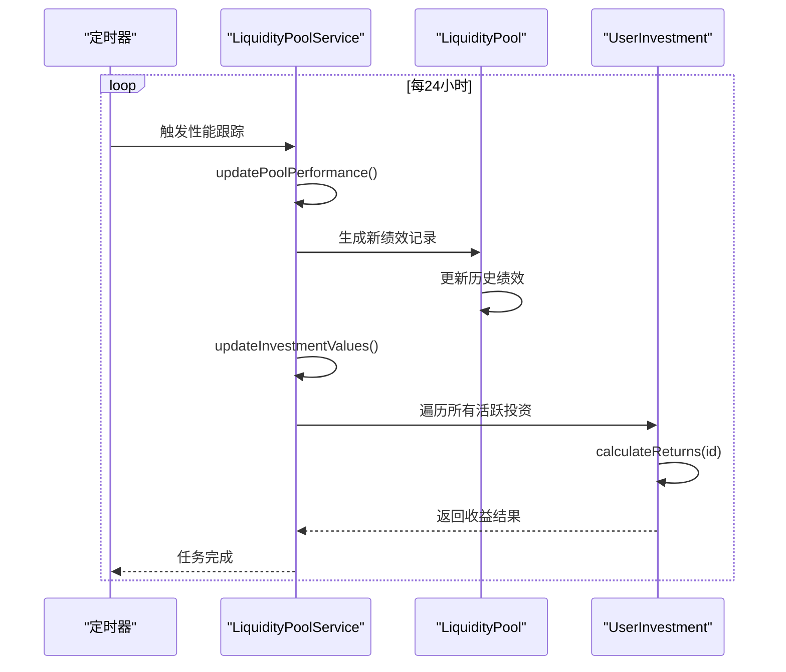
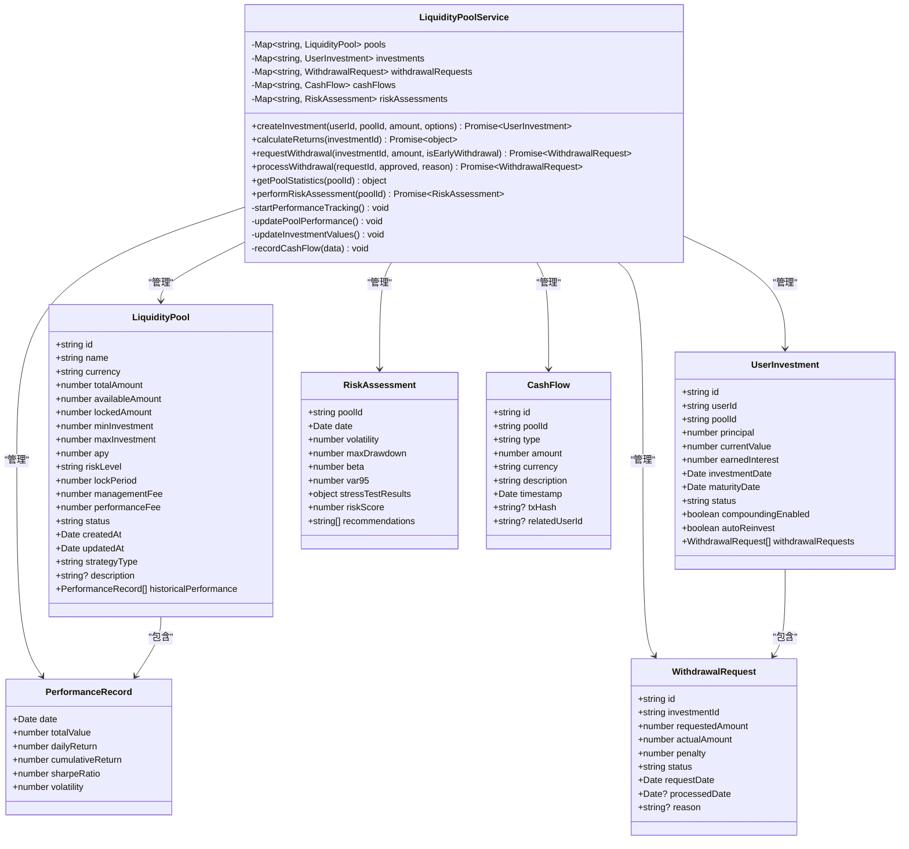

# 流动性池服务

<cite>
**本文档引用的文件**  
- [liquidityPoolService.ts](file://backend/src/services/liquidityPoolService.ts)
</cite>

## 目录
1. [服务概述](#服务概述)
2. [核心功能分析](#核心功能分析)
3. [投资生命周期管理](#投资生命周期管理)
4. [资金流记录机制](#资金流记录机制)
5. [收益计算与复利实现](#收益计算与复利实现)
6. [提取请求处理流程](#提取请求处理流程)
7. [资金池统计指标](#资金池统计指标)
8. [风险评估模型](#风险评估模型)
9. [性能跟踪定时任务](#性能跟踪定时任务)
10. [服务架构图](#服务架构图)

## 服务概述

流动性池服务（LiquidityPoolService）是一个用于管理多个收益池生命周期的核心服务组件。该服务负责处理投资创建、收益计算、提取请求和风险评估等关键金融操作。服务通过内存数据结构管理资金池、用户投资、提取请求和资金流等核心实体，为BRICS跨境金融平台提供稳定的收益管理功能。

服务在初始化时会创建三个模拟资金池：USD稳定币收益池、人民币套利池和卢布高收益池，分别对应不同的风险等级和收益率。服务采用事件驱动架构，通过EventEmitter机制在关键操作（如投资创建、提取请求）时触发相应事件。

**Section sources**
- [liquidityPoolService.ts](file://backend/src/services/liquidityPoolService.ts#L90-L686)

## 核心功能分析

LiquidityPoolService服务提供了完整的收益池管理功能集，包括投资管理、收益计算、提取处理和风险评估。服务通过Map数据结构高效管理各类实体，确保操作的原子性和一致性。

服务的核心功能包括：
- 多收益池的全生命周期管理
- 投资创建与资金锁定
- 收益计算与复利实现
- 提取请求的申请与处理
- 资金池绩效统计
- 风险评估与建议生成
- 定时性能跟踪

服务采用异步方法处理关键操作，确保非阻塞执行。所有操作都包含完整的输入验证和错误处理机制，确保系统的健壮性。

**Section sources**
- [liquidityPoolService.ts](file://backend/src/services/liquidityPoolService.ts#L90-L686)

## 投资生命周期管理

### 投资创建流程

`createInvestment`方法是投资生命周期的起点，负责处理新投资的创建和资金锁定。该方法执行以下关键步骤：

1. **输入验证**：验证资金池存在性、状态、投资金额范围和可用资金
2. **投资创建**：创建新的UserInvestment对象，设置投资参数
3. **资金池更新**：减少可用资金，增加锁定资金
4. **资金流记录**：记录存款资金流
5. **事件触发**：触发"investmentCreated"事件

投资创建时会根据资金池的锁定期自动计算到期日期，并支持复利和自动再投资选项。



**Diagram sources**
- [liquidityPoolService.ts](file://backend/src/services/liquidityPoolService.ts#L255-L313)

**Section sources**
- [liquidityPoolService.ts](file://backend/src/services/liquidityPoolService.ts#L255-L313)

## 资金流记录机制

服务通过`recordCashFlow`私有方法实现资金流记录功能，该机制用于追踪资金池的所有资金变动。资金流记录包含以下关键信息：

- 交易类型（存款、提取、利息、费用、再平衡）
- 金额和货币
- 时间戳
- 相关用户ID
- 区块链交易哈希（可选）

资金流在以下场景被记录：
- 投资创建时的存款
- 提取请求批准后的资金提取
- 提前提取产生的罚金
- 收益计算产生的利息



**Diagram sources**
- [liquidityPoolService.ts](file://backend/src/services/liquidityPoolService.ts#L78-L88)
- [liquidityPoolService.ts](file://backend/src/services/liquidityPoolService.ts#L541-L556)

**Section sources**
- [liquidityPoolService.ts](file://backend/src/services/liquidityPoolService.ts#L541-L556)

## 收益计算与复利实现

### 收益计算方法

`calculateReturns`方法实现复利计算和管理费扣除的完整逻辑。该方法的核心计算流程如下：

1. 计算投资天数
2. 基于年化收益率计算每日复利
3. 扣除按天计算的管理费
4. 更新投资记录的当前价值和已赚取利息

复利计算采用标准复利公式：`currentValue = principal × (1 + dailyRate)^days`，其中dailyRate通过`Math.pow(1 + pool.apy, 1/365) - 1`计算得出。

管理费按日计提，计算公式为：`managementFeeAmount = currentValue × pool.managementFee × (daysSinceInvestment / 365)`。



**Diagram sources**
- [liquidityPoolService.ts](file://backend/src/services/liquidityPoolService.ts#L321-L370)

**Section sources**
- [liquidityPoolService.ts](file://backend/src/services/liquidityPoolService.ts#L321-L370)

## 提取请求处理流程

### 提取请求申请

`requestWithdrawal`方法处理提取请求的申请，支持正常提取和提前提取。提前提取会根据剩余锁定期按比例收取1%的罚金。

提前提取罚金计算公式：
```
remainingDays = max(0, 到期日期 - 当前日期)
penalty = requestedAmount × 0.01 × (remainingDays / 365)
```



**Diagram sources**
- [liquidityPoolService.ts](file://backend/src/services/liquidityPoolService.ts#L373-L418)

### 提取请求处理

`processWithdrawal`方法处理提取请求的审批，执行资金的实际转移和状态更新。处理流程包括：

1. 验证请求和投资记录
2. 更新投资记录的当前价值
3. 更新资金池的锁定和可用资金
4. 记录资金流（提取和罚金）
5. 更新投资状态



**Diagram sources**
- [liquidityPoolService.ts](file://backend/src/services/liquidityPoolService.ts#L421-L480)

**Section sources**
- [liquidityPoolService.ts](file://backend/src/services/liquidityPoolService.ts#L373-L480)

## 资金池统计指标

`getPoolStatistics`方法计算资金池的关键绩效指标，为投资者和管理者提供决策支持。计算的指标包括：

### 核心统计指标
- **总投资者数**：去重的用户数量
- **平均投资金额**：所有投资本金的平均值
- **总收益**：所有投资已赚取利息的总和
- **资金利用率**：锁定资金/总资金

### 绩效指标
- **夏普比率**：衡量风险调整后收益
- **波动率**：年化标准差
- **最大回撤**：历史最大价值损失比例
- **总回报率**：累计收益



**Diagram sources**
- [liquidityPoolService.ts](file://backend/src/services/liquidityPoolService.ts#L483-L538)

**Section sources**
- [liquidityPoolService.ts](file://backend/src/services/liquidityPoolService.ts#L483-L538)

## 风险评估模型

`performRiskAssessment`方法实现全面的风险评估模型，通过量化指标评估资金池的风险水平。

### 风险评估指标

#### 波动率计算
基于历史日收益率的标准差计算年化波动率：
```
avgReturn = 日收益率平均值
variance = Σ(r - avgReturn)² / n
volatility = √(variance × 365)
```

#### 最大回撤计算
计算历史价值从峰值到谷值的最大百分比损失：
```
maxDrawdown = max((peak - current) / peak)
```

#### VaR计算
使用历史模拟法计算95%置信度下的VaR：
```
var95 = sortedReturns[5%分位数]
```

#### 风险评分
基于波动率和最大回撤生成1-10的风险评分。



**Diagram sources**
- [liquidityPoolService.ts](file://backend/src/services/liquidityPoolService.ts#L604-L660)

**Section sources**
- [liquidityPoolService.ts](file://backend/src/services/liquidityPoolService.ts#L604-L660)

## 性能跟踪定时任务

`startPerformanceTracking`方法启动每日定时任务，自动更新资金池绩效和投资价值。

### 定时任务流程



**Diagram sources**
- [liquidityPoolService.ts](file://backend/src/services/liquidityPoolService.ts#L559-L601)

**Section sources**
- [liquidityPoolService.ts](file://backend/src/services/liquidityPoolService.ts#L559-L601)

## 服务架构图



**Diagram sources**
- [liquidityPoolService.ts](file://backend/src/services/liquidityPoolService.ts#L90-L686)