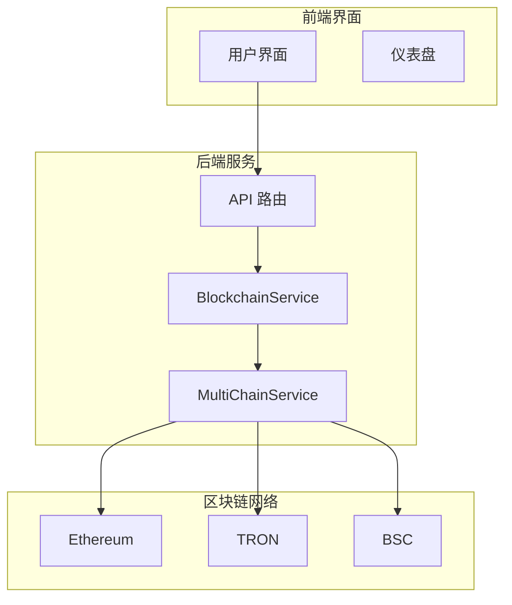
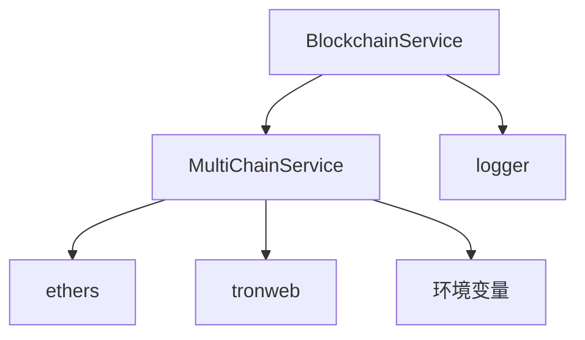

# 区块链服务

<cite>
**本文档引用的文件**
- [BlockchainService.ts](file://backend/src/services/BlockchainService.ts)
- [blockchain.ts](file://backend/src/services/blockchain.ts)
- [multiChainService.ts](file://backend/src/services/multiChainService.ts)
- [blockchain.ts](file://backend/src/routes/blockchain.ts)
- [index.ts](file://backend/src/index.ts)
</cite>

## 目录
1. [简介](#简介)
2. [核心组件](#核心组件)
3. [架构概述](#架构概述)
4. [详细组件分析](#详细组件分析)
5. [依赖分析](#依赖分析)
6. [性能考量](#性能考量)
7. [故障排除指南](#故障排除指南)
8. [结论](#结论)

## 简介
`BlockchainService` 是一个用于监控和统计多链区块链网络状态的核心服务。它继承自 `MultiChainService`，支持 Ethereum、TRON 和 BSC 三大主流区块链网络。该服务负责收集各链的实时状态信息，包括区块高度、Gas 价格、交易拥堵情况等，并基于这些数据提供网络健康状况评估、交易建议和性能指标。通过定期健康检查机制，系统能够持续监控各链的运行状态，为前端应用和用户决策提供可靠的数据支持。

## 核心组件

`BlockchainService` 的核心功能围绕区块链网络的监控与统计展开。它通过 `chainStatus` 映射维护各链的实时状态，并通过 `stats` 对象存储总体统计信息。服务初始化时会自动设置支持的区块链（Ethereum、TRON、BSC）及其默认区块时间。核心方法如 `getBlockchainStats`、`getChainStatus` 提供了对这些状态数据的访问接口，而 `updateChainStatus` 和 `checkAllChainsHealth` 则负责数据的更新与同步。

**Section sources**
- [BlockchainService.ts](file://backend/src/services/BlockchainService.ts#L20-L50)
- [blockchain.ts](file://backend/src/services/blockchain.ts#L20-L50)

## 架构概述



**Diagram sources**
- [blockchain.ts](file://backend/src/routes/blockchain.ts#L1-L293)
- [BlockchainService.ts](file://backend/src/services/BlockchainService.ts#L20-L306)
- [multiChainService.ts](file://backend/src/services/multiChainService.ts#L1-L507)

## 详细组件分析

### BlockchainService 分析

`BlockchainService` 类是整个监控系统的核心，它扩展了 `MultiChainService` 的基础功能，专注于网络状态的监控和统计。

#### 类图
```mermaid
classDiagram
class BlockchainService {
-stats : BlockchainStats
-chainStatus : Map~string, ChainStatus~
+getBlockchainStats() : BlockchainStats
+getChainStatus(chainName? : string) : ChainStatus | ChainStatus[] | undefined
+updateChainStatus(chainName : string) : Promise~void~
+checkAllChainsHealth() : Promise~void~
+updateStats() : void
+getNetworkCongestionAdvice() : {level : string, message : string, recommendedGasMultiplier : number}
+estimateOptimalGasPrice(chainName : string) : Promise~{slow : string, standard : string, fast : string, instant : string}~
+monitorTransaction(chainName : string, txHash : string) : Promise~{status : 'pending' | 'confirmed' | 'failed', confirmations : number, blockNumber? : number, gasUsed? : string}~
+getPerformanceMetrics() : {throughput : {[chain : string] : number}, latency : {[chain : string] : number}, successRate : {[chain : string] : number}}
+startHealthCheck(intervalMs : number = 30000) : void
}
class MultiChainService {
-chains : Map~string, ChainConfig~
-providers : Map~string, any~
+getChainConfig(chainName : string) : ChainConfig | undefined
+getTransactionStatus(chainName : string, txHash : string) : Promise~TransactionResult~
+getStablecoinBalance(chainName : string, tokenSymbol : string, address : string) : Promise~string~
}
BlockchainService --|> MultiChainService : "继承"
```

**Diagram sources**
- [BlockchainService.ts](file://backend/src/services/BlockchainService.ts#L20-L306)
- [multiChainService.ts](file://backend/src/services/multiChainService.ts#L1-L507)

#### 获取区块链统计信息
`getBlockchainStats` 方法返回一个包含网络总体状况的 `BlockchainStats` 对象。该对象包含总交易数、总交易量、活跃链数量、平均确认时间和网络拥堵程度等关键指标。这些数据由 `updateStats` 方法在每次健康检查后计算并更新。

**Section sources**
- [BlockchainService.ts](file://backend/src/services/BlockchainService.ts#L66-L68)
- [blockchain.ts](file://backend/src/services/blockchain.ts#L66-L68)

#### 获取链状态
`getChainStatus` 方法提供对单个或所有链状态的访问。当传入链名称时，返回指定链的 `ChainStatus` 对象；否则返回所有链的状态数组。`ChainStatus` 包含链名、在线状态、区块高度、Gas 价格、平均区块时间和待处理交易数。

**Section sources**
- [BlockchainService.ts](file://backend/src/services/BlockchainService.ts#L71-L76)
- [blockchain.ts](file://backend/src/services/blockchain.ts#L71-L76)

#### 更新链状态
`updateChainStatus` 方法负责从区块链网络获取最新的状态信息。对于 TRON 链，它调用 `provider.trx.getCurrentBlock()` 获取当前区块；对于 EVM 链（Ethereum、BSC），它使用 `provider.getBlockNumber()` 和 `provider.getFeeData()` 获取区块高度和费用数据。如果查询失败，该链的状态将被标记为离线。

**Section sources**
- [BlockchainService.ts](file://backend/src/services/BlockchainService.ts#L79-L140)
- [blockchain.ts](file://backend/src/services/blockchain.ts#L79-L111)

#### 检查所有链健康状态
`checkAllChainsHealth` 方法遍历所有已知链，依次调用 `updateChainStatus` 更新其状态，最后调用 `updateStats` 计算全局统计信息。这是一个异步方法，确保所有链的健康检查都能完成。

**Section sources**
- [BlockchainService.ts](file://backend/src/services/BlockchainService.ts#L143-L156)
- [blockchain.ts](file://backend/src/services/blockchain.ts#L127-L140)

#### 更新统计信息
`updateStats` 方法根据所有在线链的状态计算总体统计。它计算在线链的平均区块时间作为平均确认时间，并根据待处理交易的平均数量判断网络拥堵程度（低、中、高）。

**Section sources**
- [BlockchainService.ts](file://backend/src/services/BlockchainService.ts#L158-L184)
- [blockchain.ts](file://backend/src/services/blockchain.ts#L142-L168)

#### 获取网络拥堵建议
`getNetworkCongestionAdvice` 方法根据当前的 `networkCongestion` 级别返回相应的用户建议和推荐的 Gas 费乘数。例如，当网络拥堵严重时，建议用户增加 Gas 费，并返回 1.5 的乘数。

**Section sources**
- [BlockchainService.ts](file://backend/src/services/BlockchainService.ts#L187-L214)
- [blockchain.ts](file://backend/src/services/blockchain.ts#L171-L198)

#### 估算最佳Gas价格
`estimateOptimalGasPrice` 方法为指定链提供四个档位的 Gas 价格建议：慢速（80%基准价）、标准（100%基准价）、快速（120%基准价）和即时（150%基准价）。这为用户提交交易提供了灵活的选择。

**Section sources**
- [BlockchainService.ts](file://backend/src/services/BlockchainService.ts#L217-L243)
- [blockchain.ts](file://backend/src/services/blockchain.ts#L201-L227)

#### 监控交易
`monitorTransaction` 方法通过调用父类的 `getTransactionStatus` 来监控指定交易的确认状态，返回交易的状态、确认数、区块号和消耗的 Gas。

**Section sources**
- [BlockchainService.ts](file://backend/src/services/BlockchainService.ts#L246-L267)
- [blockchain.ts](file://backend/src/services/blockchain.ts#L230-L251)

#### 获取性能指标
`getPerformanceMetrics` 方法返回各链的吞吐量（TPS）、延迟（毫秒）和成功率。这些指标在实际应用中应从专门的监控系统获取，当前实现使用随机数模拟。

**Section sources**
- [BlockchainService.ts](file://backend/src/services/BlockchainService.ts#L270-L291)
- [blockchain.ts](file://backend/src/services/blockchain.ts#L254-L274)

#### 启动健康检查
`startHealthCheck` 方法启动一个定时任务，以指定的间隔（默认30秒）自动调用 `checkAllChainsHealth`，实现对多链网络的持续监控。

**Section sources**
- [BlockchainService.ts](file://backend/src/services/BlockchainService.ts#L294-L305)
- [blockchain.ts](file://backend/src/services/blockchain.ts#L277-L288)

## 依赖分析

`BlockchainService` 严重依赖 `MultiChainService` 提供的区块链连接和基础操作能力。它通过 `providers` 映射获取各链的 RPC 客户端（如 ethers.js 的 JsonRpcProvider 或 tronweb），并利用这些客户端与区块链网络进行交互。此外，服务还依赖 `logger` 进行日志记录，这对于监控和故障排查至关重要。



**Diagram sources**
- [BlockchainService.ts](file://backend/src/services/BlockchainService.ts#L1-L306)
- [multiChainService.ts](file://backend/src/services/multiChainService.ts#L1-L507)

## 性能考量
`BlockchainService` 的性能主要受外部区块链网络响应速度的影响。`updateChainStatus` 方法中的网络请求是主要的性能瓶颈。为了优化性能，可以考虑：
1.  实现缓存机制，避免对相同数据的频繁查询。
2.  使用并发请求同时检查多条链的健康状态。
3.  合理设置健康检查的间隔，避免过于频繁的请求对网络造成压力。
4.  在 `getPerformanceMetrics` 中集成真实的监控数据，而非使用随机数。

## 故障排除指南
-   **链状态更新失败**: 检查 `providers` 是否正确初始化，确认 RPC URL 和 API Key 配置无误。
-   **Gas 价格估算失败**: 确保目标链在线且 `chainStatus` 中有有效的 `gasPrice` 数据。
-   **交易监控无响应**: 验证交易哈希是否有效，并确认 `getTransactionStatus` 方法能正确与区块链网络通信。
-   **健康检查未启动**: 检查 `startHealthCheck` 是否被调用，以及 `intervalMs` 参数是否为正数。

**Section sources**
- [BlockchainService.ts](file://backend/src/services/BlockchainService.ts#L79-L140)
- [blockchain.ts](file://backend/src/services/blockchain.ts#L79-L111)

## 结论
`BlockchainService` 是一个功能全面的多链监控服务，它有效地整合了来自不同区块链网络的数据，为上层应用提供了统一的监控和统计接口。通过继承 `MultiChainService`，它复用了基础的区块链交互逻辑，专注于实现高级的监控功能。该服务的设计清晰，职责明确，易于扩展和维护，是构建跨链应用监控系统的核心组件。