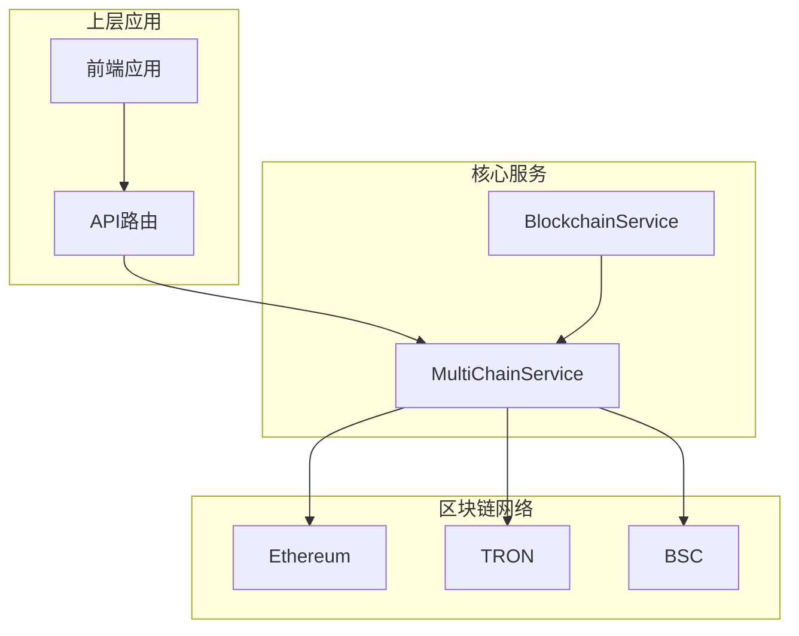
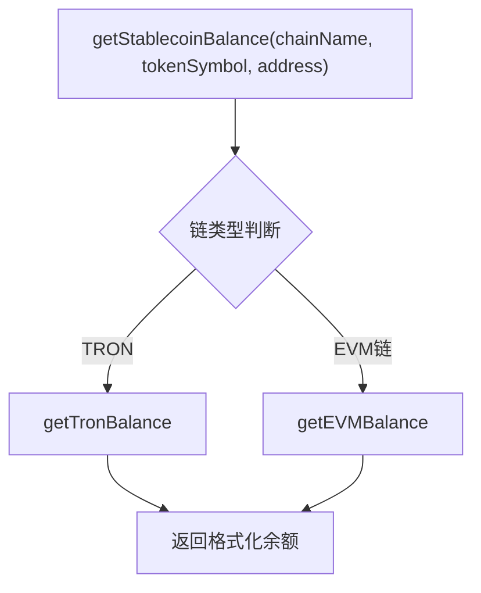
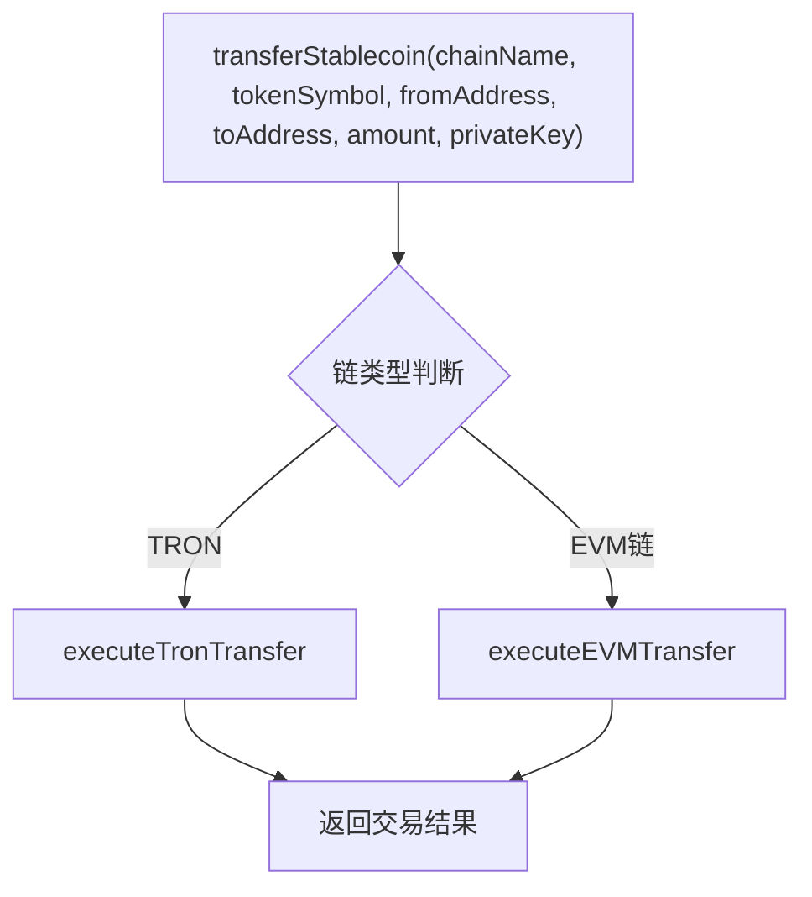
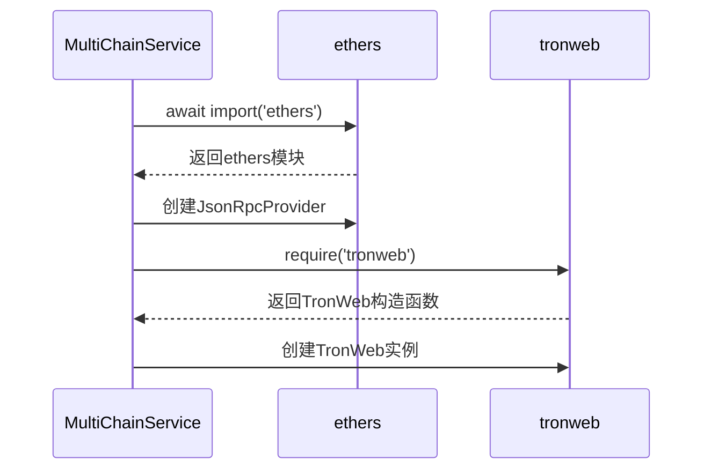
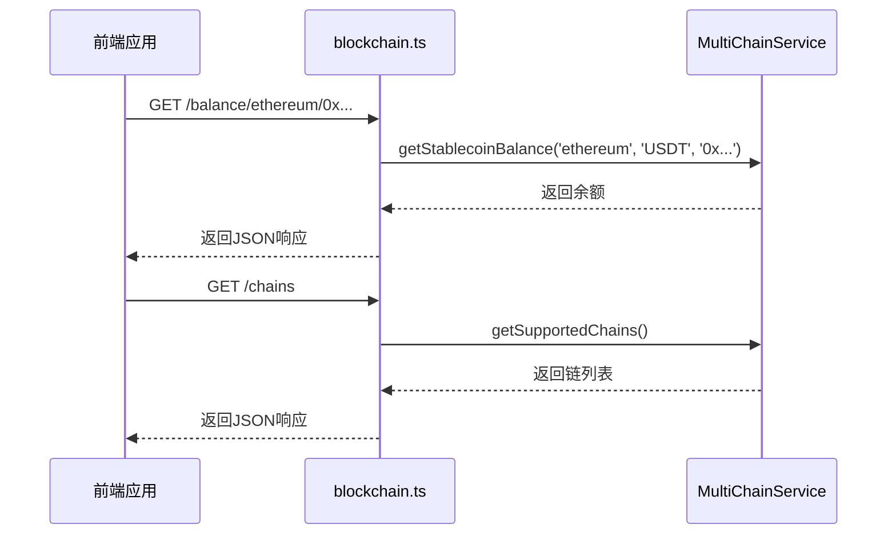
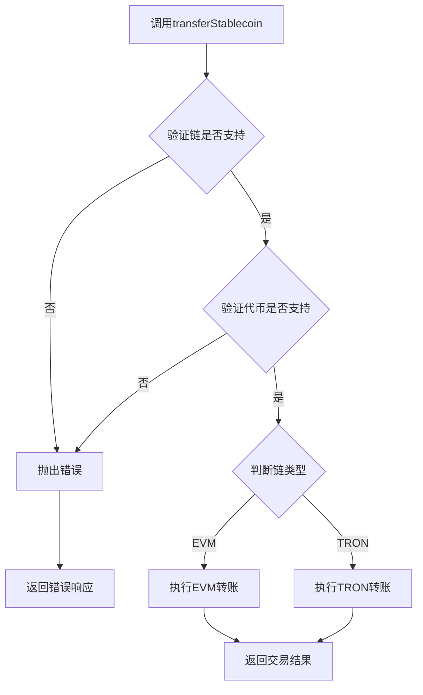
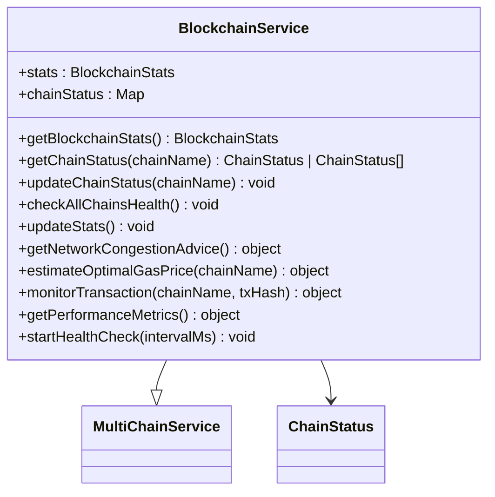

# 区块链集成服务

<cite>
**Referenced Files in This Document**   
- [multiChainService.ts](file://backend/src/services/multiChainService.ts)
- [blockchain.ts](file://backend/src/routes/blockchain.ts)
- [blockchain.ts](file://backend/src/services/blockchain.ts)
</cite>

## 目录
1. [架构概述](#架构概述)
2. [核心组件分析](#核心组件分析)
3. [跨链余额查询机制](#跨链余额查询机制)
4. [跨链转账执行流程](#跨链转账执行流程)
5. [服务初始化与依赖管理](#服务初始化与依赖管理)
6. [上层接口协同工作](#上层接口协同工作)
7. [安全验证与错误处理](#安全验证与错误处理)
8. [性能监控策略](#性能监控策略)

## 架构概述

区块链集成服务通过`MultiChainService`类实现了对Ethereum、TRON和BSC三条区块链的统一抽象。该服务封装了不同区块链在余额查询、转账执行和交易状态监控等方面的差异，为上层应用提供了一致的API接口。系统采用分层架构，`MultiChainService`作为核心业务逻辑层，被`blockchain.ts`路由模块和`BlockchainService`扩展服务所调用，形成完整的区块链操作体系。



**Diagram sources**
- [multiChainService.ts](file://backend/src/services/multiChainService.ts#L48-L505)
- [blockchain.ts](file://backend/src/routes/blockchain.ts#L1-L293)

## 核心组件分析

`MultiChainService`是整个区块链集成服务的核心，它通过`chains`和`providers`两个Map对象分别管理各链的配置信息和RPC提供者实例。服务在构造函数中调用`initializeChains`和`initializeProviders`方法完成初始化，支持通过`getSupportedChains`方法获取所有支持的区块链列表，并通过`getChainConfig`方法获取特定链的详细配置。

```mermaid
classDiagram
class MultiChainService {
+chains : Map<string, ChainConfig>
+providers : Map<string, any>
+getSupportedChains() ChainConfig[]
+getChainConfig(chainName) ChainConfig | undefined
+getStablecoinBalance(chainName, tokenSymbol, address) Promise~string~
+transferStablecoin(chainName, tokenSymbol, fromAddress, toAddress, amount, privateKey) Promise~TransactionResult~
+getTransactionStatus(chainName, txHash) Promise~TransactionResult~
+getGasPrices(chainName) Promise~{slow, standard, fast}~
+validateAddress(chainName, address) boolean
+getSupportedTokens(chainName) string[]
+getTokenInfo(chainName, tokenSymbol) object
}
class ChainConfig {
+chainId : number
+name : string
+symbol : string
+rpcUrl : string
+explorerUrl : string
+nativeCurrency : object
+stablecoins : object
}
class TransactionResult {
+txHash : string
+chainId : number
+status : string
+confirmations : number
+gasUsed? : string
+blockNumber? : number
+timestamp : Date
}
MultiChainService --> ChainConfig
MultiChainService --> TransactionResult
```

**Diagram sources**
- [multiChainService.ts](file://backend/src/services/multiChainService.ts#L48-L505)

**Section sources**
- [multiChainService.ts](file://backend/src/services/multiChainService.ts#L48-L505)

## 跨链余额查询机制

`getStablecoinBalance`方法实现了跨链稳定币余额查询功能。该方法首先验证链和代币的支持性，然后根据链类型选择不同的实现路径：对于EVM兼容链（Ethereum和BSC），使用`ethers`库通过ERC-20合约的`balanceOf`方法查询余额；对于TRON链，则使用`tronweb`库调用TRC-20合约的`balanceOf`方法。两种实现都考虑了不同代币的精度差异，确保返回的余额值正确。



**Diagram sources**
- [multiChainService.ts](file://backend/src/services/multiChainService.ts#L200-L227)

**Section sources**
- [multiChainService.ts](file://backend/src/services/multiChainService.ts#L200-L227)

## 跨链转账执行流程

`transferStablecoin`方法负责执行跨链稳定币转账。该方法首先进行链和代币的合法性校验，然后根据目标链类型调用相应的转账实现。对于EVM链，使用`ethers.Wallet`创建签名钱包，通过合约调用执行转账；对于TRON链，使用`tronweb`设置私钥后直接调用合约的`transfer`方法。两种实现都返回标准化的`TransactionResult`对象，包含交易哈希、链ID和状态等信息。



**Diagram sources**
- [multiChainService.ts](file://backend/src/services/multiChainService.ts#L267-L297)

**Section sources**
- [multiChainService.ts](file://backend/src/services/multiChainService.ts#L267-L297)

## 服务初始化与依赖管理

`initializeProviders`方法实现了动态加载区块链库的功能。该方法使用动态导入（`await import('ethers')`）和`require`分别加载`ethers`和`tronweb`库，为Ethereum、TRON和BSC链创建相应的RPC提供者实例。这种设计避免了在不使用特定链时加载不必要的库，优化了服务启动性能。提供者实例存储在`providers` Map中，供后续的区块链操作复用。



**Diagram sources**
- [multiChainService.ts](file://backend/src/services/multiChainService.ts#L155-L187)

**Section sources**
- [multiChainService.ts](file://backend/src/services/multiChainService.ts#L155-L187)

## 上层接口协同工作

`blockchain.ts`路由模块与`multiChainService`协同工作，为上层应用提供统一的区块链操作接口。路由模块创建`MultiChainService`实例，并将其方法暴露为REST API端点，如`/balance/:chainName/:address`用于查询余额，`/chains`用于获取支持的区块链列表。这种设计实现了业务逻辑与API接口的分离，提高了代码的可维护性和可测试性。



**Diagram sources**
- [blockchain.ts](file://backend/src/routes/blockchain.ts#L1-L293)
- [multiChainService.ts](file://backend/src/services/multiChainService.ts#L48-L505)

**Section sources**
- [blockchain.ts](file://backend/src/routes/blockchain.ts#L1-L293)

## 安全验证与错误处理

服务实现了多层次的安全验证和错误处理机制。在执行任何区块链操作前，都会通过`validateAddress`方法验证地址格式的正确性：EVM链使用`ethers.isAddress`进行校验，TRON链则检查地址是否以'T'开头且长度为34。所有关键操作都包含try-catch块，捕获并记录异常，同时向调用方返回有意义的错误信息。此外，`transferStablecoin`方法在执行前会验证链和代币的支持性，防止向不支持的网络或代币发送资金。



**Diagram sources**
- [multiChainService.ts](file://backend/src/services/multiChainService.ts#L267-L297)

**Section sources**
- [multiChainService.ts](file://backend/src/services/multiChainService.ts#L267-L297)

## 性能监控策略

`BlockchainService`扩展了`MultiChainService`，提供了链健康状态监控和性能指标收集功能。该服务通过`checkAllChainsHealth`方法定期检查所有链的状态，更新`chainStatus` Map中的信息。`getPerformanceMetrics`方法返回各链的吞吐量、延迟和成功率等性能指标，为系统优化提供数据支持。`startHealthCheck`方法启动一个定时器，实现持续的健康检查，确保系统能够及时发现并响应链的异常状态。



**Diagram sources**
- [blockchain.ts](file://backend/src/services/blockchain.ts#L20-L289)

**Section sources**
- [blockchain.ts](file://backend/src/services/blockchain.ts#L20-L289)