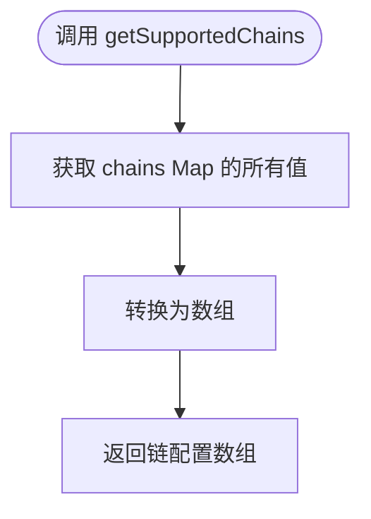
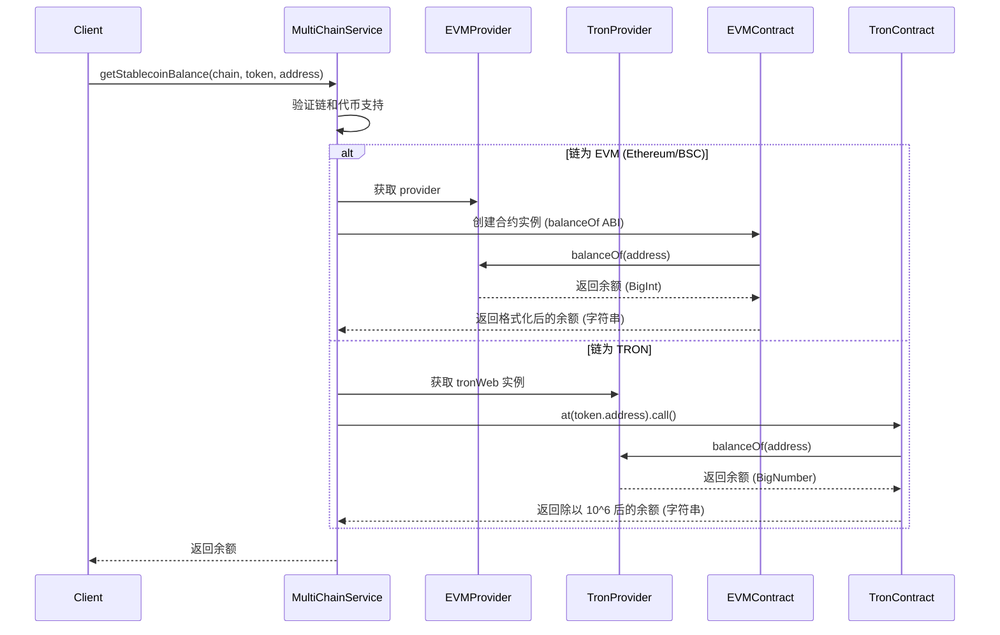
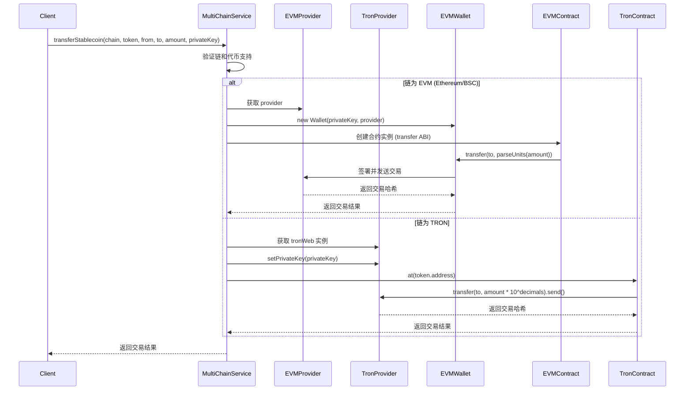
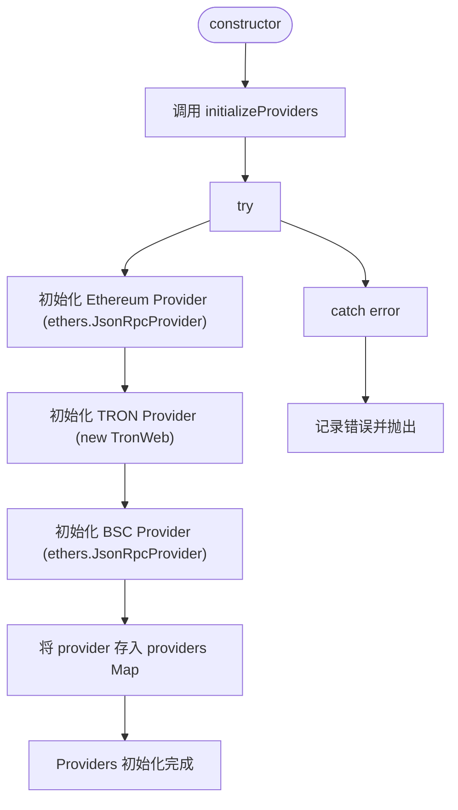
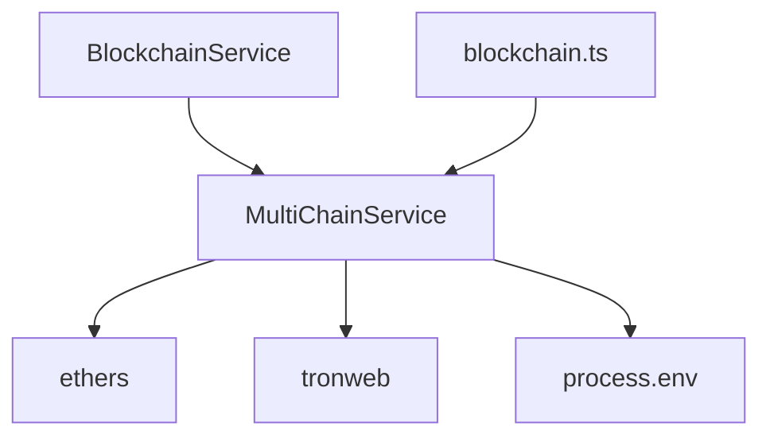

# 多链服务

<cite>
**Referenced Files in This Document**   
- [multiChainService.ts](file://backend/src/services/multiChainService.ts)
- [blockchain.ts](file://backend/src/services/blockchain.ts)
- [BlockchainService.ts](file://backend/src/services/BlockchainService.ts)
- [blockchain.ts](file://backend/src/routes/blockchain.ts)
- [multiChainService.test.ts](file://backend/src/services/__tests__/multiChainService.test.ts)
</cite>

## 目录
1. [简介](#简介)
2. [核心组件](#核心组件)
3. [架构概述](#架构概述)
4. [详细组件分析](#详细组件分析)
5. [依赖分析](#依赖分析)
6. [性能考虑](#性能考虑)
7. [故障排除指南](#故障排除指南)
8. [结论](#结论)

## 简介

`MultiChainService` 是一个核心服务，旨在统一管理跨以太坊（Ethereum）、TRON 和币安智能链（BSC）的稳定币操作。该服务提供了一套统一的接口，用于查询余额、执行转账、获取 Gas 价格和验证地址，从而简化了与多条区块链交互的复杂性。通过抽象不同链的技术差异，该服务为上层应用提供了简洁、一致的跨链操作体验。

**Section sources**
- [multiChainService.ts](file://backend/src/services/multiChainService.ts#L1-L50)

## 核心组件

`MultiChainService` 的核心功能围绕着对多条区块链的统一管理。其主要职责包括：
- **链配置管理**：通过 `initializeChains` 方法初始化并存储各链的配置信息，包括链 ID、RPC URL、浏览器链接以及支持的稳定币合约地址和精度。
- **提供者初始化**：在构造函数中调用 `initializeProviders` 方法，为每条链创建并存储相应的 RPC 提供者实例（如 ethers.js 用于 EVM 链，TronWeb 用于 TRON 链）。
- **统一接口**：提供 `getSupportedChains`、`getStablecoinBalance`、`transferStablecoin` 等方法，屏蔽底层链的差异，为调用者提供一致的 API。

**Section sources**
- [multiChainService.ts](file://backend/src/services/multiChainService.ts#L50-L155)

## 架构概述

`MultiChainService` 作为跨链操作的核心，被 `BlockchainService` 继承和扩展，同时被 `blockchain.ts` 路由模块直接实例化和调用，以提供 RESTful API 接口。

```mermaid
graph TD
A[前端/客户端] --> B[blockchain.ts 路由]
B --> C[MultiChainService 实例]
C --> D[ethers.js Provider]
C --> E[TronWeb Provider]
C --> F[EVM Provider (BSC)]
C --> G[ChainConfig 数据]
H[BlockchainService] --> C
```

**Diagram sources**
- [multiChainService.ts](file://backend/src/services/multiChainService.ts#L48-L505)
- [blockchain.ts](file://backend/src/routes/blockchain.ts#L1-L293)
- [BlockchainService.ts](file://backend/src/services/BlockchainService.ts#L1-L306)

## 详细组件分析

### getSupportedChains 方法分析

`getSupportedChains` 方法返回服务支持的所有区块链的配置列表。它通过 `Array.from(this.chains.values())` 将内部的 `Map` 结构转换为数组，便于前端展示或选择。



**Diagram sources**
- [multiChainService.ts](file://backend/src/services/multiChainService.ts#L190-L192)

**Section sources**
- [multiChainService.ts](file://backend/src/services/multiChainService.ts#L190-L192)

### getStablecoinBalance 方法分析

`getStablecoinBalance` 方法是查询稳定币余额的核心。其逻辑根据链的类型（EVM 或 TRON）进行分支处理。



**Diagram sources**
- [multiChainService.ts](file://backend/src/services/multiChainService.ts#L200-L227)

**Section sources**
- [multiChainService.ts](file://backend/src/services/multiChainService.ts#L200-L227)

### transferStablecoin 方法分析

`transferStablecoin` 方法负责执行稳定币转账。它同样根据链的类型调用不同的执行逻辑，并需要私钥来签署交易。



**Diagram sources**
- [multiChainService.ts](file://backend/src/services/multiChainService.ts#L267-L297)

**Section sources**
- [multiChainService.ts](file://backend/src/services/multiChainService.ts#L267-L297)

### initializeProviders 方法分析

`initializeProviders` 方法在服务实例化时被调用，负责为每条支持的链建立 RPC 连接。



**Diagram sources**
- [multiChainService.ts](file://backend/src/services/multiChainService.ts#L155-L187)

**Section sources**
- [multiChainService.ts](file://backend/src/services/multiChainService.ts#L155-L187)

### getGasPrices 方法分析

`getGasPrices` 方法为不同链提供 Gas 价格估算。EVM 链通过 `provider.getFeeData()` 获取实时价格，而 TRON 链则返回预设的估算值。

```mermaid
flowchart TD
Start([调用 getGasPrices]) --> CheckProvider["检查 provider 是否存在"]
CheckProvider --> alt EVM Chain
GetFeeData["调用 provider.getFeeData()"]
GetFeeData --> FormatGwei["格式化为 Gwei"]
FormatGwei --> CalculateLevels["计算 slow, standard, fast 价格"]
CalculateLevels --> ReturnEVM["返回 EVM Gas 价格"]
else TRON Chain
ReturnTRON["返回预设值 {slow: '10', standard: '15', fast: '20'}"]
end
```

**Diagram sources**
- [multiChainService.ts](file://backend/src/services/multiChainService.ts#L443-L476)

**Section sources**
- [multiChainService.ts](file://backend/src/services/multiChainService.ts#L443-L476)

### validateAddress 方法分析

`validateAddress` 方法根据链的类型使用不同的规则验证地址格式。EVM 链使用 `ethers.isAddress`，而 TRON 链则检查是否以 'T' 开头且长度为 34。

```mermaid
flowchart TD
Start([调用 validateAddress]) --> CheckChain["检查 chainName"]
CheckChain --> alt TRON Chain
CheckTRONFormat["检查地址是否以 'T' 开头且长度为 34"]
CheckTRONFormat --> ReturnResult
else EVM Chain
CallEthersIsAddress["调用 ethers.isAddress(address)"]
CallEthersIsAddress --> ReturnResult
end
ReturnResult["返回布尔值结果"]
```

**Diagram sources**
- [multiChainService.ts](file://backend/src/services/multiChainService.ts#L479-L492)

**Section sources**
- [multiChainService.ts](file://backend/src/services/multiChainService.ts#L479-L492)

## 依赖分析

`MultiChainService` 依赖于多个外部库和内部模块：
- **外部依赖**：`ethers` 用于与 EVM 兼容链（Ethereum, BSC）交互，`tronweb` 用于与 TRON 链交互。
- **内部依赖**：被 `BlockchainService` 类继承以扩展功能，并被 `blockchain.ts` 路由直接实例化以暴露 API。
- **配置依赖**：从环境变量（`process.env`）中读取各链的 RPC URL 和 TRON API Key。



**Diagram sources**
- [multiChainService.ts](file://backend/src/services/multiChainService.ts#L1-L505)
- [BlockchainService.ts](file://backend/src/services/BlockchainService.ts#L1-L306)
- [blockchain.ts](file://backend/src/routes/blockchain.ts#L1-L293)

**Section sources**
- [multiChainService.ts](file://backend/src/services/multiChainService.ts#L1-L505)

## 性能考虑

- **连接复用**：`providers` 被存储在 `Map` 中，确保每个链的 RPC 连接在服务生命周期内被复用，避免了重复创建连接的开销。
- **异步操作**：所有与区块链网络的交互（查询余额、发送交易）都是异步的，不会阻塞主线程。
- **错误处理**：每个关键方法都包含 `try-catch` 块，确保网络请求失败时能捕获错误并进行日志记录，防止服务崩溃。
- **缓存建议**：对于频繁查询的链状态或 Gas 价格，上层服务（如 `BlockchainService`）可以实现缓存机制，减少对 `MultiChainService` 的直接调用频率。

## 故障排除指南

- **链不支持错误**：确保调用的 `chainName` 是 `ethereum`、`tron` 或 `bsc` 之一，且大小写不敏感。
- **代币不支持错误**：检查 `tokenSymbol` 是否在目标链的 `stablecoins` 配置中（如 Ethereum 支持 USDT, USDC, DAI）。
- **余额查询失败**：确认提供的 `address` 格式正确（通过 `validateAddress` 方法验证），并检查 RPC 服务是否可用。
- **转账失败**：除了地址和代币检查外，还需确保 `privateKey` 对应的地址有足够的原生代币（ETH, TRX, BNB）来支付 Gas 费用。
- **初始化失败**：检查环境变量 `ETHEREUM_RPC_URL`、`TRON_RPC_URL`、`BSC_RPC_URL` 和 `TRON_API_KEY` 是否已正确设置。

**Section sources**
- [multiChainService.ts](file://backend/src/services/multiChainService.ts#L155-L187)
- [multiChainService.ts](file://backend/src/services/multiChainService.ts#L200-L227)
- [multiChainService.ts](file://backend/src/services/multiChainService.ts#L267-L297)

## 结论

`MultiChainService` 成功地为跨链稳定币操作提供了一个强大且统一的抽象层。它通过精心设计的类结构和方法，有效地管理了与 Ethereum、TRON 和 BSC 三条异构区块链的复杂交互。服务通过 `initializeProviders` 建立持久连接，并通过 `getStablecoinBalance` 和 `transferStablecoin` 等方法实现了核心功能，同时利用 `getGasPrices` 和 `validateAddress` 提供了必要的辅助功能。其清晰的架构和健壮的错误处理使其成为整个系统中可靠的核心组件。