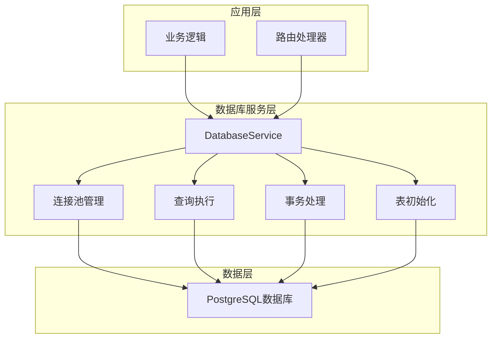
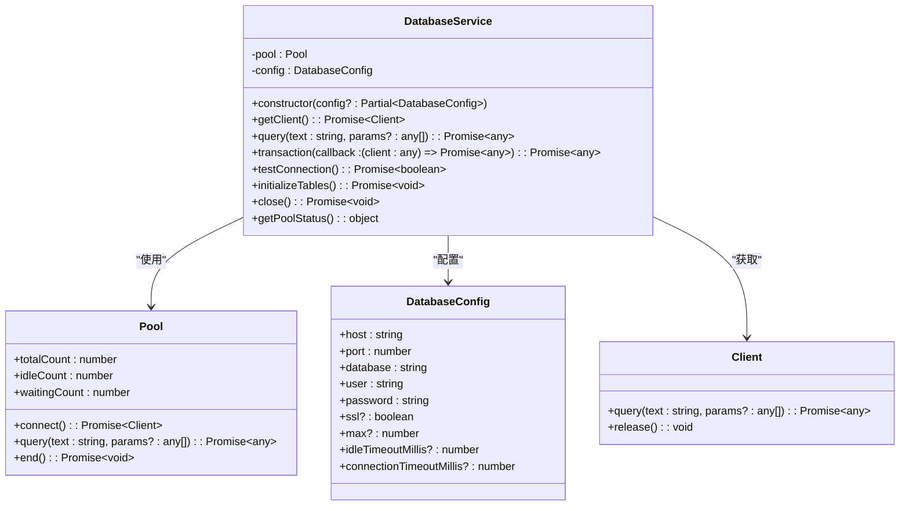
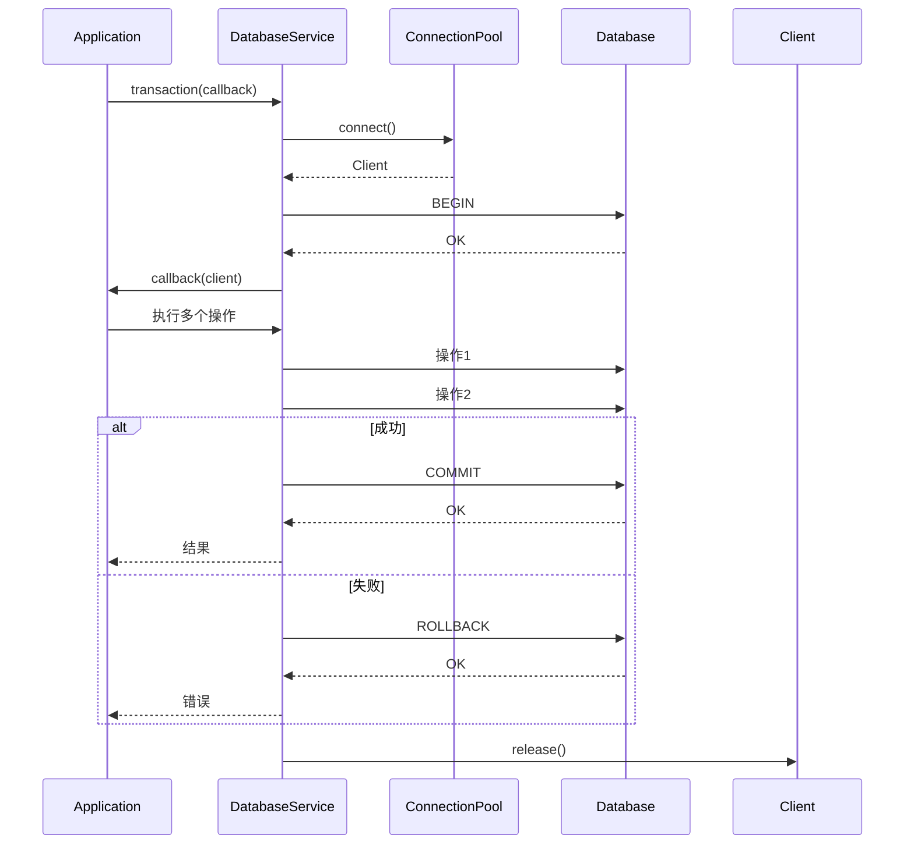
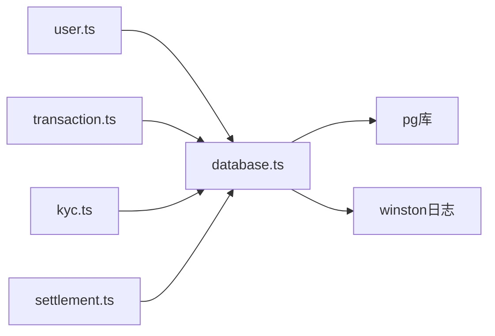

# 数据库服务

<cite>
**Referenced Files in This Document**   
- [database.ts](file://backend/src/services/database.ts)
- [user.ts](file://backend/src/routes/user.ts)
- [transaction.ts](file://backend/src/routes/transaction.ts)
</cite>

## 目录
1. [简介](#简介)
2. [核心组件](#核心组件)
3. [架构概述](#架构概述)
4. [详细组件分析](#详细组件分析)
5. [依赖分析](#依赖分析)
6. [性能考虑](#性能考虑)
7. [故障排除指南](#故障排除指南)
8. [结论](#结论)

## 简介
数据库服务是TriBridge交叉链支付平台后端系统的核心数据持久化层，负责管理与PostgreSQL数据库的连接并提供数据访问功能。该服务通过封装底层数据库操作，为上层业务逻辑提供统一、安全且高效的数据访问接口。服务设计注重连接管理、事务一致性和错误处理，确保在高并发场景下的稳定性和可靠性。通过连接池配置和监控机制，服务能够有效管理数据库资源，优化查询性能，并提供完整的故障恢复能力。

## 核心组件

数据库服务的核心组件包括连接池管理、查询执行、事务处理和表初始化功能。服务通过`DatabaseService`类实现，该类封装了与PostgreSQL数据库交互的所有逻辑。服务支持通过环境变量或构造函数参数进行灵活配置，包括主机、端口、数据库名称、认证信息和SSL设置。连接池配置允许控制最大连接数、空闲超时和连接超时，以适应不同的部署环境和负载需求。服务还提供了连接测试、状态监控和优雅关闭功能，确保数据库操作的可靠性和可维护性。

**Section sources**
- [database.ts](file://backend/src/services/database.ts#L15-L243)

## 架构概述

数据库服务采用分层架构设计，将连接管理、查询执行和业务逻辑分离。服务通过Node.js的`pg`库与PostgreSQL数据库通信，利用连接池机制提高性能和资源利用率。服务实例化时，根据配置创建连接池，并设置连接和错误事件监听器，实现连接状态的实时监控。所有数据库操作都通过统一的查询接口执行，该接口包含性能监控和错误日志记录功能。事务处理通过显式BEGIN-COMMIT/ROLLBACK语句实现，确保数据一致性。表初始化功能在服务启动时创建必要的数据库表，包括用户、钱包、交易、KYC记录和清算订单等核心实体。

**Diagram sources**
- [database.ts](file://backend/src/services/database.ts#L15-L243)

## 详细组件分析

### DatabaseService 类分析

#### 类图

**Diagram sources**
- [database.ts](file://backend/src/services/database.ts#L15-L243)

#### 构造函数分析
`DatabaseService`的构造函数负责初始化数据库配置和连接池。配置优先级为：构造函数参数 > 环境变量 > 默认值。这种设计提供了灵活的配置方式，既支持代码中直接配置，也支持通过环境变量进行部署时配置。SSL连接支持可选配置，允许在生产环境中启用加密连接。连接池配置包含最大连接数（默认20）、空闲超时（默认30秒）和连接超时（默认2秒）等关键参数，这些参数可根据实际负载进行调整以优化性能。

**Section sources**
- [database.ts](file://backend/src/services/database.ts#L25-L70)

#### 查询执行分析
查询执行方法`query`提供了安全的数据库查询接口。方法包含完整的错误处理和性能监控功能，记录查询执行时间并在日志中输出。成功查询记录为调试级别日志，包含执行时间和SQL语句；失败查询记录为错误级别日志，包含完整的错误信息。这种日志策略有助于性能分析和故障排查。查询方法直接使用连接池的查询功能，简化了连接管理，同时确保连接在使用后自动返回池中。

**Section sources**
- [database.ts](file://backend/src/services/database.ts#L70-L82)

#### 事务处理分析
事务处理方法`transaction`实现了ACID事务语义，确保多个数据库操作的原子性。方法首先获取数据库连接，然后执行BEGIN语句开始事务，接着执行用户提供的回调函数，最后根据执行结果提交或回滚事务。异常处理确保在任何错误情况下都会执行ROLLBACK，防止数据不一致。finally块确保连接在事务完成后被正确释放回连接池，避免连接泄漏。这种设计模式简化了事务管理，使业务逻辑开发者无需关心底层连接和事务控制细节。

**Diagram sources**
- [database.ts](file://backend/src/services/database.ts#L85-L99)

#### 表初始化分析
表初始化方法`initializeTables`在服务启动时创建所有必要的数据库表。方法使用`CREATE TABLE IF NOT EXISTS`语句，确保幂等性，即多次调用不会导致错误。创建的表包括用户表（users）、钱包表（wallets）、交易表（transactions）、KYC记录表（kyc_records）和清算订单表（settlement_orders）。每个表都定义了适当的主键、外键、索引和默认值，确保数据完整性和查询性能。JSONB类型用于存储灵活的文档数据，如KYC文档和个人信息，提供NoSQL式的灵活性同时保持关系数据库的优势。

**Section sources**
- [database.ts](file://backend/src/services/database.ts#L114-L222)

## 依赖分析

数据库服务依赖于Node.js的`pg`库进行PostgreSQL通信和`winston`日志库进行日志记录。服务通过`export const database = new DatabaseService()`导出默认实例，供其他模块导入使用，实现单例模式。上层路由处理器（如user.ts和transaction.ts）通过导入此实例访问数据库功能。这种依赖关系确保了整个应用使用统一的数据库连接池，避免了连接资源的浪费和不一致。

**Diagram sources**
- [database.ts](file://backend/src/services/database.ts#L1-L10)
- [user.ts](file://backend/src/routes/user.ts#L1-L10)
- [transaction.ts](file://backend/src/routes/transaction.ts#L1-L10)

## 性能考虑

数据库服务的性能主要受连接池配置、查询优化和索引策略影响。连接池的最大连接数应根据数据库服务器的处理能力和应用的并发需求进行配置，避免过多连接导致数据库过载。空闲超时和连接超时设置应平衡资源利用率和响应速度。查询性能可通过添加适当的索引优化，特别是对频繁查询的字段如用户ID、交易状态和时间戳。批量操作应使用事务确保一致性，同时避免长时间持有连接。监控连接池状态（totalCount, idleCount, waitingCount）有助于识别性能瓶颈和调整配置。

## 故障排除指南

常见故障包括数据库连接失败、查询超时和事务回滚。连接失败通常由网络问题、认证错误或数据库服务不可用引起，应检查配置参数和网络连通性。查询超时可能表明查询效率低下或数据库负载过高，应检查查询计划和索引使用情况。事务回滚表示业务逻辑中的错误或约束违反，应检查回滚日志中的错误信息。连接池耗尽可能表明连接泄漏或并发过高，应监控连接池状态并检查代码中的连接释放逻辑。服务提供了`testConnection`方法用于健康检查和`getPoolStatus`方法用于连接池监控，这些工具对于故障诊断非常有用。

**Section sources**
- [database.ts](file://backend/src/services/database.ts#L101-L113)
- [database.ts](file://backend/src/services/database.ts#L224-L243)

## 结论

数据库服务作为TriBridge平台的数据持久化核心，提供了可靠、高效和安全的数据库访问能力。通过合理的连接池管理、事务控制和错误处理，服务确保了数据的一致性和系统的稳定性。服务的模块化设计和清晰的接口使上层业务逻辑能够专注于功能实现，而不必关心底层数据访问细节。未来优化方向包括查询缓存、读写分离和分库分表，以支持更大规模的数据和更高的并发需求。