# Redis缓存服务

<cite>
**Referenced Files in This Document**  
- [redis.ts](file://backend/src/services/redis.ts)
- [index-simple.ts](file://backend/src/index-simple.ts)
</cite>

## 目录
1. [简介](#简介)
2. [项目结构](#项目结构)
3. [核心组件](#核心组件)
4. [架构概述](#架构概述)
5. [详细组件分析](#详细组件分析)
6. [依赖分析](#依赖分析)
7. [性能考虑](#性能考虑)
8. [故障排除指南](#故障排除指南)
9. [结论](#结论)

## 简介
`RedisService` 类是本系统中的核心缓存与分布式协调组件，提供高性能的Redis操作封装。该服务不仅实现了基础的键值存储功能，还集成了分布式锁、复杂对象序列化、多种数据结构操作等高级特性，为跨链支付平台提供可靠的缓存和状态管理能力。

## 项目结构

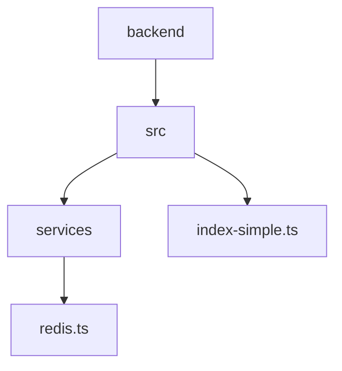

**Diagram sources**  
- [redis.ts](file://backend/src/services/redis.ts)
- [index-simple.ts](file://backend/src/index-simple.ts)

**Section sources**
- [redis.ts](file://backend/src/services/redis.ts)
- [index-simple.ts](file://backend/src/index-simple.ts)

## 核心组件

`RedisService` 类作为系统的核心缓存服务，封装了Redis客户端的所有操作，提供了类型安全、错误处理和日志记录的完整实现。该服务通过单例模式导出为 `redis` 实例，便于在整个应用中统一使用。

**Section sources**
- [redis.ts](file://backend/src/services/redis.ts#L12-L333)

## 架构概述

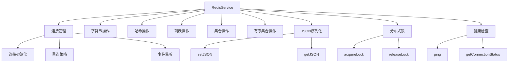

**Diagram sources**  
- [redis.ts](file://backend/src/services/redis.ts#L12-L333)

## 详细组件分析

### Redis客户端初始化

`RedisService` 的构造函数负责初始化Redis客户端，从环境变量或配置参数中读取连接信息，并构建连接URL。支持密码认证的连接字符串格式，确保连接安全性。

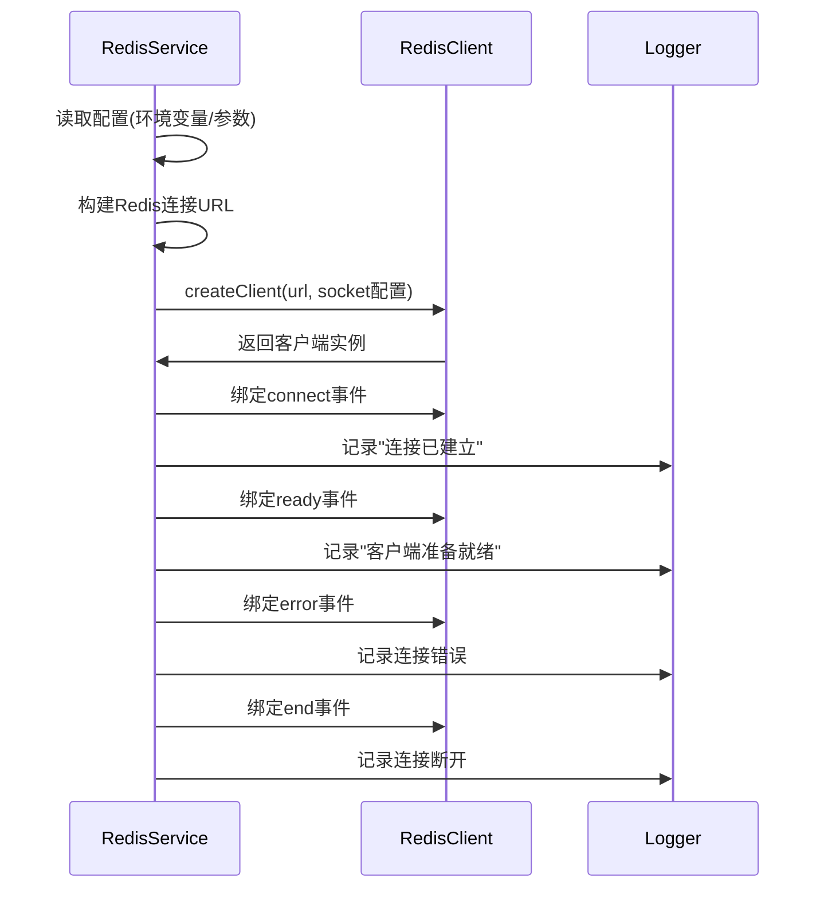

**Diagram sources**  
- [redis.ts](file://backend/src/services/redis.ts#L17-L64)

**Section sources**
- [redis.ts](file://backend/src/services/redis.ts#L17-L64)

### 基础字符串操作

`set`、`get`、`del` 方法提供了基础的字符串操作功能，包含完善的异常捕获和日志记录机制。支持可选的TTL参数，通过 `setEx` 方法实现自动过期。

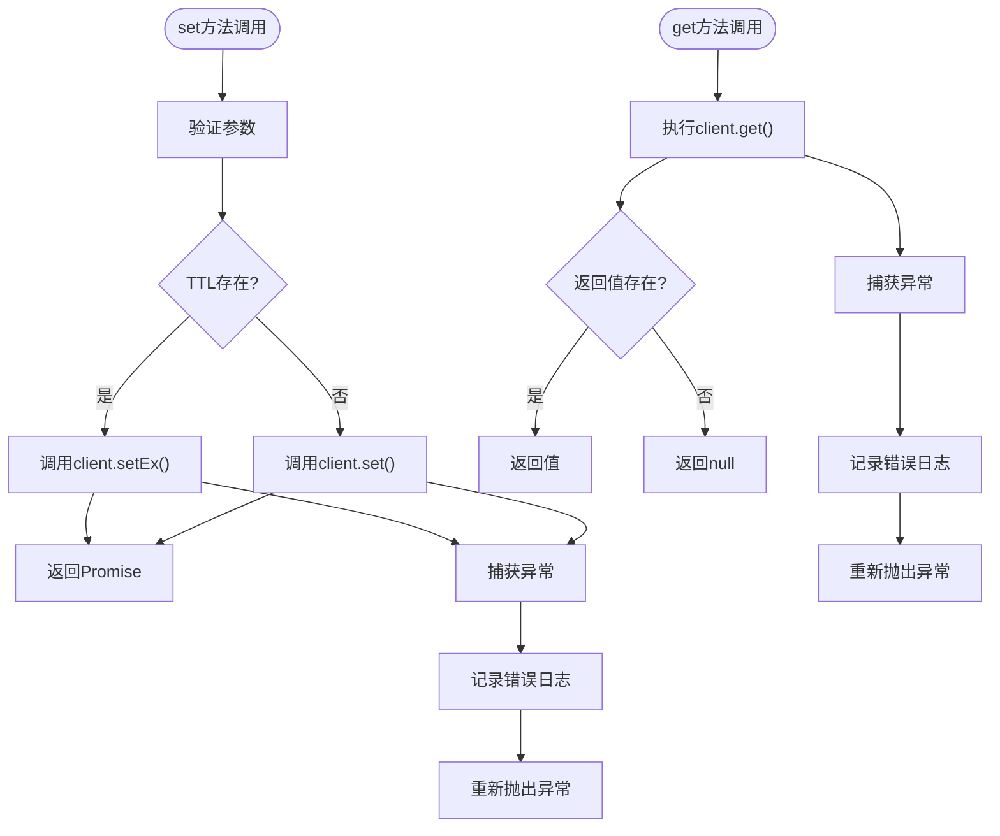

**Diagram sources**  
- [redis.ts](file://backend/src/services/redis.ts#L106-L126)

**Section sources**
- [redis.ts](file://backend/src/services/redis.ts#L106-L135)

### 复杂数据结构操作

`RedisService` 提供了对Redis五种主要数据结构的完整支持：

#### 哈希操作
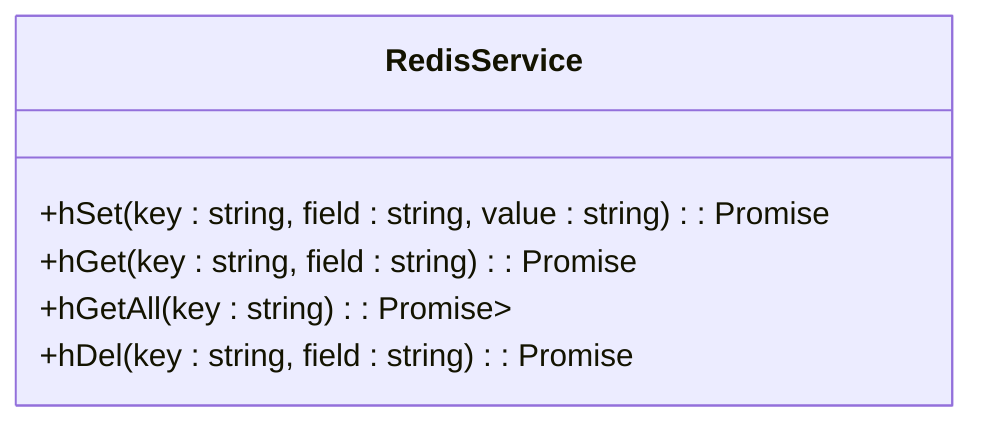

**Diagram sources**  
- [redis.ts](file://backend/src/services/redis.ts#L156-L163)

#### 列表操作
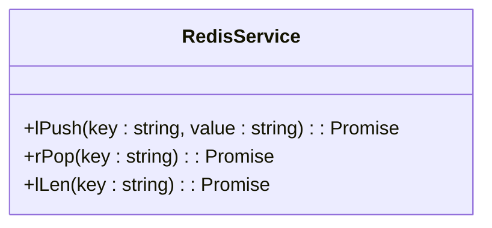

**Diagram sources**  
- [redis.ts](file://backend/src/services/redis.ts#L193-L200)

#### 集合操作
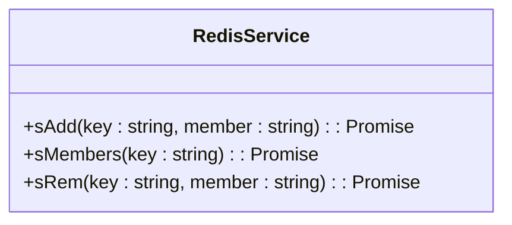

**Diagram sources**  
- [redis.ts](file://backend/src/services/redis.ts#L221-L228)

#### 有序集合操作
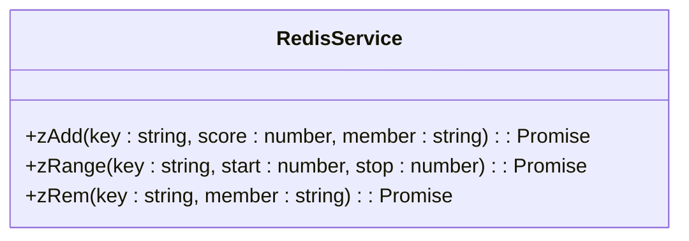

**Diagram sources**  
- [redis.ts](file://backend/src/services/redis.ts#L249-L256)

### JSON序列化支持

`setJSON` 和 `getJSON` 方法提供了对复杂对象的序列化支持，自动处理JSON转换和解析容错。

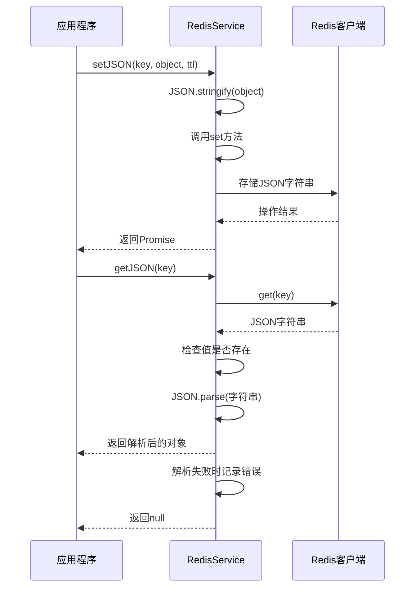

**Diagram sources**  
- [redis.ts](file://backend/src/services/redis.ts#L277-L293)

**Section sources**
- [redis.ts](file://backend/src/services/redis.ts#L277-L293)

### 分布式锁实现

`acquireLock` 和 `releaseLock` 方法基于Redis的SET命令实现了分布式锁，保证了锁的原子性和自动过期。

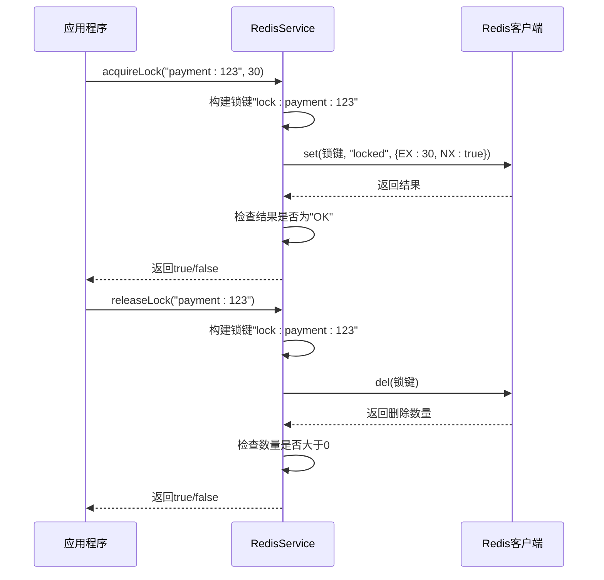

**Diagram sources**  
- [redis.ts](file://backend/src/services/redis.ts#L296-L319)

**Section sources**
- [redis.ts](file://backend/src/services/redis.ts#L296-L319)

### 健康检查机制

`ping` 和 `getConnectionStatus` 方法提供了系统监控所需的健康检查功能。

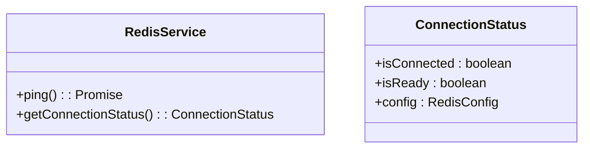

**Diagram sources**  
- [redis.ts](file://backend/src/services/redis.ts#L95-L103)
- [redis.ts](file://backend/src/services/redis.ts#L322-L332)

**Section sources**
- [redis.ts](file://backend/src/services/redis.ts#L95-L103)
- [redis.ts](file://backend/src/services/redis.ts#L322-L332)

## 依赖分析

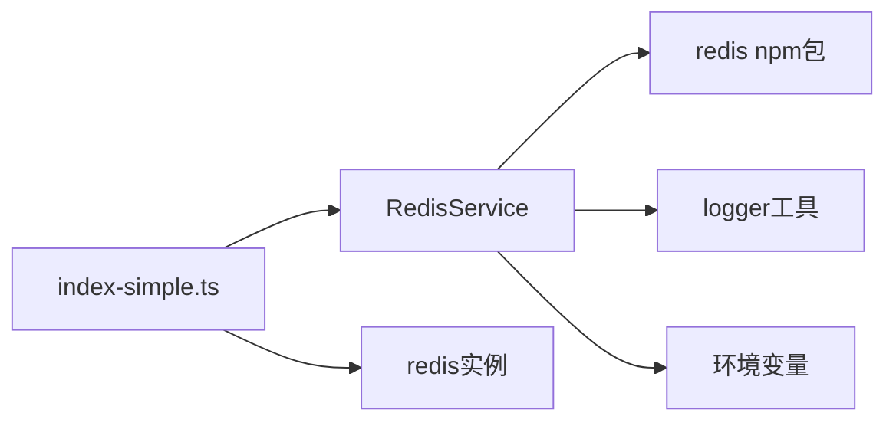

**Diagram sources**  
- [redis.ts](file://backend/src/services/redis.ts)
- [index-simple.ts](file://backend/src/index-simple.ts)

**Section sources**
- [redis.ts](file://backend/src/services/redis.ts)
- [index-simple.ts](file://backend/src/index-simple.ts)

## 性能考虑

`RedisService` 在设计上充分考虑了性能因素：
- 使用连接池复用连接，减少连接开销
- 异步非阻塞I/O操作，避免阻塞主线程
- 批量操作支持，减少网络往返
- 合理的重连策略，避免频繁重连造成资源浪费
- 错误处理机制，防止异常导致服务崩溃

## 故障排除指南

常见问题及解决方案：

1. **连接失败**：检查环境变量 `REDIS_HOST`、`REDIS_PORT`、`REDIS_PASSWORD` 是否正确配置
2. **认证失败**：确认密码正确且Redis服务器允许远程连接
3. **性能下降**：检查网络延迟，考虑使用连接池优化
4. **内存溢出**：设置合理的TTL，定期清理过期数据
5. **序列化错误**：确保存储的对象可以被JSON.stringify序列化

**Section sources**
- [redis.ts](file://backend/src/services/redis.ts)
- [index-simple.ts](file://backend/src/index-simple.ts)

## 结论

`RedisService` 类为系统提供了稳定、高效的缓存和分布式协调能力。通过封装Redis客户端的复杂性，提供了简洁易用的API接口。其完善的错误处理、日志记录和监控功能，确保了服务的可靠性和可维护性。在实际应用中，可广泛用于会话缓存、限流控制、交易状态暂存等场景，显著提升系统性能和用户体验。