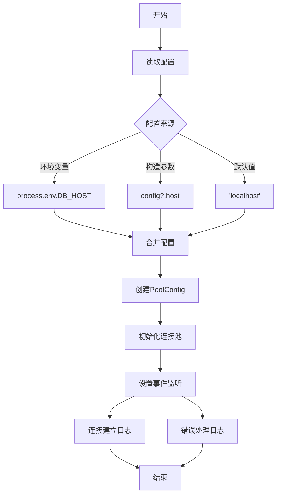
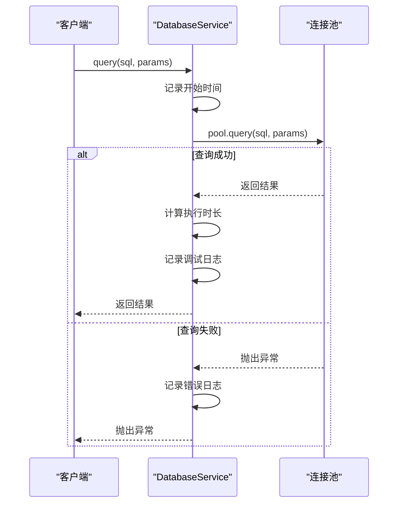
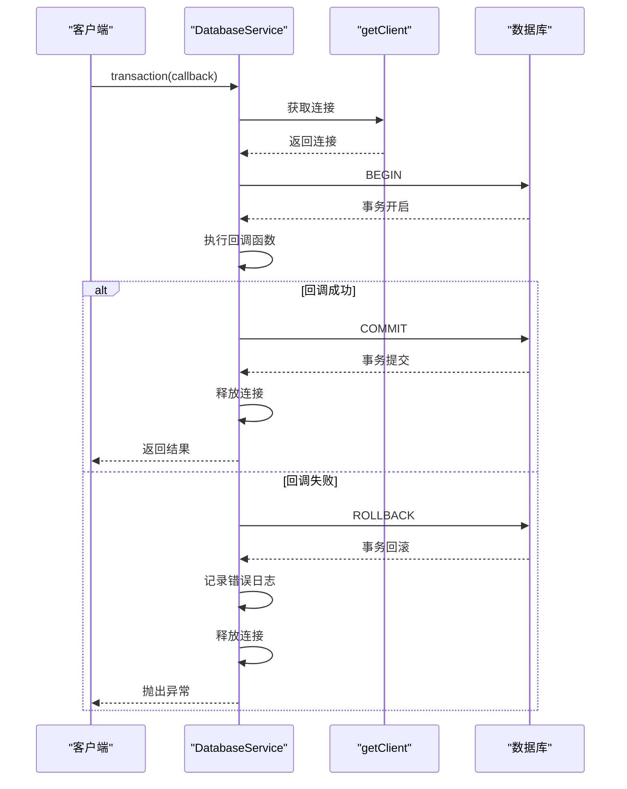
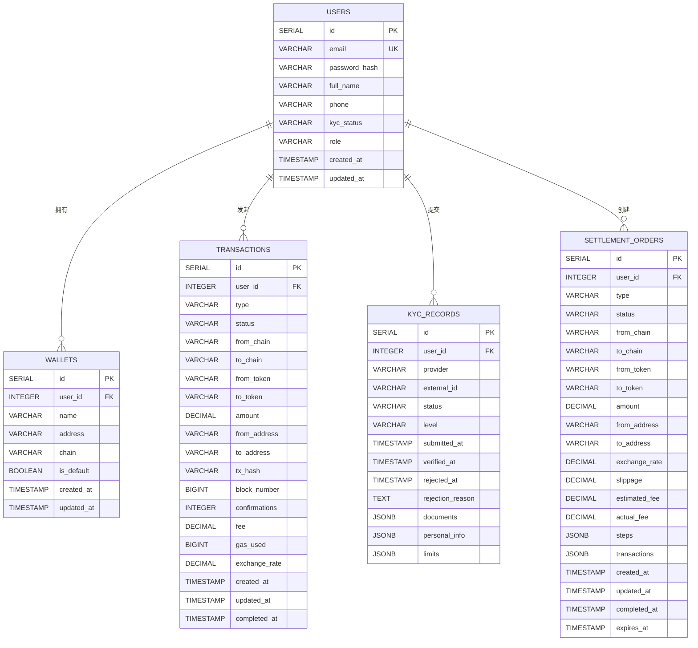
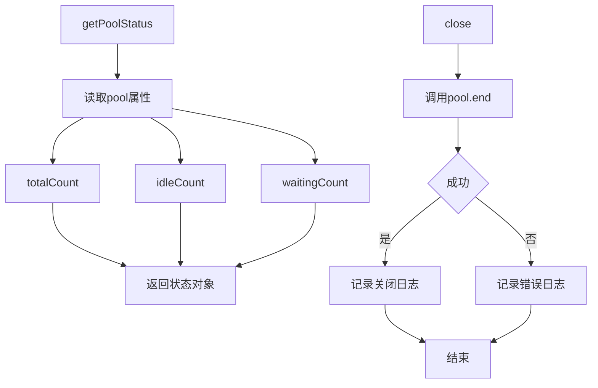
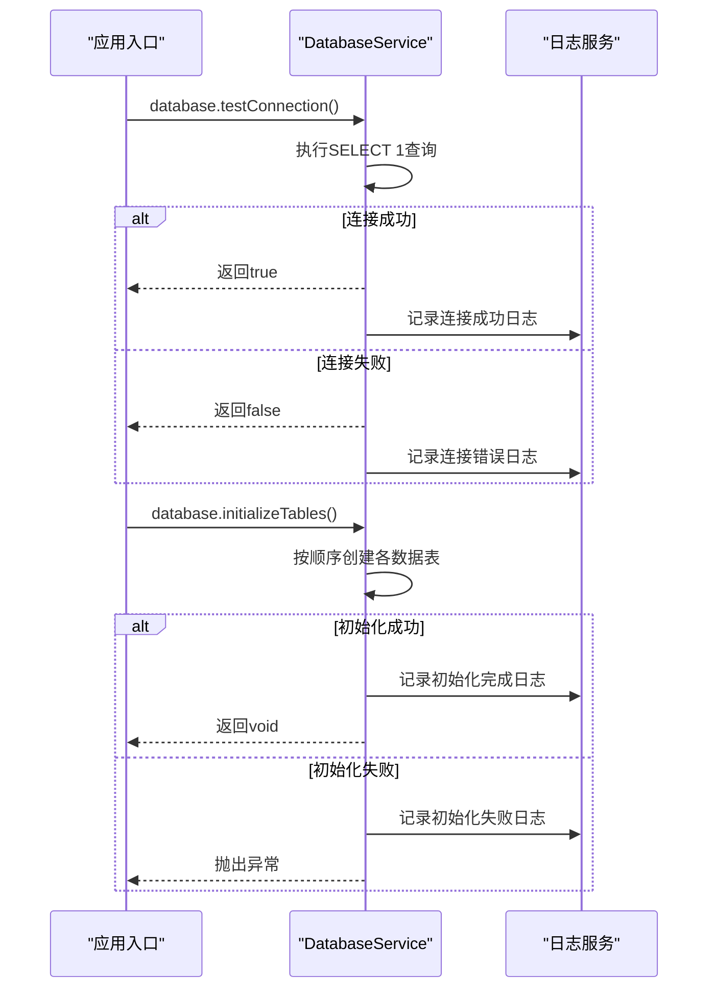

# 数据库服务

<cite>
**Referenced Files in This Document**   
- [database.ts](file://backend/src/services/database.ts)
- [logger.ts](file://backend/src/utils/logger.ts)
</cite>

## 目录
1. [简介](#简介)
2. [核心组件](#核心组件)
3. [连接池配置与初始化](#连接池配置与初始化)
4. [安全查询执行机制](#安全查询执行机制)
5. [事务管理实现](#事务管理实现)
6. [数据表结构设计](#数据表结构设计)
7. [连接池状态监控与资源释放](#连接池状态监控与资源释放)
8. [服务调用示例与最佳实践](#服务调用示例与最佳实践)

## 简介

`DatabaseService` 类是系统数据持久化的核心组件，为整个应用提供稳定可靠的 PostgreSQL 数据库访问能力。该服务通过连接池管理数据库连接，实现了高效的连接复用和资源管理。服务封装了查询执行、事务处理、表结构初始化等关键功能，为上层业务逻辑提供了简洁而强大的数据访问接口。通过参数化查询和完善的错误处理机制，确保了数据操作的安全性和可靠性。

**Section sources**
- [database.ts](file://backend/src/services/database.ts#L15-L243)

## 核心组件

`DatabaseService` 的核心由连接池管理、查询执行、事务处理和表结构管理四大组件构成。连接池基于 `pg` 库的 `Pool` 实现，通过配置化的参数控制连接数量和超时行为。查询执行组件提供参数化查询接口，内置执行时间监控和详细的日志记录。事务管理组件确保数据库操作的原子性，通过 `BEGIN-COMMIT-ROLLBACK` 机制保证数据一致性。表结构管理组件负责初始化系统所需的核心数据表，包括用户、钱包、交易、KYC 和清算订单等实体。

**Section sources**
- [database.ts](file://backend/src/services/database.ts#L15-L243)

## 连接池配置与初始化

### 连接池配置（PoolConfig）

`DatabaseService` 在构造函数中初始化连接池配置，该配置从环境变量或构造参数中获取。配置参数包括主机地址、端口号、数据库名称、用户名、密码、SSL 设置、最大连接数、空闲超时和连接超时等。这些参数确保了服务能够灵活适应不同的部署环境。

**Diagram sources**
- [database.ts](file://backend/src/services/database.ts#L19-L57)

**Section sources**
- [database.ts](file://backend/src/services/database.ts#L19-L57)

## 安全查询执行机制

### query方法实现

`query` 方法实现了安全的参数化查询执行机制。该方法接收 SQL 查询文本和参数数组，通过 `pg` 库的参数化查询功能防止 SQL 注入攻击。执行过程中，方法会记录查询开始时间，在成功或失败时计算执行时长并记录日志，便于性能监控和问题排查。

**Diagram sources**
- [database.ts](file://backend/src/services/database.ts#L70-L82)

**Section sources**
- [database.ts](file://backend/src/services/database.ts#L70-L82)

## 事务管理实现

### transaction方法实现

`transaction` 方法提供了事务管理功能，确保一系列数据库操作的原子性。方法首先获取数据库连接，然后执行 `BEGIN` 语句开启事务，接着执行传入的回调函数中的数据库操作，如果所有操作成功则执行 `COMMIT` 提交事务，如果发生异常则执行 `ROLLBACK` 回滚事务。无论成功或失败，最终都会释放数据库连接。

**Diagram sources**
- [database.ts](file://backend/src/services/database.ts#L85-L99)

**Section sources**
- [database.ts](file://backend/src/services/database.ts#L85-L99)

## 数据表结构设计

### initializeTables方法实现

`initializeTables` 方法负责创建系统所需的核心数据表。该方法按顺序创建用户、钱包、交易、KYC 和清算订单表，每个表都有明确的字段定义和约束关系。表结构设计考虑了业务需求和数据完整性，通过外键约束维护表间关系。

**Diagram sources**
- [database.ts](file://backend/src/services/database.ts#L114-L222)

**Section sources**
- [database.ts](file://backend/src/services/database.ts#L114-L222)

## 连接池状态监控与资源释放

### 连接池状态监控

`getPoolStatus` 方法提供了连接池的实时状态监控功能，返回连接池的总连接数、空闲连接数和等待连接数。这些指标对于监控数据库负载和性能调优至关重要。

### 资源释放

`close` 方法负责安全地关闭连接池，释放所有数据库连接资源。该方法在应用关闭时调用，确保数据库连接被正确清理。

**Diagram sources**
- [database.ts](file://backend/src/services/database.ts#L236-L242)
- [database.ts](file://backend/src/services/database.ts#L225-L233)

**Section sources**
- [database.ts](file://backend/src/services/database.ts#L225-L242)

## 服务调用示例与最佳实践

### 服务调用示例

`DatabaseService` 通过单例模式导出，可在应用的任何位置直接使用。以下是在用户管理和服务初始化中的典型调用方式：

**Diagram sources**
- [database.ts](file://backend/src/services/database.ts#L102-L111)
- [database.ts](file://backend/src/services/database.ts#L114-L222)

**Section sources**
- [database.ts](file://backend/src/services/database.ts#L102-L222)

### 最佳实践

1. **连接泄漏预防**：始终使用 `query` 方法或 `transaction` 方法，避免直接管理连接
2. **查询性能优化**：为常用查询字段创建索引，避免全表扫描
3. **故障恢复策略**：实现连接重试机制，在连接失败时进行指数退避重试
4. **监控与告警**：定期检查连接池状态，设置连接数和等待数的告警阈值
5. **配置管理**：通过环境变量管理数据库配置，便于不同环境的部署和切换