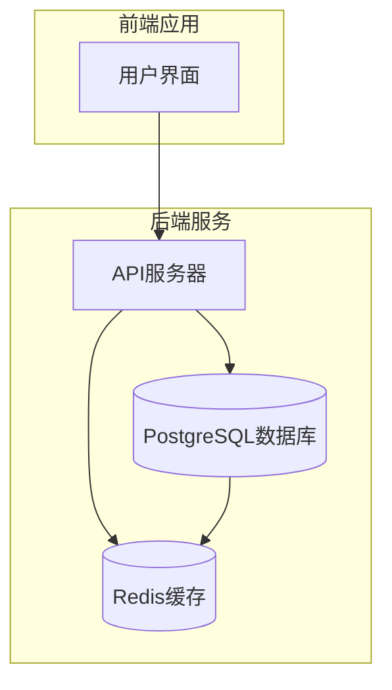
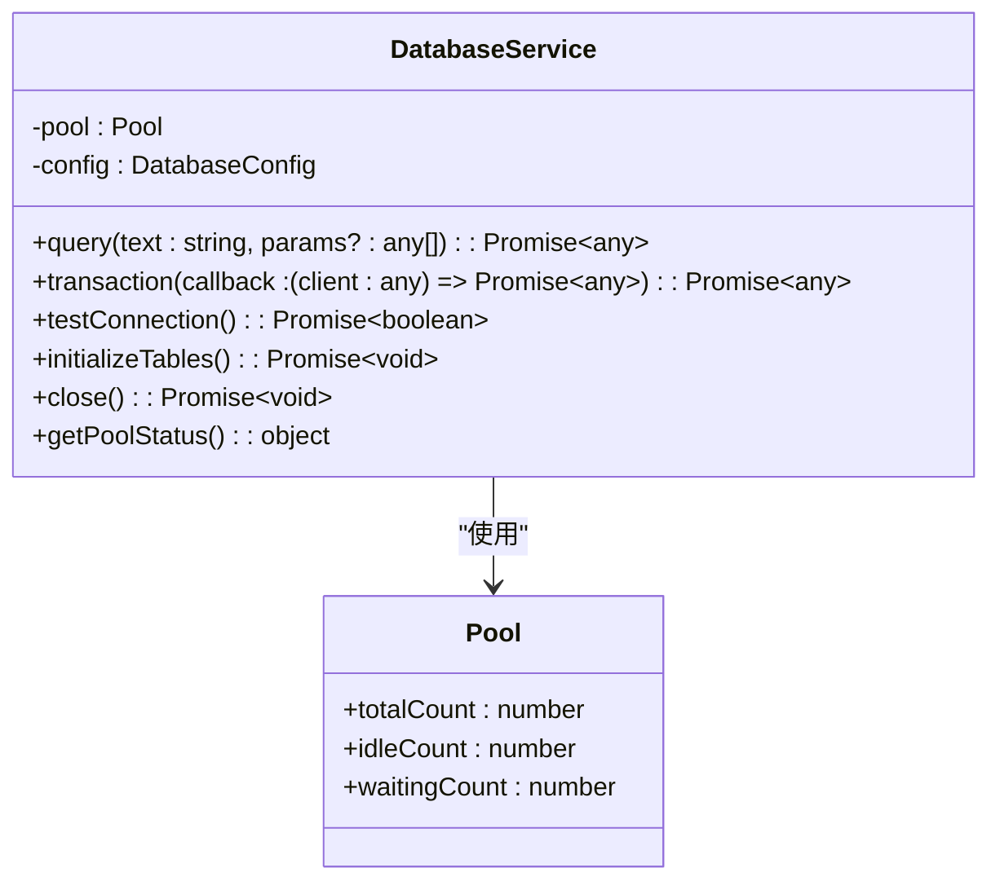
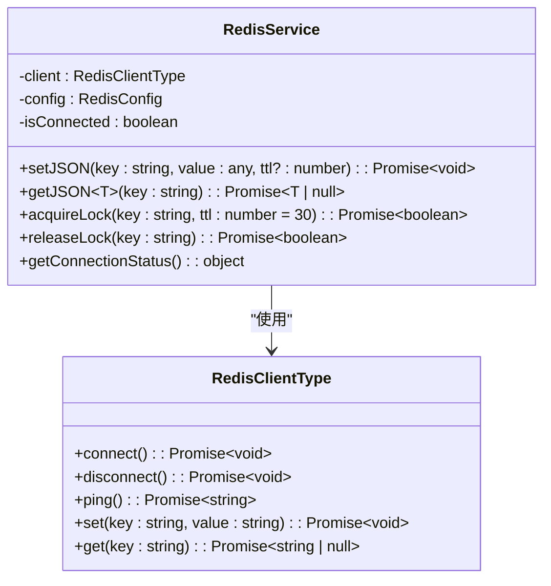
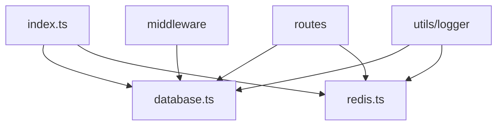

# 数据访问服务

<cite>
**本文档中引用的文件**  
- [database.ts](file://backend/src/services/database.ts)
- [redis.ts](file://backend/src/services/redis.ts)
- [index.ts](file://backend/src/index.ts)
</cite>

## 目录
1. [引言](#引言)
2. [项目结构](#项目结构)
3. [核心组件](#核心组件)
4. [架构概述](#架构概述)
5. [详细组件分析](#详细组件分析)
6. [依赖分析](#依赖分析)
7. [性能考虑](#性能考虑)
8. [故障排查指南](#故障排查指南)
9. [结论](#结论)

## 引言
本文档全面解析数据访问服务的实现机制，阐述 `database.ts` 如何基于 PostgreSQL 提供可靠的数据持久化支持，包括连接池管理、查询执行和事务处理。详细说明 `query` 和 `transaction` 方法的安全实现和错误处理策略。分析 `redis.ts` 如何实现高性能缓存和分布式锁，包括 `setJSON`/`getJSON` 的序列化支持和 `acquireLock`/`releaseLock` 的原子性保证。解释两个服务在系统中的协同作用，如数据库负责持久化存储而 Redis 负责会话缓存和实时数据。提供连接管理、状态监控和故障恢复的最佳实践。

## 项目结构
本项目采用分层架构设计，后端服务位于 `backend/src` 目录下，主要分为 `middleware`、`routes`、`services`、`types` 和 `utils` 五个模块。数据访问服务的核心实现位于 `services` 目录下的 `database.ts` 和 `redis.ts` 文件中，分别封装了 PostgreSQL 和 Redis 的访问逻辑。系统通过 `index.ts` 入口文件初始化并启动服务，确保数据库和缓存服务在应用启动时正确连接。

**Section sources**
- [index.ts](file://backend/src/index.ts#L1-L259)

## 核心组件
数据访问服务由两个核心组件构成：`DatabaseService` 和 `RedisService`。`DatabaseService` 基于 `pg` 模块实现，提供连接池管理、SQL 查询执行和事务处理功能。`RedisService` 基于 `redis` 模块实现，提供字符串、哈希、列表、集合等多种数据结构的操作接口，以及 JSON 序列化和分布式锁等高级功能。两个服务均通过单例模式暴露全局实例，便于在整个应用中统一访问。

**Section sources**
- [database.ts](file://backend/src/services/database.ts#L1-L247)
- [redis.ts](file://backend/src/services/redis.ts#L1-L337)

## 架构概述
系统采用数据库与缓存协同工作的架构模式。PostgreSQL 作为主数据存储，负责用户信息、交易记录、KYC 数据等关键业务数据的持久化存储。Redis 作为高性能缓存层，负责会话管理、实时数据缓存和分布式锁等场景。这种架构既保证了数据的可靠性和一致性，又提升了系统的响应速度和并发处理能力。

**Diagram sources**
- [database.ts](file://backend/src/services/database.ts#L1-L247)
- [redis.ts](file://backend/src/services/redis.ts#L1-L337)

## 详细组件分析

### DatabaseService 分析
`DatabaseService` 类封装了 PostgreSQL 数据库的访问逻辑，通过连接池管理数据库连接，有效控制并发连接数，避免资源耗尽。服务支持通过环境变量或构造函数参数配置数据库连接信息，包括主机、端口、数据库名、用户名、密码等。连接池配置了最大连接数、空闲超时和连接超时等参数，确保连接的高效利用和及时回收。

**Diagram sources**
- [database.ts](file://backend/src/services/database.ts#L1-L247)

**Section sources**
- [database.ts](file://backend/src/services/database.ts#L1-L247)

### RedisService 分析
`RedisService` 类封装了 Redis 缓存的访问逻辑，提供丰富的数据结构操作接口。服务支持字符串、哈希、列表、集合和有序集合等五种基本数据结构的操作，并在此基础上实现了 JSON 序列化和分布式锁等高级功能。连接配置支持主机、端口、密码、数据库编号等参数，并配置了重连策略，确保在网络波动时能够自动恢复连接。

**Diagram sources**
- [redis.ts](file://backend/src/services/redis.ts#L1-L337)

**Section sources**
- [redis.ts](file://backend/src/services/redis.ts#L1-L337)

## 依赖分析
数据访问服务与其他模块存在紧密的依赖关系。`index.ts` 入口文件在应用启动时初始化并连接数据库和 Redis 服务，确保服务可用性。业务路由模块通过中间件和业务逻辑层调用数据访问服务，实现数据的读写操作。日志模块被集成到数据访问服务中，用于记录连接状态、查询性能和错误信息，便于系统监控和故障排查。

**Diagram sources**
- [index.ts](file://backend/src/index.ts#L1-L259)
- [database.ts](file://backend/src/services/database.ts#L1-L247)
- [redis.ts](file://backend/src/services/redis.ts#L1-L337)

**Section sources**
- [index.ts](file://backend/src/index.ts#L1-L259)
- [database.ts](file://backend/src/services/database.ts#L1-L247)
- [redis.ts](file://backend/src/services/redis.ts#L1-L337)

## 性能考虑
数据访问服务在设计时充分考虑了性能优化。`DatabaseService` 通过连接池管理数据库连接，避免了频繁创建和销毁连接的开销。查询方法记录执行时间，便于性能监控和优化。`RedisService` 利用内存存储和高效的数据结构，提供亚毫秒级的读写性能。分布式锁的实现采用原子性操作，确保在高并发场景下的正确性。两个服务均实现了错误处理和重试机制，提高系统的稳定性和容错能力。

## 故障排查指南
当数据访问服务出现问题时，可按照以下步骤进行排查：首先检查服务日志，查看是否有连接错误或查询失败的记录；其次验证数据库和 Redis 服务是否正常运行，网络连接是否通畅；然后检查环境变量配置是否正确，特别是主机地址、端口、用户名和密码等关键信息；最后可通过调用健康检查接口验证服务状态。对于连接池问题，可检查连接数是否达到上限，空闲连接是否及时释放。

**Section sources**
- [database.ts](file://backend/src/services/database.ts#L1-L247)
- [redis.ts](file://backend/src/services/redis.ts#L1-L337)

## 结论
数据访问服务通过 `DatabaseService` 和 `RedisService` 两个核心组件，为系统提供了可靠的数据持久化和高性能缓存支持。服务设计充分考虑了安全性、可靠性和性能，通过连接池管理、事务处理、JSON 序列化和分布式锁等机制，满足了跨境支付平台对数据访问的高要求。两个服务的协同工作，既保证了数据的一致性和完整性，又提升了系统的响应速度和并发处理能力，为平台的稳定运行提供了坚实的基础。