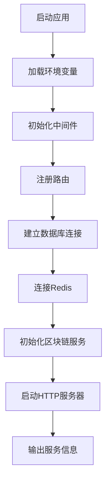
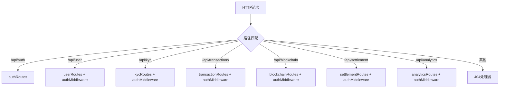
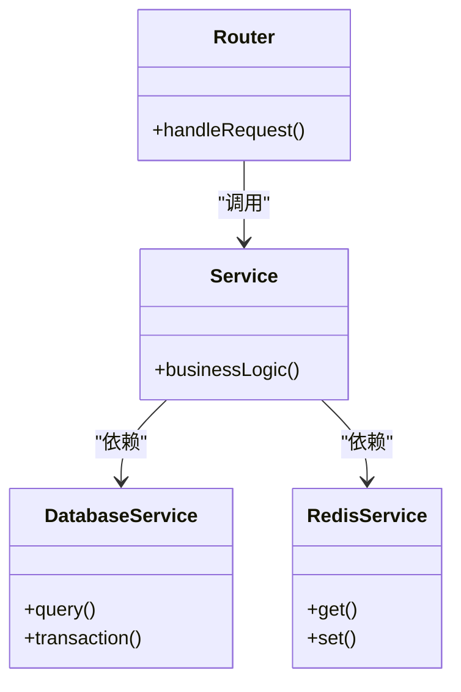
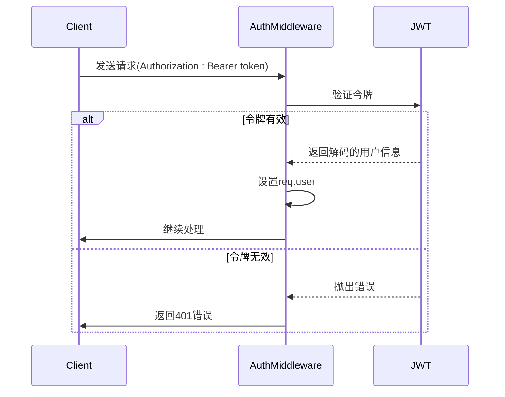
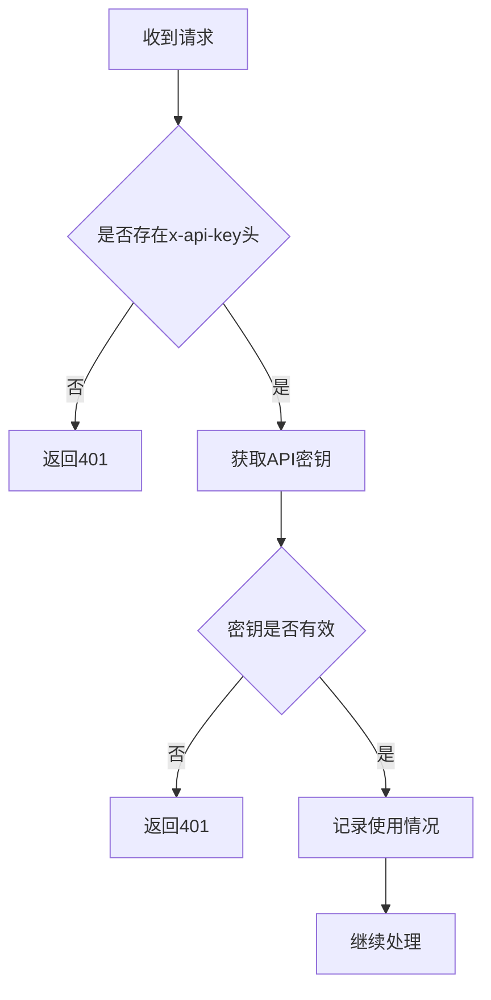
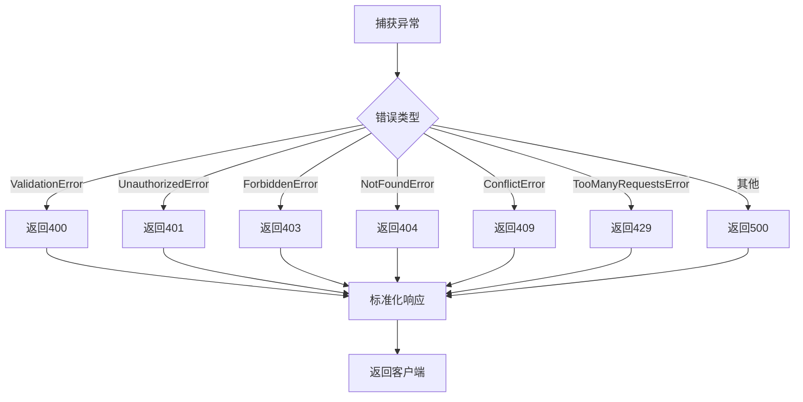
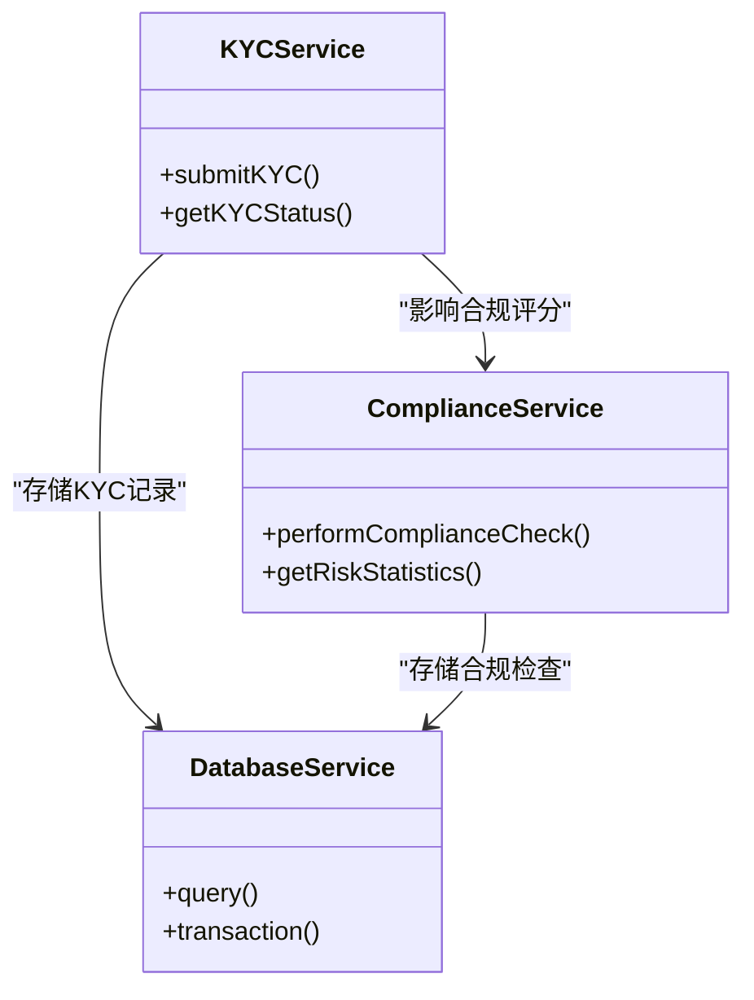
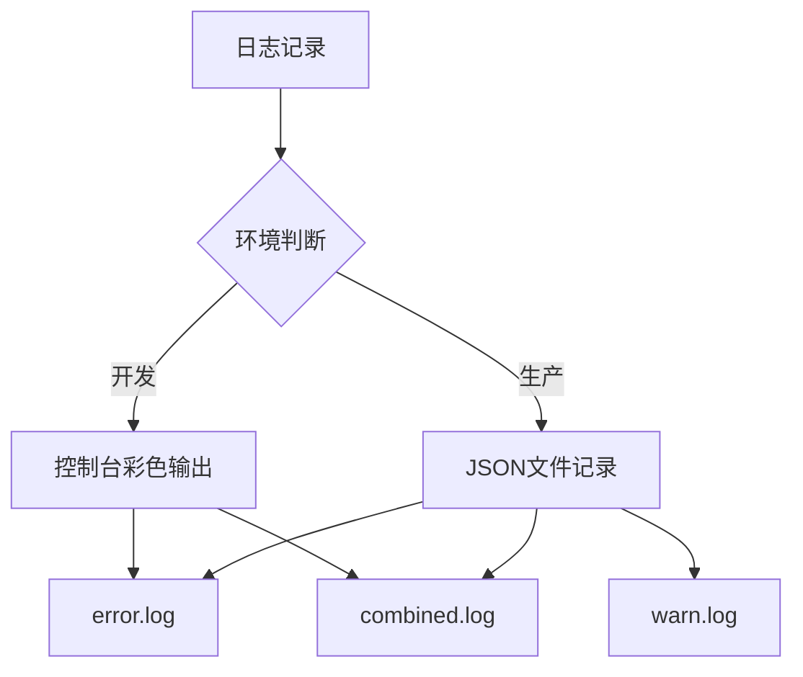
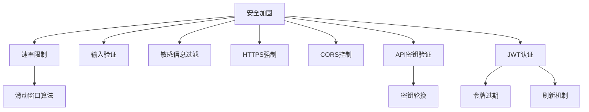
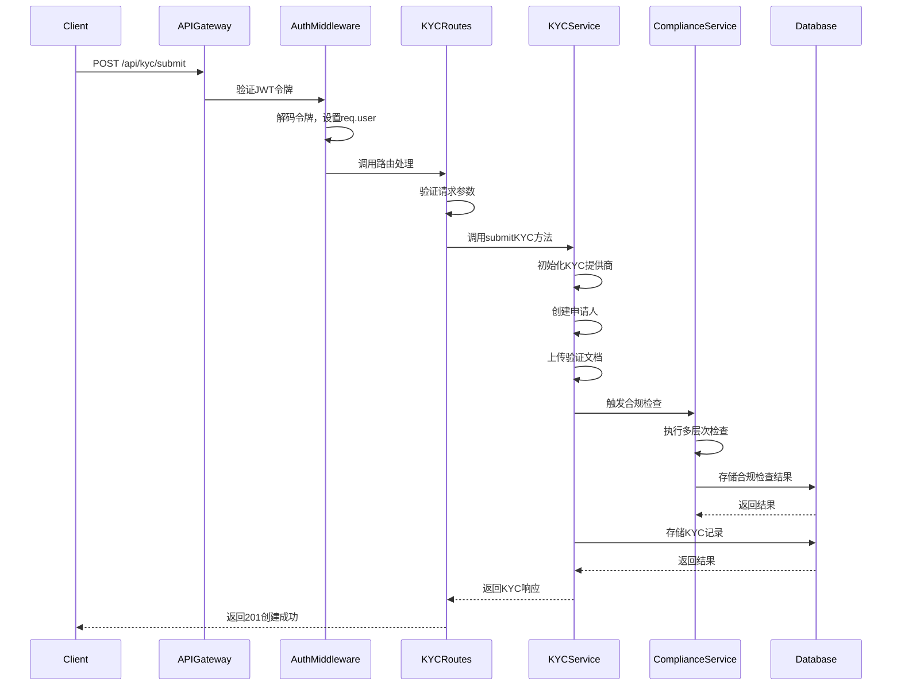

# 后端架构

<cite>
**本文档引用的文件**  
- [index.ts](file://backend/src/index.ts)
- [auth.ts](file://backend/src/middleware/auth.ts)
- [apiKey.ts](file://backend/src/middleware/apiKey.ts)
- [errorHandler.ts](file://backend/src/middleware/errorHandler.ts)
- [logger.ts](file://backend/src/utils/logger.ts)
- [kycService.ts](file://backend/src/services/kycService.ts)
- [complianceService.ts](file://backend/src/services/complianceService.ts)
- [kyc.ts](file://backend/src/routes/kyc.ts)
- [compliance.ts](file://backend/src/routes/compliance.ts)
- [database.ts](file://backend/src/services/database.ts)
- [redis.ts](file://backend/src/services/redis.ts)
- [blockchain.ts](file://backend/src/services/blockchain.ts)
</cite>

## 目录
1. [应用启动流程](#应用启动流程)
2. [中间件链构建](#中间件链构建)
3. [路由分发机制](#路由分发机制)
4. [MVC模式实现](#mvc模式实现)
5. [关键中间件工作原理](#关键中间件工作原理)
6. [服务层依赖关系](#服务层依赖关系)
7. [日志系统配置](#日志系统配置)
8. [性能监控与安全加固](#性能监控与安全加固)
9. [典型请求处理路径](#典型请求处理路径)

## 应用启动流程

后端服务的启动入口为 `index.ts` 文件，通过 `TriBridgeAPI` 类实现应用的初始化和启动。该类在构造函数中依次初始化中间件、路由、WebSocket 和错误处理机制，并在 `start()` 方法中启动服务器。

启动流程包括：
- 加载环境变量
- 初始化数据库连接（PostgreSQL）
- 建立 Redis 缓存连接
- 启动区块链服务健康检查
- 监听指定端口并输出服务状态信息

**图示来源**
- [index.ts](file://backend/src/index.ts#L1-L259)

**本节来源**
- [index.ts](file://backend/src/index.ts#L1-L259)

## 中间件链构建

中间件链在 `index.ts` 的 `initializeMiddleware()` 方法中构建，采用分层设计模式，确保请求在到达业务逻辑前经过必要的安全和性能处理。

中间件执行顺序如下：
1. **安全中间件**：使用 `helmet` 设置 HTTP 安全头
2. **跨域配置**：通过 `cors` 允许前端域名访问
3. **请求压缩**：使用 `compression` 压缩响应内容
4. **请求日志**：通过 `morgan` 记录请求日志
5. **速率限制**：使用 `express-rate-limit` 限制请求频率
6. **请求体解析**：支持 JSON 和 URL 编码格式
7. **API密钥验证**：验证外部请求的 API 密钥

**图示来源**
- [index.ts](file://backend/src/index.ts#L50-L100)

**本节来源**
- [index.ts](file://backend/src/index.ts#L50-L100)

## 路由分发机制

路由系统采用模块化设计，所有路由定义在 `routes` 目录下，通过 `initializeRoutes()` 方法注册到 Express 应用中。每个路由模块负责特定业务领域的请求处理。

核心路由包括：
- `/api/auth`：认证相关接口
- `/api/user`：用户管理接口
- `/api/kyc`：KYC认证接口
- `/api/transactions`：交易处理接口
- `/api/blockchain`：区块链操作接口
- `/api/settlement`：清算接口
- `/api/analytics`：数据分析接口

路由注册时应用了身份验证中间件，确保受保护的端点需要有效的 JWT 令牌才能访问。

**图示来源**
- [index.ts](file://backend/src/index.ts#L102-L150)

**本节来源**
- [index.ts](file://backend/src/index.ts#L102-L150)

## MVC模式实现

系统采用 MVC（Model-View-Controller）架构模式，但在后端服务中主要体现为 **路由-服务-数据访问** 的分层结构。

### 路由层（Routes）
路由文件（如 `kyc.ts`、`compliance.ts`）负责请求分发，将 HTTP 请求转换为服务层调用。路由层不包含业务逻辑，仅处理参数验证和响应格式化。

### 服务层（Services）
服务类（如 `KYCService`、`ComplianceService`）封装核心业务逻辑，提供可重用的业务方法。服务层独立于 HTTP 协议，可被多个路由或定时任务调用。

### 数据访问层
通过 `DatabaseService` 和 `RedisService` 提供统一的数据访问接口，封装数据库操作细节，为上层服务提供数据支持。

**图示来源**
- [kyc.ts](file://backend/src/routes/kyc.ts#L1-L210)
- [kycService.ts](file://backend/src/services/kycService.ts#L1-L562)
- [database.ts](file://backend/src/services/database.ts#L1-L247)
- [redis.ts](file://backend/src/services/redis.ts#L1-L333)

**本节来源**
- [kyc.ts](file://backend/src/routes/kyc.ts#L1-L210)
- [kycService.ts](file://backend/src/services/kycService.ts#L1-L562)

## 关键中间件工作原理

### JWT认证中间件

`authMiddleware` 实现基于 JWT 的身份验证机制，从请求头中提取 Bearer 令牌并进行验证。验证成功后将用户信息挂载到 `req.user` 对象上，供后续处理使用。

**图示来源**
- [auth.ts](file://backend/src/middleware/auth.ts#L10-L58)

**本节来源**
- [auth.ts](file://backend/src/middleware/auth.ts#L10-L58)

### API密钥验证中间件

`validateApiKey` 中间件用于验证外部系统调用的 API 密钥，支持多密钥配置和管理员密钥的特殊处理。密钥验证通过环境变量配置，支持开发和生产环境的不同设置。

**图示来源**
- [apiKey.ts](file://backend/src/middleware/apiKey.ts#L3-L39)

**本节来源**
- [apiKey.ts](file://backend/src/middleware/apiKey.ts#L3-L39)

### 统一错误处理中间件

`errorHandler` 是全局错误处理中间件，捕获应用中的所有异常并返回标准化的错误响应。支持根据错误类型返回不同的状态码和错误信息，并在开发环境中提供详细的调试信息。

**图示来源**
- [errorHandler.ts](file://backend/src/middleware/errorHandler.ts#L8-L85)

**本节来源**
- [errorHandler.ts](file://backend/src/middleware/errorHandler.ts#L8-L85)

## 服务层依赖关系

服务层采用依赖注入模式，各服务类之间通过明确的接口进行交互。核心服务包括 KYC 服务和合规服务，其中 KYC 服务需要调用合规服务进行风险评估。

### KYC服务调用合规服务

`KYCService` 在提交 KYC 申请时，会间接依赖 `ComplianceService` 进行风险评估。虽然当前代码中未直接显示调用关系，但从业务逻辑上看，KYC 结果会影响合规检查的评分。

**图示来源**
- [kycService.ts](file://backend/src/services/kycService.ts#L95-L559)
- [complianceService.ts](file://backend/src/services/complianceService.ts#L44-L458)

**本节来源**
- [kycService.ts](file://backend/src/services/kycService.ts#L95-L559)
- [complianceService.ts](file://backend/src/services/complianceService.ts#L44-L458)

## 日志系统配置

日志系统基于 Winston 库实现，支持不同环境下的日志级别和格式配置。系统提供多种日志记录方式，包括控制台输出、文件记录和结构化日志。

### 日志级别配置

| 日志级别 | 数值 | 颜色 | 使用场景 |
|---------|-----|------|---------|
| error | 0 | 红色 | 错误和异常 |
| warn | 1 | 黄色 | 警告信息 |
| info | 2 | 绿色 | 一般信息 |
| http | 3 | 洋红色 | HTTP请求 |
| debug | 4 | 白色 | 调试信息 |

### 日志格式

- **开发环境**：彩色格式化输出，便于调试
- **生产环境**：结构化 JSON 格式，便于日志收集和分析

日志文件按级别分离，包括 `error.log`、`warn.log` 和 `combined.log`，确保重要日志易于检索。

**图示来源**
- [logger.ts](file://backend/src/utils/logger.ts#L86-L92)

**本节来源**
- [logger.ts](file://backend/src/utils/logger.ts#L1-L199)

## 性能监控与安全加固

### 性能监控

系统通过多种机制实现性能监控：
- **请求耗时监控**：使用 `httpLogger` 记录每个请求的处理时间
- **数据库性能**：在查询前后记录时间戳，监控慢查询
- **区块链服务健康检查**：定期检查各区块链的连接状态和性能指标
- **连接池监控**：监控数据库和 Redis 连接池的使用情况

### 安全加固

系统实施了多层次的安全措施：
- **速率限制**：防止暴力破解和DDoS攻击
- **输入验证**：在路由层进行参数验证
- **敏感信息过滤**：在错误响应中过滤敏感信息
- **HTTPS强制**：通过 Helmet 中间件强制安全连接
- **CORS控制**：限制允许的跨域来源

**本节来源**
- [index.ts](file://backend/src/index.ts#L50-L100)
- [auth.ts](file://backend/src/middleware/auth.ts#L10-L58)
- [apiKey.ts](file://backend/src/middleware/apiKey.ts#L3-L39)

## 典型请求处理路径

以提交 KYC 申请为例，展示典型请求的完整处理路径：

**图示来源**
- [kyc.ts](file://backend/src/routes/kyc.ts#L4-L4)
- [kycService.ts](file://backend/src/services/kycService.ts#L95-L559)
- [complianceService.ts](file://backend/src/services/complianceService.ts#L44-L458)

**本节来源**
- [kyc.ts](file://backend/src/routes/kyc.ts#L4-L209)
- [kycService.ts](file://backend/src/services/kycService.ts#L95-L559)
- [complianceService.ts](file://backend/src/services/complianceService.ts#L44-L458)