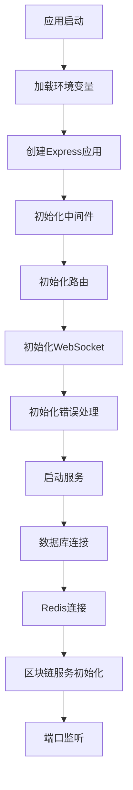
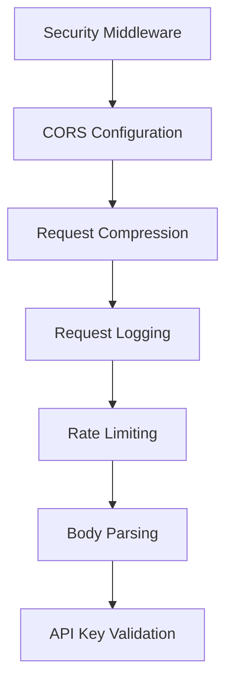
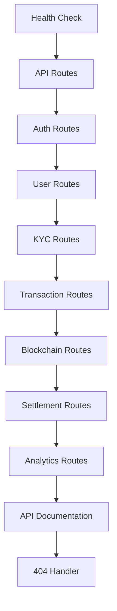
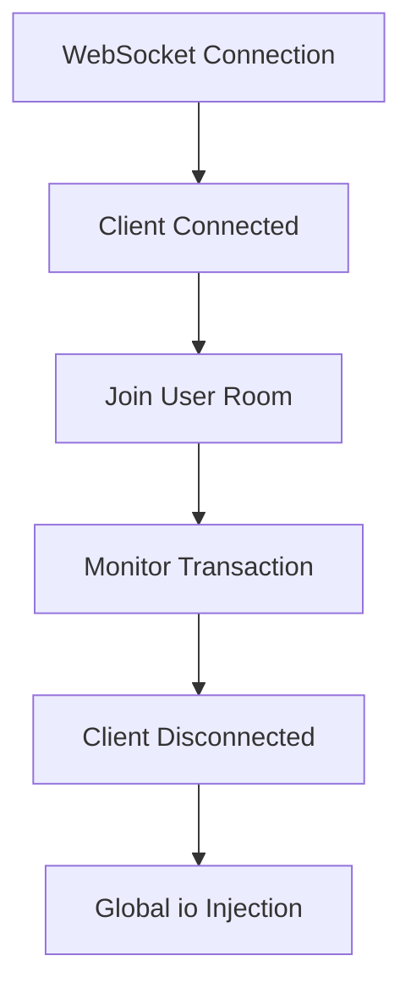
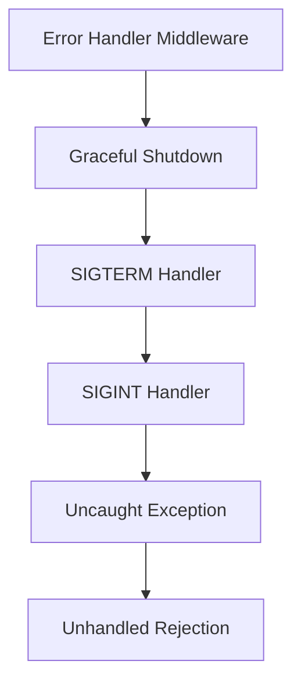
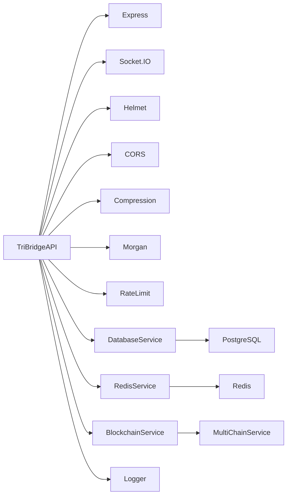

# 应用初始化流程

<cite>
**本文档引用文件**   
- [index.ts](file://backend/src/index.ts)
- [logger.ts](file://backend/src/utils/logger.ts)
- [database.ts](file://backend/src/services/database.ts)
- [redis.ts](file://backend/src/services/redis.ts)
- [blockchain.ts](file://backend/src/services/blockchain.ts)
- [errorHandler.ts](file://backend/src/middleware/errorHandler.ts)
- [apiKey.ts](file://backend/src/middleware/apiKey.ts)
</cite>

## 目录
1. [应用初始化流程](#应用初始化流程)
2. [核心组件](#核心组件)
3. [架构概述](#架构概述)
4. [详细组件分析](#详细组件分析)
5. [依赖分析](#依赖分析)
6. [性能考虑](#性能考虑)
7. [故障排除指南](#故障排除指南)
8. [结论](#结论)

## 核心组件

`TriBridgeAPI` 类是后端服务的核心入口点，负责管理整个应用的生命周期。该类在构造函数中通过调用四个关键初始化方法来设置应用：`initializeMiddleware`、`initializeRoutes`、`initializeWebSocket` 和 `initializeErrorHandling`。这些方法共同构建了应用的基础架构，包括安全中间件、路由配置、WebSocket连接和错误处理机制。

在 `start()` 方法中，应用按顺序初始化数据库、Redis和区块链服务，确保所有依赖项在启动HTTP服务器之前都已准备就绪。日志系统在整个初始化过程中起着关键作用，记录连接状态和捕获异常。全局 `io` 实例的注入使得其他服务能够访问WebSocket功能，实现HTTP服务器与WebSocket服务的协同工作。

**Section sources**
- [index.ts](file://backend/src/index.ts#L39-L252)

## 架构概述

**Diagram sources**
- [index.ts](file://backend/src/index.ts#L39-L252)

## 详细组件分析

### TriBridgeAPI类分析

`TriBridgeAPI` 类的构造函数是应用初始化的起点，它按特定顺序执行四个初始化阶段，确保应用的各个组件正确配置。

#### 初始化中间件

**Diagram sources**
- [index.ts](file://backend/src/index.ts#L62-L106)

#### 初始化路由

**Diagram sources**
- [index.ts](file://backend/src/index.ts#L108-L163)

#### 初始化WebSocket

**Diagram sources**
- [index.ts](file://backend/src/index.ts#L165-L189)

#### 初始化错误处理

**Diagram sources**
- [index.ts](file://backend/src/index.ts#L191-L221)

**Section sources**
- [index.ts](file://backend/src/index.ts#L39-L252)

## 依赖分析

**Diagram sources**
- [index.ts](file://backend/src/index.ts#L1-L258)
- [database.ts](file://backend/src/services/database.ts#L1-L246)
- [redis.ts](file://backend/src/services/redis.ts#L1-L336)
- [blockchain.ts](file://backend/src/services/blockchain.ts#L1-L289)

## 性能考虑

应用初始化过程中的性能考虑主要集中在以下几个方面：

1. **异步初始化顺序**：数据库、Redis和区块链服务按顺序异步初始化，确保依赖关系正确处理。
2. **健康检查策略**：区块链服务启动定期健康检查，间隔30秒，监控所有链的健康状态。
3. **连接池管理**：数据库连接池配置了最大连接数（20）、空闲超时（30秒）和连接超时（2秒）。
4. **重试机制**：Redis客户端配置了重连策略，最多重试3次，每次间隔递增。
5. **日志级别**：根据环境（开发/生产）动态调整日志级别，开发环境为debug，生产环境为warn。

这些性能优化措施确保了应用在启动和运行过程中的稳定性和可靠性。

## 故障排除指南

### 常见启动失败场景

| 故障类型 | 可能原因 | 解决方案 |
|---------|--------|--------|
| 数据库连接超时 | 数据库服务未启动、网络问题、认证失败 | 检查数据库服务状态、验证连接配置、确认网络连通性 |
| Redis认证失败 | 密码错误、用户权限不足、Redis服务未启动 | 验证Redis密码、检查用户权限、确认Redis服务状态 |
| 端口被占用 | 端口已被其他进程使用 | 更改应用端口或终止占用端口的进程 |
| 环境变量缺失 | 必需的环境变量未设置 | 检查.env文件或环境变量配置 |
| 依赖服务不可用 | 数据库、Redis或区块链服务不可访问 | 逐个检查依赖服务的状态和网络连接 |

### 日志分析
- **数据库连接日志**：`数据库连接测试成功` 表示数据库连接正常
- **Redis连接日志**：`Redis连接成功` 表示Redis连接正常
- **区块链服务日志**：`区块链健康检查已启动` 表示区块链服务初始化完成
- **服务器启动日志**：`🚀 TriBridge API Server running on port XXXX` 表示服务器已成功启动

通过分析这些关键日志信息，可以快速定位和解决启动过程中的问题。

**Section sources**
- [index.ts](file://backend/src/index.ts#L223-L251)
- [logger.ts](file://backend/src/utils/logger.ts#L1-L198)

## 结论

`TriBridgeAPI` 类的初始化流程设计合理，通过分阶段初始化确保了应用的稳定启动。构造函数中的四个初始化方法（`initializeMiddleware`、`initializeRoutes`、`initializeWebSocket` 和 `initializeErrorHandling`）分别处理不同的配置任务，使代码结构清晰且易于维护。

`start()` 方法中的异步初始化顺序确保了数据库、Redis和区块链服务在HTTP服务器启动前都已准备就绪。全局 `io` 实例的注入机制使得WebSocket功能可以在应用的各个部分被访问，实现了HTTP和WebSocket服务的协同工作。

日志系统在整个初始化过程中提供了详细的连接状态记录和异常捕获，为故障排除提供了有力支持。通过遵循本文档中的启动时序和健康检查策略，可以确保应用的可靠运行。