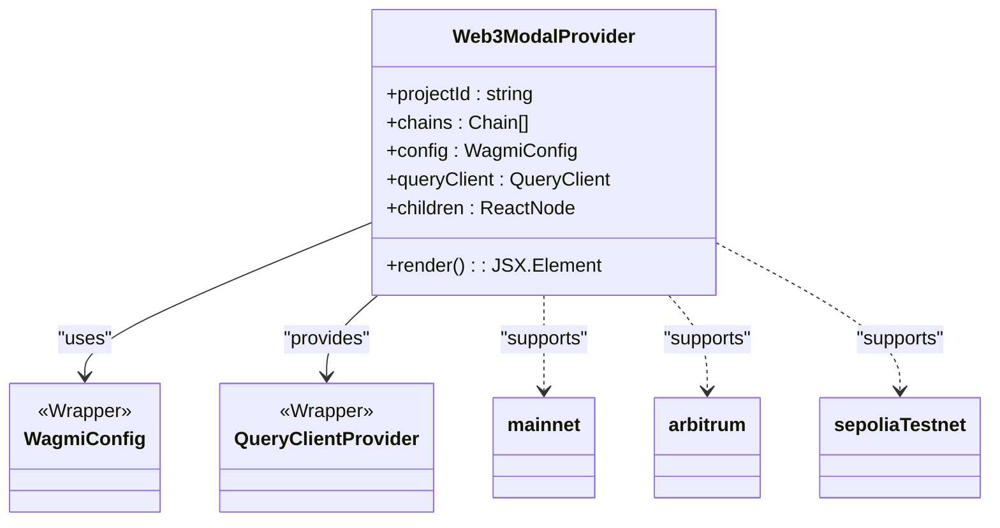
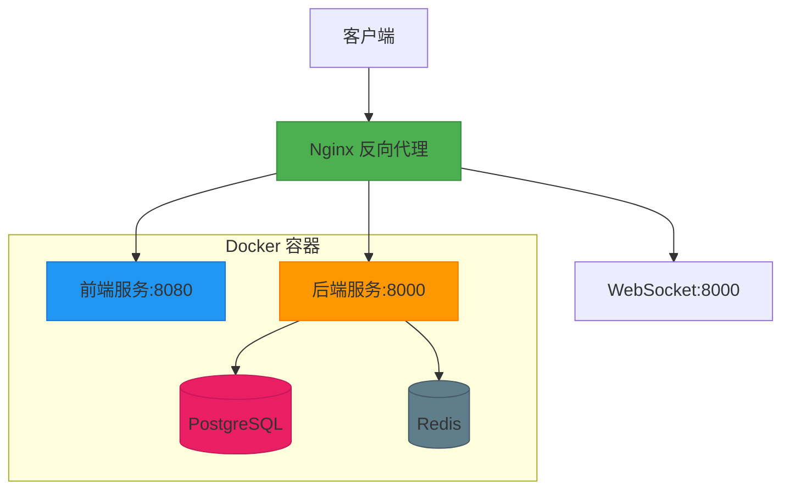
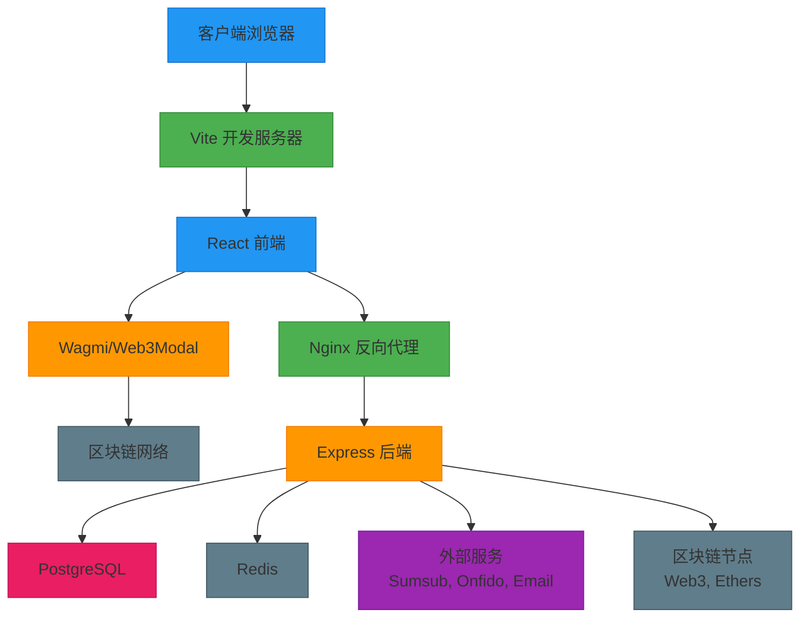

# 技术栈

<cite>
**本文档引用的文件**  
- [backend/package.json](file://backend/package.json)
- [package.json](file://package.json)
- [src/config/wagmi.tsx](file://src/config/wagmi.tsx)
- [backend/src/index.ts](file://backend/src/index.ts)
- [docker-compose.yml](file://docker-compose.yml)
- [nginx.conf](file://nginx.conf)
- [netlify.toml](file://netlify.toml)
- [tailwind.config.ts](file://tailwind.config.ts)
</cite>

## 目录
1. [简介](#简介)
2. [前端技术栈](#前端技术栈)
3. [后端技术栈](#后端技术栈)
4. [区块链交互层](#区块链交互层)
5. [数据库与缓存](#数据库与缓存)
6. [部署基础设施](#部署基础设施)
7. [技术分层架构](#技术分层架构)
8. [版本兼容性说明](#版本兼容性说明)
9. [开发者学习路径建议](#开发者学习路径建议)

## 简介
tribridge-crossroads 是一个面向跨境支付场景的稳定币金融平台，采用前后端分离架构，集成多链区块链交互能力。本项目通过现代化技术栈实现高性能、高安全性和良好开发体验。系统涵盖前端用户界面、后端服务逻辑、区块链交互、合规性检查、流动性管理等多个模块，整体架构具备可扩展性和可维护性。

## 前端技术栈

### React 18 + Vite
前端采用 **React 18** 作为核心框架，利用其并发渲染（Concurrent Rendering）和自动批处理（Automatic Batching）特性提升用户体验。构建工具使用 **Vite**，基于 ES 模块原生支持，实现毫秒级热更新和快速冷启动，显著提升开发效率。

Vite 的优势包括：
- 极快的冷启动和热模块替换（HMR）
- 原生支持 TypeScript、JSX、CSS 预处理器
- 内置开发服务器和生产构建优化

### 状态管理：Context API
项目采用 React 原生的 **Context API** 进行全局状态管理，避免引入 Redux 等额外依赖。通过 `TranslationContext.tsx` 实现多语言切换，保持状态逻辑简洁清晰，适用于中等复杂度应用。

### UI 组件库：ShadCN/UI + Tailwind CSS
UI 层基于 **ShadCN/UI** 组件库构建，该库提供可定制的、无障碍的 React 组件，结合 **Tailwind CSS** 实现高度一致的设计系统。

Tailwind 配置通过 `tailwind.config.ts` 定义设计令牌（Design Tokens），包括颜色变量、圆角、阴影、动画等，确保跨组件视觉一致性。ShadCN 组件使用 Radix UI 原语，保证可访问性和交互质量。

**Section sources**
- [package.json](file://package.json#L20-L117)
- [tailwind.config.ts](file://tailwind.config.ts#L1-L121)
- [src/contexts/TranslationContext.tsx](file://src/contexts/TranslationContext.tsx)

## 后端技术栈

### Express.js + TypeScript
后端服务基于 **Express.js** 构建 RESTful API，结合 **TypeScript** 提供类型安全和开发时提示。入口文件 `backend/src/index.ts` 定义了完整的应用初始化流程，包括中间件配置、路由注册、错误处理和 WebSocket 支持。

Express 中间件包括：
- `helmet`：增强 HTTP 安全头
- `cors`：跨域资源共享控制
- `compression`：响应压缩
- `morgan`：请求日志记录
- `express-rate-limit`：防暴力请求

### 路由与服务分层
后端采用清晰的分层架构：
- `routes/`：定义 API 路由
- `services/`：封装业务逻辑
- `middleware/`：处理认证、API 密钥验证等横切关注点
- `utils/`：通用工具函数

**Section sources**
- [backend/package.json](file://backend/package.json#L20-L84)
- [backend/src/index.ts](file://backend/src/index.ts#L1-L259)

## 区块链交互层

### Wagmi + Ethers.js
前端通过 **Wagmi** 库与钱包和区块链交互，简化了连接钱包、读取余额、发送交易等操作。Wagmi 基于 **React Query** 实现状态同步和缓存管理，提升用户体验。

`src/config/wagmi.tsx` 文件中配置了 Wagmi 的核心参数，包括支持的链（以太坊主网、Arbitrum、Sepolia 测试网）和项目 ID，集成 Web3Modal 实现统一的钱包连接界面。

### Ethers.js 版本兼容
前端使用 `ethers@6.15.0`，后端使用 `ethers@6.9.0`，均属于 v6 版本，API 兼容性良好。Ethers.js 提供钱包、合约交互、ABI 编码等核心功能。

### 多链支持
通过自定义链配置（如 Tron Nile 测试网），系统支持多区块链接入，为未来扩展 BRICS 多国稳定币体系奠定基础。

**Diagram sources**
- [src/config/wagmi.tsx](file://src/config/wagmi.tsx#L1-L80)

**Section sources**
- [src/config/wagmi.tsx](file://src/config/wagmi.tsx#L1-L80)
- [package.json](file://package.json#L50-L52)

## 数据库与缓存

### PostgreSQL
主数据库采用 **PostgreSQL**，通过 Prisma ORM 进行模式管理和数据访问。`docker-compose.yml` 中定义了 PostgreSQL 15 容器，持久化存储数据。

Prisma 提供：
- 类型安全的数据库访问
- 自动生成数据库客户端
- 迁移管理

### Redis
使用 **Redis** 作为缓存和会话存储，提升高频读取性能。`backend/src/services/redis.ts` 封装连接逻辑，`backend/src/middleware/auth.ts` 可能用于会话验证。

Redis 用途包括：
- API 速率限制计数
- 用户会话缓存
- 区块链状态缓存

**Section sources**
- [backend/package.json](file://backend/package.json#L45-L46)
- [docker-compose.yml](file://docker-compose.yml#L40-L54)

## 部署基础设施

### Docker
通过 `Dockerfile` 和 `docker-compose.yml` 实现容器化部署。`docker-compose.yml` 定义了完整的开发环境，包含前端、后端、PostgreSQL、Redis 和 Nginx 反向代理。

服务端口映射：
- 前端：8080
- 后端：8000
- PostgreSQL：5432
- Redis：6379
- Nginx：80/443

### Netlify
前端部署至 **Netlify**，通过 `netlify.toml` 配置构建命令和路由重定向。Netlify 自动从 Git 触发部署，支持预览环境和 CDN 加速。

关键配置：
- 构建命令：`vite build`
- 发布目录：`dist`
- 单页应用重定向：`/* → /index.html`

### Nginx
生产环境使用 **Nginx** 作为反向代理，`nginx.conf` 配置了：
- 静态资源代理至前端服务
- `/api/` 路由代理至后端
- WebSocket 支持（`/socket.io/`）

Nginx 提供负载均衡、SSL 终止和静态文件高效服务。

**Diagram sources**
- [docker-compose.yml](file://docker-compose.yml#L1-L75)
- [nginx.conf](file://nginx.conf#L1-L79)

**Section sources**
- [docker-compose.yml](file://docker-compose.yml#L1-L75)
- [nginx.conf](file://nginx.conf#L1-L79)
- [netlify.toml](file://netlify.toml#L1-L24)

## 技术分层架构

**Diagram sources**
- [src/config/wagmi.tsx](file://src/config/wagmi.tsx#L1-L80)
- [backend/src/index.ts](file://backend/src/index.ts#L1-L259)
- [docker-compose.yml](file://docker-compose.yml#L1-L75)

## 版本兼容性说明

| 技术 | 前端版本 | 后端版本 | 兼容性说明 |
|------|----------|----------|------------|
| Ethers.js | 6.15.0 | 6.9.0 | 同属 v6，API 兼容 |
| TypeScript | 5.8.3 | 5.3.3 | 主版本一致，类型系统兼容 |
| Node.js | - | 18+ | 后端要求 Node.js 18 |
| React | 18.3.1 | - | 前端使用最新稳定版 |
| Express | - | 4.18.2 | 后端稳定版本 |
| PostgreSQL | - | 15 | 支持 JSON、分区等特性 |
| Redis | - | 7 | 支持流、模块等高级功能 |

**Section sources**
- [package.json](file://package.json#L20-L117)
- [backend/package.json](file://backend/package.json#L20-L84)

## 开发者学习路径建议

1. **基础准备**
   - 掌握 TypeScript 基础语法和类型系统
   - 熟悉 React 18 新特性（Suspense、useTransition）

2. **前端开发**
   - 学习 Vite 配置和构建优化
   - 掌握 ShadCN/UI 组件定制方法
   - 理解 Tailwind CSS 配置和设计系统集成

3. **区块链集成**
   - 学习 Wagmi 文档，理解 useAccount、useConnect 等 Hook
   - 掌握 Ethers.js 合约交互和交易签名
   - 了解 Web3Modal 钱包连接流程

4. **后端开发**
   - 熟悉 Express 中间件机制
   - 掌握 Prisma ORM 数据建模和查询
   - 学习 JWT 认证和 API 安全最佳实践

5. **部署与运维**
   - 学习 Docker 容器化和 docker-compose 编排
   - 掌握 Nginx 反向代理配置
   - 了解 Netlify 部署流程和 CI/CD 集成

通过以上路径，开发者可系统掌握 tribridge-crossroads 项目的技术栈，快速投入开发。