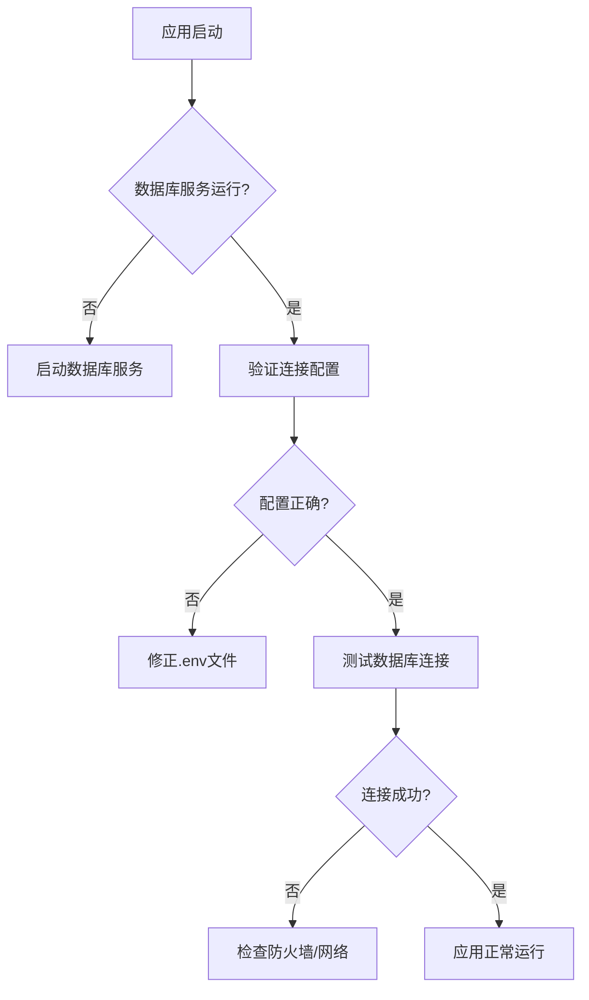
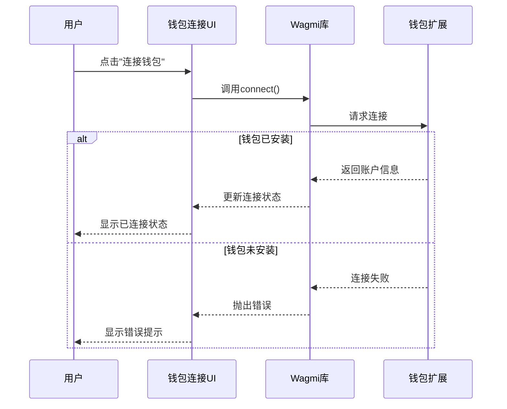
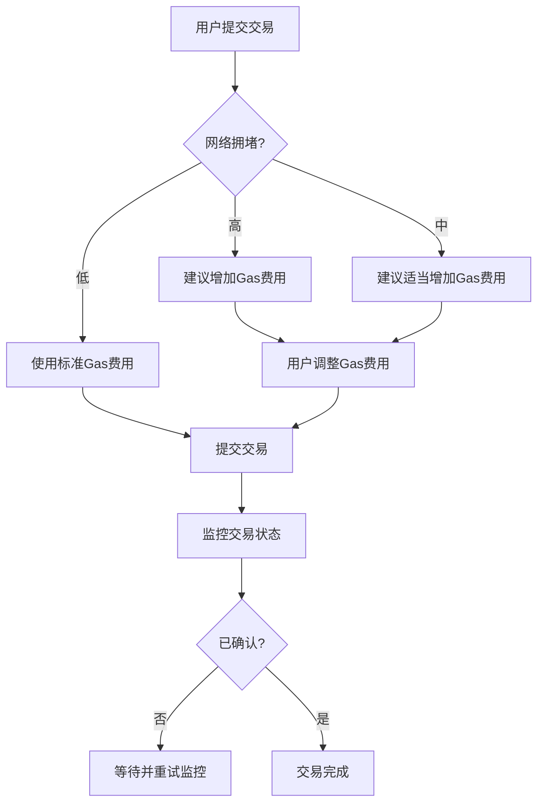

# 故障排除

<cite>
**本文档中引用的文件**  
- [errorHandler.ts](file://backend/src/middleware/errorHandler.ts)
- [logger.ts](file://backend/src/utils/logger.ts)
- [database.ts](file://backend/src/services/database.ts)
- [blockchain.ts](file://backend/src/services/blockchain.ts)
- [WalletConnect.tsx](file://src/components/Wallet/WalletConnect.tsx)
- [WalletManagement.tsx](file://src/components/Wallet/WalletManagement.tsx)
- [TransactionExecutor.tsx](file://src/components/Blockchain/TransactionExecutor.tsx)
- [PerformanceMonitor.tsx](file://src/components/Performance/PerformanceMonitor.tsx)
- [NETLIFY_FIX.md](file://NETLIFY_FIX.md)
- [GITHUB_ACCESS_SOLUTION.md](file://GITHUB_ACCESS_SOLUTION.md)
- [diagnose-display.html](file://diagnose-display.html)
- [fix-path-aliases.sh](file://fix-path-aliases.sh)
</cite>

## 目录
1. [问题分类体系](#问题分类体系)
2. [开发环境问题](#开发环境问题)
3. [部署问题](#部署问题)
4. [运行时错误](#运行时错误)
5. [区块链交互故障](#区块链交互故障)
6. [日志分析技巧](#日志分析技巧)

## 问题分类体系

为便于快速定位和解决技术问题，建立以下分类体系：

| 问题类别 | 子类别 | 典型症状 | 关键文件 |
|---------|-------|---------|---------|
| 开发环境问题 | 依赖冲突 | 构建失败、模块未找到 | package.json, package-lock.json |
| | 路径别名错误 | 模块导入失败、编译错误 | fix-path-aliases.sh, tsconfig.json |
| 部署问题 | Netlify构建失败 | 部署中断、静态资源加载失败 | NETLIFY_FIX.md, netlify.toml |
| | GitHub访问权限 | Pages未启用、推送超时 | GITHUB_ACCESS_SOLUTION.md, deploy-github-pages.sh |
| 运行时错误 | API连接超时 | 请求无响应、超时错误 | errorHandler.ts, logger.ts |
| | 数据库连接拒绝 | 服务不可用、连接失败 | database.ts, errorHandler.ts |
| 区块链交互故障 | 钱包连接失败 | 无法连接钱包、地址未显示 | WalletConnect.tsx, wagmi.tsx |
| | 交易卡顿 | 交易确认缓慢、Gas费用过高 | TransactionExecutor.tsx, blockchain.ts |

**Section sources**
- [errorHandler.ts](file://backend/src/middleware/errorHandler.ts)
- [logger.ts](file://backend/src/utils/logger.ts)
- [database.ts](file://backend/src/services/database.ts)
- [blockchain.ts](file://backend/src/services/blockchain.ts)
- [WalletConnect.tsx](file://src/components/Wallet/WalletConnect.tsx)
- [NETLIFY_FIX.md](file://NETLIFY_FIX.md)
- [GITHUB_ACCESS_SOLUTION.md](file://GITHUB_ACCESS_SOLUTION.md)

## 开发环境问题

### 路径别名错误

**症状描述**  
在开发过程中，出现模块导入错误，如 `Module not found: Can't resolve '@/components/ui/button'`。这通常发生在组件文件中使用了基于根目录的导入路径，但构建工具无法正确解析这些路径别名。

**根本原因分析**  
项目使用了TypeScript的路径映射功能（`@/*` 指向 `src/*`），但在某些情况下，这些别名未能被正确解析。这可能是由于：
- 构建工具配置不完整
- 文件移动后未更新导入路径
- 编辑器缓存问题

**分步解决方案**  
1. 运行路径别名修复脚本：
```bash
./fix-path-aliases.sh
```
2. 该脚本会自动遍历 `src/components`、`src/pages` 和 `src/hooks` 目录，将 `@/components/ui/*` 等路径替换为正确的相对路径。
3. 清理Vite缓存并重启开发服务器：
```bash
rm -rf node_modules/.vite
npm run vite:dev
```

**Section sources**
- [fix-path-aliases.sh](file://fix-path-aliases.sh)
- [tsconfig.json](file://tsconfig.json)

## 部署问题

### Netlify构建失败

**症状描述**  
在Netlify上部署时，构建过程失败，静态资源无法正确加载，页面显示空白或资源404错误。

**根本原因分析**  
通过分析 `NETLIFY_FIX.md` 文件，发现主要问题包括：
- Vite配置中的base路径设置不正确
- 存在 `.next` 目录导致Netlify误判为Next.js项目
- `netlify.toml` 配置文件需要调整

**分步解决方案**  
1. 确保Vite配置中base路径为相对路径：
```typescript
// vite.config.ts
export default defineConfig({
  base: './',
  // ... 其他配置
})
```
2. 删除 `.next` 目录：
```bash
rm -rf .next
```
3. 确认 `netlify.toml` 配置正确：
```toml
[build]
  publish = "dist"
  command = "npm run build"
```
4. 提交更改以触发重新部署。

**Section sources**
- [NETLIFY_FIX.md](file://NETLIFY_FIX.md)
- [vite.config.ts](file://vite.config.ts)
- [netlify.toml](file://netlify.toml)

### GitHub访问权限问题

**症状描述**  
无法通过GitHub Pages访问应用，返回404错误，但本地服务器运行正常。

**根本原因分析**  
根据 `GITHUB_ACCESS_SOLUTION.md` 文件分析，问题核心是GitHub Pages功能未启用，尽管仓库存在且可访问。具体原因包括：
- GitHub Pages未在仓库设置中启用
- `gh-pages` 分支内容混乱
- 网络间歇性问题导致推送超时

**分步解决方案**  
**方案1：手动启用GitHub Pages（推荐）**
1. 访问 https://github.com/RedMagicVer7/tribridge-crossroads/settings/pages
2. 在 "Source" 部分选择 "Deploy from a branch"
3. 选择分支：`gh-pages`
4. 选择目录：`/ (root)`
5. 点击 "Save" 按钮
6. 等待3-5分钟后访问：https://redmagicver7.github.io/tribridge-crossroads

**方案2：重新推送干净的gh-pages分支**
```bash
cd 
git push origin gh-pages-new:gh-pages --force
```

**方案3：使用其他部署平台**
```bash
# Vercel部署
npm install -g vercel
vercel login
vercel --prod

# Netlify部署
npm install -g netlify-cli  
netlify login
netlify deploy --prod --dir=dist
```

**Section sources**
- [GITHUB_ACCESS_SOLUTION.md](file://GITHUB_ACCESS_SOLUTION.md)
- [deploy-github-pages.sh](file://deploy-github-pages.sh)

## 运行时错误

### API连接超时

**症状描述**  
前端应用无法与后端API通信，浏览器控制台显示 `ERR_CONNECTION_TIMED_OUT` 或 `NET::ERR_CONNECTION_REFUSED` 错误。

**根本原因分析**  
可能原因包括：
- 后端服务未启动或崩溃
- 端口被占用或防火墙阻止
- 网络配置问题

**分步解决方案**  
1. 使用诊断工具检查本地服务器：
```bash
open diagnose-display.html
```
2. 在诊断页面点击"测试本地服务器"按钮。
3. 如果服务器未运行，启动后端服务：
```bash
npm run backend:start
```
4. 检查端口占用情况：
```bash
lsof -i :8080
```
5. 如果端口被占用，修改 `backend/.env` 文件中的端口配置。

**Section sources**
- [diagnose-display.html](file://diagnose-display.html)
- [errorHandler.ts](file://backend/src/middleware/errorHandler.ts)

### 数据库连接拒绝

**症状描述**  
后端服务启动失败，日志显示 "数据库连接错误" 或 "无法获取数据库连接"。

**根本原因分析**  
根据 `database.ts` 文件分析，可能原因包括：
- 数据库服务未运行
- 连接配置错误（主机、端口、凭据）
- SSL配置问题
- 连接池耗尽

**分步解决方案**  
1. 检查数据库服务状态：
```bash
docker ps | grep postgres
```
2. 验证数据库连接配置：
```typescript
// backend/src/services/database.ts
const config = {
  host: process.env.DB_HOST || 'localhost',
  port: parseInt(process.env.DB_PORT || '5432'),
  database: process.env.DB_NAME || 'tribridge',
  user: process.env.DB_USER || 'postgres',
  password: process.env.DB_PASSWORD || 'password'
}
```
3. 测试数据库连接：
```bash
psql -h localhost -p 5432 -U postgres -d tribridge -c "SELECT 1"
```
4. 检查连接池状态：
```typescript
console.log(database.getPoolStatus())
```



**Diagram sources**
- [database.ts](file://backend/src/services/database.ts)

**Section sources**
- [database.ts](file://backend/src/services/database.ts)
- [errorHandler.ts](file://backend/src/middleware/errorHandler.ts)

## 区块链交互故障

### 钱包连接失败

**症状描述**  
用户无法连接钱包，连接按钮无响应，或连接后地址未显示。

**根本原因分析**  
根据 `WalletConnect.tsx` 组件分析，可能原因包括：
- 用户未安装钱包扩展（如MetaMask）
- 网络不兼容
- 连接状态管理错误
- Wagmi配置问题

**分步解决方案**  
1. 确认用户已安装并解锁钱包扩展。
2. 检查当前网络是否支持：
```typescript
// src/config/wagmi.tsx
const getNetworkBadgeColor = (chainId: number) => {
  switch (chainId) {
    case 11155111: return 'bg-blue-500' // Sepolia
    case 1: return 'bg-green-500' // Mainnet
    default: return 'bg-gray-500'
  }
}
```
3. 重启连接流程：
```bash
# 断开并重新连接
disconnect()
connect({ connector })
```
4. 检查浏览器控制台是否有JavaScript错误。



**Diagram sources**
- [WalletConnect.tsx](file://src/components/Wallet/WalletConnect.tsx)
- [wagmi.tsx](file://src/config/wagmi.tsx)

**Section sources**
- [WalletConnect.tsx](file://src/components/Wallet/WalletConnect.tsx)
- [WalletManagement.tsx](file://src/components/Wallet/WalletManagement.tsx)

### 交易卡顿

**症状描述**  
交易提交后长时间处于"pending"状态，确认速度缓慢，用户体验差。

**根本原因分析**  
根据 `TransactionExecutor.tsx` 和 `blockchain.ts` 分析，可能原因包括：
- 网络拥堵
- Gas费用设置过低
- 区块链节点响应缓慢
- 交易监控机制问题

**分步解决方案**  
1. 检查网络拥堵情况：
```typescript
const blockchainService = new BlockchainService()
const advice = blockchainService.getNetworkCongestionAdvice()
console.log(advice.message) // "网络拥堵严重，建议增加Gas费或稍后重试"
```
2. 估算最佳Gas价格：
```typescript
const gasPrices = await blockchainService.estimateOptimalGasPrice('ethereum')
console.log('推荐Gas价格:', gasPrices.standard)
```
3. 在交易执行时使用更高的Gas费用：
```typescript
// src/components/Blockchain/TransactionExecutor.tsx
const txRequest = {
  to: formData.to,
  amount: formData.amount,
  token: formData.token,
  network: chain.id,
  gasPrice: recommendedGasPrice // 使用估算的Gas价格
}
```
4. 启动区块链健康检查：
```typescript
blockchainService.startHealthCheck(30000) // 每30秒检查一次
```



**Diagram sources**
- [TransactionExecutor.tsx](file://src/components/Blockchain/TransactionExecutor.tsx)
- [blockchain.ts](file://backend/src/services/blockchain.ts)

**Section sources**
- [TransactionExecutor.tsx](file://src/components/Blockchain/TransactionExecutor.tsx)
- [blockchain.ts](file://backend/src/services/blockchain.ts)

## 日志分析技巧

### 从errorHandler.ts提取关键信息

**日志结构分析**  
`errorHandler.ts` 文件中的全局错误处理中间件会记录详细的错误信息，包括：
- 错误消息和堆栈跟踪
- 请求URL和方法
- 客户端IP和User-Agent
- 时间戳

**关键字段识别**  
```typescript
console.error('Global Error Handler:', {
  message: error.message,        // 错误的具体描述
  stack: error.stack,            // 错误堆栈，用于定位代码位置
  url: req.url,                  // 出错的API端点
  method: req.method,            // HTTP方法
  ip: req.ip,                    // 客户端IP，用于追踪来源
  userAgent: req.get('User-Agent'), // 客户端信息
  timestamp: new Date().toISOString() // 错误发生时间
})
```

### 从logger.ts提取关键信息

**日志级别识别**  
`logger.ts` 使用了不同的日志级别，按严重性排序：
1. `error` (红色) - 严重错误，需要立即关注
2. `warn` (黄色) - 警告，潜在问题
3. `info` (绿色) - 信息性消息
4. `http` (洋红色) - HTTP请求日志
5. `debug` (白色) - 调试信息

**业务日志分类**  
`BusinessLogger` 类提供了专门的业务日志记录方法：
- `BusinessLogger.transaction()` - 交易相关日志
- `BusinessLogger.kyc()` - KYC验证日志
- `BusinessLogger.blockchain()` - 区块链操作日志
- `BusinessLogger.security()` - 安全事件日志
- `BusinessLogger.performance()` - 性能监控日志

**日志分析步骤**  
1. 首先查看 `error.log` 文件中的严重错误。
2. 根据时间戳关联 `combined.log` 中的相关信息。
3. 使用 `grep` 命令过滤特定类型的日志：
```bash
# 查找所有区块链相关错误
grep "BLOCKCHAIN" logs/error.log

# 查找特定用户的KYC日志
grep "userId: '123'" logs/combined.log

# 查找性能问题
grep "PERFORMANCE" logs/combined.log | grep -E "duration: [1-9][0-9]{3,}ms"
```

**Section sources**
- [errorHandler.ts](file://backend/src/middleware/errorHandler.ts)
- [logger.ts](file://backend/src/utils/logger.ts)