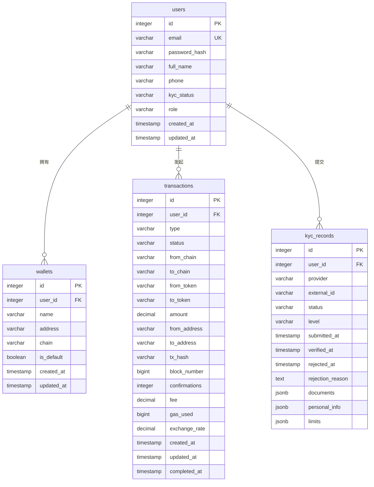

# 数据模型

<cite>
**本文档引用文件**  
- [database.ts](file://backend/src/services/database.ts)
- [redis.ts](file://backend/src/services/redis.ts)
- [user.ts](file://backend/src/routes/user.ts)
- [transaction.ts](file://backend/src/routes/transaction.ts)
- [kyc.ts](file://backend/src/routes/kyc.ts)
- [blockchain.ts](file://backend/src/routes/blockchain.ts)
</cite>

## 目录
1. [简介](#简介)
2. [数据库表结构设计](#数据库表结构设计)
3. [实体关系图（ER图）](#实体关系图er图)
4. [Redis缓存设计](#redis缓存设计)
5. [数据访问层实现](#数据访问层实现)
6. [数据生命周期管理](#数据生命周期管理)
7. [结论](#结论)

## 简介
本项目构建了一个支持多链跨境支付的金融平台，其数据模型设计围绕用户身份、交易执行、合规验证和钱包管理四大核心功能展开。系统采用PostgreSQL作为主数据库存储结构化数据，Redis作为缓存层提升性能，并通过清晰的数据访问层实现安全高效的数据库操作。本文档详细说明了各核心表的字段定义、主外键关系、索引策略以及缓存使用场景，为系统的可维护性和扩展性提供保障。

## 数据库表结构设计

### 用户表（users）
用户表存储平台注册用户的基本身份信息和账户状态。

**字段定义：**
- `id`: SERIAL，主键，自增唯一标识
- `email`: VARCHAR(255)，唯一且非空，用户邮箱
- `password_hash`: VARCHAR(255)，非空，密码哈希值
- `full_name`: VARCHAR(255)，非空，用户全名
- `phone`: VARCHAR(50)，可选，用户手机号
- `kyc_status`: VARCHAR(50)，默认值 'pending'，KYC验证状态
- `role`: VARCHAR(50)，默认值 'user'，用户角色（如user, admin）
- `created_at`: TIMESTAMP，默认当前时间戳，创建时间
- `updated_at`: TIMESTAMP，默认当前时间戳，更新时间

该表通过 `email` 字段保证用户唯一性，并通过 `kyc_status` 字段与KYC流程联动。

**Section sources**
- [database.ts](file://backend/src/services/database.ts#L15-L243)

### 钱包表（wallets）
钱包表存储用户关联的区块链钱包地址信息。

**字段定义：**
- `id`: SERIAL，主键，自增唯一标识
- `user_id`: INTEGER，外键引用 users(id)，所属用户
- `name`: VARCHAR(255)，非空，钱包名称
- `address`: VARCHAR(255)，非空，钱包地址
- `chain`: VARCHAR(50)，非空，区块链类型（如ethereum, tron）
- `is_default`: BOOLEAN，默认值 false，是否为默认钱包
- `created_at`: TIMESTAMP，默认当前时间戳，创建时间
- `updated_at`: TIMESTAMP，默认当前时间戳，更新时间

该表通过 `user_id` 与用户表建立一对多关系，支持用户管理多个不同链上的钱包。

**Section sources**
- [database.ts](file://backend/src/services/database.ts#L15-L243)
- [user.ts](file://backend/src/routes/user.ts#L45-L95)

### 交易表（transactions）
交易表记录用户发起的所有交易操作，包括跨链和同链转账。

**字段定义：**
- `id`: SERIAL，主键，自增唯一标识
- `user_id`: INTEGER，外键引用 users(id)，发起用户
- `type`: VARCHAR(50)，非空，交易类型（如cross_chain_transfer）
- `status`: VARCHAR(50)，非空，交易状态（pending, completed, failed）
- `from_chain`: VARCHAR(50)，非空，源区块链
- `to_chain`: VARCHAR(50)，非空，目标区块链
- `from_token`: VARCHAR(50)，非空，源代币
- `to_token`: VARCHAR(50)，非空，目标代币
- `amount`: DECIMAL(20, 8)，非空，交易金额
- `from_address`: VARCHAR(255)，非空，源地址
- `to_address`: VARCHAR(255)，非空，目标地址
- `tx_hash`: VARCHAR(255)，可选，区块链交易哈希
- `block_number`: BIGINT，可选，区块高度
- `confirmations`: INTEGER，默认值 0，确认数
- `fee`: DECIMAL(20, 8)，可选，交易费用
- `gas_used`: BIGINT，可选，消耗Gas
- `exchange_rate`: DECIMAL(20, 8)，可选，汇率
- `created_at`: TIMESTAMP，默认当前时间戳，创建时间
- `updated_at`: TIMESTAMP，默认当前时间戳，更新时间
- `completed_at`: TIMESTAMP，可选，完成时间

该表是系统核心，记录了完整的交易生命周期，支持交易状态追踪和审计。

**Section sources**
- [database.ts](file://backend/src/services/database.ts#L15-L243)
- [transaction.ts](file://backend/src/routes/transaction.ts#L15-L313)

### KYC记录表（kyc_records）
KYC记录表存储用户的合规验证信息和文档记录。

**字段定义：**
- `id`: SERIAL，主键，自增唯一标识
- `user_id`: INTEGER，外键引用 users(id)，关联用户
- `provider`: VARCHAR(50)，非空，验证服务提供商（如sumsub）
- `external_id`: VARCHAR(255)，可选，第三方系统ID
- `status`: VARCHAR(50)，非空，验证状态（pending, verified, rejected）
- `level`: VARCHAR(50)，默认值 'basic'，验证等级
- `submitted_at`: TIMESTAMP，默认当前时间戳，提交时间
- `verified_at`: TIMESTAMP，可选，验证通过时间
- `rejected_at`: TIMESTAMP，可选，拒绝时间
- `rejection_reason`: TEXT，可选，拒绝原因
- `documents`: JSONB，文档信息（类型、状态、哈希等）
- `personal_info`: JSONB，个人信息
- `limits`: JSONB，交易限额配置

该表使用JSONB字段灵活存储非结构化数据，如文档元信息和个人资料，支持复杂的合规需求。

**Section sources**
- [database.ts](file://backend/src/services/database.ts#L15-L243)
- [kyc.ts](file://backend/src/routes/kyc.ts#L15-L209)

## 实体关系图（ER图）

**Diagram sources**
- [database.ts](file://backend/src/services/database.ts#L15-L243)

## Redis缓存设计

### 缓存使用场景
Redis在本系统中承担了关键的性能优化和分布式协调角色，主要应用于以下场景：

**会话存储**：用户认证后的会话信息（如JWT令牌、用户ID）存储在Redis中，实现快速的会话验证和跨服务共享，支持分布式部署下的会话一致性。

**速率限制**：通过Redis的计数器功能实现API调用的速率限制。例如，对 `/api/transaction` 接口进行每分钟10次的调用限制，防止滥用和DDoS攻击。

**临时凭证**：在敏感操作（如交易执行）中，系统生成一次性临时凭证（OTP）并存储在Redis中，设置较短的TTL（如300秒），确保操作的安全性和时效性。

### 数据结构设计
- **字符串（String）**：用于存储会话令牌和临时凭证，使用 `SET key value EX ttl` 命令设置过期时间。
- **哈希（Hash）**：用于存储用户偏好设置等结构化临时数据，便于部分字段更新。
- **集合（Set）**：用于维护黑名单或白名单，如被限制的IP地址集合。
- **有序集合（Sorted Set）**：用于实现基于时间的排行榜或延迟队列，如待处理交易队列。

Redis服务封装了 `setJSON` 和 `getJSON` 方法，支持直接存储和读取JSON对象，简化了复杂数据的缓存操作。

**Section sources**
- [redis.ts](file://backend/src/services/redis.ts#L12-L333)
- [user.ts](file://backend/src/routes/user.ts#L15-L197)
- [transaction.ts](file://backend/src/routes/transaction.ts#L15-L313)

## 数据访问层实现

### 连接池管理
`DatabaseService` 类实现了基于 `pg.Pool` 的连接池管理，配置了最大连接数（max=20）、空闲超时（idleTimeoutMillis=30000）和连接超时（connectionTimeoutMillis=2000）等参数，有效控制数据库资源使用，防止连接耗尽。

### 事务处理
数据访问层提供了 `transaction` 方法，封装了事务的开始（BEGIN）、提交（COMMIT）和回滚（ROLLBACK）逻辑。该方法接受一个回调函数，确保在发生错误时自动回滚，保证了数据的一致性。例如，在创建交易和更新用户余额时，可使用此方法确保操作的原子性。

### 查询优化
- **日志监控**：所有查询操作都带有执行时间日志，便于性能分析和慢查询识别。
- **参数化查询**：通过 `query(text, params)` 方法使用参数化查询，有效防止SQL注入攻击。
- **连接复用**：通过连接池复用数据库连接，减少频繁建立和断开连接的开销。

数据访问层还提供了 `initializeTables` 方法，在应用启动时自动创建必要的数据库表，简化了部署流程。

**Section sources**
- [database.ts](file://backend/src/services/database.ts#L15-L243)

## 数据生命周期管理

### 交易记录归档
系统对交易记录实施分级存储策略。活跃交易（最近30天）保留在主交易表中以保证查询性能。历史交易记录将通过后台任务定期归档到单独的 `archived_transactions` 表或数据仓库中，支持长期审计和分析。

### KYC数据保留周期
根据GDPR和金融合规要求，KYC数据的保留遵循以下策略：
- **验证通过的数据**：保留5年，用于合规审计。
- **验证失败的数据**：在失败后30天内删除，仅保留匿名化统计信息。
- **用户主动删除请求**：收到GDPR删除请求后，系统将启动数据清除流程。

### GDPR删除请求处理流程
1. 用户通过API或前端界面提交数据删除请求。
2. 系统验证用户身份和请求合法性。
3. 启动 `deleteUserData(userId)` 事务流程，依次删除：
   - `users` 表中的个人身份信息（匿名化处理）
   - `wallets` 表中所有关联钱包
   - `transactions` 表中所有交易记录
   - `kyc_records` 表中所有KYC信息
   - Redis中所有相关缓存
4. 记录删除操作日志，完成流程。

此流程确保了用户数据权利的实现，同时保持了系统的数据完整性。

**Section sources**
- [database.ts](file://backend/src/services/database.ts#L15-L243)
- [user.ts](file://backend/src/routes/user.ts#L15-L197)

## 结论
本数据模型设计充分考虑了多链支付平台的业务复杂性、性能要求和合规需求。通过PostgreSQL的强一致性保证核心数据的完整性，利用Redis的高性能特性优化用户体验，并通过清晰的数据访问层抽象简化了数据库操作。实体关系设计合理，支持系统的可扩展性和维护性。未来可进一步优化索引策略，引入读写分离和分库分表机制以应对更大规模的数据增长。