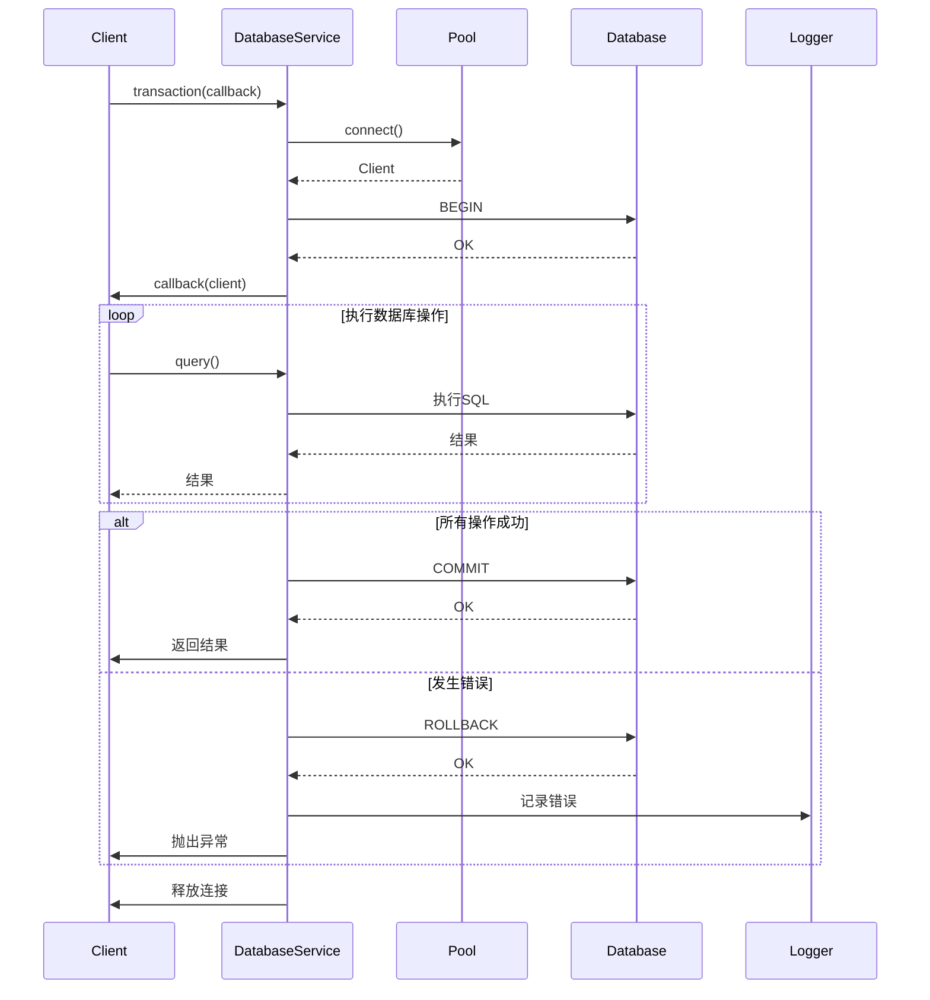
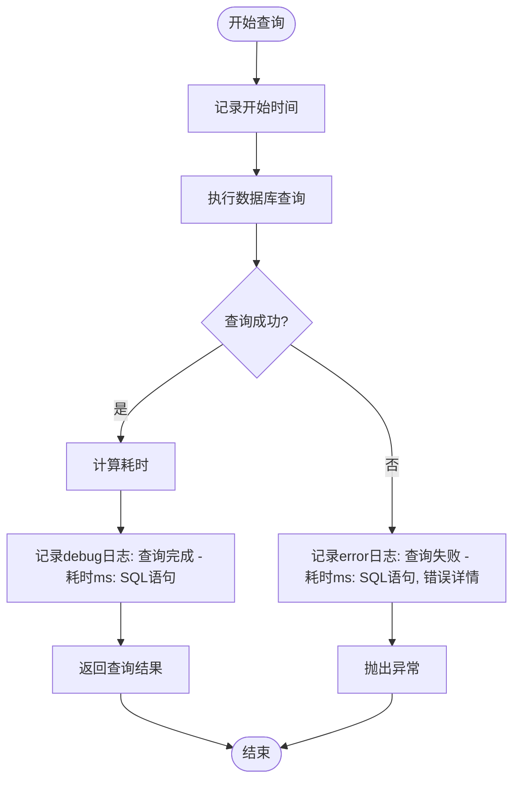

<cite>
**Referenced Files in This Document**   
- [database.ts](file://backend/src/services/database.ts)
- [redis.ts](file://backend/src/services/redis.ts)
- [logger.ts](file://backend/src/utils/logger.ts)
</cite>

## 目录
1. [数据访问层](#数据访问层)
2. [连接池管理](#连接池管理)
3. [事务处理机制](#事务处理机制)
4. [查询日志记录与性能监控](#查询日志记录与性能监控)
5. [统一数据访问接口封装](#统一数据访问接口封装)
6. [异常处理与重试策略](#异常处理与重试策略)
7. [存储协同模式](#存储协同模式)
8. [数据访问最佳实践](#数据访问最佳实践)

## 数据访问层

数据访问层是系统的核心基础设施，负责管理与PostgreSQL主数据库和Redis缓存层的交互。该层通过`DatabaseService`和`RedisService`两个核心服务类提供统一的数据访问接口，确保数据操作的可靠性、一致性和高性能。`DatabaseService`封装了PostgreSQL连接池管理、事务处理、查询执行等核心功能，保证了数据的ACID特性；`RedisService`则提供了丰富的缓存操作方法，包括字符串、哈希、列表、集合等数据结构的操作，以及分布式锁等高级功能，显著提升了系统的读取性能。

**Section sources**
- [database.ts](file://backend/src/services/database.ts#L15-L243)
- [redis.ts](file://backend/src/services/redis.ts#L12-L333)

## 连接池管理

连接池管理是确保数据库高效稳定运行的关键。`DatabaseService`在构造函数中初始化连接池配置，并根据环境变量设置连接参数，包括主机、端口、数据库名、用户名、密码、SSL配置以及连接池大小等。连接池的最大连接数默认为20，空闲超时时间为30秒，连接超时时间为2秒。通过`pg`库的`Pool`类创建连接池实例，并监听`connect`和`error`事件，分别在连接建立和发生错误时记录日志。

连接池的状态可以通过`getPoolStatus()`方法获取，该方法返回当前连接池的总连接数、空闲连接数和等待连接数，便于监控连接池的使用情况。当应用关闭时，`close()`方法会优雅地关闭所有连接，释放资源。

```mermaid
classDiagram
class DatabaseService {
-pool : Pool
-config : DatabaseConfig
+constructor(config? : Partial<DatabaseConfig>)
+getClient() : Promise<Client>
+query(text : string, params? : any[]) : Promise<any>
+transaction(callback : (client : any) => Promise<any>) : Promise<any>
+testConnection() : Promise<boolean>
+initializeTables() : Promise<void>
+close() : Promise<void>
+getPoolStatus() : { totalCount : number, idleCount : number, waitingCount : number }
}
class Pool {
+totalCount : number
+idleCount : number
+waitingCount : number
+connect() : Promise<Client>
+end() : Promise<void>
}
DatabaseService --> Pool : "使用"
```

**Diagram sources**
- [database.ts](file://backend/src/services/database.ts#L15-L243)

**Section sources**
- [database.ts](file://backend/src/services/database.ts#L19-L57)
- [database.ts](file://backend/src/services/database.ts#L236-L242)
- [database.ts](file://backend/src/services/database.ts#L225-L233)

## 事务处理机制

事务处理机制确保了数据的一致性和完整性。`DatabaseService`通过`transaction()`方法提供事务支持。该方法首先通过`getClient()`获取一个数据库连接，然后在`try`块中执行`BEGIN`命令开启事务，并调用传入的回调函数执行具体的数据库操作。如果所有操作都成功完成，将执行`COMMIT`命令提交事务；如果在执行过程中发生任何错误，`catch`块会捕获异常，执行`ROLLBACK`命令回滚事务，并记录错误日志；无论成功或失败，`finally`块都会确保连接被释放回连接池。

这种实现方式保证了事务的原子性，即事务中的所有操作要么全部成功，要么全部失败，不会出现部分成功的情况。同时，通过在`finally`块中释放连接，避免了连接泄漏的风险。



**Diagram sources**
- [database.ts](file://backend/src/services/database.ts#L85-L99)

**Section sources**
- [database.ts](file://backend/src/services/database.ts#L85-L99)

## 查询日志记录与性能监控

查询日志记录与性能监控是系统可观测性的重要组成部分。`DatabaseService`的`query()`方法在执行查询前后记录时间戳，计算查询耗时，并将查询语句和耗时信息以`debug`级别记录到日志中。如果查询成功，日志级别为`debug`；如果查询失败，则以`error`级别记录错误信息，包括错误详情和查询耗时。

日志记录由`winston`库实现，日志格式包含时间戳、日志级别和消息内容。开发环境下的日志会输出到控制台和文件，生产环境则主要输出到文件。日志级别根据环境自动调整，开发环境为`debug`，生产环境为`warn`。此外，系统还提供了`BusinessLogger`类，用于记录交易、KYC、区块链操作等业务日志，以及性能日志，便于后续分析和问题排查。



**Diagram sources**
- [database.ts](file://backend/src/services/database.ts#L70-L82)
- [logger.ts](file://backend/src/utils/logger.ts#L0-L198)

**Section sources**
- [database.ts](file://backend/src/services/database.ts#L70-L82)
- [logger.ts](file://backend/src/utils/logger.ts#L0-L198)

## 统一数据访问接口封装

为了简化数据访问操作并提供一致的API，`DatabaseService`和`RedisService`对底层数据库驱动进行了封装。`DatabaseService`提供了`query()`和`transaction()`等高层方法，开发者无需直接处理连接获取和释放的细节。`RedisService`则封装了Redis客户端的所有命令，提供了`set()`、`get()`、`del()`、`hSet()`、`hGet()`等方法，覆盖了字符串、哈希、列表、集合、有序集合等所有数据结构的操作。

此外，`RedisService`还提供了`setJSON()`和`getJSON()`等辅助方法，可以方便地将JavaScript对象序列化为JSON字符串进行存储，或从JSON字符串反序列化为对象，简化了复杂数据结构的缓存操作。`acquireLock()`和`releaseLock()`方法则实现了基于Redis的分布式锁，用于在分布式环境中协调对共享资源的访问。

**Section sources**
- [database.ts](file://backend/src/services/database.ts#L70-L82)
- [redis.ts](file://backend/src/services/redis.ts#L106-L117)
- [redis.ts](file://backend/src/services/redis.ts#L119-L126)
- [redis.ts](file://backend/src/services/redis.ts#L276-L288)

## 异常处理与重试策略

系统实现了完善的异常处理与重试策略，以确保数据操作的可靠性。在`DatabaseService`中，所有可能抛出异常的方法（如`getClient()`、`query()`、`transaction()`）都使用了`try-catch`块进行捕获，并记录详细的错误日志。对于连接获取失败或查询失败的情况，异常会被重新抛出，由上层调用者处理。

`RedisService`在连接管理方面实现了重试策略。在构造函数中，通过`reconnectStrategy`配置了重连策略：当重试次数达到3次时，停止重连并返回`false`；否则，重连间隔时间会逐渐增加（100ms, 200ms, 300ms），避免对服务器造成过大压力。这确保了在Redis服务短暂不可用时，客户端能够自动恢复连接。

**Section sources**
- [database.ts](file://backend/src/services/database.ts#L60-L67)
- [database.ts](file://backend/src/services/database.ts#L70-L82)
- [redis.ts](file://backend/src/services/redis.ts#L17-L64)

## 存储协同模式

系统采用PostgreSQL作为主数据库，保证数据的ACID特性，确保数据的强一致性和持久性；同时使用Redis作为缓存层，提升读取性能，降低数据库负载。这种协同模式遵循"主从"架构，PostgreSQL是唯一的数据源，Redis中的数据是其副本。

典型的读写流程如下：写操作首先更新PostgreSQL数据库，成功后立即删除或更新Redis中对应的缓存数据，保证数据一致性；读操作则优先从Redis缓存中读取，如果缓存未命中，则从PostgreSQL数据库读取，并将结果写入缓存供后续请求使用。这种模式显著减少了对数据库的直接访问，提高了系统的响应速度和吞吐量。

**Section sources**
- [database.ts](file://backend/src/services/database.ts#L15-L243)
- [redis.ts](file://backend/src/services/redis.ts#L12-L333)

## 数据访问最佳实践

### 批量操作
对于需要插入或更新大量数据的场景，应使用批量操作以减少网络往返次数。PostgreSQL支持`INSERT ... ON CONFLICT`语法进行批量插入和更新。虽然`DatabaseService`目前没有直接提供批量操作方法，但可以通过`query()`方法执行批量SQL语句来实现。

### 连接释放
在使用`DatabaseService`的`transaction()`方法时，连接的获取和释放由框架自动管理，开发者无需关心。但在直接使用`getClient()`获取连接时，必须确保在`finally`块中调用`client.release()`释放连接，防止连接泄漏。

### 死锁预防
在事务中，应尽量按照固定的顺序访问表和行，以减少死锁发生的概率。例如，如果多个事务都需要更新用户表和交易表，应约定先更新用户表再更新交易表。此外，应尽量缩短事务的执行时间，避免在事务中执行耗时的操作。

### 缓存策略
应根据数据的访问频率和更新频率来设计缓存策略。对于频繁读取但不常更新的数据（如用户基本信息），可以设置较长的缓存过期时间；对于更新频繁的数据，可以采用更短的过期时间或使用缓存穿透、缓存雪崩的防护策略。`RedisService`提供的`set()`方法支持设置TTL（Time To Live），可以方便地实现过期策略。

**Section sources**
- [database.ts](file://backend/src/services/database.ts#L15-L243)
- [redis.ts](file://backend/src/services/redis.ts#L12-L333)