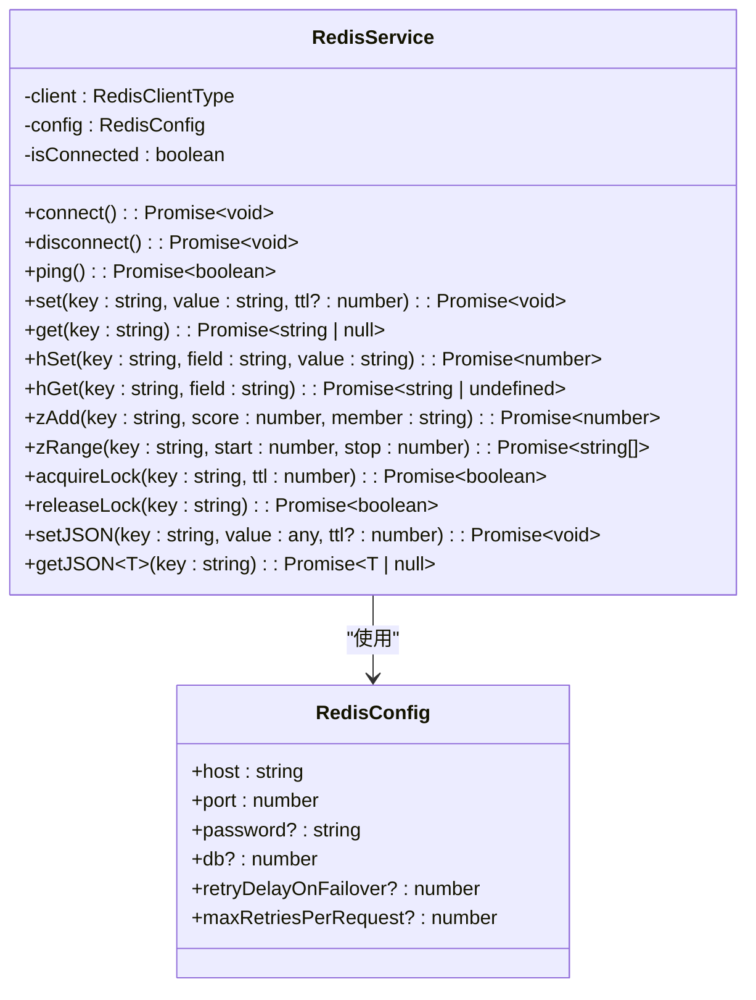
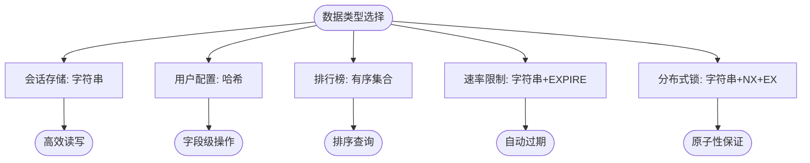
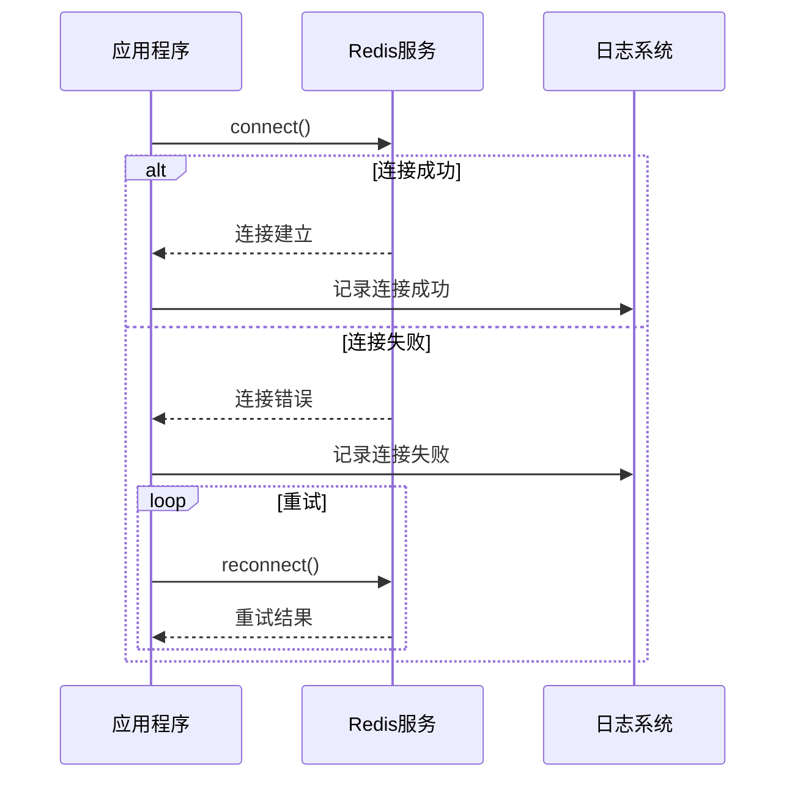

# 缓存策略

<cite>
**本文档引用的文件**   
- [redis.ts](file://backend/src/services/redis.ts)
- [valueAddedService.ts](file://backend/src/services/valueAddedService.ts)
- [blockchain.ts](file://backend/src/services/blockchain.ts)
- [auth.ts](file://backend/src/routes/auth.ts)
- [index-simple.ts](file://backend/src/index-simple.ts)
</cite>

## 目录
1. [引言](#引言)
2. [Redis服务实现](#redis服务实现)
3. [多场景应用](#多场景应用)
4. [数据结构选择依据](#数据结构选择依据)
5. [连接与配置](#连接与配置)
6. [防护方案](#防护方案)
7. [一致性保障](#一致性保障)

## 引言
本文档详细阐述了基于Redis的缓存策略实现，重点分析`redis.ts`中的`RedisService`类。系统利用Redis实现了会话存储、速率限制、临时凭证、分布式锁和实时数据缓存等多种功能，通过合理选择数据结构和配置策略，确保了系统的高性能和高可用性。

## Redis服务实现

`RedisService`类封装了Redis客户端的所有操作，提供了连接管理、数据操作和分布式锁等功能。该服务通过环境变量配置连接参数，支持密码认证和数据库选择。

**图示来源**
- [redis.ts](file://backend/src/services/redis.ts#L12-L333)

**本节来源**
- [redis.ts](file://backend/src/services/redis.ts#L12-L333)

## 多场景应用

### 会话存储
系统使用Redis字符串类型存储用户登录状态，通过JWT令牌与Redis会话数据关联，实现用户身份验证和会话管理。

### 速率限制
通过Redis的原子操作实现API调用频次控制，防止恶意请求和滥用，保护后端服务的稳定性。

### 临时凭证
OTP验证码等临时凭证存储在Redis中，设置较短的TTL，确保凭证的安全性和时效性。

### 分布式锁
在防止重复交易提交等场景中，使用Redis的`SET`命令配合`NX`和`EX`选项实现分布式锁，保证操作的原子性。

### 实时数据缓存
汇率、Gas费等实时数据通过Redis缓存，减少对后端服务的直接调用，提高响应速度。

**本节来源**
- [redis.ts](file://backend/src/services/redis.ts#L296-L308)
- [valueAddedService.ts](file://backend/src/services/valueAddedService.ts#L86-L486)
- [blockchain.ts](file://backend/src/services/blockchain.ts#L20-L289)

## 数据结构选择依据

### 字符串用于会话
字符串类型适合存储序列化的会话数据，通过`set`和`get`操作实现快速读写。

### 哈希用于用户配置
哈希类型适合存储用户配置信息，可以对单个字段进行读写操作，提高效率。

### 有序集合用于排行榜
有序集合类型适合实现排行榜功能，通过分数排序，支持范围查询和排名计算。

**图示来源**
- [redis.ts](file://backend/src/services/redis.ts#L106-L117)
- [redis.ts](file://backend/src/services/redis.ts#L156-L163)
- [redis.ts](file://backend/src/services/redis.ts#L249-L256)

**本节来源**
- [redis.ts](file://backend/src/services/redis.ts#L106-L163)
- [redis.ts](file://backend/src/services/redis.ts#L249-L256)

## 连接与配置

### TTL策略
根据数据的时效性需求设置不同的TTL，如会话数据设置较长的过期时间，临时凭证设置较短的过期时间。

### 连接池配置
通过环境变量配置连接池参数，包括最大重试次数和重连延迟，确保连接的稳定性和可靠性。

### 重连机制
实现自动重连机制，当连接断开时尝试重新连接，超过最大重试次数后停止重连，避免无限重试。

### 错误处理
对所有Redis操作进行错误捕获和日志记录，确保系统的可维护性和可观测性。

**图示来源**
- [redis.ts](file://backend/src/services/redis.ts#L45-L103)
- [index-simple.ts](file://backend/src/index-simple.ts#L167-L195)

**本节来源**
- [redis.ts](file://backend/src/services/redis.ts#L17-L64)
- [index-simple.ts](file://backend/src/index-simple.ts#L167-L195)

## 防护方案

### 缓存穿透
通过布隆过滤器或缓存空值的方式防止缓存穿透，避免恶意请求直接打到数据库。

### 缓存雪崩
通过设置不同的过期时间或使用集群部署防止缓存雪崩，避免大量缓存同时失效。

### 缓存击穿
通过互斥锁或逻辑过期的方式防止缓存击穿，避免热点数据失效时大量请求直接打到数据库。

**本节来源**
- [redis.ts](file://backend/src/services/redis.ts#L296-L308)
- [redis.ts](file://backend/src/services/redis.ts#L277-L280)

## 一致性保障
通过先更新数据库再删除缓存的策略，确保缓存与数据库的一致性。在分布式环境下，使用分布式锁保证操作的原子性，避免并发更新导致的数据不一致。

**本节来源**
- [redis.ts](file://backend/src/services/redis.ts#L296-L308)
- [valueAddedService.ts](file://backend/src/services/valueAddedService.ts#L86-L486)