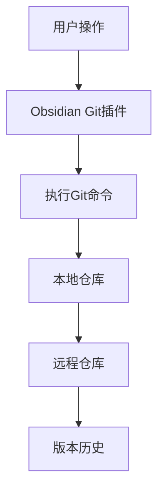

<docs>
# 文档知识库

<cite>
**本文档引用的文件**   
- [core-plugins.json](file://TriBridge/.obsidian/core-plugins.json)
- [community-plugins.json](file://TriBridge/.obsidian/community-plugins.json)
- [graph.json](file://TriBridge/.obsidian/graph.json)
- [Welcome.md](file://TriBridge/Welcome.md)
- [main.js](file://TriBridge/.obsidian/plugins/obsidian-git/main.js)
- [manifest.json](file://TriBridge/.obsidian/plugins/obsidian-git/manifest.json)
- [main.js](file://TriBridge/.obsidian/plugins/obsidian-importer/main.js)
- [manifest.json](file://TriBridge/.obsidian/plugins/obsidian-importer/manifest.json)
</cite>

## 目录
1. [引言](#引言)
2. [核心插件配置](#核心插件配置)
3. [社区插件集成](#社区插件集成)
4. [知识库结构设计](#知识库结构设计)
5. [笔记链接规范](#笔记链接规范)
6. [版本控制策略](#版本控制策略)
7. [作者指南](#作者指南)
8. [结论](#结论)

## 引言
本文档旨在全面介绍TriBridge项目中的文档知识库系统，重点阐述基于Obsidian平台的集成与配置方案。文档详细说明了核心插件和社区插件的功能与配置，以及知识库的整体架构设计。通过本指南，用户可以了解如何有效利用Obsidian系统来管理技术文档，实现知识的系统化组织与版本控制。

## 核心插件配置
核心插件在Obsidian知识库中扮演着基础性角色，提供了关键的功能支持。通过配置`core-plugins.json`文件，可以启用和管理这些核心功能。

```json
{
  "file-explorer": true,
  "global-search": true,
  "switcher": true,
  "graph": true,
  "backlink": true,
  "canvas": true,
  "outgoing-link": true,
  "tag-pane": true,
  "page-preview": true,
  "daily-notes": true,
  "templates": true,
  "note-composer": true,
  "command-palette": true,
  "editor-status": true,
  "bookmarks": true,
  "outline": true,
  "word-count": true,
  "file-recovery": true,
  "sync": true,
  "bases": true
}
```

### 图谱视图（Graph）
图谱视图插件通过可视化方式展示笔记之间的连接关系，帮助用户理解知识结构。该插件根据笔记间的内部链接自动生成网络图，用户可以通过调整布局和过滤条件来探索知识关联。

**Section sources**
- [core-plugins.json](file://TriBridge/.obsidian/core-plugins.json)

### 反向链接（Backlink）
反向链接功能显示了哪些笔记引用了当前笔记，为知识溯源和关联分析提供了便利。此功能增强了知识库的互连性，使用户能够追踪信息的传播路径。

**Section sources**
- [core-plugins.json](file://TriBridge/.obsidian/core-plugins.json)

### 画布（Canvas）
画布插件提供了一个自由的可视化工作空间，用户可以在其中创建节点并建立连接，用于头脑风暴、项目规划和概念映射。它支持将笔记、文件和外部链接作为节点进行组织。

**Section sources**
- [core-plugins.json](file://TriBridge/.obsidian/core-plugins.json)

## 社区插件集成
社区插件扩展了Obsidian的核心功能，特别是`obsidian-git`和`obsidian-importer`两个插件，在版本控制和数据迁移方面提供了重要支持。

```json
[
  "obsidian-git",
  "obsidian-importer"
]
```

### Obsidian Git插件
`obsidian-git`插件实现了与Git版本控制系统的无缝集成，支持自动备份和高级版本管理功能。该插件允许用户在不离开Obsidian环境的情况下执行Git操作，如提交、推送和拉取。



**Diagram sources**
- [main.js](file://TriBridge/.obsidian/plugins/obsidian-git/main.js)
- [manifest.json](file://TriBridge/.obsidian/plugins/obsidian-git/manifest.json)

**Section sources**
- [community-plugins.json](file://TriBridge/.obsidian/community-plugins.json)

### Obsidian Importer插件
`obsidian-importer`插件支持从多种外部来源（如Notion、Evernote、Apple Notes等）导入数据，简化了知识迁移过程。该插件确保了不同平台间的数据兼容性，使用户能够轻松