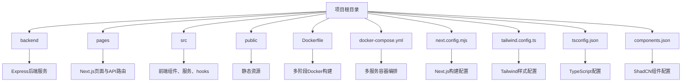

# 目录结构解析

<cite>
**本文档中引用的文件**  
- [backend](file://backend)
- [pages](file://pages)
- [src](file://src)
- [public](file://public)
- [Dockerfile](file://Dockerfile)
- [docker-compose.yml](file://docker-compose.yml)
- [next.config.mjs](file://next.config.mjs)
- [tailwind.config.ts](file://tailwind.config.ts)
- [tsconfig.json](file://tsconfig.json)
- [components.json](file://components.json)
</cite>

## 目录概览

本项目采用前后端分离的架构设计，结合Next.js前端框架与独立的Express后端服务。整体结构清晰划分了前端组件、页面路由、后端API、静态资源与部署配置，支持模块化开发与容器化部署。

**Diagram sources**  
- [backend](file://backend)
- [pages](file://pages)
- [src](file://src)
- [public](file://public)
- [Dockerfile](file://Dockerfile)
- [docker-compose.yml](file://docker-compose.yml)
- [next.config.mjs](file://next.config.mjs)
- [tailwind.config.ts](file://tailwind.config.ts)
- [tsconfig.json](file://tsconfig.json)
- [components.json](file://components.json)

## backend/：独立的Express后端服务

`backend/`目录封装了一个完整的Node.js + Express后端服务，负责处理所有业务逻辑、数据库交互、区块链集成与第三方KYC服务调用。该服务独立于前端运行，通过RESTful API与前端通信。

- **src/routes/**：定义了模块化的API路由，包括`auth.ts`、`blockchain.ts`、`kyc.ts`等，每个文件对应一个功能域。
- **src/services/**：包含核心业务逻辑实现，如`BlockchainService.ts`、`multiChainService.ts`、`kycService.ts`，封装了与外部系统的交互。
- **src/middleware/**：提供`auth.ts`（身份验证）、`apiKey.ts`（API密钥校验）、`errorHandler.ts`（统一错误处理）等中间件。
- **src/utils/logger.ts**：日志工具，用于记录服务运行状态。
- **src/types/**：扩展TypeScript类型定义，如`express.d.ts`增强Express类型支持。
- **package.json**：独立的依赖管理，包含Express、数据库驱动、Redis、区块链SDK等后端专用包。

该服务通过`index.ts`启动HTTP服务器，监听指定端口，支持JWT认证与环境变量配置。

**Section sources**  
- [backend/src/index.ts](file://backend/src/index.ts)
- [backend/src/routes/auth.ts](file://backend/src/routes/auth.ts)
- [backend/src/services/BlockchainService.ts](file://backend/src/services/BlockchainService.ts)
- [backend/src/middleware/auth.ts](file://backend/src/middleware/auth.ts)

## pages/：Next.js的页面与API路由双重角色

`pages/`目录遵循Next.js的文件路由机制，承担两个关键职责：

1. **页面路由**：每个`.tsx`文件（如`index.tsx`、`wallet.tsx`）自动映射为一个前端页面，由Next.js进行服务端渲染（SSR）或静态生成（SSG）。
2. **API路由**：`pages/api/`子目录下的文件（如`health.ts`、`auth/[...auth].ts`）作为后端API端点运行在Next.js服务器上，可用于代理请求或实现轻量级接口。

- `pages/_app.tsx`：自定义App组件，用于全局布局、状态管理与样式注入。
- `pages/api/health.ts`：健康检查接口，用于容器健康监测。
- `pages/api/auth/[...auth].ts`：动态API路由，处理所有`/api/auth/*`请求，实现OAuth或JWT认证流程。

此设计允许在不依赖外部后端的情况下实现部分API逻辑，但在本项目中主要用于与独立`backend`服务集成。

**Section sources**  
- [pages/index.tsx](file://pages/index.tsx)
- [pages/_app.tsx](file://pages/_app.tsx)
- [pages/api/health.ts](file://pages/api/health.ts)
- [pages/api/auth/[...auth].ts](file://pages/api/auth/[...auth].ts)

## src/：前端组件、服务与Hooks的组织方式

`src/`目录是前端代码的核心，采用功能模块化组织，提升可维护性与复用性。

### 组件组织（src/components/）
- **功能组件**：按业务域划分，如`Analytics/`、`Wallet/`、`Compliance/`，每个目录包含相关UI组件（如`WalletConnect.tsx`）。
- **UI组件库**：`src/components/ui/`包含基于ShadCN的可复用UI组件（如`button.tsx`、`card.tsx`），提供一致的设计语言与无障碍支持。

### 服务与逻辑（src/services/）
- `exchangeRateService.ts`、`walletService.ts`、`transactionService.ts`：封装与后端API的HTTP通信，提供类型安全的客户端接口。
- 使用Axios或Fetch API，集中管理请求地址、认证头与错误处理。

### 自定义Hooks（src/hooks/）
- `use-mobile.tsx`：检测设备是否为移动端。
- `use-toast.ts`：封装通知提示逻辑，与`sonner.tsx`组件集成。

### 配置与工具
- `src/config/wagmi.tsx`：Wagmi配置，用于连接钱包与区块链网络。
- `src/lib/utils.ts`：通用工具函数，如类名合并（`cn`）、格式化等。
- `src/contexts/TranslationContext.tsx`：国际化上下文。

**Section sources**  
- [src/components/Wallet/WalletConnect.tsx](file://src/components/Wallet/WalletConnect.tsx)
- [src/services/walletService.ts](file://src/services/walletService.ts)
- [src/hooks/use-mobile.tsx](file://src/hooks/use-mobile.tsx)
- [src/lib/utils.ts](file://src/lib/utils.ts)

## public/：静态资源的使用方式

`public/`目录存放无需构建处理的静态资源，Next.js会将其直接映射到根路径。

- `robots.txt`：搜索引擎爬虫规则，控制页面索引行为。
- 可扩展为存放`favicon.ico`、`logo.png`、字体文件等。
- 访问方式：`/robots.txt`直接对应`public/robots.txt`。

该目录内容在构建时被复制到输出目录`dist/`，由Web服务器直接提供服务。

**Section sources**  
- [public/robots.txt](file://public/robots.txt)

## Docker相关文件：部署意义

### Dockerfile：多阶段构建
采用多阶段构建优化镜像大小与安全性：
1. **frontend-builder**：基于Node 18构建前端静态资源。
2. **backend-builder**：编译TypeScript后端代码为JavaScript。
3. **runtime**：生产运行时，仅包含Node.js运行环境与后端依赖，将前端构建产物作为静态文件嵌入。

最终镜像通过`CMD ["node", "dist/index.js"]`启动后端服务，并由其提供前端静态文件，实现前后端统一部署。

### docker-compose.yml：多服务编排
定义本地开发与测试环境的完整服务栈：
- **frontend**：前端开发服务器，挂载源码实现热重载。
- **backend**：后端API服务，依赖数据库与缓存。
- **postgres**：PostgreSQL数据库，持久化用户与交易数据。
- **redis**：Redis缓存，用于会话存储与速率限制。
- **nginx**：反向代理，统一入口，支持HTTPS与负载均衡。

该文件支持通过`docker-compose up`一键启动整个系统，极大简化环境搭建。

**Section sources**  
- [Dockerfile](file://Dockerfile)
- [docker-compose.yml](file://docker-compose.yml)

## 配置文件：层级关系与作用范围

### next.config.mjs：Next.js构建配置
- `reactStrictMode: true`：启用React严格模式。
- `env`：注入环境变量，如`API_URL`。
- `webpack`：配置路径别名`@`指向`src/`，提升导入可读性。
- `pageExtensions`：指定页面文件扩展名。

**Section sources**  
- [next.config.mjs](file://next.config.mjs)

### tailwind.config.ts：Tailwind样式配置
- `content`：指定需要扫描的文件路径，确保生成正确的CSS类。
- `theme.extend.colors`：扩展设计系统颜色变量，支持暗色模式（`darkMode: "class"`）。
- `plugins: [require("tailwindcss-animate")]`：启用动画插件，支持`animate-in`等类。
- 颜色变量（如`--primary`、`--success`）在CSS中定义，实现主题切换。

**Section sources**  
- [tailwind.config.ts](file://tailwind.config.ts)

### tsconfig.json：TypeScript配置
项目包含多个`tsconfig.json`文件，形成配置继承层级：
- 根目录`tsconfig.json`：基础配置，被其他配置继承。
- `tsconfig.app.json`、`tsconfig.next.json`、`tsconfig.node.json`：分别针对应用、Next.js、Node.js环境的特定配置。
- `backend/tsconfig.json`：独立的后端TypeScript配置，可能包含不同的编译目标（如`target: "ES2021"`）。

这种分层设计确保前后端使用最适合的编译选项。

**Section sources**  
- [tsconfig.json](file://tsconfig.json)
- [tsconfig.next.json](file://tsconfig.next.json)
- [backend/tsconfig.json](file://backend/tsconfig.json)

## ShadCN组件与components.json的关联

`src/components/ui/`中的组件由ShadCN CLI生成和管理，其行为由`components.json`配置文件定义：

- `"$schema"`：指向ShadCN的JSON Schema，提供编辑器智能提示。
- `"tailwind"`：指定Tailwind配置文件与CSS入口。
- `"aliases"`：定义导入别名，如`"@/components/ui"`指向`src/components/ui`，与`next.config.mjs`中的Webpack别名协同工作。
- `"rsc": false`：禁用React Server Components，保持兼容性。

当使用`npx shadcn-ui@latest add button`命令时，CLI会读取此文件以确定组件安装位置与配置，确保一致性。

**Section sources**  
- [components.json](file://components.json)
- [src/components/ui/button.tsx](file://src/components/ui/button.tsx)

## 前后端代码的物理分离与逻辑集成

本项目通过清晰的物理分离实现关注点分离：
- **前端**：`pages/`与`src/`构成Next.js应用，负责UI渲染与用户交互。
- **后端**：`backend/`为独立Express服务，专注业务逻辑与数据处理。

逻辑集成通过以下方式实现：
1. **API调用**：前端`src/services/*`通过HTTP请求与后端`backend/src/routes/*`通信。
2. **环境配置**：`next.config.mjs`中设置`API_URL`，指向后端服务地址（开发环境为`http://localhost:8000`）。
3. **统一构建**：`Dockerfile`将前后端构建产物合并，由后端服务器统一提供前端静态资源，实现单入口部署。
4. **共享类型**（可选）：可通过抽取`types/`到独立包实现前后端类型共享，提升类型安全。

此架构兼顾开发独立性与部署便捷性，适合中大型全栈应用。