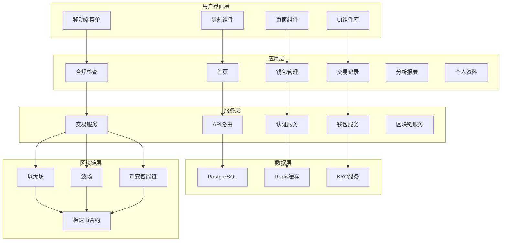

# 系统概述

<cite>
**本文档引用文件**  
- [README.md](file://README.md)
- [project-architecture-diagram.md](file://project-architecture-diagram.md)
- [VERSION.md](file://VERSION.md)
- [backend/package.json](file://backend/package.json)
- [src/main.tsx](file://src/main.tsx)
- [src/App.tsx](file://src/App.tsx)
- [src/config/wagmi.tsx](file://src/config/wagmi.tsx)
- [backend/src/index.ts](file://backend/src/index.ts)
- [backend/src/routes/auth.ts](file://backend/src/routes/auth.ts)
- [backend/src/routes/kyc.ts](file://backend/src/routes/kyc.ts)
- [backend/src/routes/transaction.ts](file://backend/src/routes/transaction.ts)
- [backend/src/routes/blockchain.ts](file://backend/src/routes/blockchain.ts)
- [backend/src/routes/otc.ts](file://backend/src/routes/otc.ts)
- [backend/src/routes/liquidityPool.ts](file://backend/src/routes/liquidityPool.ts)
- [backend/src/routes/brics.ts](file://backend/src/routes/brics.ts)
</cite>

## 目录
1. [项目简介](#项目简介)
2. [架构设计](#架构设计)
3. [核心功能模块](#核心功能模块)
4. [技术栈与选型](#技术栈与选型)
5. [前后端协同机制](#前后端协同机制)
6. [用户工作流](#用户工作流)
7. [系统架构图](#系统架构图)
8. [应用场景示例](#应用场景示例)
9. [部署与运维](#部署与运维)
10. [结论](#结论)

## 项目简介

TriBridge 是一个基于区块链的跨境支付平台，旨在通过多链稳定币结算技术实现快速、安全且合规的国际资金转移。该项目采用前后端分离的架构设计，支持以太坊、波场（TRON）和币安智能链（BSC）等主流区块链网络，集成 USDT、USDC 等多种稳定币交易功能。

平台整合了全面的KYC/AML合规服务，确保交易符合国际反洗钱和身份验证标准。系统提供实时汇率转换、流动性池管理、场外交易（OTC）撮合等金融功能，并通过现代化的用户界面为用户提供直观的操作体验。

项目当前版本为 v3.0.0，标志着从前端后端一体化架构向完全分离架构的重大演进，提升了系统的可维护性、可扩展性和部署灵活性。

**Section sources**
- [README.md](file://README.md#L1-L50)
- [VERSION.md](file://VERSION.md#L1-L30)

## 架构设计

TriBridge 采用前后端分离的全栈架构，前端负责用户界面展示与交互，后端提供 RESTful API 服务和业务逻辑处理。系统通过 API 网关进行通信，实现了清晰的职责划分和松耦合设计。

前端基于 React + Vite + TypeScript 构建，使用 ShadCN/UI 组件库和 Tailwind CSS 实现响应式设计。后端采用 Express.js + TypeScript + Socket.IO 技术栈，提供稳定的 API 服务和实时通信能力。数据库层使用 PostgreSQL 存储持久化数据，Redis 用于缓存和会话管理。

系统支持 WebSocket 实时更新，确保用户能够及时获取交易状态和市场行情。整体架构具备良好的可扩展性，各组件可独立部署和水平扩展。

**Section sources**
- [README.md](file://README.md#L52-L80)
- [VERSION.md](file://VERSION.md#L31-L53)
- [backend/src/index.ts](file://backend/src/index.ts#L39-L88)

## 核心功能模块

### 多链稳定币交易
系统支持跨以太坊、波场和币安智能链的稳定币交易，用户可在不同区块链网络间进行资产转移和结算。通过集成 Ethers.js、TronWeb 等区块链 SDK，实现对多链协议的统一访问。

### KYC/AML 合规
平台集成 Sumsub、Onfido 等第三方合规服务，提供完整的身份验证和反洗钱检查流程。用户需完成身份认证后方可进行大额交易，确保符合国际金融监管要求。

### 场外交易（OTC）
提供场外交易撮合服务，支持大额稳定币交易的点对点结算。系统记录交易双方信息，提供交易担保和纠纷处理机制。

### 流动性池管理
通过智能合约管理流动性池，支持稳定币的兑换和做市。系统监控池内资产比例，自动调整交易费率以维持流动性平衡。

### BRICS 国家结算
专为金砖国家设计的结算模块，支持人民币、卢布、卢比等本地货币与稳定币的兑换，促进新兴市场间的跨境支付。

**Section sources**
- [README.md](file://README.md#L10-L30)
- [backend/src/routes/kyc.ts](file://backend/src/routes/kyc.ts#L1-L20)
- [backend/src/routes/otc.ts](file://backend/src/routes/otc.ts#L1-L20)
- [backend/src/routes/liquidityPool.ts](file://backend/src/routes/liquidityPool.ts#L1-L20)
- [backend/src/routes/brics.ts](file://backend/src/routes/brics.ts#L1-L20)

## 技术栈与选型

### 前端技术栈
- **框架**: React + Vite + TypeScript
- **UI 库**: ShadCN/UI + Tailwind CSS
- **状态管理**: React Query
- **表单处理**: React Hook Form
- **区块链集成**: Wagmi + Viem + Web3Modal

### 后端技术栈
- **框架**: Express.js + TypeScript
- **数据库**: PostgreSQL + Redis
- **认证**: JWT + API Key
- **区块链 SDK**: Ethers.js, TronWeb, Web3.js
- **安全**: Helmet.js, CORS, 输入验证

### 区块链技术栈
- **以太坊**: Ethers.js
- **波场**: TronWeb
- **钱包集成**: MetaMask 及其他 Web3 钱包
- **智能合约交互**: Wagmi

选择 TypeScript 为开发语言，确保了前后端类型安全和代码可维护性。ShadCN/UI 提供了高质量的可定制组件，加速了 UI 开发。Wagmi 框架简化了 Web3 钱包集成和区块链交互，提升了开发效率。

**Section sources**
- [README.md](file://README.md#L52-L80)
- [project-architecture-diagram.md](file://project-architecture-diagram.md#L260-L327)
- [backend/package.json](file://backend/package.json#L20-L50)
- [src/config/wagmi.tsx](file://src/config/wagmi.tsx#L1-L30)

## 前后端协同机制

前后端通过 RESTful API 进行通信，前端通过 fetch 或 axios 调用后端接口。系统采用环境变量管理 API 基础 URL，支持开发、测试和生产环境的无缝切换。

认证机制采用 JWT（JSON Web Token）+ API Key 双重验证。用户登录后获得 JWT，后续请求携带该令牌进行身份验证。服务间调用使用 API Key 进行权限控制。

WebSocket 用于实时数据推送，如交易状态更新、价格变动通知等。前端建立 WebSocket 连接后，后端可主动推送消息，实现低延迟的实时交互。

CORS（跨域资源共享）配置允许前端域名访问后端 API，同时限制非法来源的请求。系统还实现了请求压缩、速率限制等性能优化措施。

**Section sources**
- [backend/src/index.ts](file://backend/src/index.ts#L39-L88)
- [src/main.tsx](file://src/main.tsx#L1-L20)
- [src/App.tsx](file://src/App.tsx#L1-L30)
- [backend/src/routes/auth.ts](file://backend/src/routes/auth.ts#L1-L25)

## 用户工作流

### 注册与登录
1. 用户访问平台首页，点击注册按钮
2. 填写邮箱、密码等基本信息
3. 系统发送验证邮件，用户完成邮箱验证
4. 使用凭证登录系统，获取 JWT 令牌

### KYC 验证
1. 登录后进入合规模块
2. 提交身份证明文件（护照、身份证等）
3. 系统调用第三方服务进行身份核验
4. 审核通过后，用户获得交易权限

### 跨境交易
1. 用户连接 Web3 钱包，选择源链和目标链
2. 输入交易金额，系统预览兑换汇率和手续费
3. 确认交易，前端调用后端 API 发起交易请求
4. 后端验证用户权限，调用区块链网络执行交易
5. 交易完成后，更新用户余额和交易历史

整个流程通过 React Query 管理数据状态，确保 UI 与数据同步。错误处理机制捕获并展示各类异常，提供友好的用户提示。

**Section sources**
- [backend/src/routes/auth.ts](file://backend/src/routes/auth.ts#L25-L50)
- [backend/src/routes/kyc.ts](file://backend/src/routes/kyc.ts#L20-L40)
- [backend/src/routes/transaction.ts](file://backend/src/routes/transaction.ts#L1-L30)

## 系统架构图

**Diagram sources**
- [project-architecture-diagram.md](file://project-architecture-diagram.md#L1-L383)
- [backend/src/index.ts](file://backend/src/index.ts#L39-L88)

## 应用场景示例

### BRICS 国家间稳定币结算
中国企业在俄罗斯采购商品，需支付 100 万卢布。传统跨境汇款需 3-5 个工作日，手续费高昂。

使用 TriBridge 平台：
1. 中国企业将 10 万元人民币兑换为 USDT，存入平台钱包
2. 通过多链交易功能，将 USDT 从以太坊网络转移到波场网络
3. 在 OTC 市场找到俄罗斯卖家，协商汇率后直接结算
4. 俄罗斯卖家收到 USDT 后，可选择兑换为卢布或持有

整个过程在 10 分钟内完成，手续费仅为传统方式的 1/5。系统自动记录交易信息，满足两国监管要求。

该场景展示了 TriBridge 在新兴市场跨境支付中的优势：速度快、成本低、合规性强，有效解决了传统金融体系的痛点。

**Section sources**
- [backend/src/routes/brics.ts](file://backend/src/routes/brics.ts#L1-L20)
- [backend/src/routes/blockchain.ts](file://backend/src/routes/blockchain.ts#L1-L25)
- [backend/src/routes/otc.ts](file://backend/src/routes/otc.ts#L1-L20)

## 部署与运维

### 部署架构
- **前端**: 可部署至 Netlify、Vercel、GitHub Pages 等静态托管服务
- **后端**: 可部署至 Heroku、Railway、Docker 容器等 Node.js 托管平台
- **数据库**: PostgreSQL 和 Redis 可独立部署或使用云数据库服务

### 部署方式
支持多种部署方案：
- Docker 部署：使用 docker-compose.yml 一键启动
- 云平台部署：支持 GitHub Actions 自动化部署
- 反向代理：通过 nginx.conf 配置负载均衡和 SSL 终止

### 监控与日志
系统集成 Winston 日志库和 Morgan HTTP 日志中间件，记录所有关键操作。通过健康检查接口 `/api/health` 监控服务状态，结合 GitHub Actions 实现持续集成和部署。

### 安全配置
- 环境变量存储敏感信息，不硬编码密钥
- Helmet.js 提供安全 HTTP 头
- CORS 限制仅允许受信任的前端域名访问
- 定期轮换 API 密钥和 JWT 密钥

**Section sources**
- [DEPLOYMENT_GUIDE.md](file://DEPLOYMENT_GUIDE.md#L77-L168)
- [docker-compose.yml](file://docker-compose.yml#L1-L30)
- [nginx.conf](file://nginx.conf#L1-L46)
- [backend/package.json](file://backend/package.json#L60-L80)

## 结论

TriBridge 作为一个基于区块链的跨境支付平台，通过创新的技术架构和全面的功能设计，有效解决了传统跨境支付中存在的速度慢、成本高、透明度低等问题。前后端分离的架构设计不仅提升了开发效率，也为系统的可扩展性和可维护性奠定了坚实基础。

平台整合多链稳定币交易、KYC/AML 合规、OTC 撮合等核心功能，为用户提供了一站式的跨境支付解决方案。技术栈的选择体现了对现代 Web 开发最佳实践的遵循，TypeScript 的类型安全、Wagmi 的 Web3 集成、ShadCN/UI 的组件化设计共同构建了高质量的开发体验。

未来，平台可进一步扩展支持更多区块链网络，优化交易撮合算法，增强风险监控能力，为全球用户提供更加安全、高效、便捷的跨境支付服务。