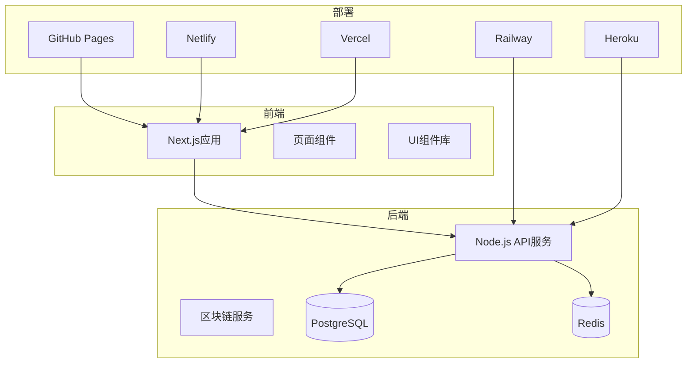
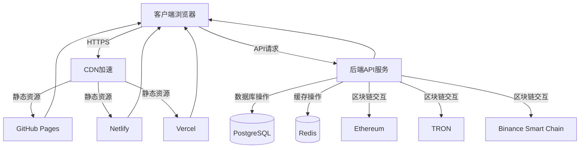
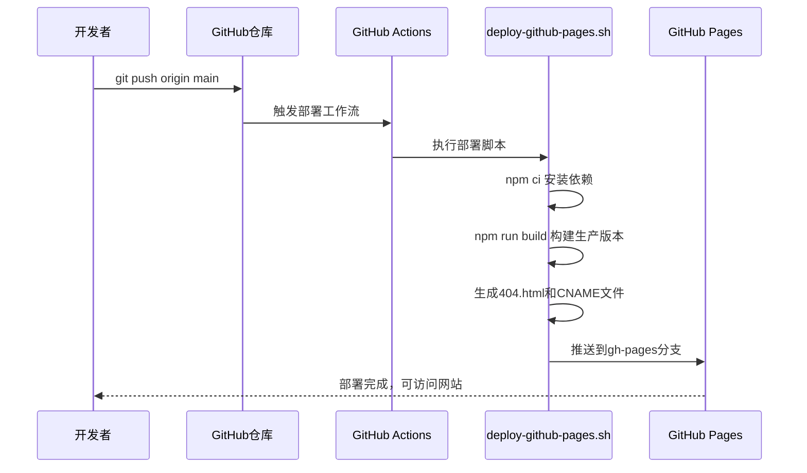
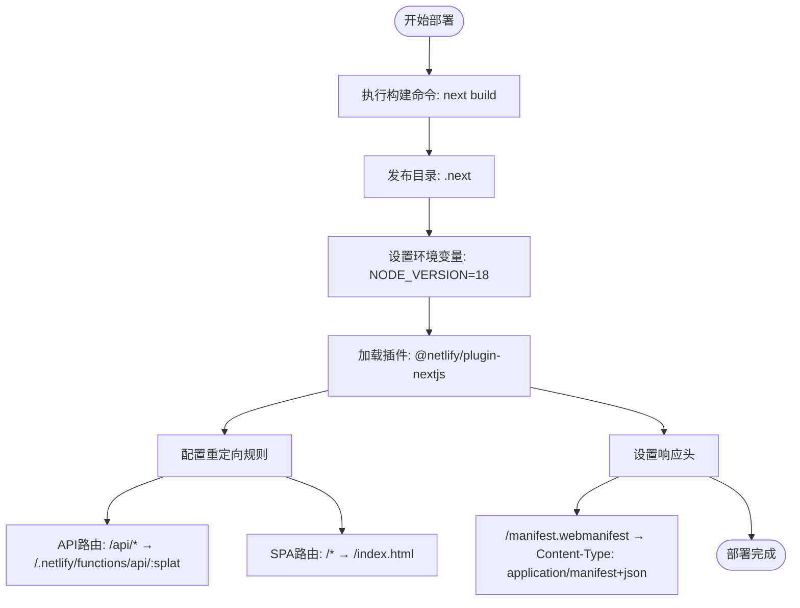
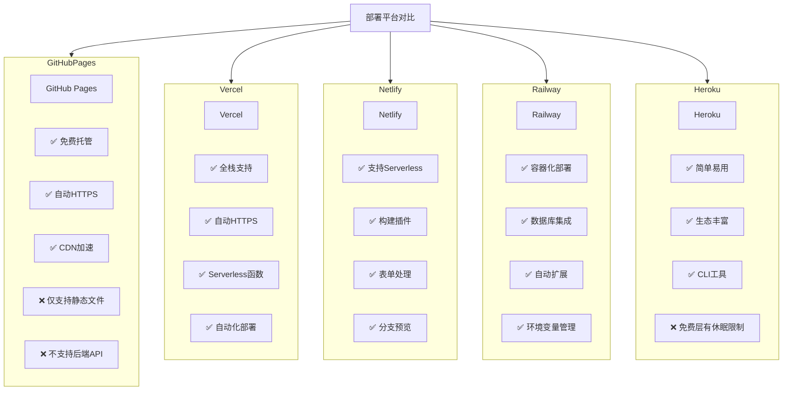
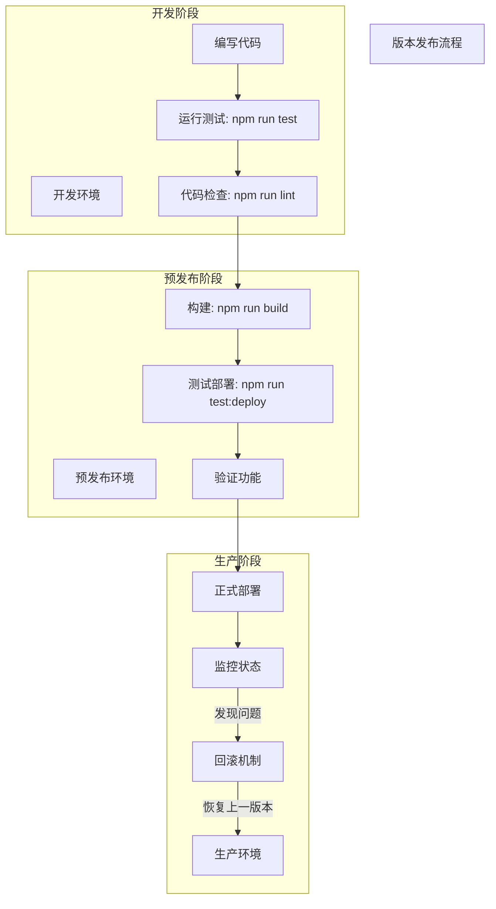

# CI/CD流水线

<cite>
**本文档引用文件**  
- [DEPLOYMENT_GUIDE.md](file://DEPLOYMENT_GUIDE.md)
- [netlify.toml](file://netlify.toml)
- [package.json](file://package.json)
- [deploy-github-pages.sh](file://deploy-github-pages.sh)
- [docker-compose.yml](file://docker-compose.yml)
</cite>

## 目录
1. [简介](#简介)
2. [项目结构](#项目结构)
3. [核心组件](#核心组件)
4. [架构概览](#架构概览)
5. [详细组件分析](#详细组件分析)
6. [依赖分析](#依赖分析)
7. [性能考虑](#性能考虑)
8. [故障排除指南](#故障排除指南)
9. [结论](#结论)

## 简介
本文档详细说明了TriBridge跨境支付平台的CI/CD自动化部署流程，涵盖从代码提交到生产环境部署的完整机制。基于DEPLOYMENT_GUIDE.md文档，深入解析GitHub Actions自动化部署、Netlify配置、多平台部署方案对比，以及自动化测试、版本发布和回滚策略的实现。

## 项目结构
本项目采用前后端分离架构，前端基于Next.js构建，后端为Node.js服务，支持多区块链交互与跨境支付功能。项目包含完整的部署脚本、Docker配置和多平台部署支持。



**Diagram sources**  
- [package.json](file://package.json#L1-L117)
- [docker-compose.yml](file://docker-compose.yml#L1-L75)

**Section sources**
- [DEPLOYMENT_GUIDE.md](file://DEPLOYMENT_GUIDE.md#L1-L190)
- [package.json](file://package.json#L1-L117)

## 核心组件
系统核心包括前端Next.js应用、后端API服务、区块链集成模块、KYC/AML合规服务和数据库持久层。部署流程通过脚本和配置文件实现自动化，支持多环境变量管理和容器化部署。

**Section sources**
- [DEPLOYMENT_GUIDE.md](file://DEPLOYMENT_GUIDE.md#L1-L190)
- [docker-compose.yml](file://docker-compose.yml#L1-L75)

## 架构概览
系统采用微服务架构，前端通过API与后端通信，后端服务集成多个区块链网络（ETH、TRON、BSC），并通过PostgreSQL和Redis实现数据持久化与缓存。部署支持静态托管（GitHub Pages、Netlify）和全栈部署（Vercel、Railway、Heroku）。



**Diagram sources**  
- [DEPLOYMENT_GUIDE.md](file://DEPLOYMENT_GUIDE.md#L1-L190)
- [docker-compose.yml](file://docker-compose.yml#L1-L75)

## 详细组件分析

### GitHub Actions自动化部署机制
系统通过GitHub Actions实现自动化部署，当代码推送到main分支时自动触发构建和部署流程。部署脚本`deploy-github-pages.sh`负责安装依赖、构建生产版本、生成路由文件并推送到gh-pages分支。



**Diagram sources**  
- [deploy-github-pages.sh](file://deploy-github-pages.sh#L1-L140)
- [package.json](file://package.json#L1-L117)

**Section sources**
- [deploy-github-pages.sh](file://deploy-github-pages.sh#L1-L140)
- [DEPLOYMENT_GUIDE.md](file://DEPLOYMENT_GUIDE.md#L1-L190)

### Netlify部署配置解析
Netlify通过`netlify.toml`文件进行配置，定义了构建命令、发布目录、环境变量和插件集成。配置支持Next.js应用的服务器端渲染和API路由重定向。



**Diagram sources**  
- [netlify.toml](file://netlify.toml#L1-L25)
- [package.json](file://package.json#L1-L117)

**Section sources**
- [netlify.toml](file://netlify.toml#L1-L25)
- [DEPLOYMENT_GUIDE.md](file://DEPLOYMENT_GUIDE.md#L1-L190)

### 多平台部署方案对比
系统支持多种部署平台，每种平台有其适用场景和配置方式。以下是各平台的对比分析和选择建议。



**Diagram sources**  
- [DEPLOYMENT_GUIDE.md](file://DEPLOYMENT_GUIDE.md#L1-L190)
- [package.json](file://package.json#L1-L117)

**Section sources**
- [DEPLOYMENT_GUIDE.md](file://DEPLOYMENT_GUIDE.md#L1-L190)
- [package.json](file://package.json#L1-L117)

### 自动化测试与版本发布策略
系统通过`package.json`中的脚本配置实现自动化测试和版本发布。`test`脚本使用Vitest运行单元测试，`test:deploy`脚本验证部署配置，确保生产环境的稳定性。



**Diagram sources**  
- [package.json](file://package.json#L1-L117)
- [src/test-deploy.js](file://src/test-deploy.js#L1-L19)

**Section sources**
- [package.json](file://package.json#L1-L117)
- [src/test-deploy.js](file://src/test-deploy.js#L1-L19)

## 依赖分析
系统依赖关系清晰，前端与后端分离，各服务通过Docker Compose进行编排。GitHub Actions和部署脚本作为CI/CD的核心组件，与代码仓库紧密集成。

```mermaid
graph LR
A[GitHub仓库] --> B[GitHub Actions]
B --> C[deploy-github-pages.sh]
C --> D[npm ci]
C --> E[npm run build]
C --> F[gh-pages]
D --> G[package.json]
E --> G
F --> H[gh-pages分支]
H --> I[GitHub Pages]
J[netlify.toml] --> K[Netlify]
K --> L[@netlify/plugin-nextjs]
L --> M[Next.js构建]
N[docker-compose.yml] --> O[前端服务]
N --> P[后端服务]
N --> Q[PostgreSQL]
N --> R[Redis]
N --> S[Nginx]
```

**Diagram sources**  
- [docker-compose.yml](file://docker-compose.yml#L1-L75)
- [netlify.toml](file://netlify.toml#L1-L25)
- [deploy-github-pages.sh](file://deploy-github-pages.sh#L1-L140)

**Section sources**
- [docker-compose.yml](file://docker-compose.yml#L1-L75)
- [netlify.toml](file://netlify.toml#L1-L25)
- [deploy-github-pages.sh](file://deploy-github-pages.sh#L1-L140)

## 性能考虑
部署策略充分考虑性能优化，包括CDN加速、静态资源缓存、数据库连接池和Redis缓存机制。生产环境配置确保高并发下的稳定性和响应速度。

## 故障排除指南
部署过程中可能遇到的问题包括构建失败、环境变量缺失、DNS配置错误等。通过检查GitHub Actions日志、浏览器开发者工具和服务器日志可快速定位问题。

**Section sources**
- [DEPLOYMENT_GUIDE.md](file://DEPLOYMENT_GUIDE.md#L1-L190)
- [deploy-github-pages.sh