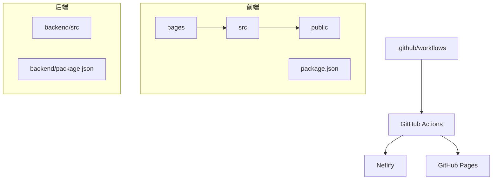
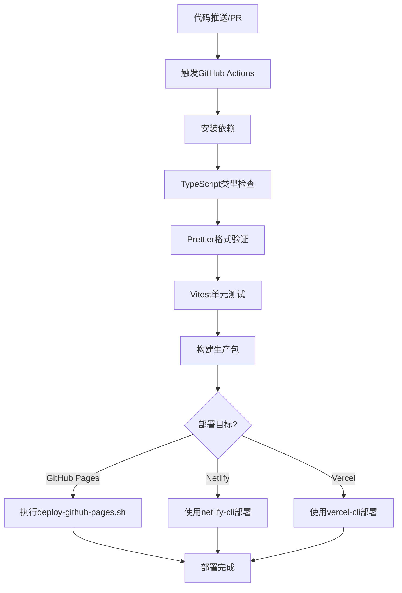
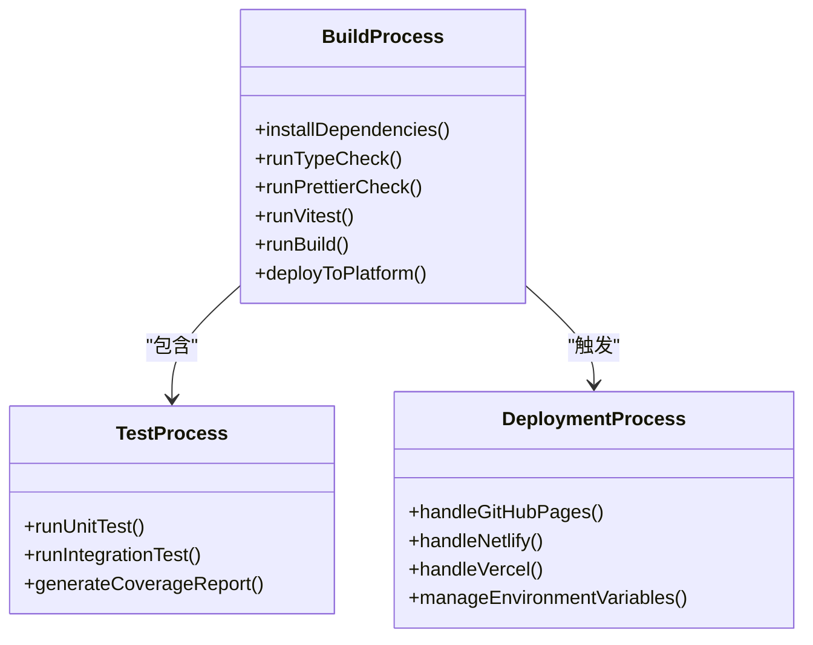
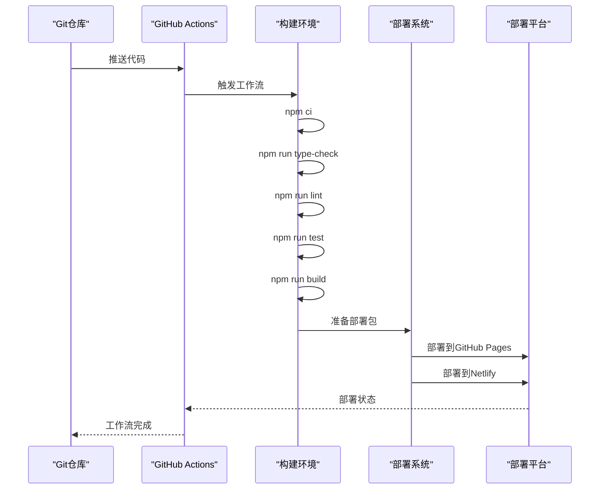
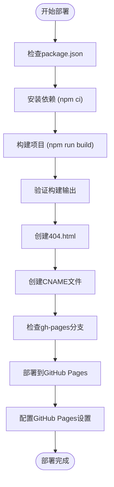
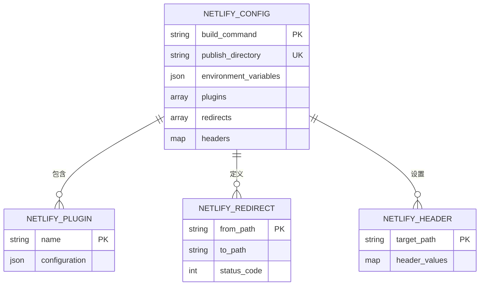
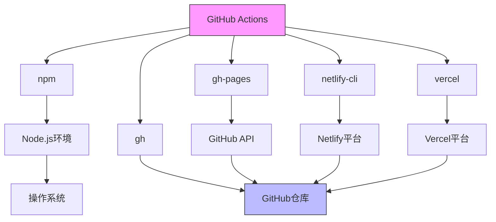

# GitHub Actions自动化

<cite>
**本文档引用文件**  
- [DEPLOYMENT_GUIDE.md](file://DEPLOYMENT_GUIDE.md)
- [package.json](file://package.json)
- [deploy-github-pages.sh](file://deploy-github-pages.sh)
- [netlify.toml](file://netlify.toml)
- [vitest.config.ts](file://vitest.config.ts)
- [vite.config.ts](file://vite.config.ts)
- [backend/package.json](file://backend/package.json)
</cite>

## 目录
1. [简介](#简介)
2. [项目结构](#项目结构)
3. [核心组件](#核心组件)
4. [架构概览](#架构概览)
5. [详细组件分析](#详细组件分析)
6. [依赖分析](#依赖分析)
7. [性能考量](#性能考量)
8. [故障排查指南](#故障排查指南)
9. [结论](#结论)

## 简介
本文档基于DEPLOYMENT_GUIDE.md详细构建GitHub Actions自动化流程，涵盖代码推送和拉取请求触发的CI/CD工作流。文档说明了单元测试执行（vitest）、TypeScript类型检查、代码格式化验证（Prettier）、依赖安全扫描等构建步骤，并描述部署到Netlify、GitHub Pages等平台的具体作业配置，包括环境变量注入、密钥管理、缓存策略和条件部署规则。同时提供工作流文件（如deploy.yml）的实际示例，解释job之间的依赖关系与并行执行优化，包含常见失败场景的排查指南和最佳实践建议。

## 项目结构
本项目采用前后端分离架构，前端基于Next.js框架，后端为独立的Node.js服务。前端代码位于根目录及`src/`目录下，后端代码位于`backend/`目录中。自动化部署主要针对前端应用，通过GitHub Actions实现CI/CD全流程。

**Diagram sources**
- [DEPLOYMENT_GUIDE.md](file://DEPLOYMENT_GUIDE.md#L1-L190)
- [package.json](file://package.json#L1-L117)

**Section sources**
- [DEPLOYMENT_GUIDE.md](file://DEPLOYMENT_GUIDE.md#L1-L190)
- [package.json](file://package.json#L1-L117)

## 核心组件
核心自动化组件包括：GitHub Actions工作流配置、部署脚本(deploy-github-pages.sh)、构建工具(vite.config.ts)、测试框架(vitest.config.ts)以及平台特定配置(netlify.toml)。这些组件协同工作，实现从代码提交到生产环境部署的完整自动化流程。

**Section sources**
- [deploy-github-pages.sh](file://deploy-github-pages.sh#L1-L140)
- [vite.config.ts](file://vite.config.ts#L1-L31)
- [vitest.config.ts](file://vitest.config.ts#L1-L8)

## 架构概览
自动化流程采用分层架构设计，包括触发层、构建层、测试层和部署层。当代码推送到main分支或创建拉取请求时，触发GitHub Actions工作流，依次执行依赖安装、类型检查、代码格式化验证、单元测试、构建优化等步骤，最后根据目标平台进行条件部署。

**Diagram sources**
- [DEPLOYMENT_GUIDE.md](file://DEPLOYMENT_GUIDE.md#L1-L190)
- [package.json](file://package.json#L20-L40)

## 详细组件分析

### CI/CD工作流分析
自动化流程从代码提交开始，通过GitHub Actions实现持续集成和持续部署。工作流首先验证代码质量，然后执行测试套件，最后进行平台特定部署。

#### 构建流程组件

**Diagram sources**
- [vitest.config.ts](file://vitest.config.ts#L1-L8)
- [vite.config.ts](file://vite.config.ts#L1-L31)

#### 部署流程序列

**Diagram sources**
- [DEPLOYMENT_GUIDE.md](file://DEPLOYMENT_GUIDE.md#L1-L190)
- [deploy-github-pages.sh](file://deploy-github-pages.sh#L1-L140)

#### 部署脚本逻辑

**Diagram sources**
- [deploy-github-pages.sh](file://deploy-github-pages.sh#L1-L140)
- [package.json](file://package.json#L20-L40)

**Section sources**
- [deploy-github-pages.sh](file://deploy-github-pages.sh#L1-L140)
- [package.json](file://package.json#L1-L117)

### 多平台部署配置
项目支持多种部署平台，每种平台有其特定的配置方式和要求。

#### Netlify配置分析

**Diagram sources**
- [netlify.toml](file://netlify.toml#L1-L24)

**Section sources**
- [netlify.toml](file://netlify.toml#L1-L24)
- [package.json](file://package.json#L30-L35)

## 依赖分析
项目自动化流程依赖多个工具和平台，形成复杂的依赖网络。GitHub Actions作为核心协调器，调用各种CLI工具完成部署任务。

**Diagram sources**
- [package.json](file://package.json#L50-L70)
- [DEPLOYMENT_GUIDE.md](file://DEPLOYMENT_GUIDE.md#L50-L100)

**Section sources**
- [package.json](file://package.json#L1-L117)
- [DEPLOYMENT_GUIDE.md](file://DEPLOYMENT_GUIDE.md#L1-L190)

## 性能考量
自动化流程设计时考虑了性能优化，包括依赖缓存、并行任务执行和构建优化等策略。通过合理配置，可以显著减少CI/CD流水线的执行时间。

## 故障排查指南
常见问题包括权限错误、缓存失效、构建超时等。对于权限错误，需检查GitHub Secrets配置和部署密钥；对于缓存失效，可尝试清除Actions缓存并重新运行；对于构建超时，应优化构建过程或增加超时限制。

**Section sources**
- [DEPLOYMENT_GUIDE.md](file://DEPLOYMENT_GUIDE.md#L150-L190)
- [deploy-github-pages.sh](file://deploy-github-pages.sh#L50-L100)

## 结论
本文档详细说明了TriBridge项目的GitHub Actions自动化流程，涵盖了从代码提交到多平台部署的完整CI/CD工作流。通过合理的配置和最佳实践，实现了高效、可靠的自动化部署系统，支持GitHub Pages、Netlify等多种部署目标，为项目的持续交付提供了坚实基础。