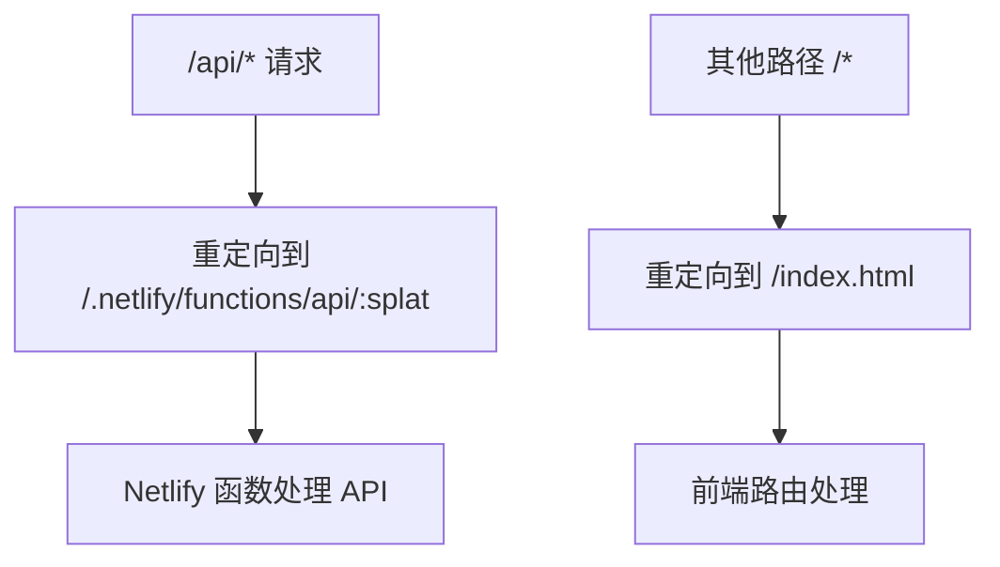

# Netlify部署配置

<cite>
**本文档引用的文件**   
- [netlify.toml](file://netlify.toml)
- [vite.config.ts](file://vite.config.ts)
- [package.json](file://package.json)
- [NEXTJS_MIGRATION_REPORT.md](file://NEXTJS_MIGRATION_REPORT.md)
- [NETLIFY_FIX.md](file://NETLIFY_FIX.md)
- [DEPLOYMENT_GUIDE.md](file://DEPLOYMENT_GUIDE.md)
</cite>

## 目录
1. [简介](#简介)
2. [构建配置](#构建配置)
3. [环境变量配置](#环境变量配置)
4. [插件集成](#插件集成)
5. [重定向规则](#重定向规则)
6. [标头设置](#标头设置)
7. [部署上下文策略](#部署上下文策略)
8. [配置调试技巧](#配置调试技巧)
9. [结论](#结论)

## 简介
本文件详细记录了TriBridge跨境支付平台在Netlify平台上的部署机制。项目已从前后端分离架构迁移至全栈Next.js架构，实现了简化的部署流程。通过`netlify.toml`配置文件，项目能够无缝集成Netlify的Next.js插件，实现单命令部署整个应用。该配置确保了前端路由的正确处理、API代理的准确映射以及静态资源的优化交付。

**Section sources**
- [netlify.toml](file://netlify.toml#L1-L24)
- [NEXTJS_MIGRATION_REPORT.md](file://NEXTJS_MIGRATION_REPORT.md#L1-L133)

## 构建配置
构建配置定义了项目的发布命令和输出目录。`[build]`部分指定了使用`next build`作为构建命令，这是Next.js应用的标准构建指令。发布目录设置为`.next`，这是Next.js框架默认的构建输出目录，包含了服务器端渲染所需的文件和静态资源。此配置确保Netlify能够正确识别并部署Next.js应用。

**Section sources**
- [netlify.toml](file://netlify.toml#L1-L5)
- [package.json](file://package.json#L10-L11)

## 环境变量配置
`[build.environment]`部分定义了构建过程中使用的环境变量。`NODE_VERSION`设置为"18"，确保构建环境使用Node.js 18版本，与项目要求一致。`NPM_FLAGS`设置为"--legacy-peer-deps"，用于在安装依赖时忽略对等依赖的版本冲突，这在处理复杂的依赖关系时特别有用，可以避免因依赖版本不匹配导致的构建失败。

**Section sources**
- [netlify.toml](file://netlify.toml#L7-L9)
- [package.json](file://package.json#L116-L117)

## 插件集成
`[[plugins]]`部分集成了`@netlify/plugin-nextjs`插件，这是Netlify为Next.js应用提供的官方插件。该插件自动处理Next.js特有的功能，如服务器端渲染（SSR）、静态站点生成（SSG）和API路由。它确保了Next.js应用的各个部分（包括API路由和静态页面）都能正确部署和运行，无需手动配置复杂的构建和部署流程。

**Section sources**
- [netlify.toml](file://netlify.toml#L11-L13)
- [NEXTJS_MIGRATION_REPORT.md](file://NEXTJS_MIGRATION_REPORT.md#L45-L106)

## 重定向规则
重定向规则用于处理前端路由和API代理。第一个规则将`/api/*`路径的所有请求重定向到`/.netlify/functions/api/:splat`，状态码为200，这确保了Next.js的API路由能够通过Netlify函数正确处理。第二个规则将所有其他路径（`/*`）重定向到`/index.html`，这也是状态码200，实现了单页应用（SPA）的客户端路由，允许前端框架（如React Router）处理页面导航。

**Diagram sources**
- [netlify.toml](file://netlify.toml#L15-L20)

**Section sources**
- [netlify.toml](file://netlify.toml#L15-L20)
- [pages/api/health.ts](file://pages/api/health.ts)

## 标头设置
标头设置用于指定特定文件的HTTP响应头。配置中针对`/manifest.webmanifest`文件设置了`Content-Type`为`application/manifest+json`。这是Web应用清单文件的标准MIME类型，确保浏览器能够正确识别和解析PWA（渐进式Web应用）的清单文件，从而支持添加到主屏幕、离线访问等PWA功能。

**Section sources**
- [netlify.toml](file://netlify.toml#L22-L24)
- [public/manifest.webmanifest](file://public/manifest.webmanifest)

## 部署上下文策略
虽然当前`netlify.toml`文件中未显式定义不同的部署上下文（如production、deploy-preview、branch-deploy），但基于项目迁移报告和部署指南，可以推断出部署策略。项目通过GitHub Actions实现自动化部署，推送到main分支会自动触发生产环境部署。对于预览和分支部署，Netlify通常会根据分支名称和Pull Request自动创建部署预览，无需额外配置。这种策略简化了开发和测试流程，确保了代码变更的快速反馈。

**Section sources**
- [DEPLOYMENT_GUIDE.md](file://DEPLOYMENT_GUIDE.md#L1-L190)
- [NETLIFY_FIX.md](file://NETLIFY_FIX.md#L1-L8)

## 配置调试技巧
当遇到部署异常时，可以采取以下调试技巧：首先，检查`netlify.toml`配置是否正确，特别是构建命令和发布目录。其次，确认`.next`目录未被错误地包含在版本控制中，这可能导致Netlify误判项目类型。再者，验证环境变量是否在Netlify控制台中正确设置。最后，查看Netlify的构建日志，以获取详细的错误信息。对于页面空白问题，确保Vite配置中的`base`路径设置为相对路径('./')，并删除`.next`目录以避免冲突。

**Section sources**
- [NETLIFY_FIX.md](file://NETLIFY_FIX.md#L1-L8)
- [vite.config.ts](file://vite.config.ts#L1-L31)
- [NETLIFY_DEPLOY_FIX.md](file://NETLIFY_DEPLOY_FIX.md#L1-L9)

## 结论
`netlify.toml`配置文件是TriBridge项目成功部署到Netlify的关键。它通过简洁的配置实现了复杂的部署需求，包括Next.js应用的构建、API路由的代理、前端路由的处理以及静态资源的优化。结合Netlify的官方插件和自动化部署流程，该项目实现了高效、可靠的部署机制，为开发者提供了流畅的开发体验。