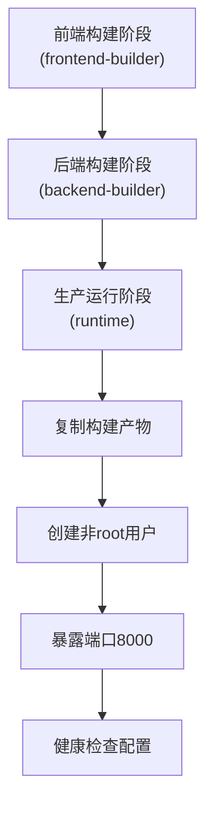
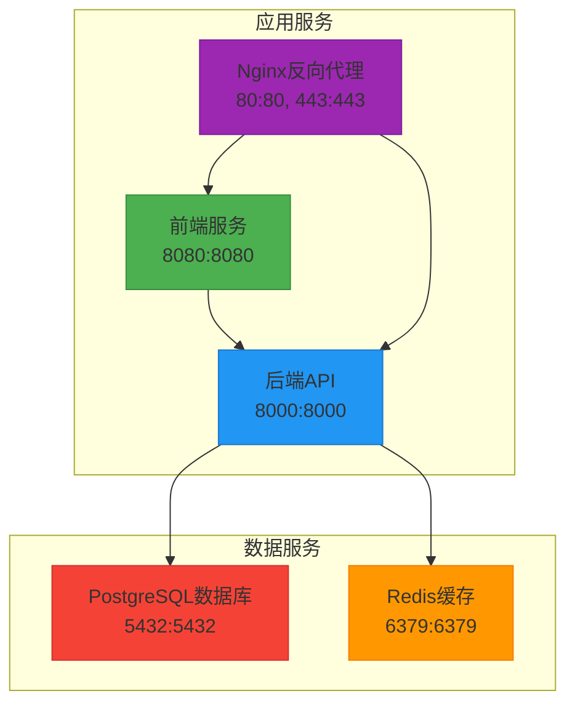
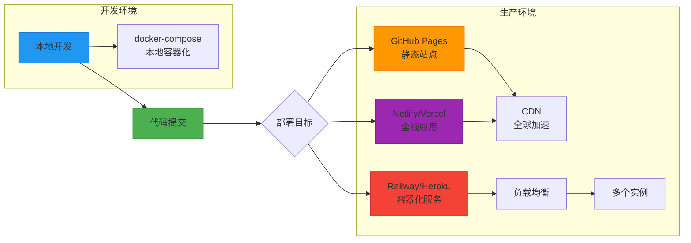

# 多平台部署方案

<cite>
**本文档引用文件**  
- [DEPLOYMENT_GUIDE.md](file://DEPLOYMENT_GUIDE.md)
- [docker-compose.yml](file://docker-compose.yml)
- [Dockerfile](file://Dockerfile)
- [netlify.toml](file://netlify.toml)
- [next.config.mjs](file://next.config.mjs)
- [backend/package.json](file://backend/package.json)
- [package.json](file://package.json)
</cite>

## 目录
1. [引言](#引言)
2. [部署平台概览](#部署平台概览)
3. [构建环境对比](#构建环境对比)
4. [自定义域名与SSL管理](#自定义域名与ssl管理)
5. [流量路由机制分析](#流量路由机制分析)
6. [容器化部署实现](#容器化部署实现)
7. [扩展能力与成本性能对比](#扩展能力与成本性能对比)
8. [部署拓扑图示例](#部署拓扑图示例)
9. [技术选型建议](#技术选型建议)

## 引言
本文档系统性地比较GitHub Pages、Netlify、Vercel、Railway和Heroku五大部署平台的适用场景与配置差异。基于DEPLOYMENT_GUIDE.md及相关容器化配置文件，深入分析各平台在构建环境、域名配置、SSL管理、流量路由和扩展能力方面的特点。重点探讨基于Docker的容器化部署在后端服务中的实现方式，为团队提供全面的技术选型决策支持。

## 部署平台概览
根据DEPLOYMENT_GUIDE.md文档，各平台的主要特性如下：

### GitHub Pages
- ✅ 免费托管
- ✅ 自动HTTPS
- ✅ CDN加速
- ❌ 仅支持静态文件
- ❌ 不支持后端API

### Vercel
- ✅ 全栈应用支持
- ✅ 自动化部署
- ✅ 边缘函数支持
- ✅ 无缝Next.js集成

### Netlify
- ✅ 静态站点托管
- ✅ 函数即服务（Functions）
- ✅ 自动化CI/CD
- ✅ 简单的重定向配置

### Railway
- ✅ 容器化部署支持
- ✅ 数据库集成
- ✅ 环境变量管理
- ✅ 按使用量计费

### Heroku
- ✅ 传统PaaS平台
- ✅ 多语言支持
- ✅ 插件生态系统
- ✅ 简单的git push部署

**Section sources**
- [DEPLOYMENT_GUIDE.md](file://DEPLOYMENT_GUIDE.md#L50-L100)

## 构建环境对比
各平台的构建环境配置方式存在显著差异：

### GitHub Pages
通过GitHub Actions实现自动化构建，依赖于仓库中的部署脚本：
```bash
./deploy-github-pages.sh
```

### Netlify
使用netlify.toml配置文件定义构建环境：
```toml
[build]
  command = "next build"
  publish = ".next"

[build.environment]
  NODE_VERSION = "18"
  NPM_FLAGS = "--legacy-peer-deps"
```

### Vercel
通过Vercel CLI进行部署，自动识别Next.js项目结构：
```bash
vercel --prod
```

### Railway和Heroku
支持直接通过git push进行部署，利用package.json中的脚本：
```json
"scripts": {
  "deploy:railway": "railway up",
  "deploy:heroku": "git push heroku main"
}
```

**Section sources**
- [DEPLOYMENT_GUIDE.md](file://DEPLOYMENT_GUIDE.md#L101-L150)
- [netlify.toml](file://netlify.toml#L1-L10)
- [package.json](file://package.json#L50-L60)

## 自定义域名与SSL管理
### 域名配置方式
各平台均支持自定义域名配置，但实现方式不同：

- **GitHub Pages**: 在仓库设置中指定源分支为`gh-pages`
- **Netlify/Vercel**: 通过管理界面添加域名
- **Railway/Heroku**: 使用CLI工具配置域名

### SSL证书管理
- **GitHub Pages**: 自动提供Let's Encrypt证书
- **Netlify/Vercel**: 自动SSL配置
- **Railway/Heroku**: 提供自动或手动SSL选项

根据文档，自定义域名配置示例：
```bash
# DNS设置
CNAME记录：tribridge.pages.dev
```

**Section sources**
- [DEPLOYMENT_GUIDE.md](file://DEPLOYMENT_GUIDE.md#L30-L50)

## 流量路由机制分析
### Netlify路由配置
通过netlify.toml文件定义复杂的路由规则：
```toml
[[redirects]]
  from = "/api/*"
  to = "/.netlify/functions/api/:splat"
  status = 200

[[redirects]]
  from = "/*"
  to = "/index.html"
  status = 200
```

### Vercel路由
自动处理Next.js的App Router和API Routes。

### GitHub Pages
仅支持简单的静态文件路由。

### Railway/Heroku
依赖应用内部的路由配置，如Express的路由中间件。

**Section sources**
- [netlify.toml](file://netlify.toml#L15-L25)
- [DEPLOYMENT_GUIDE.md](file://DEPLOYMENT_GUIDE.md#L151-L170)

## 容器化部署实现
### Dockerfile多阶段构建
采用三阶段构建策略优化镜像大小和安全性：



**Diagram sources**
- [Dockerfile](file://Dockerfile#L1-L73)

### docker-compose服务编排
定义了完整的开发环境服务栈：



**Diagram sources**
- [docker-compose.yml](file://docker-compose.yml#L1-L75)

### 端口映射与网络配置
| 服务 | 容器端口 | 主机端口 | 用途 |
|------|----------|----------|------|
| frontend | 8080 | 8080 | 前端开发服务器 |
| backend | 8000 | 8000 | 后端API服务 |
| postgres | 5432 | 5432 | 数据库访问 |
| redis | 6379 | 6379 | 缓存服务 |
| nginx | 80/443 | 80/443 | 生产环境反向代理 |

**Section sources**
- [docker-compose.yml](file://docker-compose.yml#L1-L75)
- [Dockerfile](file://Dockerfile#L1-L73)

## 扩展能力与成本性能对比
### 平台能力对比矩阵
| 特性 | GitHub Pages | Netlify | Vercel | Railway | Heroku |
|------|-------------|---------|--------|---------|--------|
| 静态托管 | ✅ 免费 | ✅ 免费 | ✅ 免费 | ❌ | ❌ |
| 全栈支持 | ❌ | ✅ Pro版 | ✅ 免费 | ✅ | ✅ |
| 容器化 | ❌ | ❌ | ✅ Pro版 | ✅ | ✅ |
| 数据库集成 | ❌ | ❌ | ❌ | ✅ | ✅ |
| 自动HTTPS | ✅ | ✅ | ✅ | ✅ | ✅ |
| CDN加速 | ✅ | ✅ | ✅ | ✅ | ✅ |
| 函数即服务 | ❌ | ✅ | ✅ | ✅ | ✅ |
| 按使用计费 | ❌ | ✅ | ✅ | ✅ | ✅ |

### 可维护性分析
- **GitHub Pages**: 最低维护成本，适合纯静态站点
- **Netlify/Vercel**: 自动化程度高，适合JAMstack应用
- **Railway/Heroku**: 需要更多运维工作，但灵活性最高

**Section sources**
- [DEPLOYMENT_GUIDE.md](file://DEPLOYMENT_GUIDE.md#L50-L100)
- [package.json](file://package.json#L50-L60)

## 部署拓扑图示例
从开发到生产的完整部署流程：



**Diagram sources**
- [DEPLOYMENT_GUIDE.md](file://DEPLOYMENT_GUIDE.md#L1-L190)
- [docker-compose.yml](file://docker-compose.yml#L1-L75)

## 技术选型建议
### 前端部署推荐
- **GitHub Pages**: 适用于文档站点或纯静态前端
- **Netlify/Vercel**: 推荐用于需要SSR或API路由的全栈应用

### 后端部署推荐
- **Railway**: 推荐用于需要容器化和数据库集成的后端服务
- **Heroku**: 适用于传统PaaS需求和快速原型开发

### 综合建议
对于TriBridge项目，建议采用混合部署策略：
1. 前端部署到Netlify或Vercel，利用其优秀的Next.js支持
2. 后端API部署到Railway，利用其容器化和数据库集成能力
3. 开发环境使用docker-compose确保一致性

此方案平衡了性能、成本和可维护性，同时充分利用了各平台的优势。

**Section sources**
- [DEPLOYMENT_GUIDE.md](file://DEPLOYMENT_GUIDE.md#L1-L190)
- [docker-compose.yml](file://docker-compose.yml#L1-L75)
- [Dockerfile](file://Dockerfile#L1-L73)