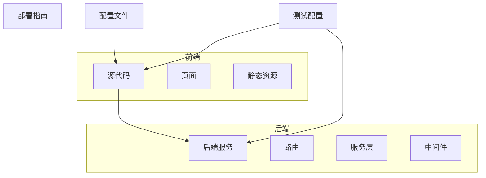
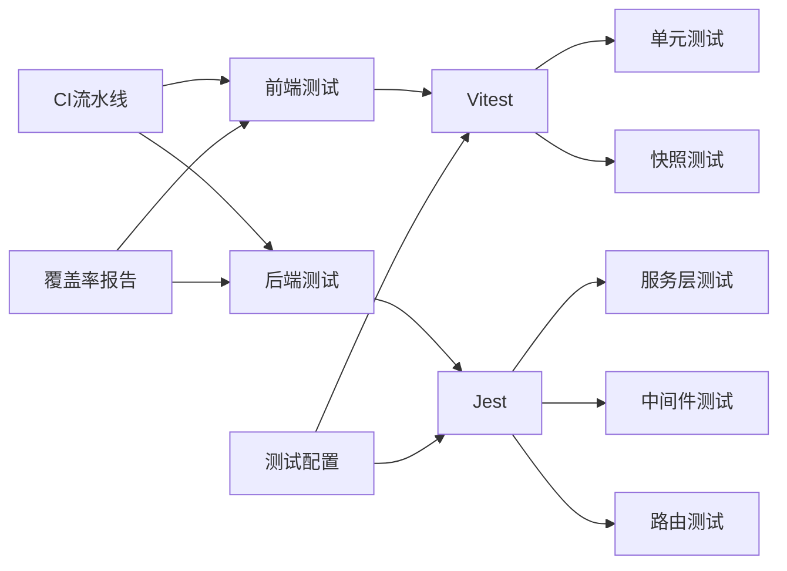
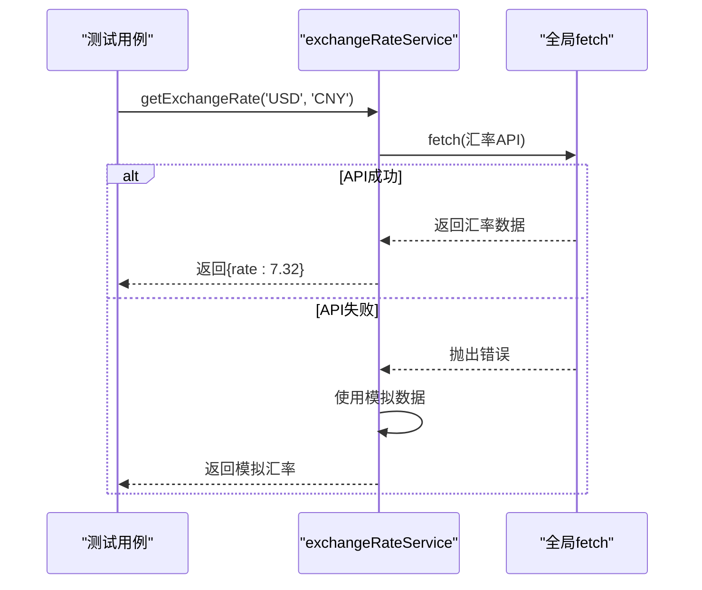
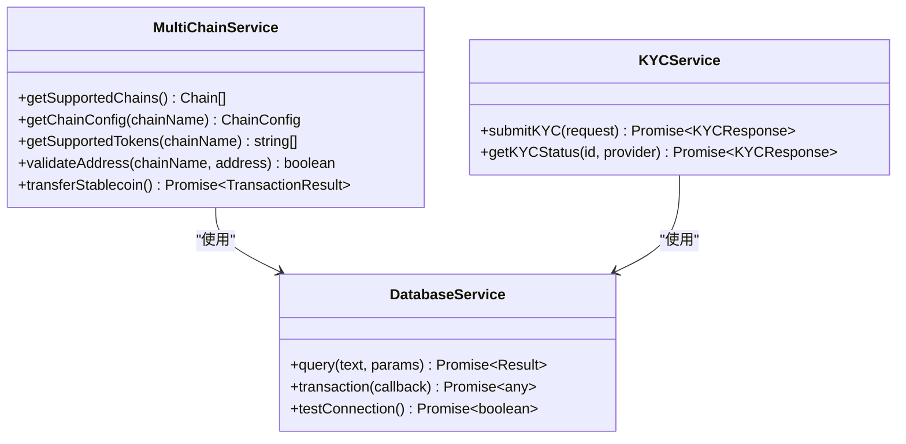
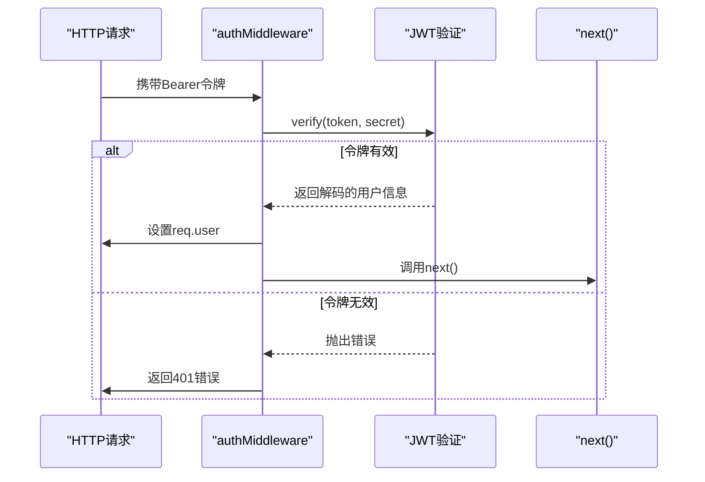
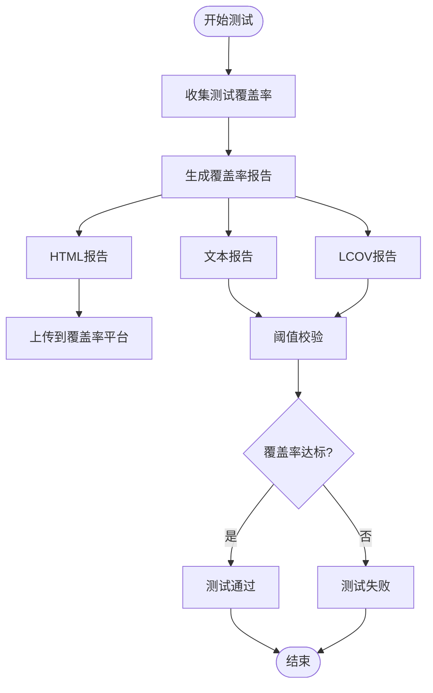
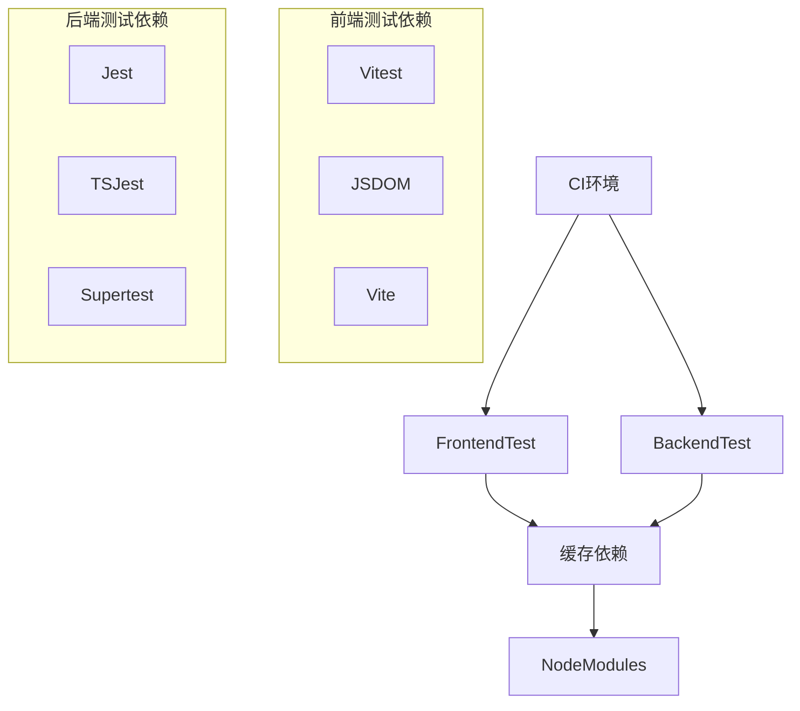

# 测试集成策略

<cite>
**本文档引用的文件**
- [DEPLOYMENT_GUIDE.md](file://DEPLOYMENT_GUIDE.md)
- [vitest.config.ts](file://vitest.config.ts)
- [backend/jest.config.js](file://backend/jest.config.js)
- [backend/src/services/__tests__/multiChainService.test.ts](file://backend/src/services/__tests__/multiChainService.test.ts)
- [backend/src/services/__tests__/multiChainService.unit.test.ts](file://backend/src/services/__tests__/multiChainService.unit.test.ts)
- [src/services/__tests__/exchangeRateService.test.ts](file://src/services/__tests__/exchangeRateService.test.ts)
- [backend/src/middleware/auth.ts](file://backend/src/middleware/auth.ts)
- [backend/src/middleware/errorHandler.ts](file://backend/src/middleware/errorHandler.ts)
- [backend/src/routes/transaction.ts](file://backend/src/routes/transaction.ts)
- [backend/src/services/database.ts](file://backend/src/services/database.ts)
- [backend/src/services/kycService.ts](file://backend/src/services/kycService.ts)
- [src/components/Wallet/WalletConnect.tsx](file://src/components/Wallet/WalletConnect.tsx)
- [src/components/Compliance/KYCVerification.tsx](file://src/components/Compliance/KYCVerification.tsx)
- [src/components/Blockchain/TransactionExecutor.tsx](file://src/components/Blockchain/TransactionExecutor.tsx)
</cite>

## 目录
1. [简介](#简介)
2. [项目结构](#项目结构)
3. [核心组件](#核心组件)
4. [架构概述](#架构概述)
5. [详细组件分析](#详细组件分析)
6. [依赖分析](#依赖分析)
7. [性能考虑](#性能考虑)
8. [故障排除指南](#故障排除指南)
9. [结论](#结论)
10. [附录](#附录)（如有必要）

## 简介
本文档基于DEPLOYMENT_GUIDE.md和测试框架配置文件，详细说明了如何在CI流水线中集成自动化测试。文档涵盖了前端使用Vitest进行单元测试和快照测试的执行流程，以及后端Jest框架下的服务层与中间件测试策略。同时，文档描述了测试覆盖率报告生成、阈值校验和失败阻断机制的实现方式，解释了如何在CI环境中配置测试数据库、模拟区块链服务和KYC接口以确保测试稳定性，并提供了测试并行化、缓存优化和调试日志输出的最佳实践。

## 项目结构
本项目采用分层架构设计，前端使用Next.js框架，后端使用Node.js + Express，测试框架分别采用Vitest（前端）和Jest（后端）。项目结构清晰地分离了前端、后端和共享配置。



**图示来源**
- [DEPLOYMENT_GUIDE.md](file://DEPLOYMENT_GUIDE.md)
- [vitest.config.ts](file://vitest.config.ts)
- [backend/jest.config.js](file://backend/jest.config.js)

**本节来源**
- [DEPLOYMENT_GUIDE.md](file://DEPLOYMENT_GUIDE.md)

## 核心组件
项目的核心组件包括前端的Vitest测试框架和后端的Jest测试框架。前端测试主要集中在组件的单元测试和快照测试，而后端测试则覆盖了服务层、中间件和路由的全面测试。测试配置文件定义了测试环境、覆盖率收集和报告生成等关键参数。

**本节来源**
- [vitest.config.ts](file://vitest.config.ts)
- [backend/jest.config.js](file://backend/jest.config.js)

## 架构概述
系统的测试架构分为前端和后端两个独立的测试体系，通过CI流水线进行集成。前端使用Vitest作为测试运行器，配置了jsdom环境以支持组件测试；后端使用Jest配合ts-jest预设，针对TypeScript代码进行测试。



**图示来源**
- [vitest.config.ts](file://vitest.config.ts)
- [backend/jest.config.js](file://backend/jest.config.js)

## 详细组件分析
### 前端测试组件分析
前端测试使用Vitest框架，配置文件定义了测试环境为jsdom，启用了全局变量，并指定了setup文件。测试主要集中在服务层和UI组件，通过模拟fetch等全局API来测试服务调用。

#### 前端服务测试序列图


**图示来源**
- [src/services/__tests__/exchangeRateService.test.ts](file://src/services/__tests__/exchangeRateService.test.ts)
- [vitest.config.ts](file://vitest.config.ts)

**本节来源**
- [src/services/__tests__/exchangeRateService.test.ts](file://src/services/__tests__/exchangeRateService.test.ts)
- [vitest.config.ts](file://vitest.config.ts)

### 后端测试组件分析
后端测试使用Jest框架，配置了ts-jest预设以支持TypeScript，测试匹配模式覆盖了__tests__目录下的所有测试文件。测试策略包括集成测试和单元测试，通过jest.mock进行依赖模拟。

#### 后端服务测试类图


**图示来源**
- [backend/src/services/__tests__/multiChainService.test.ts](file://backend/src/services/__tests__/multiChainService.test.ts)
- [backend/src/services/database.ts](file://backend/src/services/database.ts)
- [backend/src/services/kycService.ts](file://backend/src/services/kycService.ts)

#### 后端中间件测试序列图


**图示来源**
- [backend/src/middleware/auth.ts](file://backend/src/middleware/auth.ts)
- [backend/src/middleware/errorHandler.ts](file://backend/src/middleware/errorHandler.ts)

**本节来源**
- [backend/src/services/__tests__/multiChainService.test.ts](file://backend/src/services/__tests__/multiChainService.test.ts)
- [backend/src/services/__tests__/multiChainService.unit.test.ts](file://backend/src/services/__tests__/multiChainService.unit.test.ts)
- [backend/src/middleware/auth.ts](file://backend/src/middleware/auth.ts)
- [backend/src/middleware/errorHandler.ts](file://backend/src/middleware/errorHandler.ts)

### 测试覆盖率与报告
测试框架配置了覆盖率收集功能，后端Jest配置中定义了collectCoverageFrom模式，排除了类型声明文件和入口文件。覆盖率报告生成多种格式，包括文本、lcov和HTML，便于在CI环境中进行分析和展示。



**图示来源**
- [backend/jest.config.js](file://backend/jest.config.js)

**本节来源**
- [backend/jest.config.js](file://backend/jest.config.js)

## 依赖分析
项目测试依赖清晰分离，前端测试依赖Vitest及相关插件，后端测试依赖Jest、ts-jest和相关模拟库。通过package.json中的脚本配置，实现了测试的并行执行和缓存优化。



**图示来源**
- [package.json](file://package.json)
- [backend/package.json](file://backend/package.json)

**本节来源**
- [backend/jest.config.js](file://backend/jest.config.js)
- [vitest.config.ts](file://vitest.config.ts)

## 性能考虑
在CI环境中，测试性能优化至关重要。通过并行执行前端和后端测试、使用依赖缓存、合理配置测试超时等策略，可以显著提升CI流水线的执行效率。同时，测试数据库的配置和区块链服务的模拟也对测试稳定性有重要影响。

## 故障排除指南
当测试失败时，应首先检查测试日志和覆盖率报告。对于前端测试，重点关注组件渲染和交互逻辑；对于后端测试，检查中间件执行顺序、服务依赖模拟和数据库连接状态。DEPLOYMENT_GUIDE.md中提供了详细的部署和监控指南，可作为故障排除的参考。

**本节来源**
- [DEPLOYMENT_GUIDE.md](file://DEPLOYMENT_GUIDE.md)

## 结论
本文档详细阐述了TriBridge项目的测试集成策略，涵盖了从测试框架配置到CI流水线集成的各个方面。通过合理的测试策略和配置，确保了代码质量和系统稳定性，为项目的持续交付提供了有力保障。

## 附录
### 测试脚本参考
```json
{
  "scripts": {
    "test": "npm run test:frontend && npm run test:backend",
    "test:frontend": "vitest",
    "test:backend": "jest",
    "test:coverage": "jest --coverage",
    "test:watch": "vitest --watch"
  }
}
```

**本节来源**
- [package.json](file://package.json)
- [backend/package.json](file://backend/package.json)