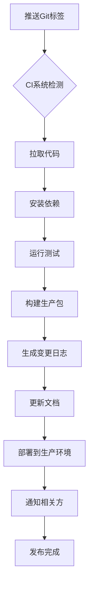
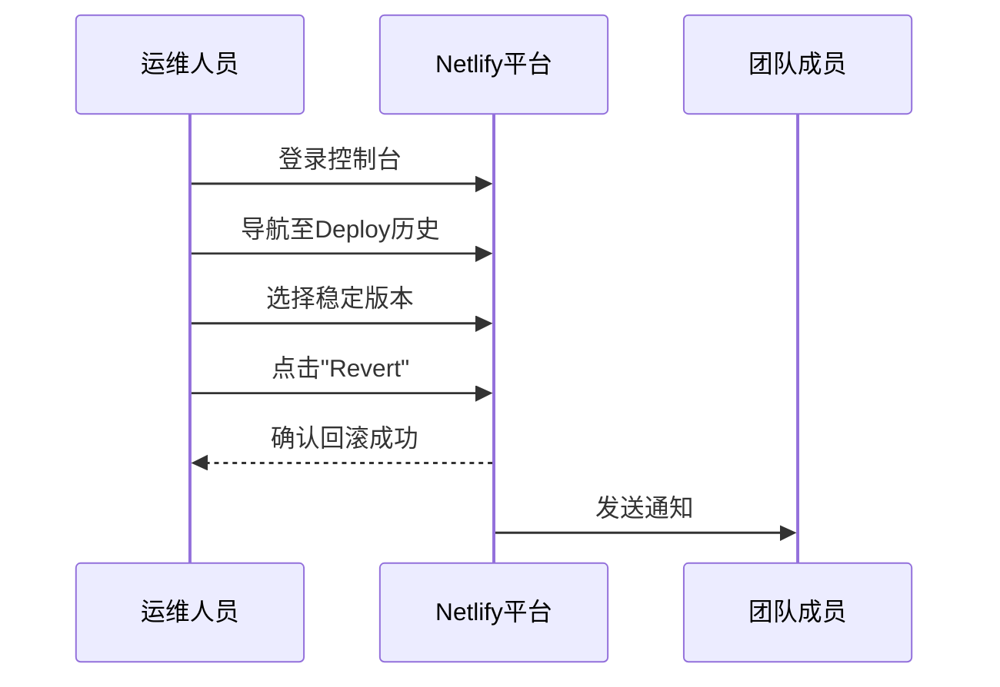

# 版本发布与回滚机制

<cite>
**本文档引用文件**  
- [DEPLOYMENT_GUIDE.md](file://DEPLOYMENT_GUIDE.md)
- [VERSION.md](file://VERSION.md)
- [deploy-github-pages.sh](file://deploy-github-pages.sh)
- [netlify.toml](file://netlify.toml)
- [docker-compose.yml](file://docker-compose.yml)
- [VERSION_FRONTEND_BACKEND_SEPARATION.md](file://VERSION_FRONTEND_BACKEND_SEPARATION.md)
- [GITHUB_DEPLOYMENT_SUCCESS.md](file://GITHUB_DEPLOYMENT_SUCCESS.md)
- [NETLIFY_REDEPLOY_TRIGGER.md](file://NETLIFY_REDEPLOY_TRIGGER.md)
</cite>

## 目录
1. [引言](#引言)
2. [语义化版本控制规范](#语义化版本控制规范)
3. [版本发布流程](#版本发布流程)
4. [自动发布触发机制](#自动发布触发机制)
5. [生产环境回滚策略](#生产环境回滚策略)
6. [发布检查清单](#发布检查清单)
7. [灰度发布策略](#灰度发布策略)
8. [紧急回滚操作手册](#紧急回滚操作手册)
9. [附录](#附录)

## 引言

本文件旨在为TriBridge跨境支付平台建立标准化的版本发布与回滚流程，确保部署过程的安全性、可控性和可追溯性。文档基于项目现有的部署指南和版本记录，系统性地定义了从版本控制到生产环境变更的完整生命周期管理机制。

**Section sources**
- [DEPLOYMENT_GUIDE.md](file://DEPLOYMENT_GUIDE.md#L1-L190)
- [VERSION.md](file://VERSION.md#L1-L46)

## 语义化版本控制规范

TriBridge项目采用语义化版本控制（SemVer）标准，版本号格式为`主版本号.次版本号.补丁号`，具体应用规则如下：

### 主版本号（Major）
当进行不兼容的API更改或重大架构调整时递增主版本号。例如：
- 从前后端分离架构迁移至Next.js全栈架构（v2.0.0 → v3.0.0）
- 区块链网络支持的重大变更
- 数据库模式的破坏性更新

### 次版本号（Minor）
当以向后兼容的方式添加新功能时递增次版本号。例如：
- 新增支持的稳定币类型
- 增加新的API端点
- 用户界面功能增强

### 补丁版本号（Patch）
当进行向后兼容的问题修复时递增补丁版本号。例如：
- 安全漏洞修复
- Bug修复
- 性能优化
- 文档更新

**Section sources**
- [VERSION.md](file://VERSION.md#L1-L46)
- [VERSION_FRONTEND_BACKEND_SEPARATION.md](file://VERSION_FRONTEND_BACKEND_SEPARATION.md)

## 版本发布流程

### 发布准备
1. 确保所有功能分支已合并至`main`分支
2. 完成代码审查和自动化测试
3. 更新`VERSION.md`文件中的版本信息
4. 确认环境变量配置正确

### 构建与打包
```bash
# 执行生产环境构建
npm run build
```

构建输出将生成在`.next`目录中，包含优化后的静态资源和服务器端渲染文件。

### 部署执行
通过以下任一方式触发部署：
- 推送代码至`main`分支触发GitHub Actions
- 执行`./deploy-github-pages.sh`脚本
- 使用Netlify CLI手动部署

**Section sources**
- [DEPLOYMENT_GUIDE.md](file://DEPLOYMENT_GUIDE.md#L1-L190)
- [deploy-github-pages.sh](file://deploy-github-pages.sh#L1-L140)

## 自动发布触发机制

### Git标签触发
项目采用基于Git标签的自动发布机制。创建符合`vX.X.X`格式的标签将触发CI流水线：

```bash
# 创建发布标签
git tag -a v3.0.0 -m "Next.js全栈架构发布"
git push origin v3.0.0
```

### CI流水线工作流


**Diagram sources**
- [DEPLOYMENT_GUIDE.md](file://DEPLOYMENT_GUIDE.md#L1-L190)
- [GITHUB_DEPLOYMENT_SUCCESS.md](file://GITHUB_DEPLOYMENT_SUCCESS.md)

**Section sources**
- [DEPLOYMENT_GUIDE.md](file://DEPLOYMENT_GUIDE.md#L1-L190)

## 生产环境回滚策略

### 方式一：Netlify历史版本恢复


**Diagram sources**
- [NETLIFY_REDEPLOY_TRIGGER.md](file://NETLIFY_REDEPLOY_TRIGGER.md)
- [netlify.toml](file://netlify.toml#L1-L24)

### 方式二：Docker镜像版本切换
通过`docker-compose.yml`文件中的服务配置，可快速切换到之前的稳定镜像版本：

```yaml
services:
  backend:
    image: tribridge/backend:v2.1.0  # 回滚到旧版本
    ports:
      - "8000:8000"
```

执行回滚命令：
```bash
docker-compose down
docker-compose up -d
```

**Diagram sources**
- [docker-compose.yml](file://docker-compose.yml#L1-L74)

### 方式三：数据库迁移回退
对于数据库变更，采用渐进式回退策略：
1. 停止写入操作
2. 执行反向迁移脚本
3. 验证数据完整性
4. 重启服务

**Section sources**
- [docker-compose.yml](file://docker-compose.yml#L1-L74)
- [netlify.toml](file://netlify.toml#L1-L24)

## 发布检查清单

- [ ] 代码已通过审查并合并至main分支
- [ ] 所有自动化测试通过
- [ ] 版本号已正确更新
- [ ] 变更日志已记录
- [ ] 环境变量已配置
- [ ] 构建过程成功完成
- [ ] 部署目标平台可访问
- [ ] 健康检查端点返回正常
- [ ] 关键业务流程测试通过
- [ ] 相关方已通知

**Section sources**
- [DEPLOYMENT_GUIDE.md](file://DEPLOYMENT_GUIDE.md#L1-L190)

## 灰度发布策略

采用分阶段发布策略降低风险：
1. **内部测试**：在预发布环境中验证
2. **小流量测试**：向5%用户开放新版本
3. **逐步扩大**：按10%→50%→100%比例增加流量
4. **全面上线**：所有用户切换至新版本

监控关键指标：
- 系统错误率
- API响应时间
- 用户会话时长
- 交易成功率

**Section sources**
- [DEPLOYMENT_GUIDE.md](file://DEPLOYMENT_GUIDE.md#L1-L190)

## 紧急回滚操作手册

### 触发条件
当出现以下情况时立即执行紧急回滚：
- 核心交易功能中断
- 安全漏洞暴露
- 数据库连接失败
- 系统错误率持续高于5%

### 操作步骤
1. 通知团队进入紧急响应状态
2. 确定最近的稳定版本
3. 执行选择的回滚方式（Netlify/Docker/数据库）
4. 验证系统恢复情况
5. 记录事件详情
6. 启动根本原因分析

**Section sources**
- [DEPLOYMENT_GUIDE.md](file://DEPLOYMENT_GUIDE.md#L1-L190)
- [NETLIFY_REDEPLOY_TRIGGER.md](file://NETLIFY_REDEPLOY_TRIGGER.md)

## 附录

### 变更日志生成规则
每次发布时自动生成变更日志，包含：
- 版本号和发布日期
- 主要功能变更
- Bug修复列表
- 已知问题
- 升级注意事项

### 相关文档
- [GitHub部署解决方案](GITHUB_ACCESS_SOLUTION.md)
- [Netlify部署修复指南](NETLIFY_FIX.md)
- [最终迁移总结](MIGRATION_COMPLETE.md)

**Section sources**
- [VERSION.md](file://VERSION.md#L1-L46)
- [FINAL_MIGRATION_SUMMARY.md](file://FINAL_MIGRATION_SUMMARY.md)