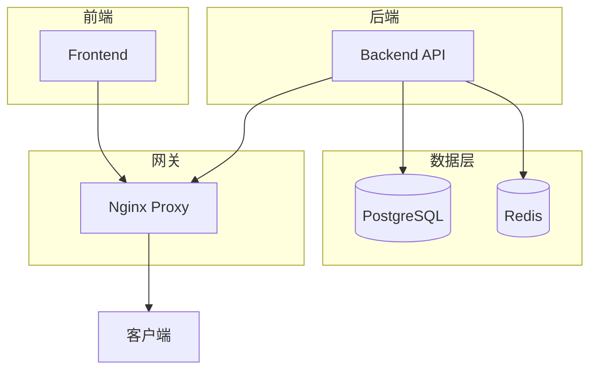
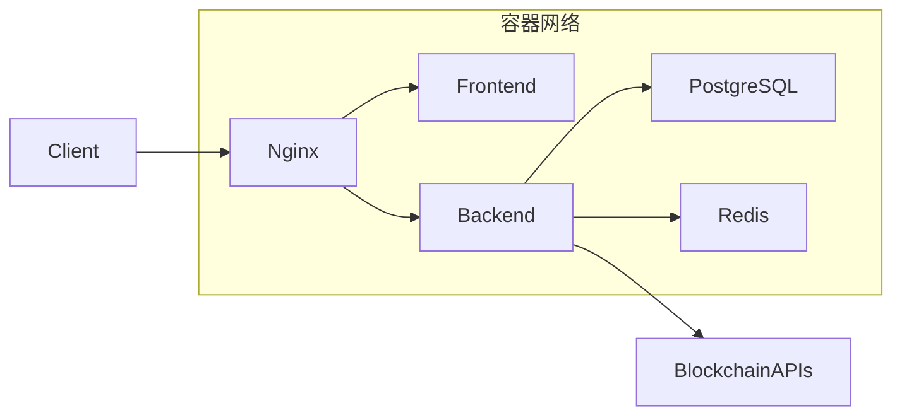
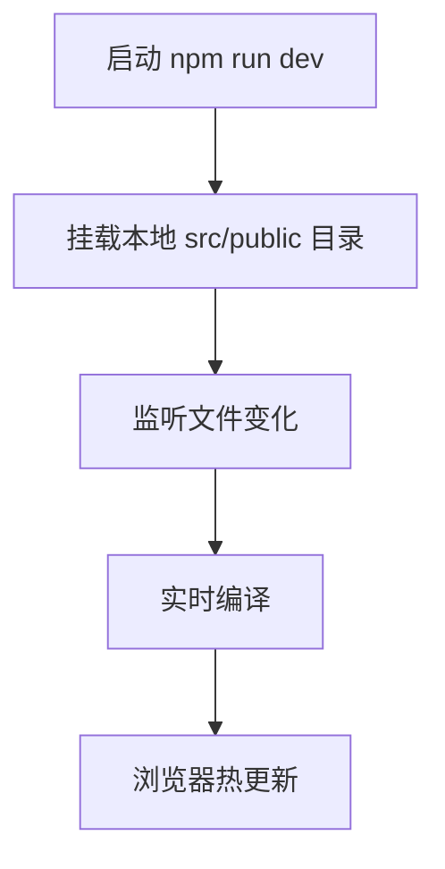
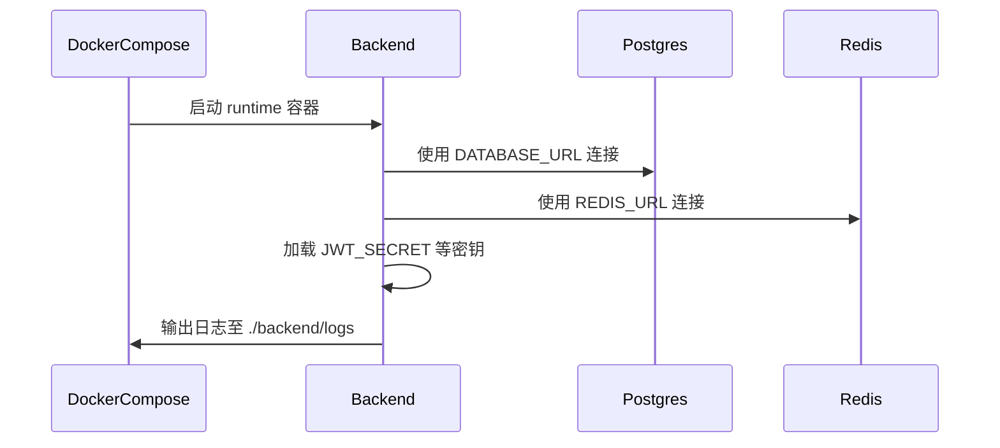
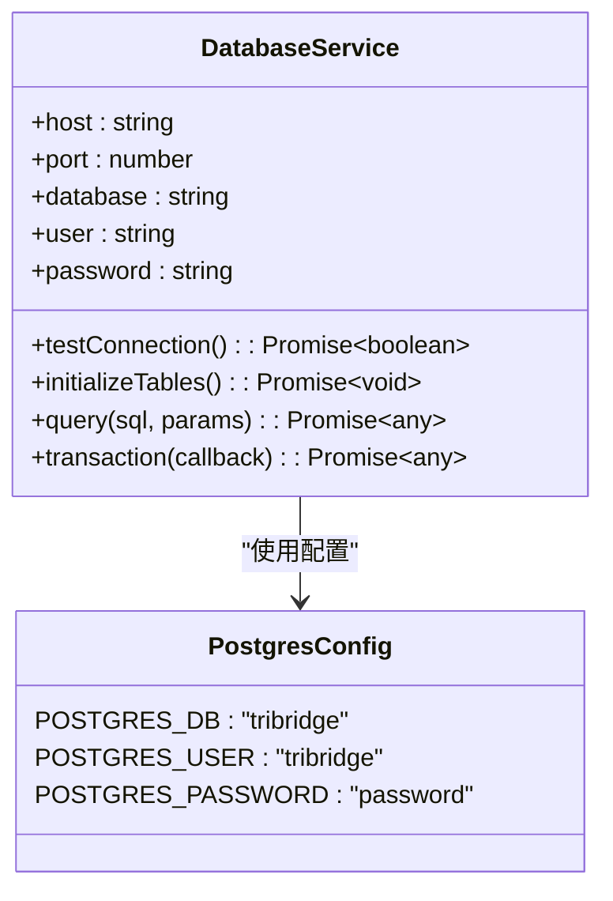
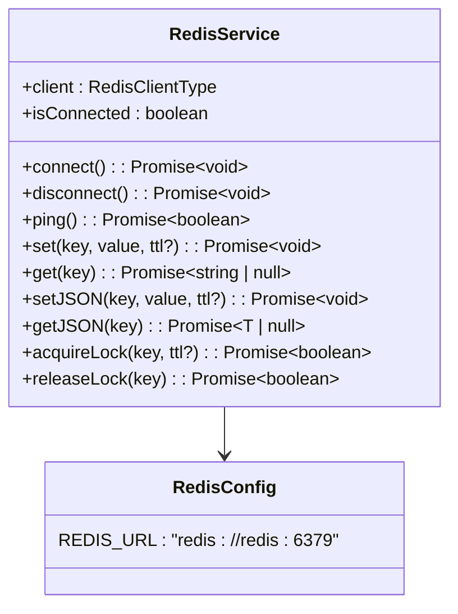
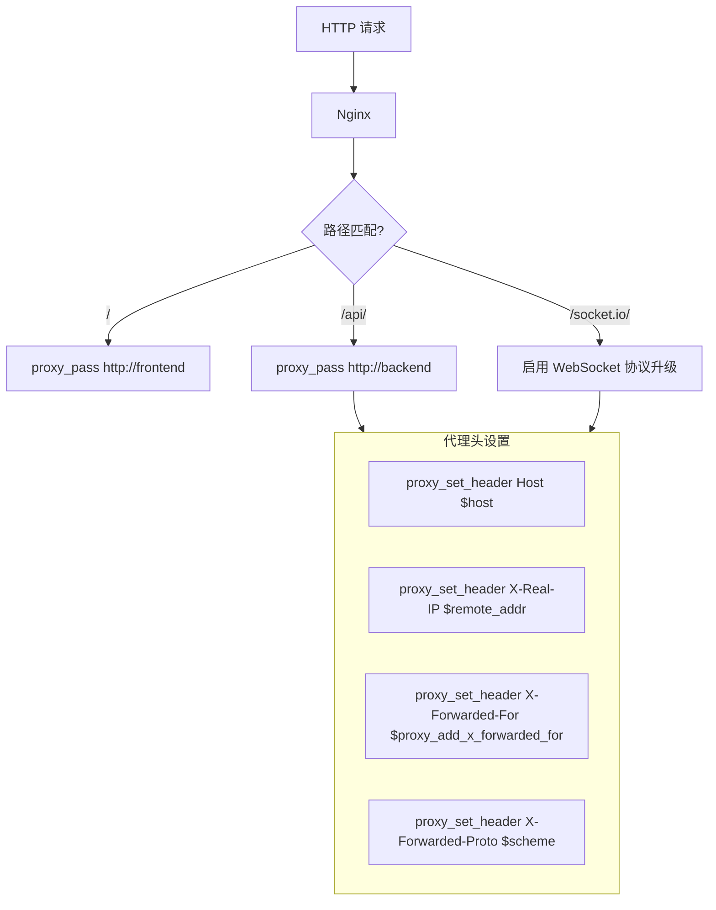
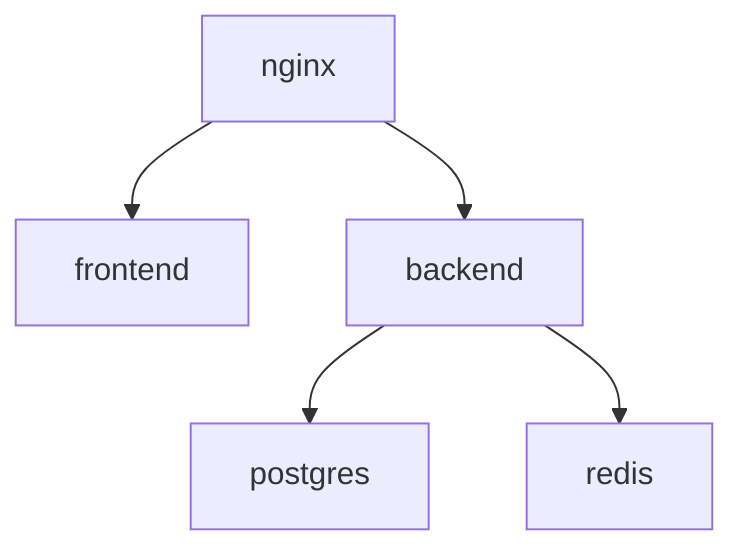

# Docker Compose 编排配置

<cite>
**本文档引用文件**  
- [docker-compose.yml](file://docker-compose.yml)
- [nginx.conf](file://nginx.conf)
- [Dockerfile](file://Dockerfile)
- [backend/src/index.ts](file://backend/src/index.ts)
- [backend/src/services/database.ts](file://backend/src/services/database.ts)
- [backend/src/services/redis.ts](file://backend/src/services/redis.ts)
</cite>

## 目录
1. [简介](#简介)
2. [项目结构](#项目结构)
3. [核心服务配置](#核心服务配置)
4. [架构概览](#架构概览)
5. [详细组件分析](#详细组件分析)
6. [依赖关系分析](#依赖关系分析)
7. [性能考量](#性能考量)
8. [故障排查指南](#故障排查指南)
9. [结论](#结论)

## 简介
本文档深入解析 `docker-compose.yml` 文件中各服务的编排配置，涵盖前端开发服务、后端生产服务、PostgreSQL 数据库、Redis 缓存以及 Nginx 反向代理的完整部署策略。结合 `nginx.conf` 配置文件，详细说明静态资源服务与 API 代理的集成方式，并提供多环境管理、健康检查机制和常见启动问题的解决方案。

## 项目结构
本项目采用前后端分离架构，包含独立的前端（Next.js）、后端（Node.js/Express）及多个基础设施服务。通过 Docker 多阶段构建实现高效镜像生成，使用 Docker Compose 统一编排所有服务。

**Diagram sources**
- [docker-compose.yml](file://docker-compose.yml#L1-L74)
- [Dockerfile](file://Dockerfile#L1-L72)

**Section sources**
- [docker-compose.yml](file://docker-compose.yml#L1-L74)
- [Dockerfile](file://Dockerfile#L1-L72)

## 核心服务配置
`docker-compose.yml` 定义了五个核心服务：`frontend`、`backend`、`postgres`、`redis` 和 `nginx`，分别承担用户界面、业务逻辑、持久化存储、缓存加速和流量路由功能。

**Section sources**
- [docker-compose.yml](file://docker-compose.yml#L1-L74)

## 架构概览
系统采用微服务式容器化架构，Nginx 作为统一入口处理 HTTPS 终止和请求分发，前端与后端分别运行在独立容器中，共享 Redis 缓存并连接同一 PostgreSQL 实例。

**Diagram sources**
- [docker-compose.yml](file://docker-compose.yml#L1-L74)
- [nginx.conf](file://nginx.conf#L1-L78)

## 详细组件分析

### 前端开发服务分析
前端服务基于多阶段构建中的 `frontend-builder` 阶段启动开发服务器，支持热重载功能。通过卷挂载将本地 `src` 和 `public` 目录同步至容器内 `/app/src` 和 `/app/public`，确保代码变更实时生效。

**Diagram sources**
- [docker-compose.yml](file://docker-compose.yml#L6-L13)
- [Dockerfile](file://Dockerfile#L1-L72)

**Section sources**
- [docker-compose.yml](file://docker-compose.yml#L6-L13)

### 后端生产服务分析
后端服务以生产模式运行，通过环境变量注入关键配置，包括数据库连接字符串、Redis 地址、JWT 密钥等敏感信息。日志目录通过卷挂载持久化到宿主机 `./backend/logs`。

**Diagram sources**
- [docker-compose.yml](file://docker-compose.yml#L15-L27)
- [backend/src/index.ts](file://backend/src/index.ts#L1-L258)
- [backend/src/services/database.ts](file://backend/src/services/database.ts#L1-L246)
- [backend/src/services/redis.ts](file://backend/src/services/redis.ts#L1-L336)

**Section sources**
- [docker-compose.yml](file://docker-compose.yml#L15-L27)
- [backend/src/index.ts](file://backend/src/index.ts#L1-L258)

### PostgreSQL 数据库服务分析
PostgreSQL 服务使用官方 `postgres:15-alpine` 镜像，通过环境变量预设数据库名称、用户和密码。初始化脚本 `init.sql` 挂载至容器启动目录，确保首次启动时自动执行表结构创建。

**Diagram sources**
- [docker-compose.yml](file://docker-compose.yml#L29-L38)
- [backend/src/services/database.ts](file://backend/src/services/database.ts#L1-L246)

**Section sources**
- [docker-compose.yml](file://docker-compose.yml#L29-L38)
- [backend/src/services/database.ts](file://backend/src/services/database.ts#L1-L246)

### Redis 缓存服务分析
Redis 服务采用 `redis:7-alpine` 镜像，数据卷 `redis_data` 实现持久化存储。后端通过 `redis://redis:6379` 地址连接，用于会话管理、速率限制和临时数据缓存。

**Diagram sources**
- [docker-compose.yml](file://docker-compose.yml#L40-L47)
- [backend/src/services/redis.ts](file://backend/src/services/redis.ts#L1-L336)

**Section sources**
- [docker-compose.yml](file://docker-compose.yml#L40-L47)
- [backend/src/services/redis.ts](file://backend/src/services/redis.ts#L1-L336)

### Nginx 反向代理服务分析
Nginx 作为反向代理，负责 SSL 终止、静态资源服务和 API 请求转发。配置文件 `nginx.conf` 明确定义了对 `/`、`/api/` 和 `/socket.io/` 路径的路由规则。

**Diagram sources**
- [docker-compose.yml](file://docker-compose.yml#L49-L58)
- [nginx.conf](file://nginx.conf#L1-L78)

**Section sources**
- [docker-compose.yml](file://docker-compose.yml#L49-L58)
- [nginx.conf](file://nginx.conf#L1-L78)

## 依赖关系分析
各服务间存在明确的依赖关系，确保启动顺序正确。后端服务依赖数据库和缓存，Nginx 依赖前端和后端服务。

**Diagram sources**
- [docker-compose.yml](file://docker-compose.yml#L1-L74)

**Section sources**
- [docker-compose.yml](file://docker-compose.yml#L1-L74)

## 性能考量
- **前端热重载**：通过卷挂载实现快速反馈，但可能影响容器性能。
- **数据库连接池**：后端使用连接池管理 PostgreSQL 连接，最大连接数为 20。
- **Redis 缓存**：减少数据库查询压力，提升响应速度。
- **Nginx 高效代理**：支持 HTTP/1.1 Keep-Alive 和 Gzip 压缩，优化传输效率。

## 故障排查指南
### 常见启动问题
- **数据库初始化失败**：检查 `init.sql` 文件路径是否正确挂载。
- **后端无法连接数据库**：确认 `DATABASE_URL` 中主机名为 `postgres`，端口为 `5432`。
- **Redis 连接超时**：确保 `depends_on` 正确声明依赖关系。
- **Nginx 502 错误**：检查前端或后端服务是否已成功启动并监听对应端口。

### 健康检查机制
后端容器配置了健康检查命令 `curl -f http://localhost:8000/api/health`，每 30 秒检测一次，连续 3 次失败则标记为不健康。

**Section sources**
- [docker-compose.yml](file://docker-compose.yml#L15-L27)
- [Dockerfile](file://Dockerfile#L70-L72)
- [backend/src/index.ts](file://backend/src/index.ts#L1-L258)

## 结论
该 Docker Compose 配置实现了完整的全栈应用容器化部署，具备良好的可维护性和扩展性。通过合理的服务划分、依赖管理和网络配置，确保了系统的稳定运行。建议在生产环境中启用 HTTPS 配置，并定期备份数据库卷。