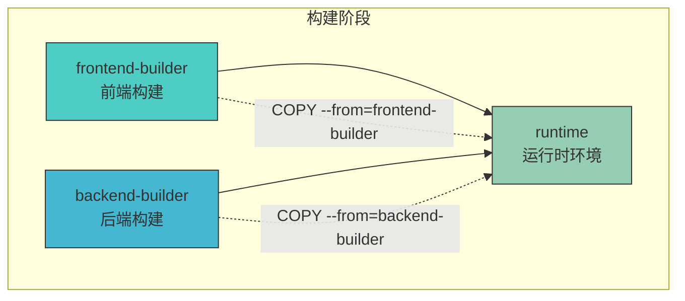
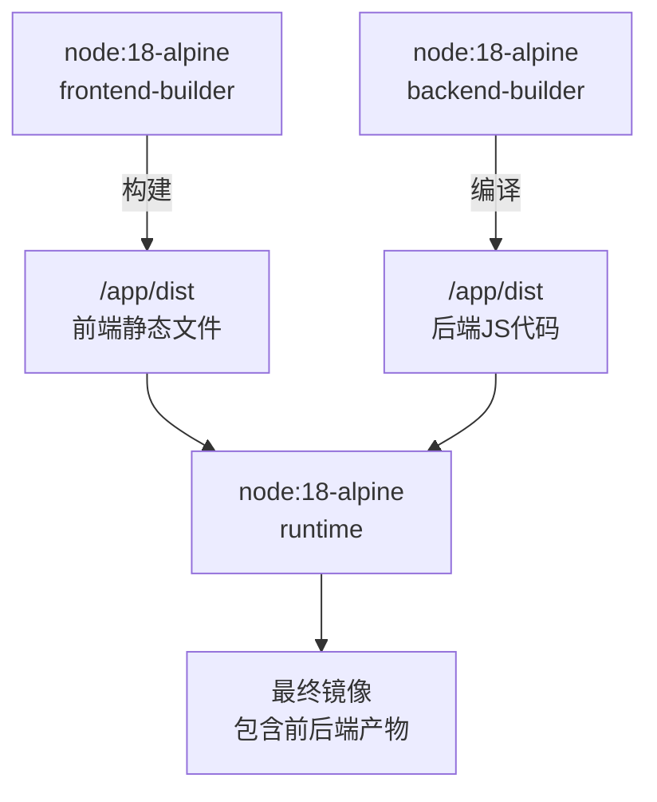
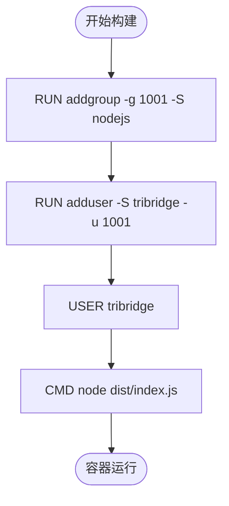
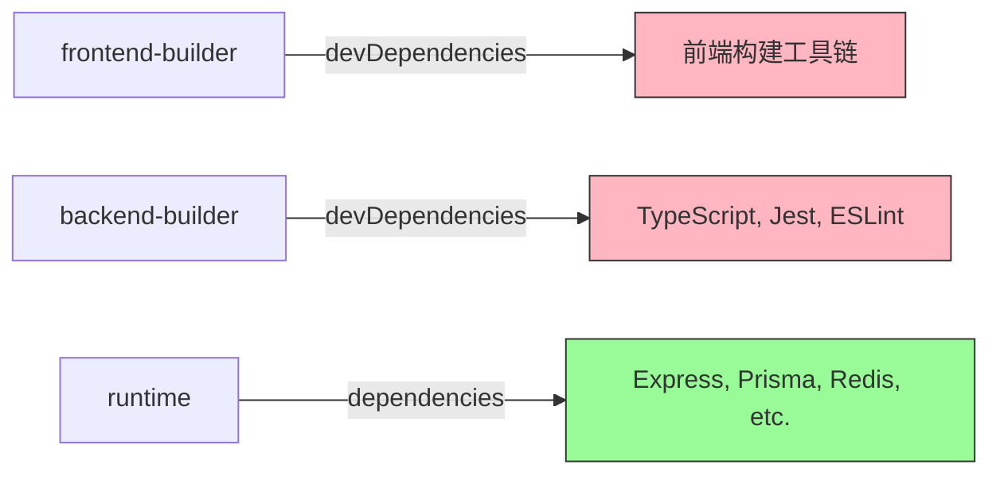

# Dockerfile 构建流程

<cite>
**本文档引用的文件**
- [Dockerfile](file://Dockerfile)
- [backend/package.json](file://backend/package.json)
- [package.json](file://package.json)
</cite>

## 目录
1. [简介](#简介)
2. [项目结构](#项目结构)
3. [核心构建阶段分析](#核心构建阶段分析)
4. [多阶段构建架构概述](#多阶段构建架构概述)
5. [详细组件分析](#详细组件分析)
6. [依赖关系分析](#依赖关系分析)
7. [性能与优化建议](#性能与优化建议)
8. [安全与健康检查机制](#安全与健康检查机制)
9. [结论](#结论)

## 简介
本文档深入解析 TriBridge 跨境支付平台的 Docker 多阶段构建流程，重点阐述前端构建、后端编译及生产运行时镜像的整合机制。通过分析 Dockerfile 指令，揭示构建上下文传递、非 root 用户安全策略、镜像体积优化等关键技术实践。

## 项目结构
本项目采用前后端分离架构，前端基于 Next.js 框架位于根目录，后端为 Node.js 服务位于 `backend/` 目录。构建过程通过 Docker 多阶段实现前后端独立编译并最终合并为单一生产镜像。

**图示来源**
- [Dockerfile](file://Dockerfile#L5-L72)

**本节来源**
- [Dockerfile](file://Dockerfile#L1-L72)

## 核心构建阶段分析

### 前端构建阶段 (frontend-builder)
该阶段使用 Node.js 18 Alpine 镜像作为基础环境，专门用于构建 Next.js 前端应用。首先复制 `package*.json`、`tsconfig*.json`、`vite.config.ts` 等配置文件，执行 `npm ci` 安装精确版本依赖以确保构建一致性。随后复制 `src/`、`public/` 和 `index.html` 源码，最后通过 `npm run build` 执行生产构建，生成静态资源至 `/app/dist`。

**本节来源**
- [Dockerfile](file://Dockerfile#L5-L25)
- [package.json](file://package.json#L10-L116)

### 后端构建阶段 (backend-builder)
后端构建同样基于 Node.js 18 Alpine 镜像。仅复制 `backend/package*.json` 和 `tsconfig.json`，运行 `npm ci` 安装开发依赖。接着复制 `backend/src/` 源码，执行 `npm run build` 调用 TypeScript 编译器（tsc）将 TypeScript 源码编译为 JavaScript，输出至 `/app/dist` 目录。

**本节来源**
- [Dockerfile](file://Dockerfile#L27-L40)
- [backend/package.json](file://backend/package.json#L10-L84)

### 运行时阶段 (runtime)
生产运行阶段仅安装后端生产依赖（`--only=production`），通过 `COPY --from` 指令分别从 `backend-builder` 和 `frontend-builder` 阶段复制编译产物：后端代码至 `/app/dist`，前端静态资源至 `/app/public`。创建非 root 用户 `tribridge` 并切换至该用户运行服务，提升安全性。暴露 8000 端口，并配置健康检查，最后启动 Node.js 服务。

**本节来源**
- [Dockerfile](file://Dockerfile#L42-L72)

## 多阶段构建架构概述

**图示来源**
- [Dockerfile](file://Dockerfile#L5-L72)

## 详细组件分析

### 构建指令作用解析
- **COPY**: 用于将主机文件复制到镜像中。在不同阶段分别复制前后端的依赖文件和源码。
- **RUN**: 执行命令，如安装依赖 (`npm ci`) 和构建应用 (`npm run build`)。
- **EXPOSE**: 声明容器运行时监听的端口（8000），提供文档信息。
- **HEALTHCHECK**: 定义健康检查命令，Docker 通过 `curl` 请求 `/api/health` 端点判断服务状态。
- **CMD**: 容器启动时执行的默认命令，此处为 `node dist/index.js`。

**本节来源**
- [Dockerfile](file://Dockerfile#L42-L72)
- [backend/package.json](file://backend/package.json#L10-L84)

### 非 root 用户安全策略
通过 `addgroup` 和 `adduser` 创建 UID 为 1001 的非特权用户 `tribridge`，并使用 `USER tribridge` 切换运行身份。此举遵循最小权限原则，即使容器被攻破，攻击者也无法获得 root 权限，有效降低安全风险。

**图示来源**
- [Dockerfile](file://Dockerfile#L55-L57)

**本节来源**
- [Dockerfile](file://Dockerfile#L55-L57)

## 依赖关系分析
多阶段构建有效分离了构建依赖与运行时依赖。前端构建依赖 Vite、Tailwind CSS 等开发工具，后端构建依赖 TypeScript 编译器，这些均不包含在最终镜像中。运行时镜像仅包含 `backend/package.json` 中的生产依赖（如 Express、Prisma Client、Redis 等），显著减小镜像体积。

**图示来源**
- [backend/package.json](file://backend/package.json#L50-L80)
- [package.json](file://package.json#L50-L110)

**本节来源**
- [backend/package.json](file://backend/package.json#L50-L80)
- [package.json](file://package.json#L50-L110)

## 性能与优化建议

### 构建缓存优化
利用 Docker 层缓存机制，将变更频率低的步骤（如复制 package.json 和安装依赖）置于变更频率高的步骤（如复制源码）之前。这样，只要 `package*.json` 文件未改变，`npm ci` 步骤即可复用缓存，大幅提升构建速度。

### 镜像体积压缩
- 使用 `node:18-alpine` 作为基础镜像，其体积远小于标准 Debian 镜像。
- 多阶段构建确保开发依赖（如 TypeScript、测试框架）不会进入最终镜像。
- 运行时仅安装生产依赖 (`npm ci --only=production`)。

### 安全性加固
- **非 root 用户运行**：已实现。
- **最小化基础镜像**：使用 Alpine Linux。
- **依赖锁定**：使用 `npm ci` 和 `package-lock.json` 确保依赖版本一致，防止供应链攻击。
- **建议**：可进一步使用 `.dockerignore` 文件排除不必要的文件（如 `node_modules`, `.git`）进入构建上下文。

**本节来源**
- [Dockerfile](file://Dockerfile#L1-L72)
- [backend/package.json](file://backend/package.json)
- [package.json](file://package.json)

## 安全与健康检查机制
健康检查配置为每 30 秒执行一次，超时 3 秒，启动后 5 秒开始首次检查，连续失败 3 次则标记容器为不健康。该机制确保容器编排系统（如 Kubernetes）能及时发现并重启故障实例，保障服务高可用。

**本节来源**
- [Dockerfile](file://Dockerfile#L68-L70)
- [backend/package.json](file://backend/package.json#L20)

## 结论
TriBridge 项目的 Dockerfile 采用多阶段构建，高效地实现了前后端的独立编译与集成。通过精心设计的构建流程，不仅保证了构建的可重复性和一致性，还通过非 root 用户运行、精简镜像等手段优化了生产环境的安全性与性能。此实践为现代全栈应用的容器化部署提供了优秀范例。