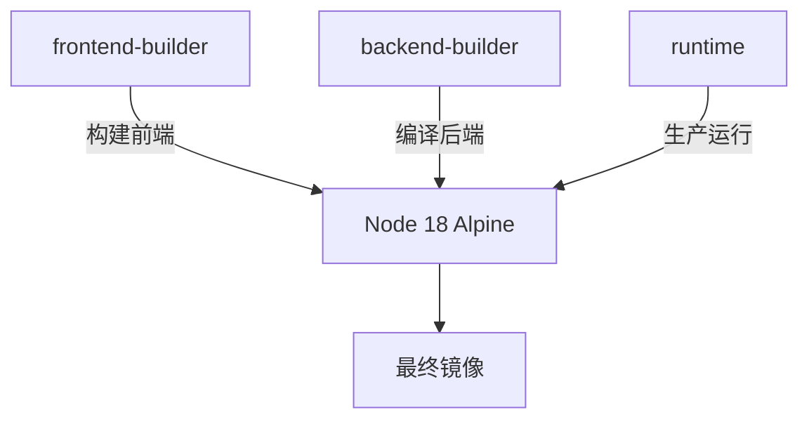
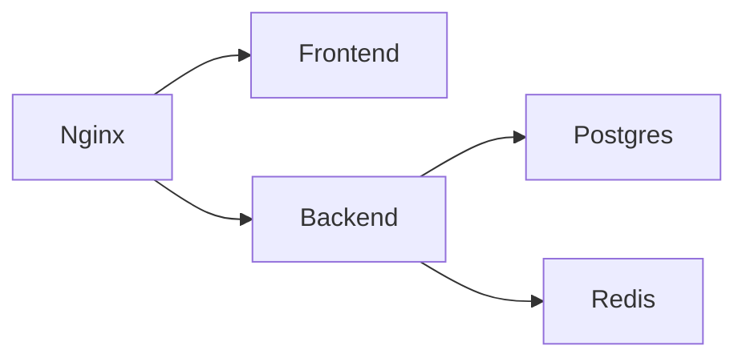

<cite>
**本文档中引用的文件**
- [Dockerfile](file://Dockerfile)
- [docker-compose.yml](file://docker-compose.yml)
- [nginx.conf](file://nginx.conf)
- [backend/src/index.ts](file://backend/src/index.ts)
- [backend/package.json](file://backend/package.json)
- [package.json](file://package.json)
</cite>

## 目录
1. [引言](#引言)
2. [多阶段Docker构建详解](#多阶段docker构建详解)
3. [Docker Compose服务配置](#docker-compose服务配置)
4. [容器网络与数据持久化](#容器网络与数据持久化)
5. [健康检查与高可用性](#健康检查与高可用性)
6. [构建与部署实践](#构建与部署实践)
7. [常见问题排查](#常见问题排查)
8. [性能优化建议](#性能优化建议)

## 引言

本指南详细解析TriBridge跨境支付平台的容器化部署架构。系统采用现代化的多阶段Docker构建策略，结合Docker Compose进行多服务编排，实现了前端Next.js应用、后端Node.js服务、PostgreSQL数据库、Redis缓存和Nginx反向代理的完整容器化部署方案。文档深入剖析了Dockerfile中的多阶段构建流程，详细解释了各服务的配置参数、依赖关系和运行时优化。

**Section sources**
- [Dockerfile](file://Dockerfile)
- [docker-compose.yml](file://docker-compose.yml)

## 多阶段Docker构建详解

### 构建阶段概览

Dockerfile采用三阶段构建策略，分别处理前端构建、后端构建和生产运行时环境，有效优化了最终镜像大小和安全性。



**Diagram sources**
- [Dockerfile](file://Dockerfile#L1-L72)

### 前端构建阶段

frontend-builder阶段专门用于构建Next.js前端应用。该阶段从node:18-alpine基础镜像开始，首先复制package.json、tsconfig.json等配置文件并安装依赖，然后复制源代码并执行npm run build命令生成优化的静态资源。此阶段确保了前端构建环境的纯净和可重现性。

**Section sources**
- [Dockerfile](file://Dockerfile#L5-L34)
- [package.json](file://package.json)

### 后端构建阶段

backend-builder阶段负责编译TypeScript后端服务。同样基于node:18-alpine镜像，该阶段复制后端项目的package.json和tsconfig.json文件，安装所有依赖，然后复制src目录下的TypeScript源码。通过执行npm run build命令，TypeScript代码被编译为JavaScript并输出到dist目录，为生产环境做好准备。

**Section sources**
- [Dockerfile](file://Dockerfile#L36-L51)
- [backend/package.json](file://backend/package.json#L10-L15)

### 生产运行时阶段

runtime阶段构建最终的生产镜像，实现了最小化和安全性的最佳平衡。该阶段仅安装生产依赖（通过npm ci --only=production），然后从前两个构建阶段分别复制编译好的后端代码（dist目录）和前端静态资源（public目录）。创建了非root用户tribrigde以增强安全性，并配置了端口暴露和健康检查机制。

**Section sources**
- [Dockerfile](file://Dockerfile#L53-L72)
- [backend/src/index.ts](file://backend/src/index.ts#L245-L258)

## Docker Compose服务配置

### 服务架构概览

docker-compose.yml定义了五个核心服务：frontend、backend、postgres、redis和nginx，形成了完整的开发和生产环境。



**Diagram sources**
- [docker-compose.yml](file://docker-compose.yml#L1-L74)

### 前端服务配置

前端服务使用Dockerfile的frontend-builder阶段作为构建目标，映射8080端口用于开发服务器。通过卷挂载机制，将本地src和public目录挂载到容器中，实现代码修改的实时同步。设置NODE_ENV为development，并运行npm run dev命令启动Vite开发服务器。

**Section sources**
- [docker-compose.yml](file://docker-compose.yml#L6-L15)

### 后端服务配置

后端服务基于runtime阶段构建，暴露8000端口。配置了关键的环境变量，包括数据库连接字符串、Redis URL、JWT密钥和第三方服务令牌。通过depends_on声明了对数据库和缓存服务的依赖关系，确保服务启动顺序。日志目录通过卷挂载实现持久化存储。

**Section sources**
- [docker-compose.yml](file://docker-compose.yml#L17-L34)
- [backend/src/index.ts](file://backend/src/index.ts#L19-L25)

### 数据库与缓存服务

PostgreSQL服务使用官方15-alpine镜像，配置了数据库名称、用户名和密码。通过卷挂载实现数据持久化，并挂载init.sql脚本用于数据库初始化。Redis服务使用7-alpine镜像，同样通过卷挂载确保数据持久性，为会话管理和缓存提供支持。

**Section sources**
- [docker-compose.yml](file://docker-compose.yml#L36-L53)

### Nginx反向代理配置

Nginx服务作为系统的入口网关，配置了反向代理规则。将根路径请求代理到前端服务，/api/路径的请求代理到后端API服务，并特别配置了WebSocket连接的支持。通过挂载自定义nginx.conf配置文件和SSL证书目录，实现了灵活的网络配置。

**Section sources**
- [docker-compose.yml](file://docker-compose.yml#L55-L74)
- [nginx.conf](file://nginx.conf)

## 容器网络与数据持久化

### 网络配置机制

Docker Compose自动创建了一个默认网络，使所有服务能够通过服务名称进行相互发现和通信。后端服务通过postgres和redis主机名访问数据库和缓存服务，Nginx通过frontend和backend主机名代理请求。这种基于DNS的服务发现机制简化了服务间通信的配置。

**Section sources**
- [docker-compose.yml](file://docker-compose.yml#L33-L34)
- [nginx.conf](file://nginx.conf#L9-L10)

### 数据卷管理

系统定义了两个命名数据卷：postgres_data和redis_data，用于持久化数据库和缓存数据。即使容器被删除或重建，这些数据卷中的数据仍然保留。此外，后端日志目录和数据库初始化脚本也通过绑定挂载方式实现主机和容器之间的文件共享。

**Section sources**
- [docker-compose.yml](file://docker-compose.yml#L50-L51)
- [docker-compose.yml](file://docker-compose.yml#L65-L66)

## 健康检查与高可用性

### 健康检查配置

生产镜像配置了完善的健康检查机制，通过HEALTHCHECK指令定期（每30秒）调用后端的健康检查API。检查使用curl命令访问http://localhost:8000/api/health端点，设置5秒启动期和3秒超时，连续3次失败后标记容器为不健康状态，便于编排系统进行故障恢复。

**Section sources**
- [Dockerfile](file://Dockerfile#L68-L70)
- [backend/src/index.ts](file://backend/src/index.ts#L175-L180)

### 高可用性设计

系统通过多层设计确保高可用性：Nginx作为负载均衡器和反向代理，Redis提供会话缓存和消息队列，PostgreSQL确保数据持久性。服务间的依赖关系通过depends_on明确声明，确保正确的启动顺序。环境变量的集中管理便于配置的灵活调整。

**Section sources**
- [docker-compose.yml](file://docker-compose.yml#L32-L33)
- [backend/src/index.ts](file://backend/src/index.ts#L19-L25)

## 构建与部署实践

### 构建命令示例

```bash
# 构建并启动所有服务
docker-compose up --build

# 仅构建生产镜像
docker build -t tribridge -f Dockerfile .

# 构建并后台运行
docker-compose up -d --build

# 查看服务日志
docker-compose logs -f backend
```

### 环境变量管理

生产环境的关键配置通过环境变量注入，包括数据库连接、API密钥和第三方服务令牌。建议使用.env文件或Docker Secrets进行敏感信息管理，避免在配置文件中硬编码敏感数据。

**Section sources**
- [docker-compose.yml](file://docker-compose.yml#L23-L29)

## 常见问题排查

### 构建失败处理

- **依赖安装失败**：检查网络连接，考虑使用国内镜像源
- **TypeScript编译错误**：验证tsconfig.json配置和类型定义
- **端口冲突**：确认80、443、8000、5432等端口未被占用
- **权限问题**：确保非root用户有足够权限访问必要资源

### 运行时问题

- **服务无法通信**：检查Docker网络和服务名称解析
- **数据库连接失败**：验证DATABASE_URL格式和凭据
- **健康检查失败**：确认后端服务正常启动并响应健康检查
- **静态资源404**：检查前端构建输出和Nginx配置

**Section sources**
- [Dockerfile](file://Dockerfile#L68-L70)
- [docker-compose.yml](file://docker-compose.yml#L23-L29)

## 性能优化建议

### 镜像优化

- 使用Alpine Linux基础镜像减小体积
- 多阶段构建分离构建和运行环境
- 清理不必要的构建工具和依赖
- 合理使用Docker层缓存加速构建

### 运行时优化

- 配置适当的资源限制（CPU、内存）
- 启用Nginx的Gzip压缩
- 优化数据库连接池大小
- 实施Redis缓存策略减少数据库负载
- 使用CDN分发静态资源

**Section sources**
- [Dockerfile](file://Dockerfile)
- [nginx.conf](file://nginx.conf)