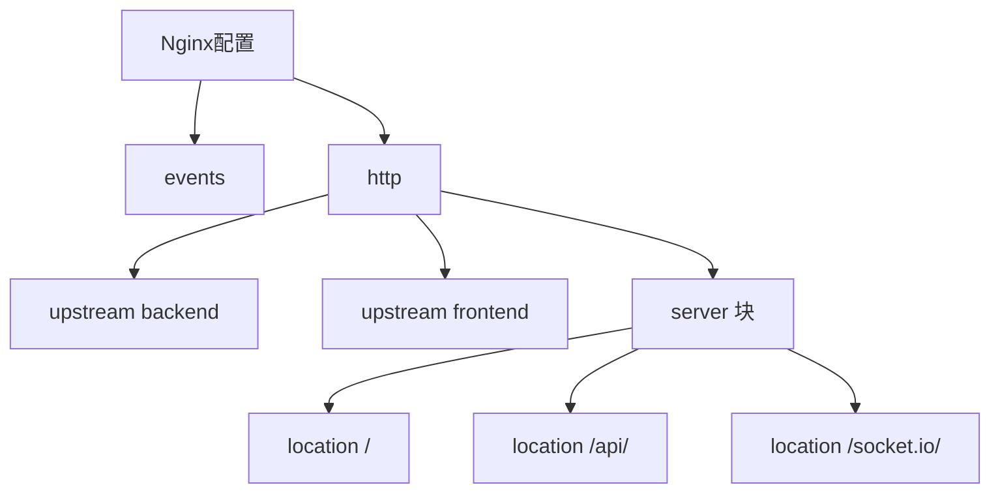
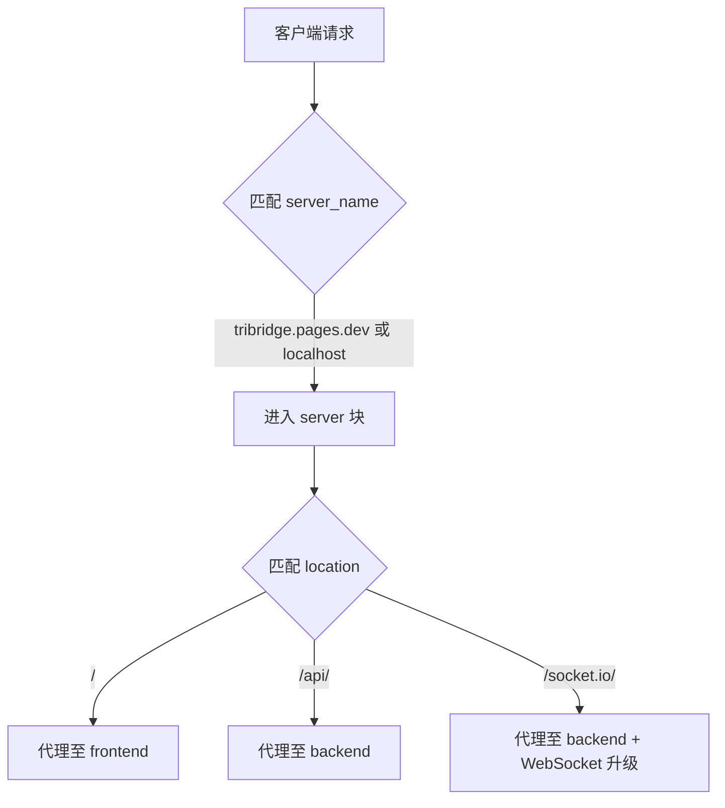

# Nginx反向代理配置

<cite>
**本文档引用文件**  
- [nginx.conf](file://nginx.conf)
</cite>

## 目录
1. [简介](#简介)
2. [核心配置结构](#核心配置结构)
3. [上游服务器定义](#上游服务器定义)
4. [HTTP服务器块配置](#http服务器块配置)
5. [位置块路由与代理规则](#位置块路由与代理规则)
6. [WebSocket与Socket.IO支持](#websocket与socketio支持)
7. [HTTPS安全配置建议](#https安全配置建议)
8. [请求头传递机制](#请求头传递机制)
9. [生产环境性能调优](#生产环境性能调优)

## 简介
本文档详细解析项目中Nginx反向代理的核心配置文件`nginx.conf`，重点阐述其作为前后端流量调度中枢的角色。该配置实现了静态资源、API接口和实时通信的统一入口管理，通过负载均衡与代理转发机制，构建了安全高效的Web服务架构。

## 核心配置结构
Nginx配置采用模块化分层设计，主要由`events`和`http`两大上下文构成。`events`块用于设置全局连接处理参数，而`http`块则封装了所有HTTP相关的服务逻辑，包括上游服务器定义、虚拟主机配置及代理规则。



**Diagram sources**
- [nginx.conf](file://nginx.conf#L1-L78)

**Section sources**
- [nginx.conf](file://nginx.conf#L1-L78)

## 上游服务器定义
在`http`上下文中，通过`upstream`指令定义了两个逻辑后端服务集群：`backend`和`frontend`。这种抽象层允许Nginx将请求分发到指定的服务实例，为未来扩展负载均衡策略（如轮询、IP哈希等）提供基础。

- `upstream backend` 指向运行在`backend:8000`的后端API服务
- `upstream frontend` 指向运行在`frontend:8080`的前端应用服务

此机制实现了服务发现与解耦，使得Nginx可根据域名或路径将流量精确路由至对应服务。

**Section sources**
- [nginx.conf](file://nginx.conf#L4-L10)

## HTTP服务器块配置
HTTP服务器块定义了一个监听80端口的虚拟主机，服务于`tribridge.pages.dev`和`localhost`两个域名。该配置作为所有外部请求的统一入口，承担着静态资源分发、API代理和WebSocket升级的综合职责。



**Diagram sources**
- [nginx.conf](file://nginx.conf#L12-L78)

**Section sources**
- [nginx.conf](file://nginx.conf#L12-L20)

## 位置块路由与代理规则
Nginx通过`location`指令实现基于路径的精细化路由控制，确保不同类型请求被正确转发。

### 前端静态资源代理
`location /` 规则捕获所有根路径请求，并将其代理至`frontend`上游服务。此配置适用于HTML、CSS、JS等静态资源的访问。

### 后端API请求代理
`location /api/` 规则专门处理以`/api/`开头的API请求，将其转发至`backend`服务。该路径前缀的设计实现了前后端接口的清晰分离。

**Section sources**
- [nginx.conf](file://nginx.conf#L22-L52)

## WebSocket与Socket.IO支持
为支持实时双向通信，Nginx配置了专门的WebSocket代理机制，尤其针对Socket.IO协议进行了优化。

### WebSocket协议升级
在`/api/`和`/socket.io/`位置块中，通过以下指令实现HTTP到WebSocket的协议升级：
- `proxy_http_version 1.1`：启用HTTP/1.1，支持持久连接
- `proxy_set_header Upgrade $http_upgrade`：传递客户端Upgrade头
- `proxy_set_header Connection "upgrade"`：指示代理建立隧道连接

### Socket.IO专用配置
`location /socket.io/` 提供了独立的代理规则，确保Socket.IO的长轮询和WebSocket连接均能正常工作。其包含完整的请求头传递设置，保障会话上下文的完整性。

**Section sources**
- [nginx.conf](file://nginx.conf#L40-L52)

## HTTPS安全配置建议
尽管当前配置中HTTPS部分被注释，但已提供完整的安全配置模板。建议在生产环境中启用并完善以下设置：

```nginx
server {
    listen 443 ssl;
    server_name tribridge.pages.dev;
    
    ssl_certificate /etc/nginx/ssl/cert.pem;
    ssl_certificate_key /etc/nginx/ssl/key.pem;
    ssl_protocols TLSv1.2 TLSv1.3;
    ssl_ciphers ECDHE-RSA-AES256-GCM-SHA512:DHE-RSA-AES256-GCM-SHA512;
    add_header Strict-Transport-Security "max-age=31536000" always;
}
```

此配置启用现代加密协议，禁用已知不安全的SSL版本，并通过HSTS头强制浏览器使用HTTPS连接。

**Section sources**
- [nginx.conf](file://nginx.conf#L55-L78)

## 请求头传递机制
代理过程中，Nginx通过`proxy_set_header`指令精确控制请求头的传递，确保后端服务能获取真实的客户端信息：

- `Host $host`：保留原始主机名
- `X-Real-IP $remote_addr`：传递真实客户端IP
- `X-Forwarded-For $proxy_add_x_forwarded_for`：记录代理链路中的IP序列
- `X-Forwarded-Proto $scheme`：标识原始请求协议（HTTP/HTTPS）

这些头信息对于日志记录、访问控制和安全审计至关重要。

**Section sources**
- [nginx.conf](file://nginx.conf#L25-L30, L37-L39, L45-L50)

## 生产环境性能调优
当前配置已包含基础性能参数，建议在生产环境中进一步优化：

### 工作进程连接数
`worker_connections 1024` 设置每个工作进程的最大并发连接数。根据服务器硬件资源，可适当调高此值以支持更大并发：

```nginx
events {
    worker_connections 4096;
    use epoll;
    multi_accept on;
}
```

### 其他优化建议
- 启用`gzip`压缩以减少传输体积
- 配置静态资源缓存（`expires`指令）
- 调整`keepalive_timeout`以优化长连接
- 使用`open_file_cache`提升静态文件读取效率

**Section sources**
- [nginx.conf](file://nginx.conf#L1-L2)