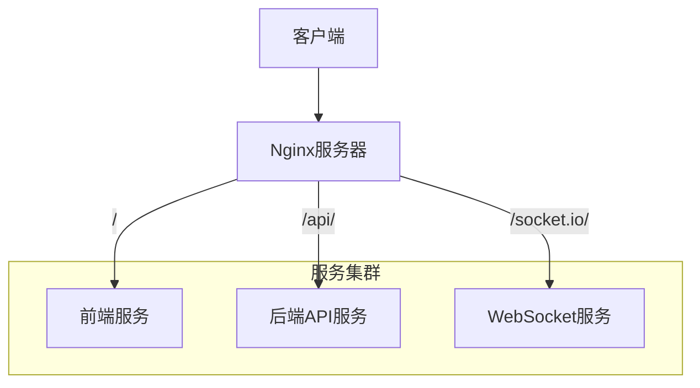
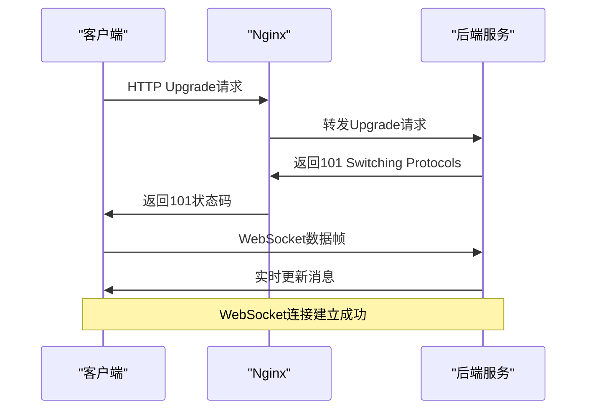
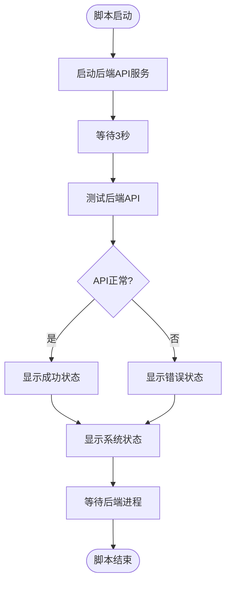
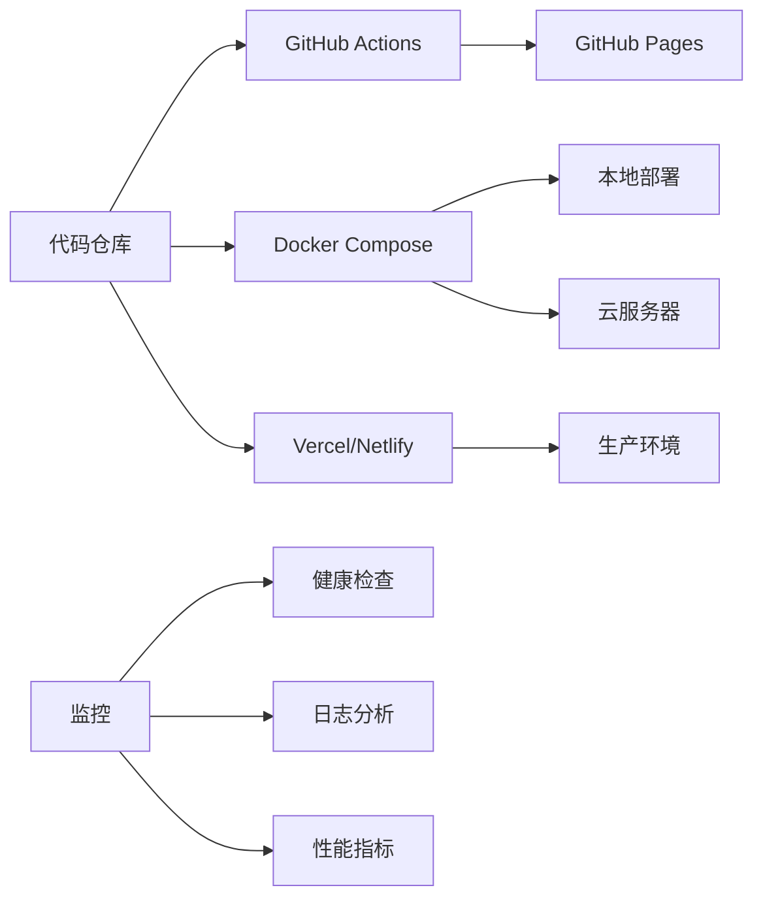

# 服务器配置

<cite>
**本文档引用的文件**  
- [nginx.conf](file://nginx.conf)
- [start-system.sh](file://start-system.sh)
- [backend/src/index-simple.ts](file://backend/src/index-simple.ts)
- [DEPLOYMENT_GUIDE.md](file://DEPLOYMENT_GUIDE.md)
- [README.md](file://README.md)
</cite>

## 目录
1. [简介](#简介)
2. [Nginx反向代理配置](#nginx反向代理配置)
3. [HTTPS与SSL证书配置](#https与ssl证书配置)
4. [WebSocket支持机制](#websocket支持机制)
5. [系统启动脚本分析](#系统启动脚本分析)
6. [生产环境优化建议](#生产环境优化建议)
7. [部署与监控](#部署与监控)
8. [结论](#结论)

## 简介
TriBridge跨境支付平台采用现代化技术栈构建，支持多链稳定币结算和完整的KYC/AML合规服务。本指南详细说明服务器核心配置，包括Nginx反向代理、HTTPS安全配置、WebSocket实时通信机制以及系统启动流程。文档还提供生产环境优化建议，确保系统在高并发场景下的稳定性与安全性。

## Nginx反向代理配置

Nginx作为TriBridge系统的入口网关，负责前端静态资源服务、API路由转发和WebSocket连接管理。配置文件通过`upstream`定义后端服务集群，并使用`location`规则实现精细化路由控制。



**Diagram sources**  
- [nginx.conf](file://nginx.conf#L1-L78)

**Section sources**  
- [nginx.conf](file://nginx.conf#L1-L78)

### Upstream定义
Nginx通过`upstream`指令定义后端服务地址，实现负载均衡和高可用：

```nginx
upstream backend {
    server backend:8000;
}

upstream frontend {
    server frontend:8080;
}
```

该配置将`backend`服务指向容器`backend`的8000端口，`frontend`服务指向容器`frontend`的8080端口，支持Docker容器化部署。

### Location路由规则
Nginx使用`location`指令实现基于路径的请求路由：

- `/`：默认路由，代理到前端服务，提供静态文件访问
- `/api/`：API路由，代理到后端服务，处理所有API请求
- `/socket.io/`：WebSocket路由，代理到后端服务，支持实时通信

每个`location`块都设置了标准的代理头信息，确保客户端真实IP和协议信息正确传递。

## HTTPS与SSL证书配置

Nginx配置文件中包含可选的HTTPS服务器块，用于启用SSL加密通信：

```nginx
# server {
#     listen 443 ssl;
#     server_name tribridge.pages.dev;
#     
#     ssl_certificate /etc/nginx/ssl/cert.pem;
#     ssl_certificate_key /etc/nginx/ssl/key.pem;
#     
#     location / {
#         proxy_pass http://frontend;
#         proxy_set_header Host $host;
#         proxy_set_header X-Real-IP $remote_addr;
#         proxy_set_header X-Forwarded-For $proxy_add_x_forwarded_for;
#         proxy_set_header X-Forwarded-Proto $scheme;
#     }
#     
#     location /api/ {
#         proxy_pass http://backend;
#         proxy_set_header Host $host;
#         proxy_set_header X-Real-IP $remote_addr;
#         proxy_set_header X-Forwarded-For $proxy_add_x_forwarded_for;
#         proxy_set_header X-Forwarded-Proto $scheme;
#     }
# }
```

**Section sources**  
- [nginx.conf](file://nginx.conf#L44-L78)

### SSL证书部署流程
1. **证书生成**：使用Let's Encrypt或商业CA获取SSL证书
2. **证书放置**：将`cert.pem`和`key.pem`文件放置在`/etc/nginx/ssl/`目录
3. **配置启用**：取消注释HTTPS服务器块，重启Nginx服务
4. **自动续期**：配置cron任务定期更新证书

生产环境中建议使用ACME协议实现证书自动签发和续期，确保服务连续性。

## WebSocket支持机制

TriBridge系统通过Socket.IO实现实时交易监控和通知功能。Nginx配置专门的`/socket.io/`路由来支持WebSocket连接升级：

```nginx
location /socket.io/ {
    proxy_pass http://backend;
    proxy_http_version 1.1;
    proxy_set_header Upgrade $http_upgrade;
    proxy_set_header Connection "upgrade";
    proxy_set_header Host $host;
    proxy_set_header X-Real-IP $remote_addr;
    proxy_set_header X-Forwarded-For $proxy_add_x_forwarded_for;
    proxy_set_header X-Forwarded-Proto $scheme;
}
```

**Section sources**  
- [nginx.conf](file://nginx.conf#L30-L43)
- [backend/src/index-simple.ts](file://backend/src/index-simple.ts#L100-L120)

### WebSocket连接流程


**Diagram sources**  
- [nginx.conf](file://nginx.conf#L30-L43)
- [backend/src/index-simple.ts](file://backend/src/index-simple.ts#L100-L120)

后端服务在`index-simple.ts`中初始化Socket.IO服务器，客户端通过`subscribe-transactions`事件订阅交易更新，实现用户交易状态的实时推送。

## 系统启动脚本分析

`start-system.sh`脚本负责启动TriBridge系统的后端服务，包含服务启动、健康检查和状态显示功能。



**Diagram sources**  
- [start-system.sh](file://start-system.sh#L1-L40)

**Section sources**  
- [start-system.sh](file://start-system.sh#L1-L40)
- [backend/src/index-simple.ts](file://backend/src/index-simple.ts#L150-L200)

### 启动流程详解
1. **服务启动**：进入`backend`目录，启动`dist/index-simple.js`服务，记录进程ID
2. **延迟等待**：等待3秒让后端服务完成初始化
3. **健康检查**：通过`curl`命令测试`/health`端点，验证服务可用性
4. **状态显示**：输出系统访问地址和可用API端点
5. **进程管理**：使用`wait`命令保持脚本运行，确保后端进程正常终止

脚本通过`BACKEND_PID`变量跟踪后端进程，支持优雅的进程管理和信号处理。

## 生产环境优化建议

为确保TriBridge系统在生产环境中的高性能和高可用性，建议实施以下优化措施：

### 连接数调整
```nginx
events {
    worker_connections 4096;
    use epoll;
    multi_accept on;
}
```

增加`worker_connections`值以支持更多并发连接，使用`epoll`事件模型提升I/O性能。

### 缓存策略
```nginx
location ~* \.(js|css|png|jpg|jpeg|gif|ico|svg)$ {
    expires 1y;
    add_header Cache-Control "public, immutable";
    proxy_cache_valid 200 1d;
}
```

对静态资源设置长期缓存，减少重复请求，提升前端加载速度。

### 安全加固
```nginx
server {
    # 隐藏服务器版本
    server_tokens off;
    
    # 安全头
    add_header X-Frame-Options DENY;
    add_header X-Content-Type-Options nosniff;
    add_header X-XSS-Protection "1; mode=block";
    
    # 限制请求
    limit_req_zone $binary_remote_addr zone=api:10m rate=10r/s;
    limit_req zone=api burst=20 nodelay;
}
```

**Section sources**  
- [nginx.conf](file://nginx.conf#L1-L10)
- [DEPLOYMENT_GUIDE.md](file://DEPLOYMENT_GUIDE.md#L50-L80)

实施请求速率限制，防止DDoS攻击，同时配置安全头增强客户端防护。

## 部署与监控

TriBridge系统支持多种部署方式，包括GitHub Pages、Docker容器和云平台部署。



**Diagram sources**  
- [DEPLOYMENT_GUIDE.md](file://DEPLOYMENT_GUIDE.md#L1-L190)
- [README.md](file://README.md#L1-L216)

**Section sources**  
- [DEPLOYMENT_GUIDE.md](file://DEPLOYMENT_GUIDE.md#L1-L190)
- [README.md](file://README.md#L1-L216)

部署后应定期检查API健康状态，监控Docker容器日志，并配置环境变量安全存储，避免敏感信息泄露。

## 结论
TriBridge系统的服务器配置通过Nginx反向代理实现了前后端分离、API路由和WebSocket支持。HTTPS配置确保通信安全，启动脚本提供了可靠的服务管理机制。生产环境优化建议涵盖了连接数、缓存和安全加固等方面，确保系统在高负载下的稳定运行。通过合理的部署和监控策略，可以构建一个高性能、高可用的跨境支付平台。