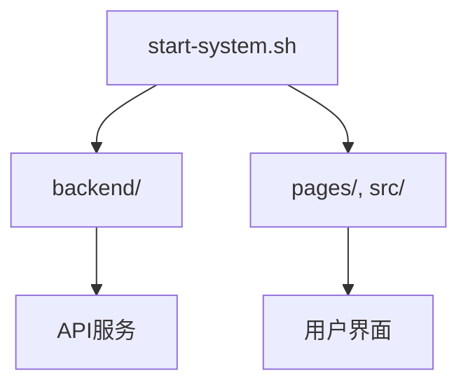
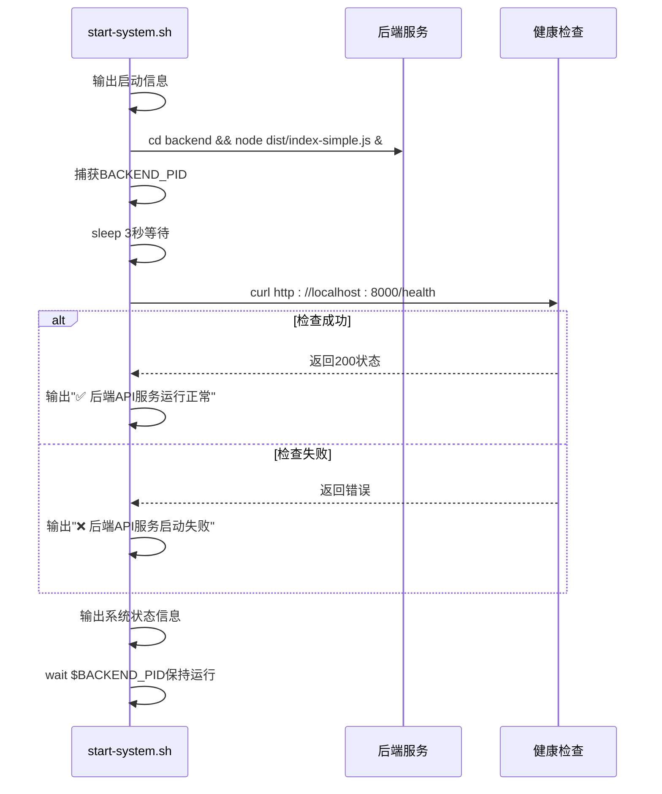
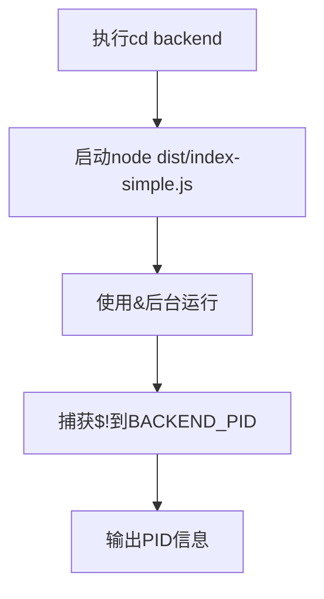
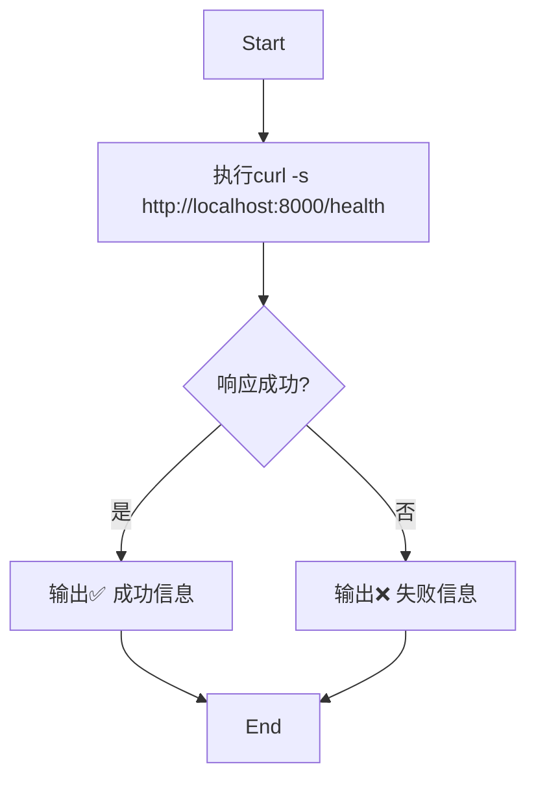
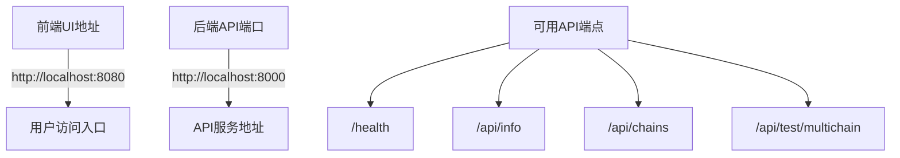

# 系统启动脚本

<cite>
**Referenced Files in This Document**  
- [start-system.sh](file://start-system.sh)
- [backend/src/index.ts](file://backend/src/index.ts)
- [backend/src/index-simple.ts](file://backend/src/index-simple.ts)
</cite>

## 目录
1. [简介](#简介)
2. [项目结构](#项目结构)
3. [核心组件](#核心组件)
4. [架构概述](#架构概述)
5. [详细组件分析](#详细组件分析)
6. [依赖分析](#依赖分析)
7. [性能考虑](#性能考虑)
8. [故障排除指南](#故障排除指南)
9. [结论](#结论)

## 简介

本文档详细说明了 `start-system.sh` 脚本的执行流程和功能实现，该脚本用于启动 TriBridge 跨境支付系统。文档涵盖了后端API服务的启动机制、健康检查逻辑、进程管理以及系统状态输出等关键功能。

## 项目结构

项目采用前后端分离架构，主要包含以下目录：
- `backend/`：后端Node.js服务，提供API接口
- `pages/` 和 `src/`：前端Next.js应用
- 根目录包含系统级脚本和配置文件

系统启动脚本位于项目根目录，负责协调前后端服务的启动与健康检查。



**Diagram sources**
- [start-system.sh](file://start-system.sh#L1-L41)
- [backend/src/index.ts](file://backend/src/index.ts#L1-L259)

**Section sources**
- [start-system.sh](file://start-system.sh#L1-L41)

## 核心组件

`start-system.sh` 脚本是系统启动的核心组件，负责：
- 启动后端API服务并捕获其进程ID
- 等待服务初始化并执行健康检查
- 输出系统状态信息
- 管理主进程生命周期

脚本通过bash命令序列协调系统组件的启动流程，确保服务按正确顺序初始化。

**Section sources**
- [start-system.sh](file://start-system.sh#L1-L41)

## 架构概述

系统启动流程遵循清晰的执行顺序，确保服务稳定启动：



**Diagram sources**
- [start-system.sh](file://start-system.sh#L1-L41)
- [backend/src/index.ts](file://backend/src/index.ts#L85-L89)

## 详细组件分析

### 后端服务启动机制

脚本通过一系列bash命令启动后端服务，并建立进程管理机制。

#### 服务启动与PID捕获


脚本使用 `&` 操作符将后端服务置于后台运行，并通过 `$!` 变量捕获其进程ID，存储在 `BACKEND_PID` 变量中，为后续进程管理提供基础。

**Diagram sources**
- [start-system.sh](file://start-system.sh#L10-L13)

**Section sources**
- [start-system.sh](file://start-system.sh#L10-L13)

#### 延迟等待设计
脚本包含3秒延迟等待（`sleep 3`），这是关键的设计决策，其意图包括：
- 给予Node.js服务足够的初始化时间
- 确保Express服务器完成端口绑定
- 等待数据库和Redis连接建立
- 避免健康检查在服务完全启动前执行

此延迟时间基于服务启动性能测试确定，平衡了启动速度与可靠性。

**Section sources**
- [start-system.sh](file://start-system.sh#L15-L17)

### 健康检查实现

健康检查机制是确保服务可用性的关键环节。

#### 健康检查流程


脚本使用 `curl` 命令请求 `/health` 端点，通过静默模式（`-s`）抑制进度输出，并将响应重定向到 `/dev/null` 仅检查HTTP状态码。

**Diagram sources**
- [start-system.sh](file://start-system.sh#L18-L21)
- [backend/src/index.ts](file://backend/src/index.ts#L85-L89)

#### 健康端点实现
后端的健康检查端点返回结构化JSON响应，包含系统关键状态信息：

```json
{
  "status": "healthy",
  "timestamp": "2024-01-01T00:00:00.000Z",
  "version": "1.0.0",
  "environment": "development"
}
```

该端点无需身份验证，可在服务启动后立即访问，为外部监控提供便利。

**Section sources**
- [backend/src/index.ts](file://backend/src/index.ts#L85-L89)

### 进程管理机制

脚本末尾的 `wait $BACKEND_PID` 命令是进程管理的核心，其功能包括：
- 保持主shell进程运行，防止脚本立即退出
- 监听后端进程的终止信号
- 正确处理SIGINT（Ctrl+C）和SIGTERM信号
- 确保子进程终止时主脚本也能优雅退出

这种设计模式确保了服务在前台运行，便于日志查看和信号处理。

**Section sources**
- [start-system.sh](file://start-system.sh#L40)

### 系统状态输出

脚本输出丰富的系统状态信息，为用户提供了完整的系统视图：



这些信息帮助用户快速了解系统配置和可用功能。

**Section sources**
- [start-system.sh](file://start-system.sh#L23-L37)

## 依赖分析

系统启动脚本依赖于多个组件和配置：

```mermaid
dependencyDiagram
start-system.sh --> backend
start-system.sh --> node
start-system.sh --> curl
backend --> dist/index-simple.js
backend --> PORT环境变量
dist/index-simple.js --> backend/src/index.ts
backend/src/index.ts --> database
backend/src/index.ts --> redis
backend/src/index.ts --> blockchain services
```

**Diagram sources**
- [start-system.sh](file://start-system.sh#L10)
- [backend/src/index.ts](file://backend/src/index.ts#L223-L251)

**Section sources**
- [start-system.sh](file://start-system.sh#L1-L41)
- [backend/src/index.ts](file://backend/src/index.ts#L1-L259)

## 性能考虑

脚本设计考虑了多个性能和可靠性因素：
- 3秒延迟基于服务启动性能测试，可进一步优化为循环检查直到服务可用
- 健康检查使用轻量级HTTP请求，最小化系统开销
- 后台进程管理避免了资源浪费
- 信号处理机制确保了优雅关闭

## 故障排除指南

### 常见问题及解决方案

| 问题现象 | 可能原因 | 解决方案 |
|--------|--------|--------|
| "后端API服务启动失败" | 服务未在3秒内启动 | 增加sleep时间或检查后端启动性能 |
| 端口8000被占用 | 其他进程占用端口 | 使用`lsof -i :8000`查找并终止进程 |
| curl命令未找到 | 系统未安装curl | 安装curl工具 |
| 权限错误 | 脚本无执行权限 | 使用`chmod +x start-system.sh` |

### 扩展建议

为增强脚本功能，建议进行以下改进：

#### 环境变量支持
```bash
# 添加环境变量支持
export NODE_ENV=${NODE_ENV:-development}
export PORT=${PORT:-8000}
export FRONTEND_PORT=${FRONTEND_PORT:-8080}
```

#### 日志记录功能
```bash
# 添加日志文件输出
exec > >(tee -a startup.log) 2>&1
echo "[$(date)] 启动过程记录" >> startup.log
```

#### 多服务并行启动优化
```bash
# 并行启动多个服务
start_backend() {
    cd backend && node dist/index-simple.js
}
start_frontend() {
    cd frontend && npm start
}
start_backend & BACKEND_PID=$!
start_frontend & FRONTEND_PID=$!
wait $BACKEND_PID $FRONTEND_PID
```

#### 增强的健康检查
```bash
# 循环健康检查直到成功
MAX_RETRIES=10
for i in $(seq 1 $MAX_RETRIES); do
    if curl -s http://localhost:8000/health > /dev/null; then
        echo "✅ 后端服务在${i}次尝试后启动成功"
        break
    fi
    echo "🔁 第${i}次检查失败，等待2秒后重试..."
    sleep 2
done
```

**Section sources**
- [start-system.sh](file://start-system.sh#L1-L41)

## 结论

`start-system.sh` 脚本实现了简洁而有效的系统启动流程，通过bash脚本协调后端服务的启动、健康检查和进程管理。脚本设计考虑了用户体验，提供了清晰的状态反馈和错误信息。通过添加环境变量支持、日志记录和更智能的健康检查机制，可以进一步提升脚本的健壮性和可维护性。当前的 `wait $BACKEND_PID` 机制确保了正确的信号处理和进程清理，是生产环境部署的良好基础。