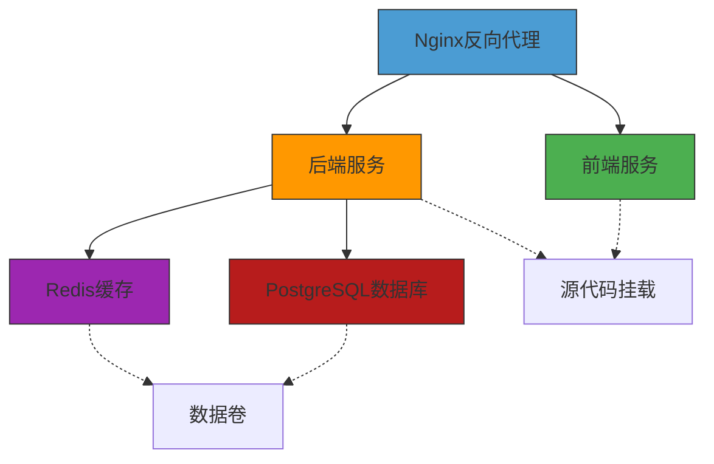
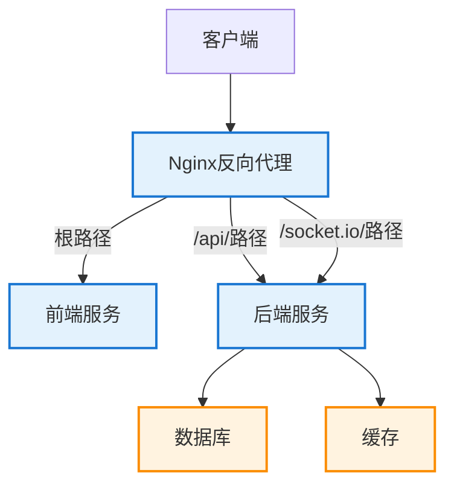
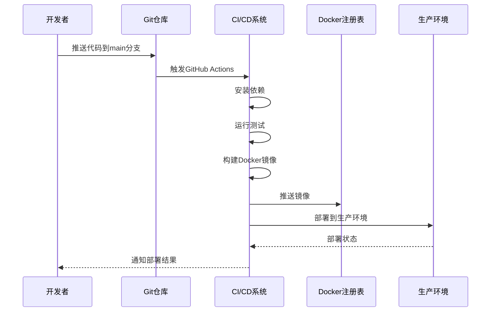

# 部署与运维

<cite>
**本文档引用的文件**   
- [Dockerfile](file://Dockerfile)
- [docker-compose.yml](file://docker-compose.yml)
- [netlify.toml](file://netlify.toml)
- [nginx.conf](file://nginx.conf)
- [DEPLOYMENT_GUIDE.md](file://DEPLOYMENT_GUIDE.md)
</cite>

## 目录
1. [简介](#简介)
2. [多阶段Docker构建策略](#多阶段docker构建策略)
3. [Docker Compose服务编排](#docker-compose服务编排)
4. [Netlify部署配置](#netlify部署配置)
5. [Nginx反向代理配置](#nginx反向代理配置)
6. [CI/CD流水线](#cicd流水线)
7. [生产环境监控建议](#生产环境监控建议)
8. [结论](#结论)

## 简介
本文档为TriBridge跨境支付平台提供从本地开发到生产环境的完整部署与运维权威指南。文档详细说明了容器化部署、服务编排、云平台配置、反向代理设置以及持续集成/持续部署流程，旨在为开发和运维团队提供全面的技术参考。

## 多阶段Docker构建策略

Dockerfile采用多阶段构建策略，将前端构建、后端编译和生产镜像优化分离到不同的构建阶段，有效减小最终镜像体积并提高构建效率。

构建过程分为三个阶段：
1. **前端构建阶段**：使用Node 18 Alpine镜像，安装前端依赖并执行构建命令生成静态资源
2. **后端构建阶段**：独立构建后端服务，编译TypeScript代码生成生产就绪的JavaScript文件
3. **生产运行阶段**：基于最小化基础镜像，仅安装生产依赖，合并前端构建产物和后端编译结果

该策略确保最终镜像不包含开发依赖和源代码，提高了安全性和性能。

**Section sources**
- [Dockerfile](file://Dockerfile#L1-L72)

## Docker Compose服务编排

docker-compose.yml文件定义了完整的本地开发和测试环境，包含前端、后端、数据库、缓存和反向代理等服务。

服务编排特点：
- **前端服务**：映射源代码目录实现热重载，便于开发调试
- **后端服务**：依赖数据库和Redis服务，配置生产环境变量
- **PostgreSQL数据库**：持久化数据存储，通过卷挂载保持数据
- **Redis缓存**：提供会话管理和临时数据存储
- **Nginx反向代理**：统一入口，处理静态资源和API路由

服务间通过depends_on指令建立启动依赖关系，确保服务按正确顺序启动。

**Diagram sources**
- [docker-compose.yml](file://docker-compose.yml#L1-L74)

**Section sources**
- [docker-compose.yml](file://docker-compose.yml#L1-L74)

## Netlify部署配置

netlify.toml文件配置了Netlify平台的部署参数，支持前端应用的自动化部署。

主要配置项：
- **构建命令**：指定"next build"作为构建命令
- **发布目录**：设置".next"为发布目录
- **环境变量**：配置Node版本和NPM标志
- **插件集成**：启用Next.js官方插件以获得最佳支持
- **重定向规则**：将API请求代理到Netlify函数，实现SSR支持
- **头部设置**：为特定文件类型设置正确的Content-Type

该配置确保Next.js应用能够正确构建和部署，并处理静态资源和动态API路由。

**Section sources**
- [netlify.toml](file://netlify.toml#L1-L24)

## Nginx反向代理配置

nginx.conf文件定义了Nginx服务器的反向代理行为，为应用提供统一的访问入口。

配置特点：
- **上游服务器**：定义前端和后端服务的上游地址
- **HTTP监听**：在80端口监听请求
- **静态资源代理**：将根路径请求代理到前端服务
- **API路由代理**：将/api/路径请求代理到后端服务
- **WebSocket支持**：配置Socket.IO连接的代理参数
- **HTTPS预留**：注释部分提供HTTPS配置模板

该配置实现了前后端分离架构下的统一访问，同时支持实时通信功能。

**Diagram sources**
- [nginx.conf](file://nginx.conf#L1-L78)

**Section sources**
- [nginx.conf](file://nginx.conf#L1-L78)

## CI/CD流水线

DEPLOYMENT_GUIDE.md文档详细描述了CI/CD流水线的配置和执行流程。

流水线关键环节：
- **自动化测试**：在构建阶段运行单元测试和集成测试
- **镜像构建**：使用Docker多阶段构建生成生产镜像
- **部署触发**：通过GitHub Actions监听main分支的推送事件
- **多平台支持**：提供GitHub Pages、Vercel、Netlify等多种部署选项
- **环境管理**：区分开发、测试和生产环境的配置

部署流程包括快速部署、配置管理、平台选择、监控和安全设置等完整环节，确保应用能够可靠地交付到生产环境。

**Diagram sources**
- [DEPLOYMENT_GUIDE.md](file://DEPLOYMENT_GUIDE.md#L1-L190)

**Section sources**
- [DEPLOYMENT_GUIDE.md](file://DEPLOYMENT_GUIDE.md#L1-L190)

## 生产环境监控建议

为确保生产环境的稳定运行，建议实施以下监控措施：

### 日志收集
- 集中收集前端和后端日志
- 使用结构化日志格式便于分析
- 设置日志轮转策略防止磁盘溢出

### 健康检查
- 实现/api/health端点
- 配置Docker HEALTHCHECK指令
- 集成到负载均衡器的健康检查机制

### 性能指标跟踪
- 监控API响应时间和吞吐量
- 跟踪数据库查询性能
- 监测缓存命中率和内存使用

### 告警机制
- 设置关键指标的告警阈值
- 配置多通道通知（邮件、短信、即时通讯）
- 建立事件响应流程

这些监控措施有助于及时发现和解决生产环境中的问题，确保系统的高可用性。

**Section sources**
- [DEPLOYMENT_GUIDE.md](file://DEPLOYMENT_GUIDE.md#L1-L190)
- [Dockerfile](file://Dockerfile#L65-L68)

## 结论
本文档全面介绍了TriBridge跨境支付平台的部署与运维方案。通过多阶段Docker构建、Docker Compose服务编排、Netlify云部署、Nginx反向代理和CI/CD流水线的综合应用，实现了从开发到生产的完整交付流程。建议运维团队根据实际环境需求，结合文档中的配置示例和最佳实践，建立可靠的部署和监控体系，确保应用的稳定运行。