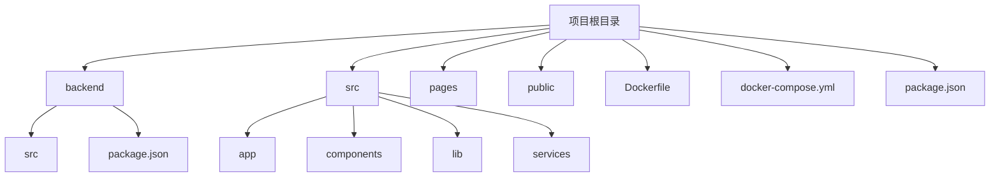
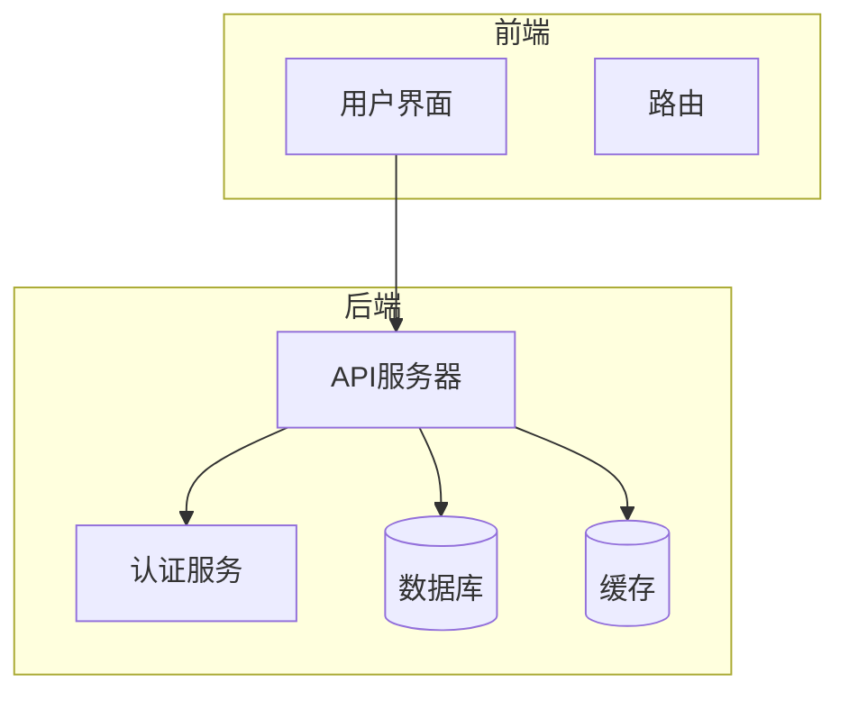
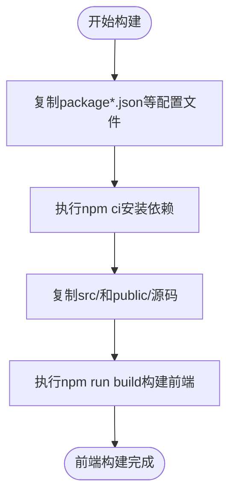
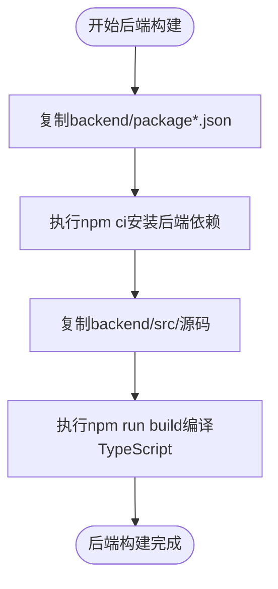
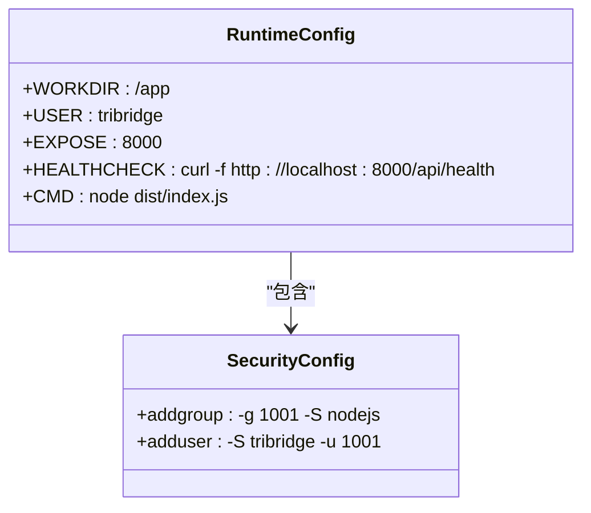
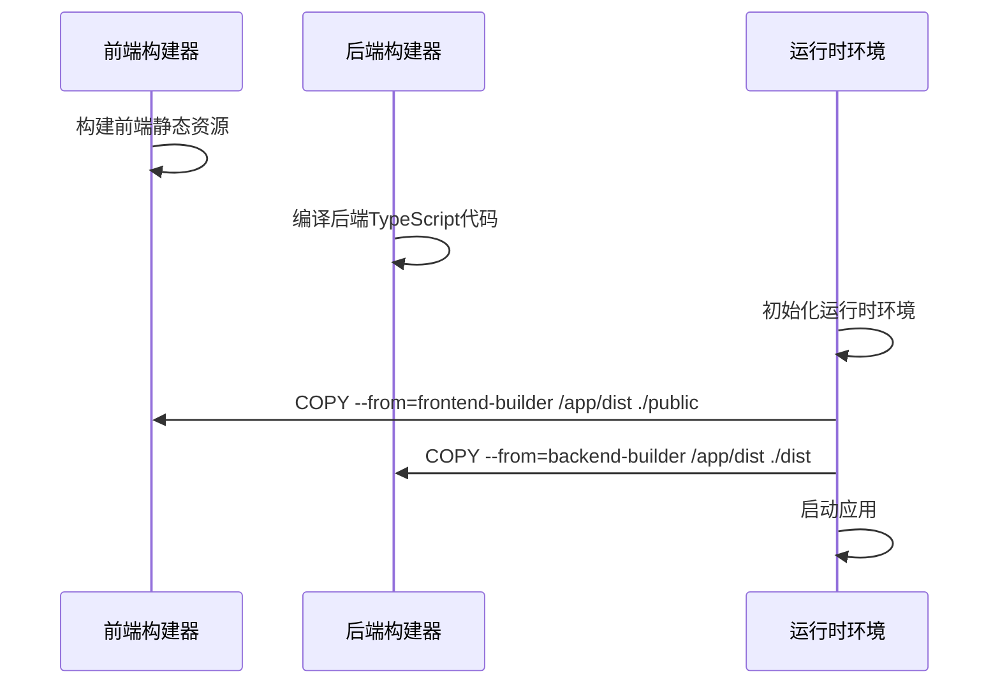
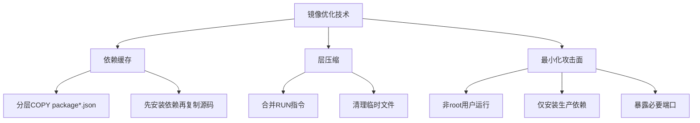
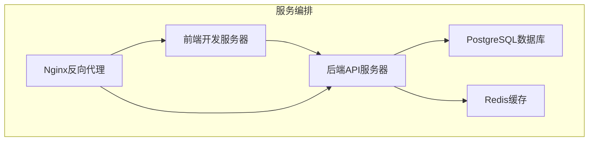
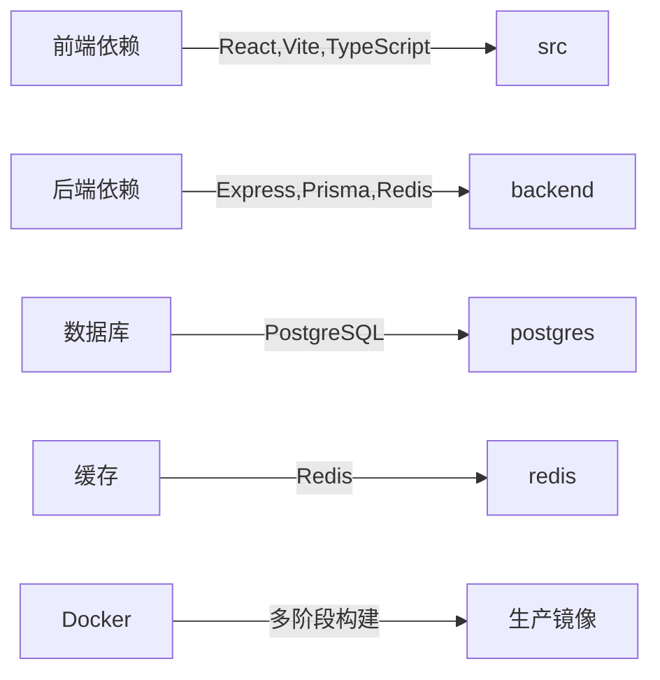

# Docker配置

<cite>
**本文档引用文件**   
- [Dockerfile](file://Dockerfile)
- [docker-compose.yml](file://docker-compose.yml)
- [backend/package.json](file://backend/package.json)
- [backend/src/index.ts](file://backend/src/index.ts)
- [backend/src/services/database.ts](file://backend/src/services/database.ts)
- [backend/src/services/redis.ts](file://backend/src/services/redis.ts)
</cite>

## 目录
1. [简介](#简介)
2. [项目结构](#项目结构)
3. [核心组件](#核心组件)
4. [架构概述](#架构概述)
5. [详细组件分析](#详细组件分析)
6. [依赖分析](#依赖分析)
7. [性能考虑](#性能考虑)
8. [故障排除指南](#故障排除指南)
9. [结论](#结论)
10. [附录](#附录) (如需要)

## 简介
本项目为TriBridge跨境支付平台，采用前后端分离架构，前端基于React + Vite + TypeScript构建，后端采用Node.js + Express + TypeScript实现。系统支持多链区块链集成（以太坊、TRON、BSC）、KYC/AML合规服务、PostgreSQL数据库集成、Redis缓存以及WebSocket实时更新。通过Docker多阶段构建策略实现高效的容器化部署。

## 项目结构

**图示来源**
- [Dockerfile](file://Dockerfile#L1-L72)
- [docker-compose.yml](file://docker-compose.yml#L1-L74)

**本节来源**
- [Dockerfile](file://Dockerfile#L1-L72)
- [docker-compose.yml](file://docker-compose.yml#L1-L74)

## 核心组件

**本节来源**
- [Dockerfile](file://Dockerfile#L1-L72)
- [docker-compose.yml](file://docker-compose.yml#L1-L74)

## 架构概述

**图示来源**
- [Dockerfile](file://Dockerfile#L1-L72)
- [docker-compose.yml](file://docker-compose.yml#L1-L74)

## 详细组件分析

### 前端构建阶段分析
前端构建阶段使用node:18-alpine作为基础镜像，通过多阶段构建优化生产环境镜像大小。构建过程分为依赖安装和源码构建两个步骤，有效利用Docker缓存机制。

**图示来源**
- [Dockerfile](file://Dockerfile#L5-L23)

**本节来源**
- [Dockerfile](file://Dockerfile#L5-L23)
- [package.json](file://package.json#L1-L84)

### 后端构建阶段分析
后端构建阶段同样使用node:18-alpine作为基础镜像，专注于TypeScript编译和生产依赖分离。通过独立的构建阶段确保开发依赖不会进入生产镜像。

**图示来源**
- [Dockerfile](file://Dockerfile#L25-L38)
- [backend/package.json](file://backend/package.json#L1-L84)

**本节来源**
- [Dockerfile](file://Dockerfile#L25-L38)
- [backend/package.json](file://backend/package.json#L1-L84)

### 运行时阶段分析
运行时阶段采用最小化镜像策略，仅包含生产所需依赖和编译后的代码。通过创建非root用户提高安全性，并配置健康检查确保服务可用性。

**图示来源**
- [Dockerfile](file://Dockerfile#L40-L72)
- [backend/src/index.ts](file://backend/src/index.ts#L1-L258)

**本节来源**
- [Dockerfile](file://Dockerfile#L40-L72)
- [backend/src/index.ts](file://backend/src/index.ts#L1-L258)

### 多阶段构建上下文传递机制
多阶段构建通过COPY --from指令实现构建产物的精确传递，避免不必要的文件复制，优化镜像大小和安全性。

**图示来源**
- [Dockerfile](file://Dockerfile#L48-L52)
- [backend/src/index.ts](file://backend/src/index.ts#L1-L258)

**本节来源**
- [Dockerfile](file://Dockerfile#L48-L52)

### 镜像优化技术分析
镜像优化采用依赖缓存、层压缩和最小化攻击面等技术，确保生产环境的安全性和性能。

**图示来源**
- [Dockerfile](file://Dockerfile#L40-L72)
- [backend/package.json](file://backend/package.json#L1-L84)

**本节来源**
- [Dockerfile](file://Dockerfile#L40-L72)
- [backend/package.json](file://backend/package.json#L1-L84)

### Docker Compose编排分析
Docker Compose配置实现了完整的开发环境编排，包括前端、后端、数据库、缓存和反向代理服务。

**图示来源**
- [docker-compose.yml](file://docker-compose.yml#L1-L74)
- [Dockerfile](file://Dockerfile#L1-L72)

**本节来源**
- [docker-compose.yml](file://docker-compose.yml#L1-L74)

## 依赖分析

**图示来源**
- [backend/package.json](file://backend/package.json#L1-L84)
- [package.json](file://package.json#L1-L84)

**本节来源**
- [backend/package.json](file://backend/package.json#L1-L84)
- [package.json](file://package.json#L1-L84)

## 性能考虑
[性能优化建议和最佳实践]

## 故障排除指南

**本节来源**
- [Dockerfile](file://Dockerfile#L1-L72)
- [docker-compose.yml](file://docker-compose.yml#L1-L74)

## 结论
[总结和建议]