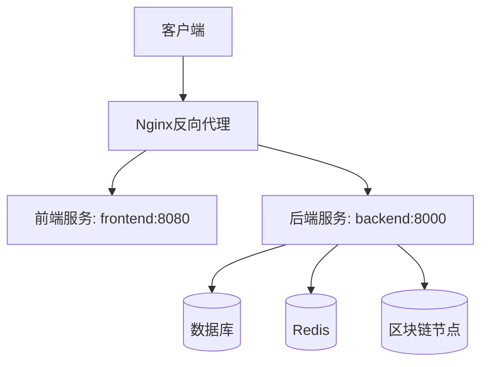
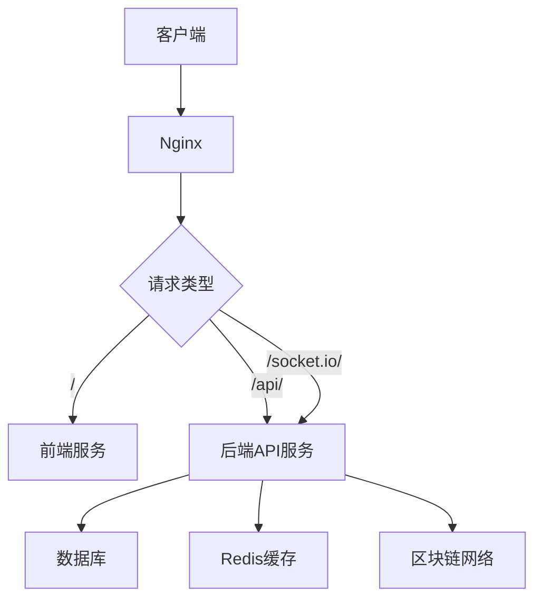
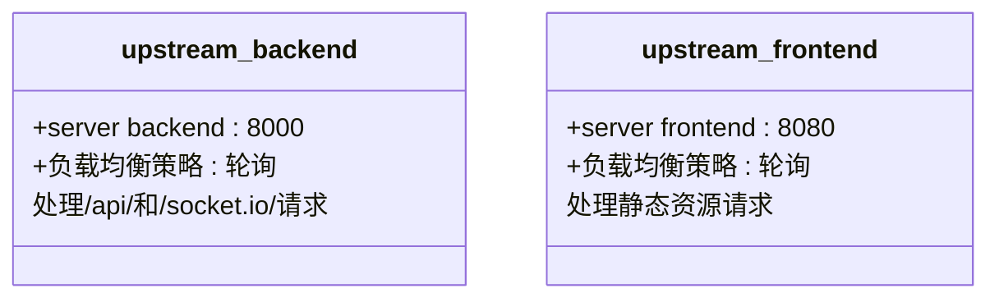
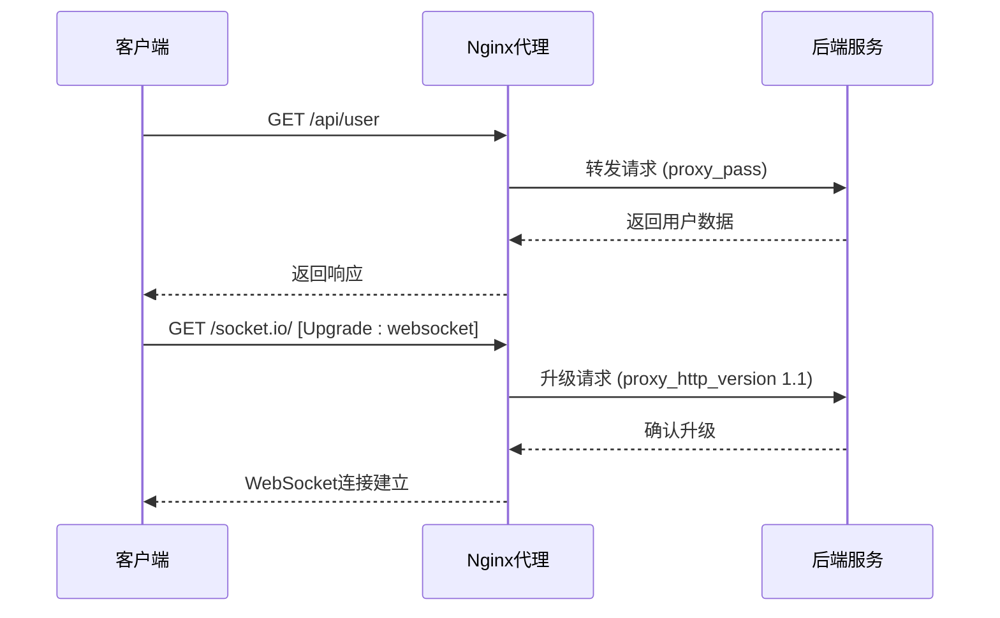
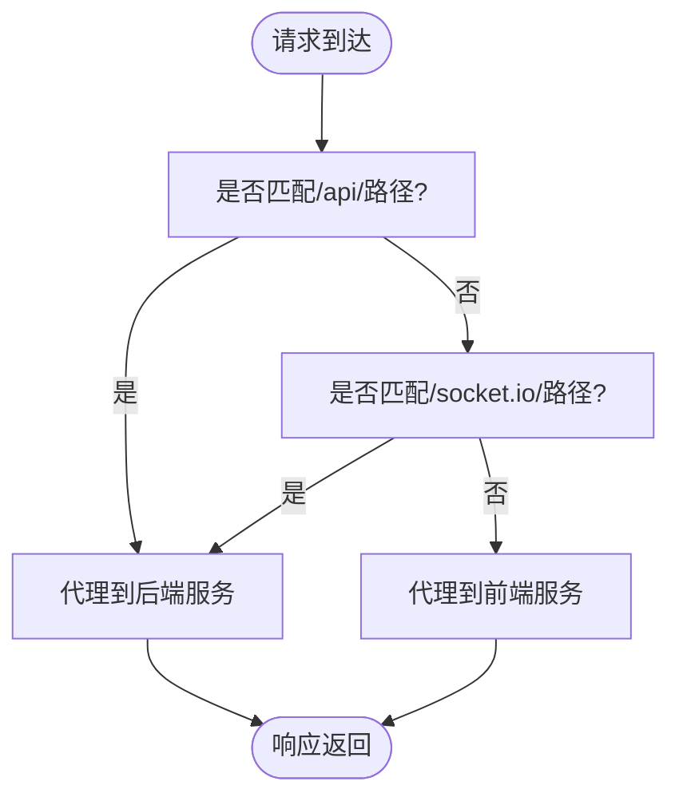
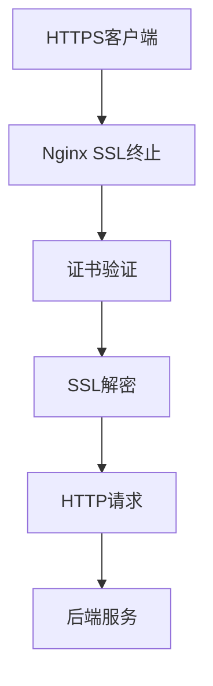
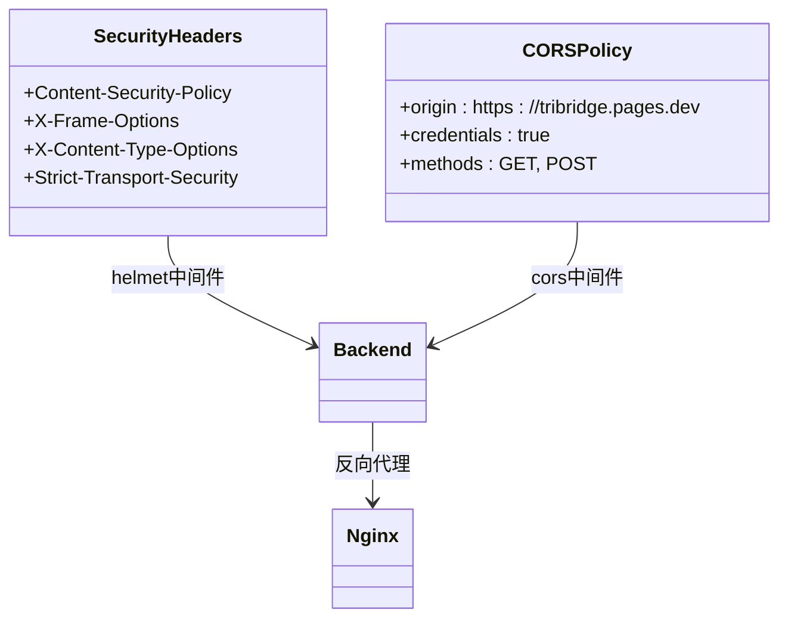
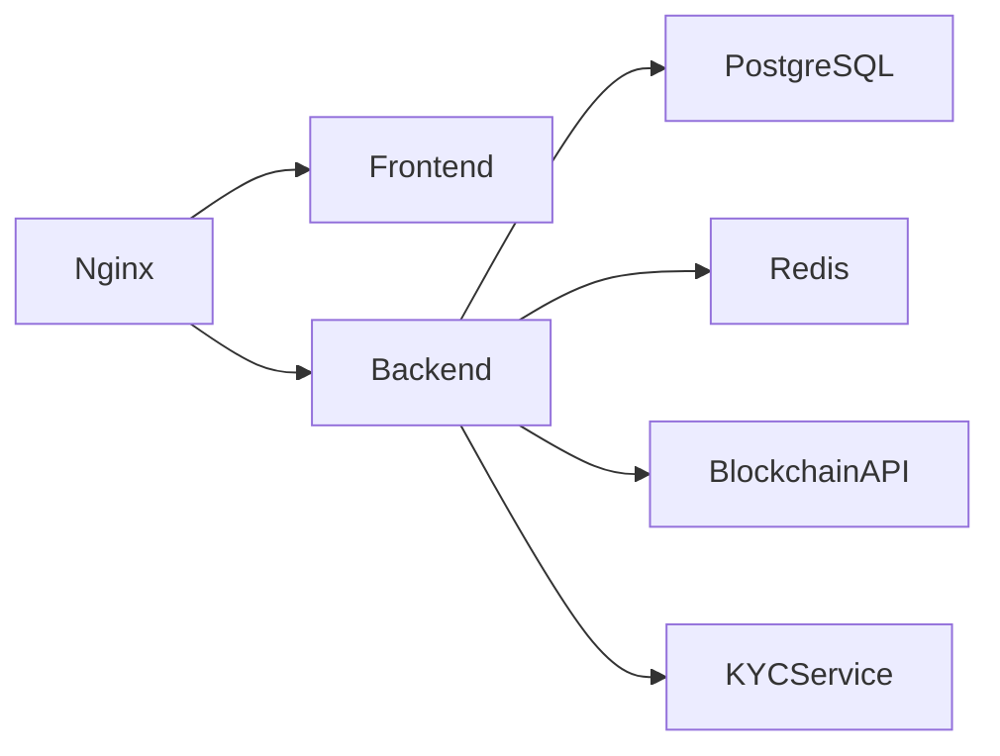

# 反向代理

<cite>
**本文档引用文件**  
- [nginx.conf](file://nginx.conf)
- [backend/src/index.ts](file://backend/src/index.ts)
- [backend/src/middleware/errorHandler.ts](file://backend/src/middleware/errorHandler.ts)
- [DEPLOYMENT_GUIDE.md](file://DEPLOYMENT_GUIDE.md)
</cite>

## 目录
1. [项目结构](#项目结构)
2. [核心组件](#核心组件)
3. [架构概述](#架构概述)
4. [详细组件分析](#详细组件分析)
5. [依赖分析](#依赖分析)
6. [性能考虑](#性能考虑)
7. [故障排查指南](#故障排查指南)

## 项目结构

本项目采用前后端分离架构，包含独立的前端（React/Vite）和后端（Node.js/Express）服务。Nginx作为反向代理服务器，负责将请求路由到相应的服务。

**图示来源**  
- [nginx.conf](file://nginx.conf#L1-L78)
- [VERSION.md](file://VERSION.md#L2-L52)

**本节来源**  
- [nginx.conf](file://nginx.conf#L1-L78)
- [VERSION.md](file://VERSION.md#L2-L52)

## 核心组件

Nginx配置文件定义了upstream块，分别指向前端和后端服务。upstream backend指向运行在8000端口的后端API服务，upstream frontend指向运行在8080端口的前端静态文件服务。server块处理HTTP请求，根据location指令将请求代理到相应服务。

**本节来源**  
- [nginx.conf](file://nginx.conf#L5-L15)

## 架构概述

系统采用分层架构，Nginx作为边缘代理处理所有入站请求。静态资源请求被代理到前端服务，API请求被代理到后端服务。后端服务通过WebSocket实现实时通信，支持Socket.IO协议。

**图示来源**  
- [nginx.conf](file://nginx.conf#L17-L78)
- [backend/src/index.ts](file://backend/src/index.ts#L39-L252)

## 详细组件分析

### 负载均衡机制分析

Nginx的upstream模块为backend和frontend服务提供了负载均衡功能。当前配置采用默认的轮询算法，将请求均匀分配到上游服务器。

**图示来源**  
- [nginx.conf](file://nginx.conf#L5-L15)

**本节来源**  
- [nginx.conf](file://nginx.conf#L5-L15)

### 请求处理流程分析

server块定义了HTTP请求的处理逻辑，通过location指令实现精确的路径匹配和路由转发。

#### 静态资源代理
根路径(/)的请求被代理到前端服务，用于提供静态HTML、CSS和JavaScript文件。

#### API路由转发
/api/路径的请求被代理到后端服务，实现RESTful API调用。

#### WebSocket升级处理
通过设置proxy_http_version为1.1，并配置Upgrade和Connection头，支持WebSocket协议升级，实现全双工通信。

**图示来源**  
- [nginx.conf](file://nginx.conf#L25-L78)
- [backend/src/index.ts](file://backend/src/index.ts#L165-L189)

**本节来源**  
- [nginx.conf](file://nginx.conf#L25-L78)
- [backend/src/index.ts](file://backend/src/index.ts#L165-L189)

### 路径匹配策略分析

location指令采用前缀匹配策略，实现不同路径的特殊处理：

- `/`：匹配所有请求，作为默认处理规则
- `/api/`：精确匹配API请求，代理到后端服务
- `/socket.io/`：专门处理WebSocket连接，确保实时通信正常工作

**图示来源**  
- [nginx.conf](file://nginx.conf#L35-L78)

**本节来源**  
- [nginx.conf](file://nginx.conf#L35-L78)

### SSL终止配置分析

配置文件中包含注释的HTTPS配置块，展示了SSL终止的实现方式。Nginx在边缘层处理SSL解密，将HTTP请求转发给后端服务，减轻后端服务器的加密负担。

**图示来源**  
- [nginx.conf](file://nginx.conf#L60-L78)

**本节来源**  
- [nginx.conf](file://nginx.conf#L60-L78)

### CORS兼容性与安全头分析

结合DEPLOYMENT_GUIDE.md中的安全建议，后端服务配置了CORS策略和安全头，确保跨域请求的安全性。

**图示来源**  
- [DEPLOYMENT_GUIDE.md](file://DEPLOYMENT_GUIDE.md#L130-L138)
- [backend/src/index.ts](file://backend/src/index.ts#L45-L55)

**本节来源**  
- [DEPLOYMENT_GUIDE.md](file://DEPLOYMENT_GUIDE.md#L130-L138)
- [backend/src/index.ts](file://backend/src/index.ts#L45-L55)

## 依赖分析

系统组件间存在明确的依赖关系，Nginx依赖于前端和后端服务的正常运行，后端服务依赖于数据库、缓存和区块链网络。

**图示来源**  
- [nginx.conf](file://nginx.conf#L5-L15)
- [backend/src/index.ts](file://backend/src/index.ts#L1-L258)

**本节来源**  
- [nginx.conf](file://nginx.conf#L5-L15)
- [backend/src/index.ts](file://backend/src/index.ts#L1-L258)

## 性能考虑

### worker_connections调优

events块中的worker_connections设置为1024，定义了每个worker进程的最大并发连接数。此值可根据服务器性能和预期负载进行调整。

### 静态资源缓存策略

Nginx自动缓存代理的静态资源，减少对前端服务的重复请求。建议在生产环境中配置适当的缓存头，提高静态资源加载性能。

**本节来源**  
- [nginx.conf](file://nginx.conf#L1-L3)

## 故障排查指南

### 502 Bad Gateway解决方案
- 检查后端服务是否正常运行
- 验证upstream配置中的服务器地址和端口
- 检查网络连接和防火墙设置
- 查看Nginx错误日志获取详细信息

### WebSocket连接失败解决方案
- 确认Upgrade和Connection头正确配置
- 检查proxy_http_version是否设置为1.1
- 验证后端WebSocket服务是否正常启动
- 检查CORS配置是否允许WebSocket连接

### SSL握手错误解决方案
- 验证SSL证书文件路径和权限
- 检查证书和私钥是否匹配
- 确认SSL协议版本和加密套件配置
- 验证域名与证书CN或SAN匹配

**本节来源**  
- [nginx.conf](file://nginx.conf#L44-L78)
- [backend/src/middleware/errorHandler.ts](file://backend/src/middleware/errorHandler.ts#L8-L85)