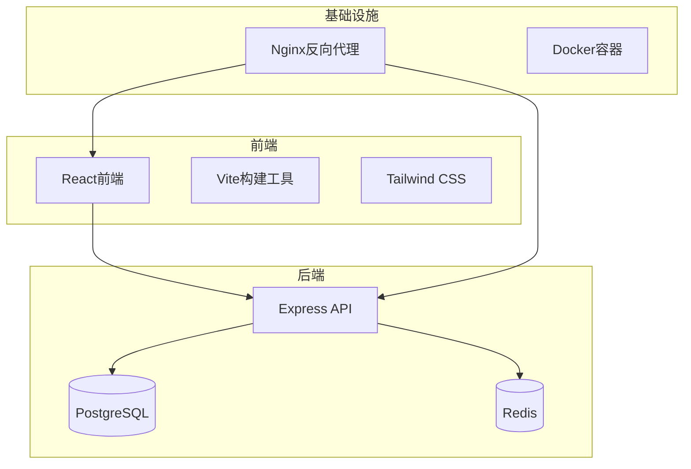
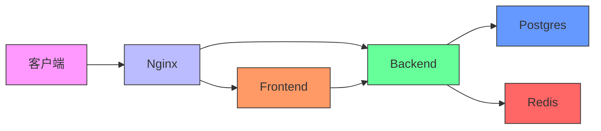
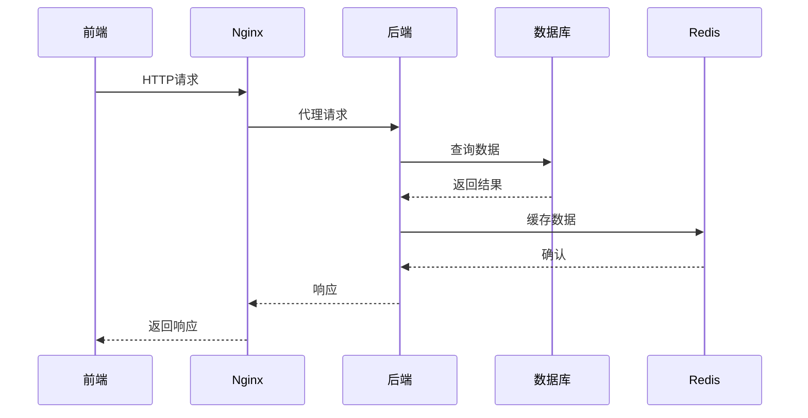
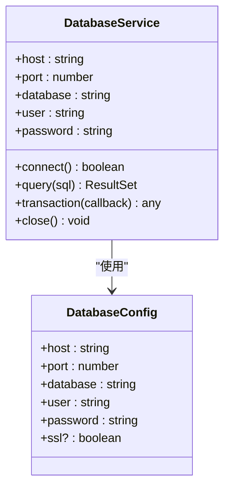
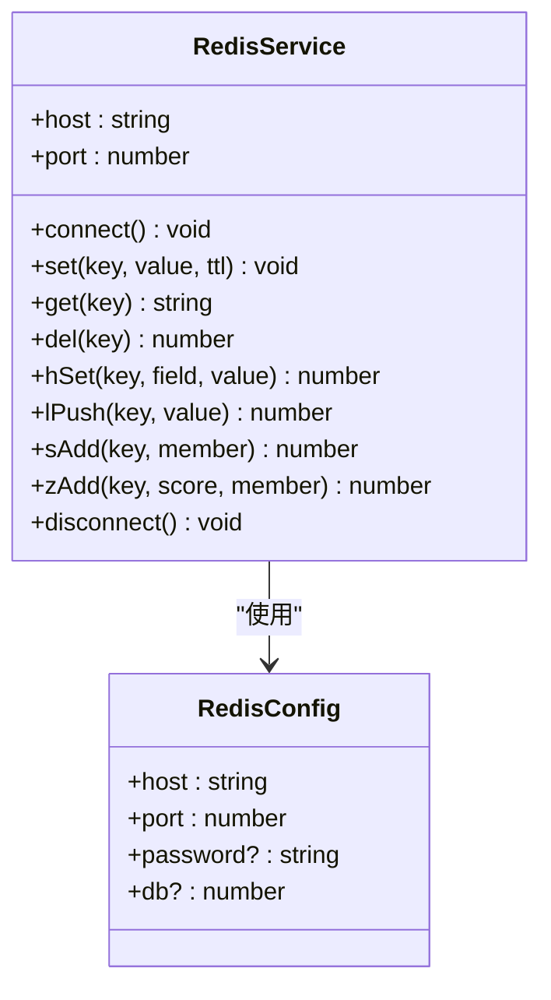
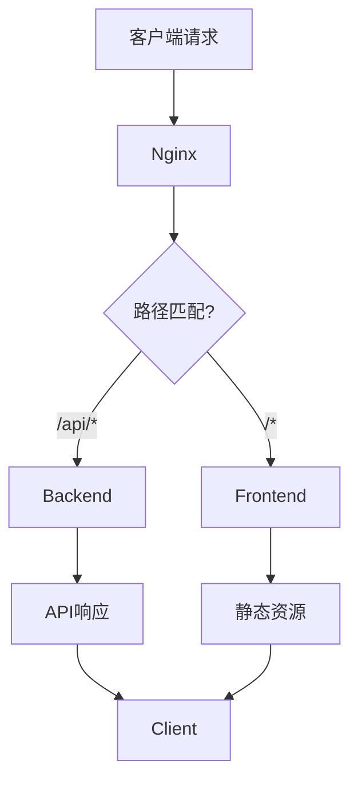
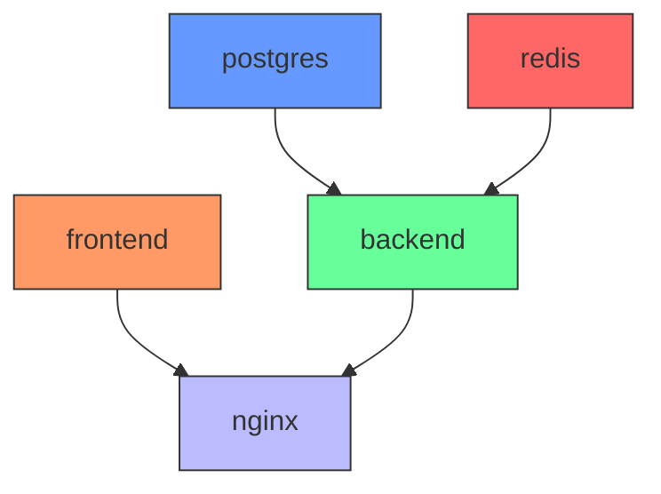

# 服务编排

<cite>
**本文档引用的文件**   
- [docker-compose.yml](file://docker-compose.yml)
- [nginx.conf](file://nginx.conf)
- [backend/src/services/database.ts](file://backend/src/services/database.ts)
- [backend/src/services/redis.ts](file://backend/src/services/redis.ts)
- [backend/src/middleware/auth.ts](file://backend/src/middleware/auth.ts)
- [backend/src/middleware/apiKey.ts](file://backend/src/middleware/apiKey.ts)
- [README.md](file://README.md)
- [DEPLOYMENT_GUIDE.md](file://DEPLOYMENT_GUIDE.md)
</cite>

## 目录
1. [简介](#简介)
2. [项目结构](#项目结构)
3. [核心组件](#核心组件)
4. [架构概述](#架构概述)
5. [详细组件分析](#详细组件分析)
6. [依赖分析](#依赖分析)
7. [性能考虑](#性能考虑)
8. [故障排除指南](#故障排除指南)
9. [结论](#结论)

## 简介
TriBridge 是一个基于区块链技术的跨境支付平台，采用前后端分离的架构设计。本系统通过 Docker Compose 实现多服务编排，包含前端、后端、PostgreSQL、Redis 和 Nginx 五个核心服务。该平台支持多链稳定币结算，集成 KYC/AML 合规服务，并提供实时汇率转换功能。系统采用现代化技术栈，前端基于 React + Vite + TypeScript，后端采用 Express.js + TypeScript，数据库使用 PostgreSQL 和 Redis 组合，通过 Nginx 作为反向代理服务器。

## 项目结构
本项目采用模块化设计，将前端和后端代码分离在不同的目录中，便于独立开发和部署。核心服务通过 docker-compose.yml 文件进行编排，实现了容器化部署。

**Diagram sources**
- [docker-compose.yml](file://docker-compose.yml#L1-L74)
- [README.md](file://README.md#L1-L263)

**Section sources**
- [docker-compose.yml](file://docker-compose.yml#L1-L74)
- [README.md](file://README.md#L1-L263)

## 核心组件
系统由五个主要服务组成：前端开发服务器、后端API服务器、PostgreSQL数据库、Redis缓存和Nginx反向代理。这些服务通过 Docker Compose 进行协调管理，每个服务都有特定的配置和职责。前端服务负责用户界面展示，后端服务处理业务逻辑和API请求，PostgreSQL提供持久化数据存储，Redis用于缓存和会话管理，Nginx则作为生产环境的反向代理和负载均衡器。

**Section sources**
- [docker-compose.yml](file://docker-compose.yml#L1-L74)
- [README.md](file://README.md#L1-L263)

## 架构概述
系统采用分层架构设计，通过 Docker Compose 实现服务编排。Nginx 作为入口网关，将前端静态资源请求和后端API请求分别路由到对应的容器。后端服务依赖于数据库和缓存服务，确保在这些服务启动完成后再启动。这种依赖关系通过 `depends_on` 指令实现，保证了服务启动的正确顺序。

**Diagram sources**
- [docker-compose.yml](file://docker-compose.yml#L1-L74)
- [nginx.conf](file://nginx.conf#L1-L79)

## 详细组件分析

### 前端服务分析
前端服务配置为开发服务器，使用多阶段Docker构建中的 `frontend-builder` 目标。通过端口映射将容器的8080端口暴露给主机，便于开发访问。采用卷挂载方式将本地源代码映射到容器中，实现代码修改的实时同步。环境变量设置为开发模式，启动命令为 `npm run dev`，支持热重载功能。

**Section sources**
- [docker-compose.yml](file://docker-compose.yml#L6-L13)

### 后端服务分析
后端服务是系统的核心业务逻辑处理单元，负责API接口的提供和业务规则的执行。该服务通过 `runtime` 构建目标创建，暴露8000端口供外部访问。配置了多个关键环境变量，包括数据库连接字符串、Redis地址、JWT密钥以及第三方服务凭证。服务启动依赖于PostgreSQL和Redis，确保数据存储和缓存服务就绪后再启动API服务。

**Diagram sources**
- [docker-compose.yml](file://docker-compose.yml#L15-L28)
- [backend/src/services/database.ts](file://backend/src/services/database.ts#L1-L247)
- [backend/src/services/redis.ts](file://backend/src/services/redis.ts#L1-L337)

**Section sources**
- [docker-compose.yml](file://docker-compose.yml#L15-L28)
- [backend/src/services/database.ts](file://backend/src/services/database.ts#L1-L247)

### 数据库服务分析
PostgreSQL服务采用官方的15-alpine镜像，通过环境变量配置数据库名称、用户名和密码。数据持久化通过命名卷 `postgres_data` 实现，确保容器重启后数据不丢失。同时挂载初始化SQL脚本到容器的启动目录，使数据库在首次创建时自动执行表结构初始化。开发环境中暴露5432端口，便于本地数据库工具连接调试。

**Diagram sources**
- [docker-compose.yml](file://docker-compose.yml#L30-L40)
- [backend/src/services/database.ts](file://backend/src/services/database.ts#L1-L247)

**Section sources**
- [docker-compose.yml](file://docker-compose.yml#L30-L40)
- [backend/src/services/database.ts](file://backend/src/services/database.ts#L1-L247)

### 缓存服务分析
Redis服务采用7-alpine轻量级镜像，提供高性能的内存数据存储。通过命名卷 `redis_data` 实现数据持久化，确保重启后缓存数据不完全丢失。暴露6379标准端口，便于开发调试和监控。在应用中主要用于会话存储、API速率限制和热点数据缓存，显著提升系统响应速度和可伸缩性。

**Diagram sources**
- [docker-compose.yml](file://docker-compose.yml#L42-L48)
- [backend/src/services/redis.ts](file://backend/src/services/redis.ts#L1-L337)

**Section sources**
- [docker-compose.yml](file://docker-compose.yml#L42-L48)
- [backend/src/services/redis.ts](file://backend/src/services/redis.ts#L1-L337)

### 反向代理服务分析
Nginx服务作为生产环境的入口网关，采用alpine轻量镜像。配置了HTTP 80端口和HTTPS 443端口的监听，通过 `nginx.conf` 配置文件定义请求路由规则。实现静态资源服务和API请求的智能路由，将根路径请求转发到前端服务，/api/路径请求转发到后端服务。同时配置了WebSocket支持，确保实时通信功能正常工作。

**Diagram sources**
- [docker-compose.yml](file://docker-compose.yml#L50-L58)
- [nginx.conf](file://nginx.conf#L1-L79)

**Section sources**
- [docker-compose.yml](file://docker-compose.yml#L50-L58)
- [nginx.conf](file://nginx.conf#L1-L79)

## 依赖分析
服务间的依赖关系通过 `depends_on` 指令明确声明，确保服务启动的正确顺序。后端服务依赖于PostgreSQL和Redis，保证在数据库和缓存服务完全就绪后再启动API服务。Nginx服务依赖于前端和后端，确保在应用服务启动完成后再启动反向代理，避免出现502错误。这种依赖管理机制提高了系统的稳定性和可靠性。

**Diagram sources**
- [docker-compose.yml](file://docker-compose.yml#L1-L74)

**Section sources**
- [docker-compose.yml](file://docker-compose.yml#L1-L74)

## 性能考虑
系统在性能方面进行了多方面优化。通过Redis缓存频繁访问的数据，减少数据库查询压力。Nginx作为反向代理，提供静态资源的高效服务和请求负载均衡。后端服务配置了日志卷，将日志输出到主机文件系统，便于监控和故障排查。数据库连接池配置了合理的连接数和超时设置，平衡资源利用和响应速度。环境变量的合理配置确保了开发和生产环境的不同性能需求。

## 故障排除指南
### 服务启动失败
检查 `docker-compose.yml` 文件语法是否正确，确认所有服务的镜像名称和版本是否存在。查看Docker日志 `docker-compose logs` 获取具体的错误信息。确保主机端口未被占用，特别是8080、8000、5432和6379等常用端口。

### 数据库连接超时
验证后端服务的 `DATABASE_URL` 环境变量是否正确，检查PostgreSQL服务是否已完全启动。确认网络配置是否允许服务间通信，特别是在自定义网络配置的情况下。检查数据库认证信息是否匹配。

### 卷挂载权限问题
确保主机目录的权限设置正确，容器内的用户有读写权限。对于Linux系统，可能需要调整SELinux上下文或使用适当的权限标志。检查卷挂载路径是否正确，避免路径不存在或拼写错误。

**Section sources**
- [docker-compose.yml](file://docker-compose.yml#L1-L74)
- [DEPLOYMENT_GUIDE.md](file://DEPLOYMENT_GUIDE.md#L1-L191)

## 结论
本系统通过 Docker Compose 实现了复杂但清晰的服务编排，各组件职责明确，依赖关系合理。通过环境变量注入敏感信息，既保证了安全性又提高了配置灵活性。数据卷的使用确保了数据持久化和配置文件的外部管理。Nginx反向代理的引入为生产环境提供了专业的请求路由和负载均衡能力。整体架构兼顾了开发便利性和生产稳定性，为跨境支付平台提供了可靠的技术基础。