# 部署架构

<cite>
**本文档引用的文件**   
- [docker-compose.yml](file://docker-compose.yml)
- [Dockerfile](file://Dockerfile)
- [netlify.toml](file://netlify.toml)
- [nginx.conf](file://nginx.conf)
- [NETLIFY_REDEPLOY_TRIGGER.md](file://NETLIFY_REDEPLOY_TRIGGER.md)
- [DEPLOYMENT_GUIDE.md](file://DEPLOYMENT_GUIDE.md)
- [backend/src/index.ts](file://backend/src/index.ts)
- [backend/src/services/database.ts](file://backend/src/services/database.ts)
- [backend/src/services/redis.ts](file://backend/src/services/redis.ts)
</cite>

## 目录
1. [部署架构概述](#部署架构概述)
2. [容器化策略](#容器化策略)
3. [多服务编排](#多服务编排)
4. [前端托管配置](#前端托管配置)
5. [反向代理设置](#反向代理设置)
6. [CI/CD流程](#cicd流程)
7. [生产环境配置](#生产环境配置)
8. [高可用性设计](#高可用性设计)
9. [故障排查指南](#故障排查指南)

## 部署架构概述

本系统采用现代化的微服务架构，通过Docker容器化技术实现前后端分离部署。整体架构包含前端应用、后端API服务、PostgreSQL数据库、Redis缓存服务以及Nginx反向代理等多个组件，通过docker-compose进行统一编排管理。前端通过Netlify进行全球CDN托管，后端服务通过容器化部署确保环境一致性。Nginx作为反向代理服务器，负责负载均衡和SSL终止，为系统提供安全的HTTPS访问。

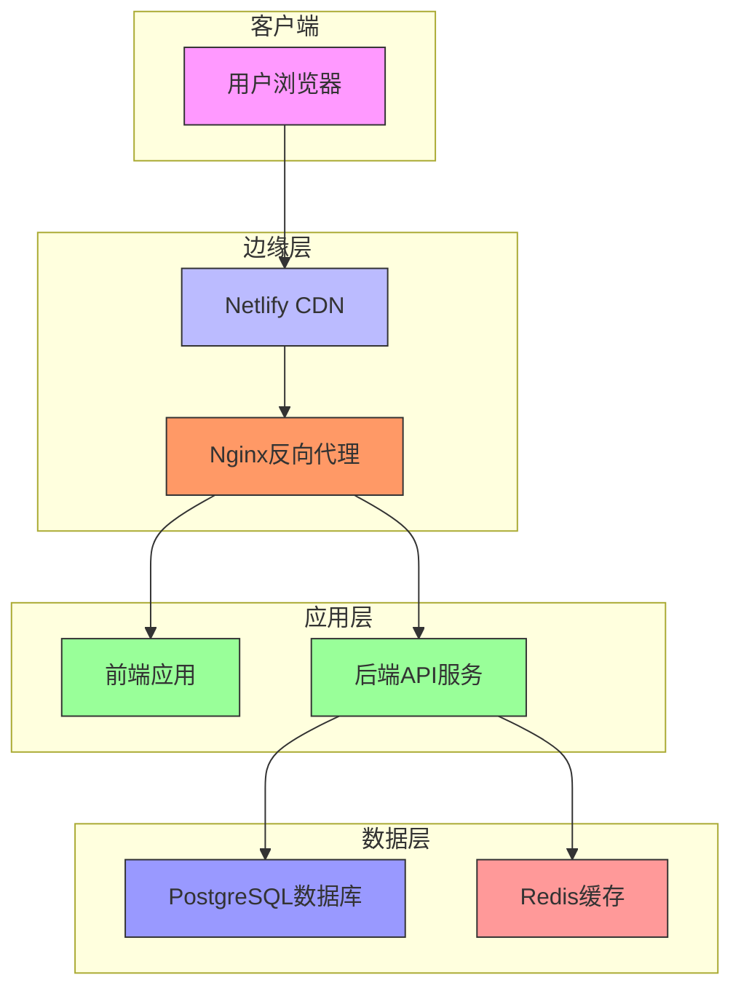

**Diagram sources**
- [docker-compose.yml](file://docker-compose.yml#L1-L74)
- [nginx.conf](file://nginx.conf#L1-L78)

**Section sources**
- [DEPLOYMENT_GUIDE.md](file://DEPLOYMENT_GUIDE.md#L1-L190)

## 容器化策略

系统采用多阶段Docker构建策略，实现前后端分离的镜像构建。Dockerfile定义了三个构建阶段：前端构建器、后端构建器和运行时环境，有效减小最终镜像体积并提高安全性。

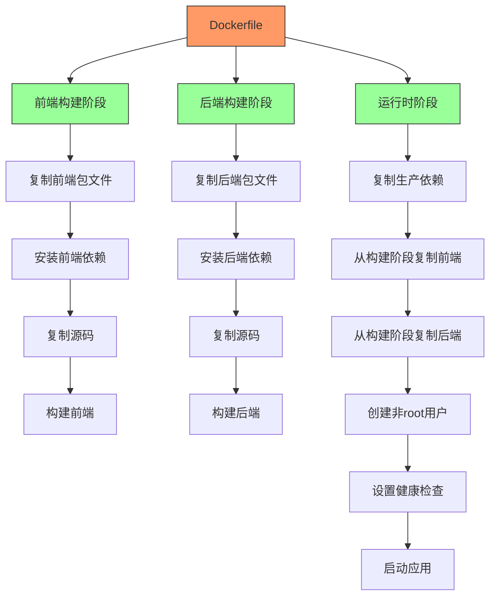

**Diagram sources**
- [Dockerfile](file://Dockerfile#L1-L72)

**Section sources**
- [Dockerfile](file://Dockerfile#L1-L72)

## 多服务编排

通过docker-compose.yml文件定义了完整的多服务编排方案，包含前端、后端、数据库、缓存和反向代理五个核心服务，确保各组件协同工作。

```mermaid
graph TB
Compose[docker-compose.yml] --> Frontend[前端服务]
Compose --> Backend[后端服务]
Compose --> Postgres[PostgreSQL]
Compose --> Redis[Redis]
Compose --> Nginx[Nginx]
Frontend --> |构建上下文| .[当前目录]
Frontend --> |目标阶段| frontend-builder
Frontend --> |端口映射| 8080:8080
Frontend --> |环境变量| NODE_ENV=development
Backend --> |构建上下文| .[当前目录]
Backend --> |目标阶段| runtime
Backend --> |端口映射| 8000:8000
Backend --> |环境变量| NODE_ENV=production
Backend --> |依赖| Postgres
Backend --> |依赖| Redis
Backend --> |卷映射| logs:/app/logs
Postgres --> |镜像| postgres:15-alpine
Postgres --> |环境变量| POSTGRES_DB=tribridge
Postgres --> |端口映射| 5432:5432
Postgres --> |卷| postgres_data:/var/lib/postgresql/data
Redis --> |镜像| redis:7-alpine
Redis --> |端口映射| 6379:6379
Redis --> |卷| redis_data:/data
Nginx --> |镜像| nginx:alpine
Nginx --> |端口映射| 80:80,443:443
Nginx --> |卷映射| nginx.conf:/etc/nginx/nginx.conf
Nginx --> |依赖| Frontend
Nginx --> |依赖| Backend
style Compose fill:#f96,stroke:#333
style Frontend fill:#9f9,stroke:#333
style Backend fill:#9f9,stroke:#333
style Postgres fill:#99f,stroke:#333
style Redis fill:#f99,stroke:#333
style Nginx fill:#f96,stroke:#333
```

**Diagram sources**
- [docker-compose.yml](file://docker-compose.yml#L1-L74)

**Section sources**
- [docker-compose.yml](file://docker-compose.yml#L1-L74)

## 前端托管配置

前端应用通过Netlify进行托管，通过netlify.toml配置文件定义了构建命令、发布目录和重定向规则，确保单页应用的正确路由处理。

```mermaid
flowchart TD
A[netlify.toml] --> B[构建配置]
A --> C[环境变量]
A --> D[重定向规则]
A --> E[头部设置]
B --> F[构建命令: vite build]
B --> G[发布目录: dist]
C --> H[NODE_VERSION: 18]
C --> I[NETLIFY_NEXT_PLUGIN_SKIP: true]
C --> J[NEXT_PRIVATE_TARGET: ""]
C --> K[NEXT_TELEMETRY_DISABLED: 1]
D --> L[/* 重定向到 /index.html]
D --> M[状态码: 200]
E --> N[/manifest.webmanifest]
N --> O[Content-Type: application/manifest+json]
style A fill:#f96,stroke:#333
style B fill:#9f9,stroke:#333
style C fill:#9f9,stroke:#333
style D fill:#9f9,stroke:#333
style E fill:#9f9,stroke:#333
```

**Diagram sources**
- [netlify.toml](file://netlify.toml#L1-L23)

**Section sources**
- [netlify.toml](file://netlify.toml#L1-L23)

## 反向代理设置

Nginx配置实现了反向代理功能，将前端静态资源和后端API请求分别路由到对应的上游服务，同时支持WebSocket连接，为实时通信提供支持。

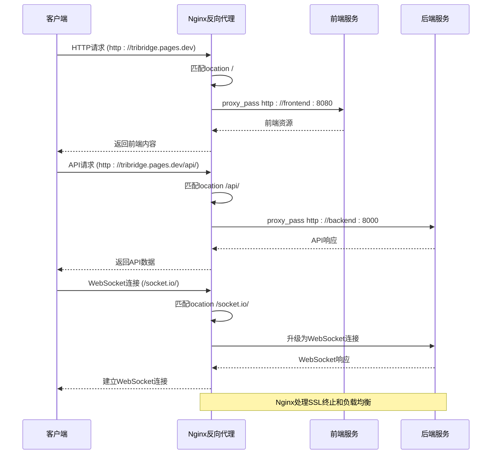

**Diagram sources**
- [nginx.conf](file://nginx.conf#L1-L78)
- [docker-compose.yml](file://docker-compose.yml#L50-L74)

**Section sources**
- [nginx.conf](file://nginx.conf#L1-L78)

## CI/CD流程

系统的CI/CD流程通过GitHub Actions和Netlify集成实现自动部署，当代码推送到主分支时触发重新部署，确保最新更改及时生效。

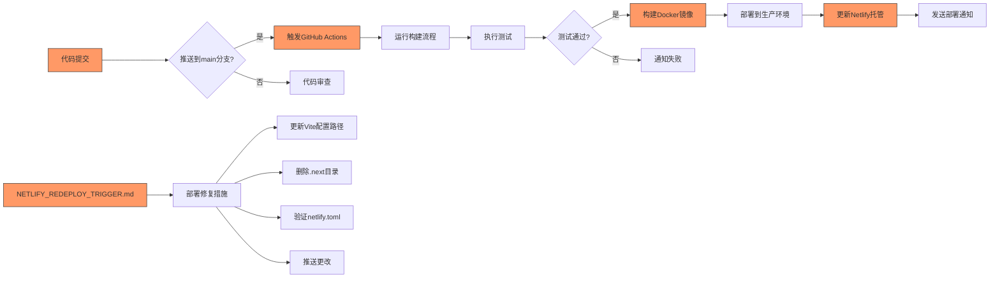

**Diagram sources**
- [NETLIFY_REDEPLOY_TRIGGER.md](file://NETLIFY_REDEPLOY_TRIGGER.md#L1-L9)
- [DEPLOYMENT_GUIDE.md](file://DEPLOYMENT_GUIDE.md#L1-L190)

**Section sources**
- [NETLIFY_REDEPLOY_TRIGGER.md](file://NETLIFY_REDEPLOY_TRIGGER.md#L1-L9)
- [DEPLOYMENT_GUIDE.md](file://DEPLOYMENT_GUIDE.md#L1-L190)

## 生产环境配置

生产环境配置遵循最佳实践，通过环境变量管理敏感信息，实施日志收集和监控告警，确保系统安全稳定运行。

### 环境变量管理
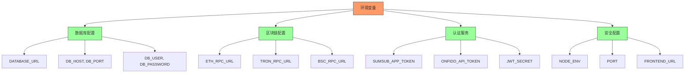

### 日志收集与监控
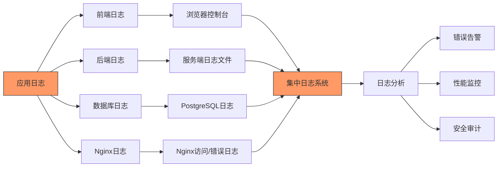

**Section sources**
- [DEPLOYMENT_GUIDE.md](file://DEPLOYMENT_GUIDE.md#L1-L190)
- [docker-compose.yml](file://docker-compose.yml#L1-L74)

## 高可用性设计

系统通过容器健康检查、自动重启策略和备份恢复方案确保高可用性，最大限度减少服务中断时间。

### 健康检查与自动恢复
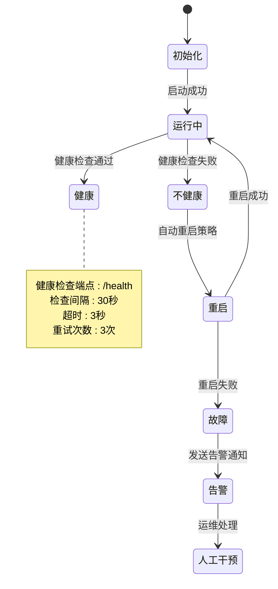

### 备份与恢复方案
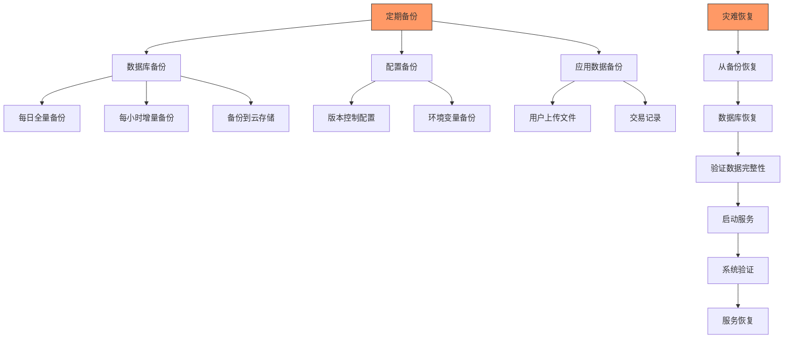

**Diagram sources**
- [Dockerfile](file://Dockerfile#L70-L72)
- [backend/src/index.ts](file://backend/src/index.ts#L230-L258)

**Section sources**
- [Dockerfile](file://Dockerfile#L70-L72)
- [backend/src/index.ts](file://backend/src/index.ts#L230-L258)

## 故障排查指南

提供常见问题的解决方案，帮助快速定位和解决部署过程中可能遇到的问题。

### 容器启动失败
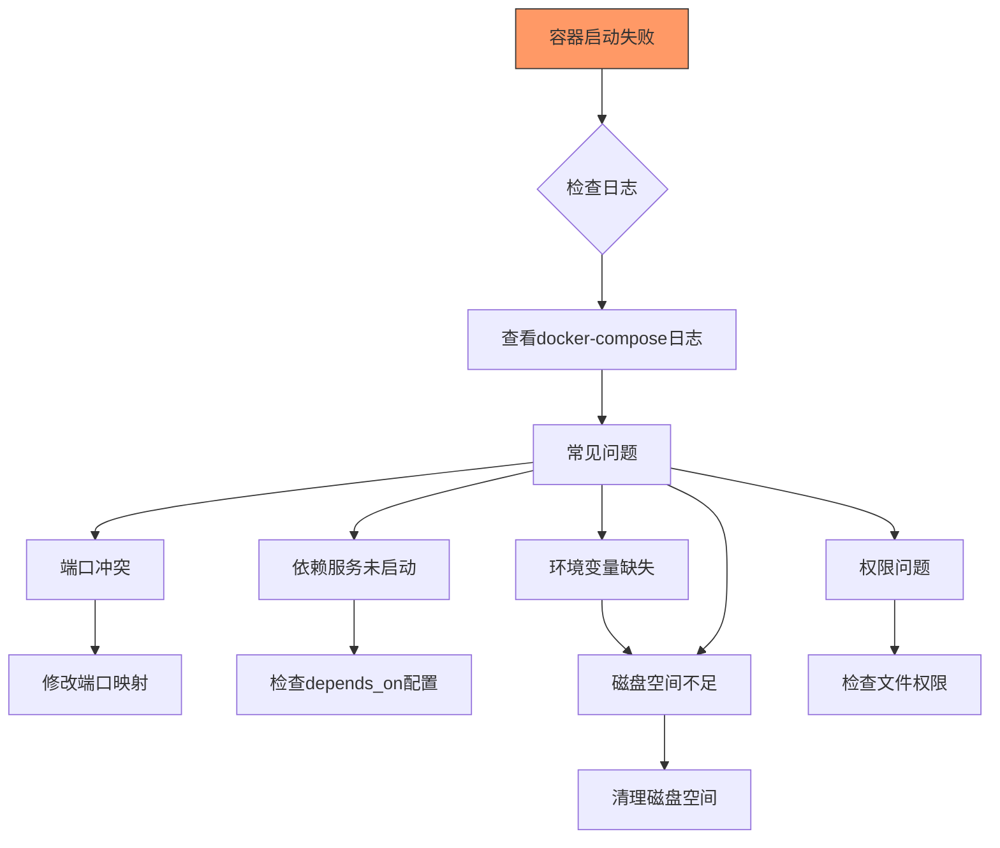

### 网络连接问题
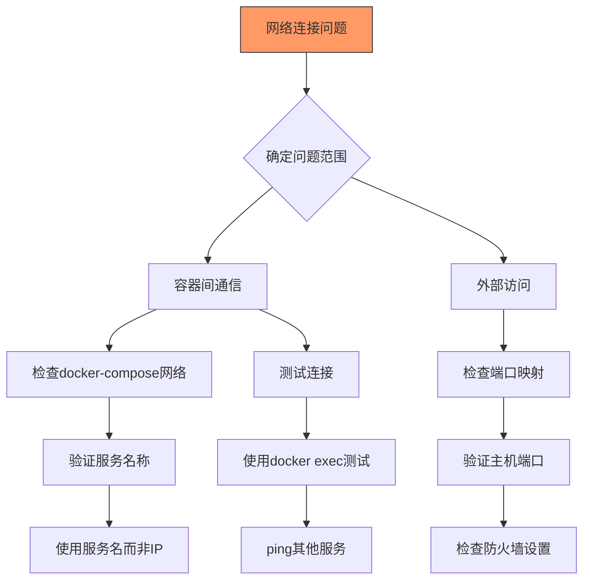

### SSL证书错误
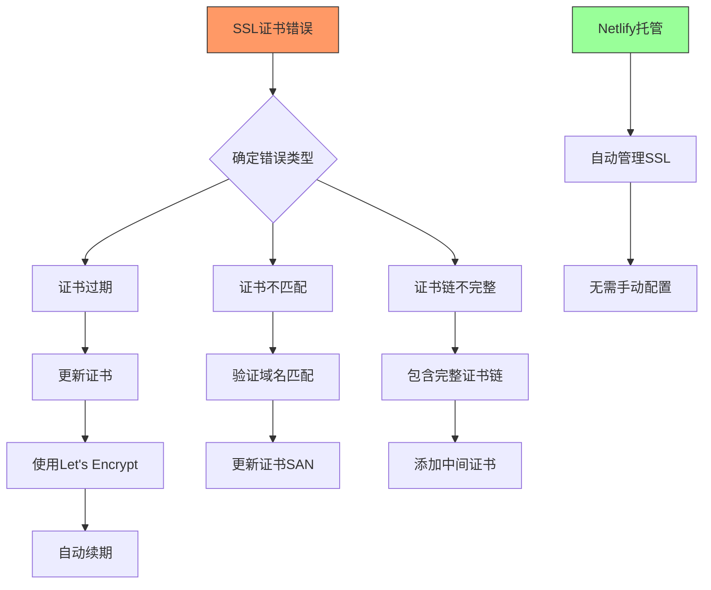

**Section sources**
- [nginx.conf](file://nginx.conf#L60-L78)
- [netlify.toml](file://netlify.toml#L1-L23)
- [DEPLOYMENT_GUIDE.md](file://DEPLOYMENT_GUIDE.md#L1-L190)