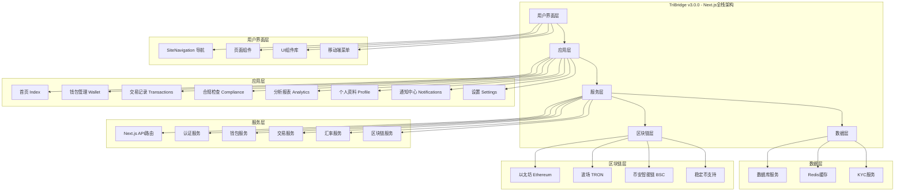
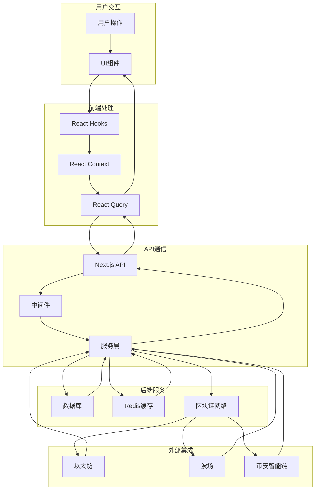
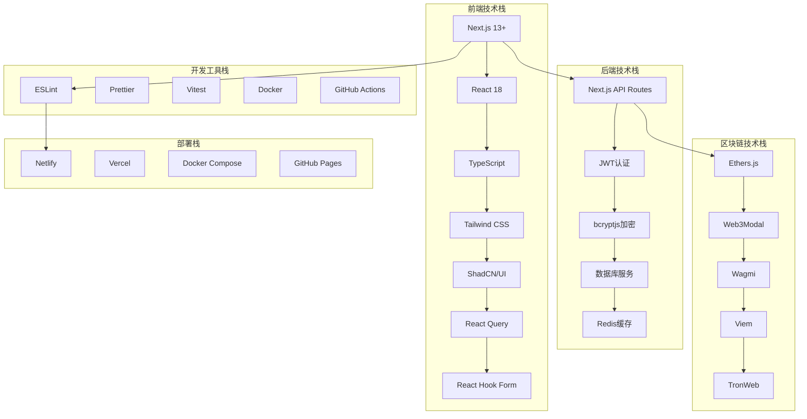
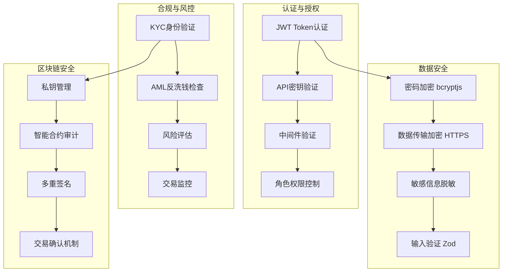

# TriBridge区块链项目架构灰度图

## 项目总体架构图



## 组件层次结构图

```mermaid
graph TB
    subgraph "页面组件 Pages"
        P1[Index 首页]
        P2[Wallet 钱包]
        P3[Transactions 交易]
        P4[Compliance 合规]
        P5[Analytics 分析]
        P6[Profile 个人资料]
        P7[Notifications 通知]
        P8[Settings 设置]
    end

    subgraph "布局组件 Layout"
        L1[SiteNavigation 导航栏]
        L2[Header 头部]
        L3[MobileMenu 移动菜单]
    end

    subgraph "功能组件 Components"
        C1[StatsCards 统计卡片]
        C2[CurrencyExchange 货币兑换]
        C3[RecentTransactions 最近交易]
        C4[WalletManagement 钱包管理]
        C5[TransactionHistory 交易历史]
        C6[KYCVerification KYC验证]
        C7[AMLAssessment AML评估]
        C8[Analytics 分析组件]
        C9[UserProfile 用户资料]
        C10[NotificationCenter 通知中心]
        C11[RiskMonitoring 风险监控]
    end

    subgraph "UI组件库 UI"
        U1[Button 按钮]
        U2[Card 卡片]
        U3[Dialog 对话框]
        U4[Form 表单]
        U5[Table 表格]
        U6[Navigation 导航]
        U7[Toast 提示]
    end

    P1 --> L1
    P1 --> C1
    P1 --> C2
    P1 --> C3

    P2 --> L1
    P2 --> C4

    P3 --> L1
    P3 --> C5

    P4 --> L1
    P4 --> C6
    P4 --> C7

    P5 --> L1
    P5 --> C8

    P6 --> L1
    P6 --> C9

    P7 --> L1
    P7 --> C10

    P8 --> L1

    L1 --> L3
    L2 --> L3

    C1 --> U2
    C2 --> U1
    C2 --> U4
    C3 --> U5
    C4 --> U1
    C4 --> U3
    C5 --> U5
    C6 --> U4
    C7 --> U4
    C8 --> U2
    C9 --> U1
    C9 --> U4
    C10 --> U7
    C11 --> U2
```



## API路由架构图

```mermaid
graph TB
    subgraph "Next.js API路由"
        API[/api]
        API --> AUTH[/api/auth]
        API --> HEALTH[/api/health]
        API --> WALLET[/api/wallet]
    end

    subgraph "认证路由"
        AUTH --> REGISTER[POST /api/auth/register]
        AUTH --> LOGIN[POST /api/auth/login]
        AUTH --> REFRESH[POST /api/auth/refresh]
    end

    subgraph "钱包路由"
        WALLET --> BALANCES[GET /api/wallet/balances]
        WALLET --> TRANSACTION[POST /api/wallet/transaction]
    end

    subgraph "健康检查"
        HEALTH --> HEALTHCHECK[GET /api/health]
    end

    subgraph "服务层"
        S1[认证中间件]
        S2[钱包服务]
        S3[交易服务]
        S4[汇率服务]
        S5[区块链服务]
    end

    REGISTER --> S1
    LOGIN --> S1
    REFRESH --> S1
    BALANCES --> S2
    TRANSACTION --> S3
    S2 --> S4
    S3 --> S5
```

## 数据流图



## 技术栈架构图



## 安全架构图



---

*本架构图展示了TriBridge v3.0.0的完整技术架构，采用Next.js全栈架构，支持跨境支付、区块链集成和合规管理功能。*